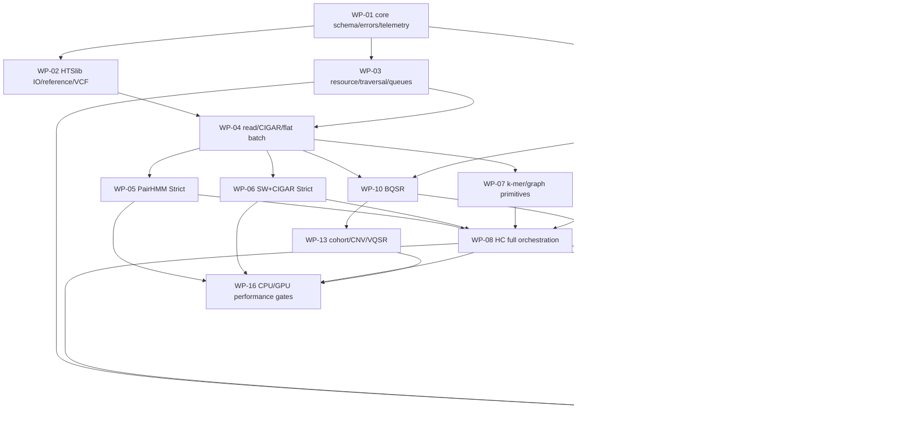

# Fast-GATK 总体执行方案

版本：0.1（2026-08-21）  
目标：在保持 GATK 命令、文件和结果契约的前提下，用 C++ Host + Kokkos Kernel + HTSlib
实现可在 CPU/GPU/异构集群运行的 native toolkit，并能被现有
`GATK + SLURM + Nextflow` 直接调用。

本文是“从现在开始如何执行”的主计划。模块边界和历史调研仍保留在：

- [GATK_MODULE_INVENTORY.md](</home/turing-agents/Documents/fast-gatk/GATK_MODULE_INVENTORY.md>)：源码区域、工具包和外部依赖清单；
- [MODULE_IMPLEMENTATION_PLANS.md](</home/turing-agents/Documents/fast-gatk/MODULE_IMPLEMENTATION_PLANS.md>)：每类 kernel 的详细技术蓝图；
- [FAST_GATK_RUNTIME_SPEC.md](</home/turing-agents/Documents/fast-gatk/FAST_GATK_RUNTIME_SPEC.md>)：运行时、资源、确定性和错误规范；
- [GATK_CPU_SIMD_GPU_DETAIL.md](</home/turing-agents/Documents/fast-gatk/GATK_CPU_SIMD_GPU_DETAIL.md>)、[PAIRHMM_SIMD_BENCHMARK.md](</home/turing-agents/Documents/fast-gatk/PAIRHMM_SIMD_BENCHMARK.md>)：硬件和性能证据。
- 专项审计附录：[模块执行草案](</home/turing-agents/Documents/fast-gatk/EXECUTION_PLAN_MODULES_DRAFT.md>)、[兼容性/验证草案](</home/turing-agents/Documents/fast-gatk/EXECUTION_PLAN_COMPAT_DRAFT.md>)、[性能草案](</home/turing-agents/Documents/fast-gatk/EXECUTION_PLAN_PERF_DRAFT.md>)；本文件是收敛后的主基线。

### 当前增量状态（2026-09-01）

HaplotypeCaller/Mutect2 的共享 ActivityProfile 现将显式 CIGAR `I/D` 事件作为 active
AssemblyRegion seed 投影到 Kokkos 输入，修正对齐碱基全为 reference 但 CIGAR 含 indel 时
候选落入 fallback、PairHMM 丢失 reads 的 ownership gap。pinned GATK 4.6.2.0 synthetic
（8x `60M2D58M` + 8x `120M`）在 OpenMP/Serial 均得到规范化 `chr1:250 GCA>G`，GT/AD/DP/
GQ/PL/QUAL exact，且 `pairhmm_unassigned_candidates=0`；新增
`fastgatk-hc-cigar-indel-activity-gatk-oracle`。该项只固定 activity/AssemblyRegion/
PairHMM ownership，不宣称完整 ReadThreadingAssembler/graph parity。

AnnotateIntervals 现接受 GATK 4.6.2.0 的 `--feature-query-lookahead`（含 0/负值），并
将该 FeatureManager 查询缓存参数写入 native manifest/telemetry；它不改变 GC、mappability
或 segmental-duplication 数值。现有 pinned Java/native interval oracle 已加入该参数，
OpenMP/Serial 均通过。云端 track/query 语义仍保持 explicit fallback。

校正记录：ApplyBQSR 的最新 pinned Java `PrintReads` oracle 实际比较完整 chr17
fixture 的 493 条记录；文档中较早的 254 条统计仅属于旧子集，应以 493 为准。

VariantRecalibrator 现对齐 GATK `VariantDataManager.normalizeData` 的维度重排：归一化后按
training 与 non-training 均值差的绝对值降序排列（Java 稳定排序保留 ties），再进入 Kokkos
VBEM；这会影响多高斯随机协方差初始化，不能只视为报告列顺序。新增 pinned GATK 4.6.2.0
annotation-order oracle，OpenMP/Serial 均通过，VQSLOD 最大差约 4e-5。完整多高斯 VBEM
收敛、资源校准与 raw-bit 模型一致性仍是 explicit fallback。

BaseRecalibrator 已补齐长读 CycleCovariate 数据路径：GATK 默认
`maximum-cycle-value=500` 超限时会拒绝读段，native 现在以同一边界 fail-closed，并支持
`--maximum-cycle-value/--max-cycle` 选择更大的确定性 cycle 域；checkpoint、GATKReport
Arguments 和 manifest 均记录该模型维度。同时修正 CIGAR insertion 的 substitution
observation：插入的 read bases 按 GATK `isSNP=0` 纳入质量/读组/cycle covariates，indel
事件路径不变。1,500M 与 `50M2I48M` synthetic 在 pinned GATK 4.6.2.0 下，默认失败、
显式 1,500 配置的 Quantized/RecalTable0/1/2 全表 bit-identical；OpenMP/Serial 均通过。
这收敛长读和 checkpoint 域边界，不宣称完整云端分布式 BQSR。

PairHMM 输入准备已修正无 `BI/BD` 标签时的终位插入/删除质量：GATK 默认原始质量为
Q45，Conservative PCR 模型以原始 read 坐标仅降低非终位；AssemblyRegion clipping 后，
被截取的末位若原本是内部重复位点可观察到 Q20/Q40。`NONE` 模式保持 Q45。native
HC/Mutect2 共用该 Host 规则，pinned GATK 4.6.2.0 PairHMM 输入 oracle（706 rows，
终位集合 {20,45}）在 OpenMP/Serial 通过，显式 BI/BD 标签路径不变。

ModelSegments 多样本 KernelSegmenter 已修正为按完整样本向量计算 kernel：线性 kernel 使用
拼接的 per-sample feature vector，Gaussian kernel 使用各样本 anchor kernel 求和，不再先
取样本均值而抵消反相关事件。pinned GATK 4.6.2.0 anti-correlated/concordant synthetic
在 OpenMP/Serial 均与 native 分段边界 exact；完整 Java 多样本 posterior/SVD raw-bit
一致性仍保持显式 fallback。

VariantRecalibrator 已修正 GATK 的 retry/iteration 参数边界：`--max-attempts`
是模型构建失败后的重试次数（默认 1），`--max-iterations` 才是 VBEM 迭代上限
（默认 150）；native 不再把前者误当作 EM 迭代次数，并在 OutputManifest 分开记录。
pinned GATK 4.6.2.0 help/runtime oracle 在 OpenMP/Serial 均通过；这只收敛参数与
失败重试控制，不宣称完整 VBEM/raw-bit 模型一致。

VariantRecalibrator 已补齐 GATK 的训练归一化零方差边界：当任一 training annotation
标准差低于 `1e-5` 时，native 在模型拟合前 fail-closed，与 pinned GATK 4.6.2.0 的
常量注释 fixture 退出码/错误语义一致；OpenMP/Serial 专用 CTest 均通过。完整 VBEM
收敛与 recalibration-table provenance 仍保持显式 fallback。

LearnReadOrientationModel 已补齐 GATK 4.6.2.0 orientation utility CLI 边界：
`--QUIET/--quiet`、`--tmp-dir`、`--verbosity/--VERBOSITY` 与 JDK deflater/inflater
Boolean aliases 均可直接传入，选择记录在 manifest telemetry。既有两样本
`.orientation_priors` tar writer pinned oracle 以这些 controls 在 OpenMP/Serial 均通过；
tar/gzip 字节身份和完整 release-specific calibration 仍不承诺。另已对齐
`--max-depth` 的 EM 边界：不重分箱输入直方图中更高深度，而仅限制每轮 E/M 观测；
双样本深度 2 pinned oracle 与 GATK 输出最大概率差约 1.9e-12。

CollectReadCounts 已补齐 GATK 4.6.2.0 的 CNV utility CLI 边界：`--QUIET`、
`--read-validation-stringency/-VS`、`--disable-bam-index-caching/-DBIC`、`--tmp-dir`
和 JDK deflater/inflater switches 支持 value/Boolean 形式，并记录 manifest telemetry。
pinned Java/native TSV read-start、interval/exclusion oracle 在 OpenMP/Serial 均通过；
HDF5/cloud 与完整 read-filter release matrix 仍按 registry 保持 fallback。

GatherBQSRReports 已补齐 GATK 4.6.2.0 utility CLI 边界：`--QUIET`/`--quiet`、
`--tmp-dir`、`--verbosity` 及 JDK deflater/inflater 开关支持 Boolean/value 形式，
且选择记录到 OutputManifest telemetry。既有 pinned Gather oracle 额外以这些参数
运行并保持五张 GATKReport 表 bit-identical，同时覆盖不兼容维度和空报告 fail-closed。

SortSam 已补齐 Picard/GATK 4.6.2.0 的直接替换 CLI 边界：支持大写
`--INPUT/--OUTPUT/--REFERENCE_SEQUENCE`、`-SO/--SORT_ORDER`、
`--MAX_RECORDS_IN_RAM/--TMP_DIR`、`--CREATE_INDEX`、`--QUIET`、JDK codec
开关、`--COMPRESSION_LEVEL`、`--VALIDATION_STRINGENCY` 与 `--VERBOSITY`。
pinned Java/native oracle 比较坐标排序的 header/records，并检查 compression、validation
和禁用 index 的 manifest telemetry；OpenMP/Serial 均通过。native 另实现 Picard
`duplicate` sort order，按 library、unclipped read/MC mate coordinate、orientation、
mapped-end、reference-length score 和 name/end tie-break 做 bounded spill/merge；独立
pinned comparator oracle 在 OpenMP/Serial 比较完整记录顺序。cloud/MD5 与
byte-identical codec 输出仍保持 explicit fallback。

GatherVcfs 已补齐 Picard/GATK CLI 别名边界：native 接受重复大写
`--INPUT/--OUTPUT`、`--REFERENCE_SEQUENCE`、`--QUIET`、`--VERBOSITY`，并保持
`--COMMENT`、`--CREATE_INDEX`、`--COMPRESSION_LEVEL` 的 writer 语义。pinned GATK
4.6.2.0 oracle 比较两 shard 数据行、comment、compression level 与禁用索引路径，
OpenMP/Serial 均通过；完整 Picard cloud/TMP/MD5 语义仍按 registry 保持 fallback。

LeftAlignAndTrimVariants 已补齐 VariantWalker CLI/interval 边界：支持重复
`-XL/--exclude-intervals`、`-ip/--interval-padding`、`-ixp/--interval-exclusion-padding`，
并接受 `-isr/-imr/-OVI` 短别名；include/exclude 按记录 END span 应用 padding 与过滤。
`--dont-trim-alleles`、`--split-multi-allelics`、`--keep-original-ac` 的 separated
Boolean 形式也已与 GATK 4.6.2.0 对齐。pinned Java/native CLI oracle 覆盖这些路径，
OpenMP/Serial 均通过，manifest 记录区间和 index 边界；复杂 symbolic/cloud/bit-identical
normalization 仍保持 explicit fallback。

AnnotateIntervals 的 CNV interval 校验边界已与 GATK 4.6.2.0 对齐：要求
`--interval-merging-rule OVERLAPPING_ONLY` 与 `--interval-set-rule UNION`，
`--interval-padding`、`--interval-exclusion-padding` 仅接受 0，非零值 fail-closed
并返回对应 Java 诊断；include/exclude 与双后端 Java oracle 已通过。此项不扩大
cloud/remote-output 或完整 CNV annotation 模型承诺。

ValidateVariants 已修正 symbolic ALT 的 GATK 语义：`<DEL>`、`<CNV>` 等 symbolic
allele 不参与 `validateAlternateAlleles()` 的 called-genotype usage check，只有
concrete ALT 必须在 genotype 中出现。pinned GATK 4.6.2.0 oracle 覆盖未观察 symbolic、
symbolic+concrete 与 concrete failure，OpenMP/Serial 均通过；该增量不扩大完整
htsjdk/Tribble validation 的 fallback 承诺。

VariantFiltration 已补齐 `--set-filtered-genotype-to-no-call` writer/semantic 边界：
带非-PASS FORMAT/FT 的 called genotype 改为 unphased `./.`，并仅在 genotype 发生变化时
重算 INFO/AC、INFO/AN、INFO/AF；已有 FT 状态和无 FT 记录的 header/row 形状遵循 GATK。
该 Boolean 支持 bare/分离形式，embedded `=` fail-closed；pinned GATK 4.6.2.0 oracle
及 OpenMP/Serial CTest 均通过。

DenoiseReadCounts 已补齐 HDF5 input metadata 边界：SimpleCountCollection 的完整 SAM
sequence dictionary 存在 `/locatable_metadata/sequence_dictionary`，native 现在在解码后
将全部 `@SQ`（含 AS/M5/UR/SP）传递到 standardized 与 denoised TSV，和 GATK
CopyRatioCollection writer 一致。新增 pinned GATK 4.6.2.0 oracle 比较两份输出的 header
和数据行，OpenMP/Serial 均通过；其余 HDF5/Spark/cloud 语义仍按 registry 保持
explicit fallback。

ApplyVQSR 已补齐 GATK 4.6.2.0 的 exclusion traversal 边界：native 支持重复
`-XL/--exclude-intervals`（以及 dispatcher 常用别名）和 `-ixp/--interval-exclusion-padding`，
先构造 `-L` include 集合，再对记录 span 应用 union exclusion；未提供 `-L` 时仍对隐式
全输入执行 exclusion。pinned Java/native oracle 覆盖 include+exclude、exclude-only 和
padding，VQSLOD/FILTER/site 行一致，OpenMP/Serial CTest 均通过；manifest 记录排除计数、
padding 与 interval-file 统计。

HaplotypeCaller 已补齐 GATK 4.6.2.0 `--sites-only-vcf-output` writer 边界：VCF/GVCF
先完成完整 genotype/reference-confidence 计算，再由最终 writer 省略 FORMAT/sample
列；bare、true、false 三种 Boolean 形式与 pinned Java/native oracle 在 OpenMP/Serial
均通过。GVCF reference-block 分段差异仍单独报告，oracle 只要求 concrete candidate
rows 与 Java 一致，避免把 writer 形状测试误报为完整 RCM 等价。

Mutect2 已补齐 `--normal-lod` matched-normal emission 边界（默认 2.2）：native 在
somatic likelihood 物化后按 GATK 固定二倍体 `hom-ref - ref/ALT-het` log10-odds
抑制正常样本支持的候选，且把有效阈值写入 stats/manifest；NLOD 不再误用 TLOD 的
Dirichlet 变分 evidence。pinned equation 与低阈值/零阈值命令 oracle 在
OpenMP/Serial 均通过；
这不等同于完整 Java SomaticGenotypingEngine posterior calibration。

GenotypeGVCFs 已补齐 GATK 4.6.2.0 的重复 `-XL/--exclude-intervals`：native 先按
`-L` 构造 include set，再按 exclusion union 对记录 span 做二次过滤；仅给 `-XL` 时仍
遍历全输入，`--stream-by-locus` 与 aggregate 共用该 predicate。新增 pinned Java/native
oracle 将 concrete variant 放入排除区间，比较两种 native traversal 的完整数据行和
manifest telemetry，OpenMP/Serial 均通过。该切片只收敛 interval writer/traversal 边界，
不扩展 full release-specific cohort posterior。

GenotypeGVCFs 进一步补齐 deprecated
`--only-output-calls-starting-in-intervals`：按 GATK 4.6.2.0，它不是输入裁剪开关，
而是 joint genotyping 完成后的 STARTS_IN writer filter。native 因此继续以 span overlap
遍历 `-L`，让区间外起点的长 deletion 参与 likelihood/annotation，再仅按最终记录 POS
决定输出。自包含 pinned Java fixture 固定默认 `[10,12]` 与 STARTS_IN `[12]`，aggregate/
`--stream-by-locus` 数据行 exact，OpenMP/Serial 专测通过；manifest 记录模式、skip 与
实际 output count。完整 cohort calibration/fallback 范围不变。

CollectF1R2Counts 与 GatherPileupSummaries 已补齐 Barclay short-name 的大写长别名
`--I`/`--O`（同时保留 `-I`/`-O` 与既有 lower-case aliases）。这两个拼写是
GATK 4.6.2.0 help/工作流生成器实际接受的形式；native contract/oracle 在
OpenMP/Serial 对其输出语义逐项复核，避免 dispatcher 直接替换时因参数名失败。

HaplotypeCaller 已补齐 GATK 4.6.2.0 `--floor-blocks` 的 GVCF reference-block
writer 语义：普通 `REF/<NON_REF>` block 在完整 RCM/genotyping 后将 GQ 向下取到实际
`-GQB` 分箱下界，并只写 `GT:DP:GQ`（移除 `MIN_DP/PL`）；candidate rows 和
`BP_RESOLUTION` 不变。扩展的 pinned Java GQ-band oracle 比较 header、records 和
manifest，OpenMP/Serial 均通过；这只是精确 writer/分箱边界，不宣称完整 RCM
bit-identical。

LeftAlignAndTrimVariants 已补齐 GATK 4.6.2.0 的 `--sites-only-vcf-output` optional
Boolean writer 边界：native 保留完整 FORMAT/sample payload 完成拆分、规范化和
left-shift，最后才输出严格 8 列 site-only VCF；false/bare/separated-true 三种形式
与 pinned Java oracle 在 OpenMP/Serial 均通过，manifest/registry/verify_all 已同步。

BaseRecalibrator 的 BQSR covariate CLI 已补齐 GATK 4.6.2.0 短别名 `-ics`（indel
context）与 `-mcs`（mismatch context），与长参数共享同一 report 路径；现有 BI/BD
插入删除事件表 pinned oracle 增加 `-ics 4` 四张表逐行比较，OpenMP/Serial 均通过。

SelectVariants 已补齐 GATK 4.6.2.0 `--sites-only-vcf-output` writer 边界：选择、样本
子集和 genotype/INFO 处理仍消费完整 FORMAT/sample 记录，最终 writer 才移除这些列，
输出严格 8 列 site-only VCF；false/bare/separated true 形式及 embedded `=` fail-closed
行为由 pinned Java/native oracle 在 OpenMP/Serial 验证，manifest 记录 compatibility/
telemetry 选择。该切片不扩大完整 JEXL、pedigree、random 或 cloud 语义。

ApplyBQSR 已补齐 GATK 4.6.2.0 的 `-bqsr` 短别名，和
`--bqsr-recal-file` 选择同一 report。新增 pinned Java/native alias oracle，分别
比较长/短拼写及 Java 解码后的 493 条记录，OpenMP/Serial 均通过；这只收敛直接替换
CLI 边界，不扩大完整 BQSR 模型、cloud 或 MD5 语义。

CallCopyRatioSegments 已补齐 GATK 4.6.2.0 的完整 z-score 参数拼写：native 现在
接受 `--outlier-neutral-segment-copy-ratio-z-score-threshold` 与
`--calling-copy-ratio-z-score-threshold`，并保留既有短别名。pinned Java/native
oracle 在 OpenMP/Serial 验证默认与显式参数输出、legacy `.igv.seg` sidecar 及
退化统计边界均通过；完整 ModelSegments 概率分段仍是 fallback。

CallCopyRatioSegments 另补齐非有限输入边界：GATK 4.6.2.0 的
`CopyRatioSegment` TSV decoder 接受 `NaN`、`Infinity`、`-Infinity` 的
`MEAN_LOG2_COPY_RATIO`，SimpleCopyRatioCaller 将其沿 IEEE-754 统计路径传播并
对该段给出 neutral call。native 不再提前拒绝这些值，且 called/`.igv.seg` 输出
保留 Java 的文本表示；新增 `fastgatk-call-copy-ratio-segments-nonfinite-gatk-oracle`，
三种值及 NaN 统计 manifest 在 OpenMP/Serial 双 backend exact。完整 ModelSegments
概率分段及 release-specific semantics 仍为 fallback。

CallCopyRatioSegments 有限统计补齐 Java 17 `DoubleStream.sum()` 的最终补偿步骤：
native 现在返回 Kahan 高位累加减去负补偿字，并保留同号 infinity fallback，而非
丢弃低位字。pinned GATK 4.6.2.0 阈值夹具在旧路径把末段误判为 `+`，修复后为 `0`；
called 与 `.igv.seg` bytes 在 OpenMP/Serial exact。完整 ModelSegments 概率后验与
release-specific sampler 仍保持 explicit fallback。

VariantFiltration 已补齐 `--missing-values-evaluate-as-failing` 的 GATK Boolean
命令行边界：bare、分离 true/false 以及 embedded `=` 拒绝行为均由 native 与 pinned
GATK 4.6.2.0 对齐；缺失 INFO 值的过滤策略与 `== null` 语义分别由独立 oracle 验证。

DenoiseReadCounts 已补齐 GATK 的双输出 writer 边界：`--denoised-copy-ratios`
（或 `-O/--output`）与 `--standardized-copy-ratios` 均为必需，缺失任一参数时
native 与 pinned GATK 4.6.2.0 均在处理输入前失败；现有 integer-input oracle、
contract 和 dispatcher dry-run 已同步该要求。

ApplyVQSR 已补齐 `--sites-only-vcf-output` writer 边界：native 在完成 VQSLOD
评分/过滤后才裁剪 FORMAT/sample，输出严格 8 列并保留 INFO/FILTER；pinned
GATK 4.6.2.0 Java/native shape 与 VQSLOD/FILTER oracle 在 OpenMP/Serial 均通过。

Mutect2 已补齐 GATK 4.6.2.0 的 `--force-active` optional Boolean：该开关保留
ActivityProfile 的坐标边界，但将原本 inactive 的 profile segment 也标记为 active，
使 AssemblyRegion graph/PairHMM 继续消费完整窗口；native stats/manifest 记录有效值。
新增 pinned `fastgatk-mutect2-force-active-gatk-oracle` 对 Java/native 的 IGV profile
边界、active 状态和候选 site set 做双 backend 检查，OpenMP/Serial 均通过；完整
somatic posterior 仍不宣称 bit-identical。

GatherVcfs 已补齐 Picard/GATK 的 `--REFERENCE_SEQUENCE`（`-R`）大写长别名；native
与 pinned GATK 4.6.2.0 在同一 shard 输入下记录一致，现有 GatherVcfs contract/oracle
覆盖该命令行边界。

LearnReadOrientationModel 已补齐标准 CollectF1R2Counts 多样本 writer 边界：一个
输入 tar 可含多个样本的 histogram/table，native 按样本隔离聚合并写出每个样本的
`<sample>.orientation_priors` 成员，行为与 GATK 4.6.2.0 一致。pinned 双样本
Java/native oracle 已在 OpenMP/Serial 通过；tar `./` 前缀、成员顺序和 gzip 字节
不作 bit-identical 承诺。

MarkDuplicates 已修正 `CREATE_INDEX` 默认副作用：GATK/Picard 4.6.2.0 默认不创建
坐标排序 BAM 的 `.bai`，native 之前误设为 true，现改为 false；显式
`--create-output-bam-index=true` 仍创建索引。新增 pinned Java/native 默认与显式
索引边界断言，OpenMP/Serial 的 contract 与 oracle 均通过。

2026-09-01 MarkDuplicates `TAGGING_POLICY` 算法边界：GATK/Picard 4.6.2.0 的
`OpticalOnly` 只给 optical duplicate 写 `DT:Z:SQ`，普通 library duplicate 不写
`DT`；native 原先只接受 `DontTag|All`，会在真实命令上拒绝该策略。现已在同一
duplicate classification/output 路径支持 `OpticalOnly`，并保留 `All` 的
`DT:Z:SQ/LB` 行为。新增 pinned Java/native oracle，比较 14 条 SAM 记录、metrics
和 duplicate-set histogram，OpenMP/Serial 均通过；registry/dispatcher/verify_all
已同步。Picard 的 UMI、flow、cloud 以及其他 release-specific metrics 仍显式
fallback。

2026-09-01 MarkDuplicates paired ReadEnds key：native 现在在首遍按 read name
配对 mapped mates，用两条实际 unclipped 5′ 坐标构造统一 duplicate key；这覆盖
无 `MC` 标签及 terminal S/H clipping，且必要的 repaired key 会写入 spill
checkpoint 供 resume 使用。pinned GATK/Picard 4.6.2.0 4-record oracle 与
OpenMP/Serial CTest 均通过；UMI/flow/cloud 仍为 explicit fallback。

PreprocessIntervals 已补齐 interval-rule validation：虽然通用参数默认值显示为
`ALL`，GATK 4.6.2.0 的该工具对省略参数和显式 `ALL` 均拒绝，并要求
`OVERLAPPING_ONLY`；native 现在在同一边界 fail-closed。现有 contract 的 pinned
Java/native 断言在 OpenMP/Serial 均通过。

GatherBQSRReports 已对齐 GATK 4.6.2.0 的空报告失败边界：仅含 Arguments/Quantized
而无任何 RecalTable0/1/2 数据的输入报告会被视为不可用；全部输入不可用时 native
返回 `there is no usable data in any input file`，并在错误前不发布 primary report
或 covariates sidecar。该行为由 pinned Java/native oracle 在 OpenMP/Serial 双 backend
验证，避免把空输入误报为成功的零行 merged report。AnalyzeCovariates 当前 CSV
oracle 已逐字节一致，本轮未新增其他安全边界。

CombineGVCFs 已补齐 `-L` 参考块边界：当 `REF/<NON_REF>` block 的 END 超过区间
终点时按 GATK 4.6.2.0 丢弃（Java 会报告 cuts-in-middle），当 END 被区间包含时
保留完整 block；aggregate 与 `--stream-merge` 共用同一 predicate。pinned
interval-refblock oracle 在 OpenMP/Serial 均通过。

ReblockGVCF 已补齐 GATK writer 的 overlap boundary：当 concrete variant 或 deletion
span 穿过输入 hom-ref block 时，native 在 GQ-band merge 前按 Java
`ReblockingGVCFBlockCombiner.trimBlockToVariant()` 语义裁剪或拆分 block，并从 indexed
reference 更新拆分后 REF base；缺失 reference 时对需要移动的 block fail-closed。新增
`verify_reblock_overlap_gatk_oracle.py` 使用 pinned GATK 4.6.2.0 固定输出
`69000-69004 / 69005 / 69006-69010`，OpenMP/Serial 均 exact；CTest 与 `verify_all.sh`
均已接入。该项只收敛 overlap block coverage，不宣称完整 annotation/posterior/deletion
semantics。

VariantRecalibrator 已纠正核心模型默认值：GATK 4.6.2.0 的
`MultivariateGaussian` 始终计算完整协方差，native 不再默认 diagonal；保留
`--full-covariance` 仅用于旧调用兼容。双 backend 的 VBEM score oracle、model-artifact
oracle 和 broad contract 均通过；full multi-Gaussian raw-bit VBEM、完整 AS provenance
和大样本收敛仍保持 explicit fallback。

BaseRecalibrator 已补齐 `--mismatches-context-size`：native 按 GATK 的 1..13
范围生成 substitution ContextCovariate（默认 2），并将该值写入 report、checkpoint
和 manifest。pinned GATK 4.6.2.0 size=3 oracle 在 OpenMP/Serial 均通过；这只收敛
ContextCovariate 参数边界，不代表完整 BQSR 模型等价。

GatherPileupSummaries 已进一步对齐 GATK 4.6.2.0 的空 shard writer 边界：当所有
输入 table 均为空时，GATK 忽略空输入的 SAMPLE 冲突并只输出列名 header；native
现在仅对非空输入执行 sample 校验，且不为 all-empty 输出写 SAMPLE metadata。
新增 pinned Java/native oracle 在 OpenMP/Serial 均逐字节通过；该边界不扩展为
cloud 或完整 Java dictionary edge semantics。

VariantRecalibrator 的隐藏 `--sample-every-Nth-variant` 已按 GATK 零基 traversal
语义实现：首条输入记录保留，随后每 N 条保留一条，且 writer 不再把未采样记录
带入 recalibration VCF。pinned 4.6.2.0 oracle 固定 N=2 的 `[1,3,5]` 记录、
VQSLOD/训练标签、sites-only shape 和 manifest 计数，OpenMP/Serial 均通过；
这只证明 scatter/recalibration-table provenance，不覆盖 full-covariance 多高斯
VBEM 的完整收敛或 bit-identical 模型。

AnalyzeCovariates report 参数比较已进一步对齐 GATK 4.6.2.0：before/after 合并
只比较 Java `compareReportArguments()` 的固定字段，忽略 `indels_context_size`、
 `covariate` 与 report 路径，并对旧报告缺失字段补 Java 默认值。新增差异 oracle 在
 OpenMP/Serial 均通过且 CSV 逐字节一致；native PDF 仍是无外部 R 依赖的确定性语义
 输出，不能宣称与 GATK R 绘图逐字节一致。

AnalyzeCovariates CLI 现补齐 GATK 4.6.2.0 的小写 `-bqsr` short alias（同时保留
legacy `-BQSR`）。`verify_analyze_covariates_bqsr_alias_gatk_oracle.py` 使用 pinned
GATKReport 固定 Java `-bqsr`/`--bqsr-recal-file` CSV 等价、native lower/upper CSV
等价及 `-bqsr=...` embedded-equals 拒绝边界；对应 CTest 在 OpenMP/Serial 均运行。

ReblockGVCF 兼容性补充：GATK 4.6.2.0 将 `--rgq-threshold-to-no-call` 声明为
double；native 已改为有限非负 double 解析，保留小数阈值而不截断，并由 pinned
Java/native oracle 验证 `10.5` 的完整输出一致。该项不代表完整 reblocking 等价。

GenomicsDBImport 新增 sample-name-map 兼容边界：native sparse workspace 现在严格
校验 sample-map 的两列格式与唯一 sample 名，并在 `native-inputs/` 私有物化阶段
重写单样本 VCF/GVCF header；源文件不被修改，后续 native GenotypeGVCFs 的样本列
与 GATK 4.6.2.0 `callset.json`/输出 header 一致。新增
`verify_genomicsdb_import_sample_map_gatk_oracle.py`，OpenMP/Serial 均通过；这只
收敛 sample-name-map 与重试物化边界，native workspace 仍不是 TileDB。

GenomicsDBImport 增加增量 workspace 边界：`--genomicsdb-update-workspace-path`
现在由 Host 透传给外部 GATK backend，要求既有 workspace，并保留 adapter 的完整
`fastgatk-inputs.tsv` 输入索引/metadata；pinned GATK 4.6.2.0 oracle 验证追加样本、
callset/header/sample columns 与初次导入 interval set（update 时 GATK 忽略本次 `-L`）。
native sparse 模式现在也支持一个安全的非 TileDB 增量边界：要求既有 input index，
合并旧/新 canonical inputs 后原子重建 materialized VCF/index，并保留既有
sample-name-map；manifest 明确标记 `native_incremental_update` 与 non-TileDB，
不会伪造 TileDB storage 兼容性。

GenomicsDBImport native sparse workspace 现补齐 `-L/--intervals` 的记录-span 边界：
按 contig 名称解析重复 selector 及 interval-list/BED 文件，GATK UNION/INTERSECTION
规则在 materialization 前执行；只要完整 REF/variant record 的 span 与 selector 相交
即保留整条记录，避免把跨 selector 的 reference-confidence block 错误截断。过滤或
sample-name rewrite 后不复制原输入的 stale VCF/CSI index，checkpoint 固定 selector
及 set-rule，native incremental update 复用初次导入的 interval 集。新增 pinned
`verify_genomicsdb_import_native_interval_gatk_oracle.py` 比较 GATK 4.6.2.0
GenomicsDB bridge 导出的 block/variant 边界，OpenMP/Serial 均通过；完整 TileDB
storage/query 仍由外部 GATK backend/隔离 bridge 负责。

GatherBQSRReports 当前会保留首个输入 Java GATK report 的 `Arguments` 表，并按其
`quantizing_levels` 重建 `QualQuantizer`；非默认 `--quantizing-levels 4` 的两个
disjoint BaseRecalibrator shard 已由独立 `verify_gather_bqsr_gatk_oracle.py` 与
GATK 4.6.2.0 对比五张表逐行一致。合并前还检查 covariate、mismatches/indels
context 与 maximum-cycle 等 `RecalibrationTables` 维度参数，结构不一致时
fail-closed；该边界已在 OpenMP/Serial 双 backend 通过，但不代表 BQSR 大样本、
cloud staging 或完整 recalibration model 已完成。

按“可直接替换 GATK 的生产能力”对运行时/I/O、Kokkos 核心、P1 主流程、长尾工具、
GPU/集群生产化分别加权（不是按代码行数或命令数量）估算，当前总体完成度约 **54%**。
本次 ValidateVariants Boolean/互斥选项 fail-closed、GenomicsDBImport 真实 TileDB
workspace publication/reopen、LeftAlignAndTrimVariants 多等位/符号 ALT/任意倍性字段重映射、VariantEval
CountVariants GATKReport 字节级 oracle、CollectReadCounts HDF5 SimpleCountCollection
元数据 Java round-trip，以及 CombineGVCFs/GenotypeGVCFs 区间集合语义、Float32 Kokkos SIMD API、CountReads/FlagStat
其中 VariantEval CountVariants 已补齐 GATK genotype-aware ignore-AC0 边界：含 FORMAT/GT 时
hom-ref/all-no-call ALT 记录计为 reference loci，sites-only 记录保持 site-level variant；
pinned GATK 4.6.2.0 oracle 同时覆盖两类输入及 singleton/insertion-deletion ratio 字段。
本轮进一步落地 VariantEval 的 --keep-ac0（及 -keep-ac0）边界：bare/true/false
会按 GATK 将 genotyped AC=0 的 SNP/INDEL 重新纳入 CountVariants；aggregate
GATKReport 已由 pinned 4.6.2.0 oracle 逐字节核对，native-only alias checks
覆盖 separated/bare true、short alias 和 false。该 focused oracle 不宣称其它
evaluator/stratifier 表的 Java byte parity。
公共 ReadWalker 过滤边界和双 backend 回归提升了验证成熟度，但不改变
“完整算法等价”门槛：native registry 的 48 个条目中仍有 31 个标为 `prototype`、
1 个 `adapter`，HaplotypeCaller、CountBasesInReference、CountReads、FlagStat、
IndexFeatureFile、CompareReferences、CheckReferenceCompatibility、AnnotateIntervals、
FastaReferenceMaker、FastaAlternateReferenceMaker、ShiftFasta、
SplitIntervals、FilterIntervals、PreprocessIntervals、GenotypeGVCFs 与 GatherVcfs 达到
`contract-compatible`，长尾命令继续显式 fallback。

当前 CTest 清单（2026-09-01）：OpenMP 与 Serial 构建各配置 **209** 个测试（以两边
`ctest -N` 现场结果为准）。新增 STARTS_IN gate 已在 OpenMP/Serial 分别 1/1 通过。修复
VariantRecalibrator sampling provenance 与 GenotypeGVCFs dense-reference INFO/DP writer 边界后，按连续版本分段执行的当前完整清单
合计为 **140/140**：#1–#59 各 59/59（OpenMP 873.04 s、Serial 872.66 s），
#60–#67 各 8/8（93.67 s、92.81 s），#68–#140 各 73/73（1246.71 s、1300.92 s），
总耗时 OpenMP 2213.42 s、Serial 2266.39 s。随后新增 CombineGVCFs PL-less、
FilterMutectCalls orientation-joint 与 CreateReadCountPanelOfNormals 退化 SVD
oracle，及 GenotypeGVCFs maximum-ALT、ModelSegments smoothing、Mutect2
normal-evidence、FilterMutectCalls normal-artifact、DenoiseReadCounts integer-input、HC AssemblyRegion boundary 与 Mutect2 global-mismapping-rate
等新增边界均在 OpenMP/Serial 通过；本轮又加入 PoN v7 sample-metadata、HC RCM PL-range、HC CIGAR indel-activity、GenomicsDBImport native interval-span 与 ModelSegments count-backed allele-fraction likelihood oracle。此前 134/134 是修复前的历史整套基线，
不与当前分段结果重复相加。2026-09-01 修正 VariantRecalibrator 输入模型维度顺序
contract 后，OpenMP/Serial 各自独立连续运行此前 194 项均为 **194/194 通过**，总耗时
分别 1198.16 s 与 1184.40 s；随后新增 DepthOfCoverage deletion-site、MarkDuplicates pair-key、HC CIGAR indel-activity、GenomicsDBImport native interval-span、ModelSegments count-backed AF likelihood、CallCopyRatioSegments compensated-sum、GenotypeGVCFs STARTS_IN 与 VariantEval ValidationReport oracles，当前
209 项已对这些新增项做双后端专测；该结果仅证明当前配置无已知回归，不代表完整算法或
GPU/多节点生产语义已完成。

第三波收口补充：PairHMM fragment-first 聚合已改为 Kokkos 有序
fragment×haplotype 求和，保留 Java `-Infinity` 零概率 mate，不再以
`std::isfinite` 静默丢失；六 cell pinned GATK 4.6.2.0 oracle 在 OpenMP/Serial
均 raw-bit exact。ModelSegments manifest 现在区分 GATK 总迭代/燃烧期/保留样本与
native bounded conditional-point estimate，并明确完整 Gibbs/minibatch/RNG parity
仍为 fallback。GenomicsDBImport native workspace 则明确声明
`fastgatk-portable-sparse-v1`、非 TileDB、非 query-compatible；真实 TileDB
publication/query 继续走 external adapter/legacy bridge，相关边界 oracle 双后端通过。

本轮针对 Mutect2 broad fixture 的 `17:69368` TLOD residual 增加了独立的
PairHMM/assembly 分层审计：GATK 4.6.2.0 `--pair-hmm-results-file` 导出的
706 行真实 read/haplotype/quality 请求，由 `fastgatk-pairhmm-results-gatk-oracle`
通过共享 `compute_kokkos_bucketed()` 在 OpenMP/Serial 重放，最大差
`4.222168e-6`，严格落在 GATK `%e` 六位小数的 `5e-6` 序列化边界内。相同
Mutect2 run 的 native stats 记录 724 request pairs/18 local haplotypes、GATK
记录 706 rows/18 haplotypes，固定 request-set 差为 18；因此当前 broad TLOD
最大差 `3.500717` 的可证根因是 AssemblyRegion/ReadThreadingAssembler 的
逐 region request ownership，而非 PairHMM recurrence 或 FP32/FP64。不得通过
放宽 TLOD 断言或调 posterior 参数掩盖；下一阶段要先对齐逐 region haplotype
集合，再复用该 replay oracle 验证数值层。
本轮新增的 ValidateVariants 与 GenomicsDBImport/bridge Java oracle 在 OpenMP/Serial 均通过；
新增的 scheduler-aware resource-limit gate 在 OpenMP/Serial 均 **1/1** 通过；
新增 ReblockGVCF 真实 GATK oracle
在 OpenMP/Serial 均 **2/2** 通过（默认、`--floor-blocks`、`--drop-low-quals`、
低质量 concrete variant 丢弃与高置信 hom-ref 转 reference block）；同一样本非重叠 shard 的 ReblockGVCF
oracle 在两个 backend 均 **1/1**，Serial 默认聚焦回归现为 **54/54**；其中
`fastgatk-progress-score-contract`、`fastgatk-fixture-digest-contract` 和
`fastgatk-count-bases-in-reference-contract` 已在两个 backend 定向通过（进度评分+
CountBases 为 `2/2`，fixture digest 为 `1/1`）。因此
当前主要风险已经从“架构/接口是否可行”转移到各工具的完整 Java 算法语义、
bit-identical 输出，以及真实 GPU/多节点生产验证。
本轮随后执行的 `ctest -R fastgatk-reblock-gvcf` 在 OpenMP/Serial 均 **4/4**，
覆盖 contract、真实 GATK oracle、同样本 shard oracle 与 Java benchmark command contract。

本轮当前边界回归还覆盖 BQSR Java report/ApplyBQSR oracle（四张报告表与 493 条
Java-`PrintReads` 稳定记录，含 `OQ`/`--use-original-qualities`）、HC reverse-strand
indel 的 reverse-complement/anchored CIGAR/left-normalization、dispatcher launcher
contract（`--java-options`、`--gatk-config-file`、递归 `@args`、`--` 与未知选项
fail-closed），以及 runtime 的 cgroup/SLURM hard/free host budget、device
memory、scratch/local-SSD、remote-input、byte backpressure 和
`RESOURCE_EXHAUSTED` 语义。远端输入先做原子 staging；普通 VCF/Tribble `.idx`
由共享 writer 在 primary output 校验后原子发布。SelectVariants 的 Java 4.6.2.0
semantic oracle 覆盖 type/sample/JEXL/concordance/allele-subset，并校验稳定的
GT/AD/PL/GQ/AC/AN/AF payload；`fastgatk-runtime-output-smoke` 覆盖完整
primary/index/manifest 发布、缺索引、临时残留 fail-closed 与失败提交回滚。上述
五十四项兼容性边界聚焦门禁在 OpenMP/Serial 均为 `54/54`；新增 VariantsToTable
GATK oracle 后，当前完整矩阵 **125/125** 通过（OpenMP 766.81 s、Serial
1024.16 s）。新增 CRAM/CRAI BQSR
容器 oracle、ApplyVQSR 多等位 Number=A/culprit oracle 与 SortSam Picard/GATK
排序及 `CREATE_INDEX` 默认值 oracle 均在两种 backend 通过。

本轮 BQSR I/D event-table slice 新增 `fastgatk-bqsr-indel-gatk-oracle`：对 pinned
GATK 4.6.2.0 同一批 reads 注入确定性的 per-base `BI`/`BD` Z tag，比较
`Quantized`、`RecalTable0/1/2` 以及 I/D quality-keyed rows；OpenMP/Serial 均 `1/1`
通过。缺失 tag 按 GATK Q45/显式 default fallback，非空截短 tag 在 Host reader
fail-closed；此 bounded 证据不扩展为完整 BQSR 模型、大样本或 cloud 等价。

本轮新增 ApplyBQSR preserve-threshold slice：`fastgatk-bqsr-preserve-gatk-oracle`
使用 pinned GATK 4.6.2.0 report，并将同一批 reads 的 QUAL 设置为 Q0..Q40 混合值，
在 `--preserve-qscores-less-than 10` 下比较 Java/native 的 493 条 `PrintReads`
记录；低于 Q10 的质量逐碱基保持不变，OpenMP/Serial 均 `1/1`。C++ decode/encode
共享阈值谓词，确保这些 bases 同时绕过 Bayesian model 和 quantizer；完整 BQSR
模型、大样本和 cloud 仍是后续边界。

本轮新增 BaseRecalibrator read-filter plugin slice：native 真实解析 GATK
4.6.2.0 的七个默认过滤器（MappingQualityNotZero、MappingQualityAvailable、Mapped、
NotSecondaryAlignment、NotDuplicate、PassesVendorQualityCheck、Wellformed），并支持
`-DF/--disable-read-filter`、`-RF/--read-filter` 与
`--disable-tool-default-read-filters[=BOOL]`。解析顺序与 Java plugin descriptor 一致：
先建立默认集或清空默认集，再移除 `-DF`，最后加入显式 `-RF`；未知/inverted filter
fail-closed。`fastgatk-bqsr-read-filter-gatk-oracle` 使用包含 MAPQ 0/255、secondary、
duplicate、vendor-fail、supplementary 的合成 SAM，四种配置下比较 pinned GATK
4.6.2.0 的 `Quantized`/`RecalTable0/1/2`，并验证 2/3/6/1 条有效 read，OpenMP/Serial
均 `1/1` 通过。该证据只覆盖 filter/plugin 边界，不扩展为完整 BQSR 模型、大样本或
cloud 语义等价。

HaplotypeCaller 的 aggregate、contig-streaming 和 indexed-region-streaming 三条
文件输出路径现在在写入 manifest 后统一调用 `fastgatk::runtime::require_complete_output`；
只有主输出、可选索引与 `outputs[]/complete` manifest envelope 均完整时才返回成功。
stdout 仍保持无 sidecar 的流式例外。该接入不改变既有 VCF/GVCF 字节输出，只把
输出契约从局部文件大小检查提升为共享 fail-closed 校验。

本轮 FilterMutectCalls release-specific 参数边界复核：GATK 4.6.2.0 的
`M2FiltersArgumentCollection` 原始字段虽以 `-1` 表示未显式设置，但
`getMinMedianMappingQuality()` 在正常模式解析为有效阈值 30、microbial mode
解析为 20；native 保持该有效默认而不是直接采用 help 中的 sentinel。正确
`MMQ` `Number=R`（`REF,ALT=60,29`）的 Java/native guard 已接入 contamination
oracle，OpenMP/Serial 均通过。该边界不宣称完整 ErrorProbabilities joint posterior
或 release-specific somatic model 已完成。

Mutect2 的全局错配质量参数也已按 GATK 4.6.2.0 收紧：正数 Q 启用 per-read
likelihood cap，负数以 GATK 的 `-Infinity` sentinel 显式关闭 cap，而 Q=0 会在
`normalizeLikelihoods` 边界被拒绝，不能被解释为另一个 uncapped 模式。native
在进入 assembly 前 fail-closed，且 disabled sentinel 贯穿共享 Kokkos API，保留
PairHMM 的合法 `-Infinity` zero-probability cells；避免零宽 cap 把每个 read 的
REF/ALT likelihood 压平并改变 TLOD。新增
`fastgatk-mutect2-mismapping-rate-boundary`，其中 pinned Java 直接调用
`AlleleLikelihoods.normalizeLikelihoods(-Infinity, true)` 验证 `[0.0,-Infinity,-3.0]`，
OpenMP/Serial 与 pinned Java 均通过。

本轮新增 FilterMutectCalls orientation writer oracle：GATK 4.6.2.0 的
`QualityUtils.errorProbToQual()` 将 `ROQ` 限制在 `[1,93]`；native 原先对零
orientation-artifact posterior 写出 `ROQ=1000`、对确定性 artifact 写出 `0`，现已
统一复用 bounded phred 编码。pinned canonical/reverse-complement prior、标准
`F1R2/F2R1 Number=R` 与 MNV fixture 的 GATK/native `ROQ=[93,93,1]` 和
orientation FILTER pattern 均 exact；OpenMP/Serial 的
`fastgatk-filter-mutect-calls-orientation-gatk-oracle` 均通过。该 slice 只固定
orientation 质量 writer 边界，不宣称完整 FilterMutectCalls joint posterior
或 Mutect2 release-specific 模型等价。

本轮继续收口 FilterMutectCalls CLI 直接替换边界：GATK 4.6.2.0 的
`--create-output-variant-index` 同时暴露 `-OVI <Boolean>` 短别名；native
解析器、dispatcher registry 与帮助文本现在接受该 separated Boolean 形式。新增
pinned Java/native oracle 对 `-OVI false/true` 分别验证无 `.tbi` 与有 `.tbi`
的输出 sidecar 形状，OpenMP/Serial 均通过；inline `-OVI=true` 不是 GATK
4.6.2.0 的 Barclay 语法，不纳入 direct-replacement 承诺。

本轮继续收口 FilterMutectCalls 的真实联合模型边界：经验
`OPTIMAL_F_SCORE` 阈值学习现在复用最终过滤的 Kokkos AD/POPAF contamination
posterior，并按 GATK `ErrorProbabilities` 将其与 GermlineFilter 在
`NON_SOMATIC` 类型内取最大值后再跨类型合并。新增 pinned GATK 4.6.2.0
`fastgatk-filter-mutect-calls-contamination-joint-oracle`，对固定 AD 梯度验证
contamination FILTER 集合和学习阈值范围；OpenMP/Serial 均通过。该 bounded
slice 修复了此前最终阶段才应用 contamination、经验阈值退化为 1.0 的差异，
不宣称其余 release-specific somatic calibration 已 bit-identical。

本轮再收口 read-orientation 联合后验：启用 `--orientation-bias-artifact-priors` 时，
现有 Kokkos F1R2/F2R1 weighted-median `ReadOrientationFilter` 后验在经验
`OPTIMAL_F_SCORE` pre-pass 中作为 `ARTIFACT` contributor 参与阈值学习，且最终
ALT 联合后验复用同一值。新增 pinned GATK 4.6.2.0
`fastgatk-filter-mutect-calls-orientation-joint-oracle`，验证 orientation FILTER
pattern、GATK 阈值 0 边界和无 orientation-prior baseline 的差异；OpenMP/Serial
均通过。剩余 release-specific calibration 仍明确为 fallback。

本轮并行收口还覆盖 `FilterMutectCalls --sites-only-vcf-output` writer 边界（过滤阶段
消费完整 sample payload，写出前再裁剪为 site-only 8 列）、`GatherBQSRReports` 非默认
quantizing-levels 的五表合并，以及 `CollectReadCounts` 的 GATK 默认 HDF5
SimpleCountCollection（TSV 仅在显式 `--format TSV` 时启用）。三项均有 pinned
GATK 4.6.2.0 oracle、OutputManifest/telemetry 和 OpenMP/Serial 双 backend 回归。

本次并行收口补充四项边界：GenomicsDBImport native sparse workspace 按显式
`-V`/sample-map 顺序稳定去重，重开与 chr2-only 查询保持 sample header 顺序和
缺失 genotype；真实 TileDB/GenomicsDB 格式仍由 GATK backend/legacy bridge 负责。
HaplotypeCaller 的 `--dont-use-soft-clipped-bases` 只屏蔽 terminal/internal
soft-clip 派生 evidence，不误伤已对齐的 terminal-adjacent base，chr17 四个位点
pinned oracle 的 core FORMAT 与稳定 annotations 在双 backend 通过。FilterMutectCalls
新增 Kokkos GermlineFilter posterior（NLOD/POPAF/tumor AD→Number=A GERMQ，
QualityUtils [1,93] 边界，缺 POPAF fail-closed）。CombineGVCFs 新增
`--sites-only-vcf-output` writer boundary：完整 sample/FORMAT 先参与 allele/DP
合并，再用独立 writer header 与 `bcf_subset_format` 发布 8 列 site-only VCF；
reference block 不额外提升 DP，pinned GATK 4.6.2.0 site-only shape/payload 在双
backend exact。

本轮最后三项边界已完成双 backend 验证：VariantsToTable 修正 `--moltenize` 的
`-ASF/-ASGF` 顺序消费、biallelic `Number=R` 投影及 `-EMD` 的 presence 语义；
CalculateContamination 对所有位点被 `MIN_COVERAGE` 过滤时输出 `0.0/1.0` 与
header-only segmentation，并支持 `-matched/-segments`；GatherTranches 强制
`--mode`、支持 `-tranche`，且把 version-6 header-only scatter shard 视作零行
contributor。三者均有 pinned GATK 4.6.2.0 contract/oracle 证据；VariantsToTable
专用 oracle 使 CTest 清单增至 125 项。上述均为 bounded slices，不扩展为完整工具
算法等价声明。

GenotypeGVCFs 的定向 CTest 在 OpenMP/Serial 均 **6/6**；真实 Java/native oracle
进一步覆盖 `--use-posteriors-to-calculate-qual`（`--gp-qual`）的无 GP 输入边界：
HaplotypeCaller gVCF 只有 PL/GQ 时，三条 variant row 的 QUAL 与整行文本保持 exact，
native `posterior_kernel_calls=0`，与 GATK `hasPosteriors` 条件一致。显式
`USE_POSTERIOR_PROBABILITIES` assignment 仍走独立 Kokkos posterior kernel；完整
GP 输入/跨样本 joint posterior 与 release-specific calibration 继续显式 fallback。

同一 GenotypeGVCFs oracle 还固定了 legacy AF-calculator 边界：
`--use-new-qual-calculator false` 不启动新的 cohort EM，但 GATK 仍会把
HaplotypeCaller 输入携带的 Number=A `MLEAC/MLEAF` 从 concrete ALT+
`<NON_REF>` 投影到最终 ALT。native 在 ALT union 和移除 symbolic allele 两个
阶段均使用 Kokkos allele-field remap；OpenMP/Serial 各 3 条真实记录均与 Java
整行及 semantic header exact，CTest 名称为
`fastgatk-genotype-gvcf-legacy-qual-gatk-oracle`。这只证明 legacy 字段投影，
不等于所有 release-specific old AF calibration 已完成。

SLURM/Nextflow wrapper 现在补齐资源映射 contract：已有 `SLURM_JOB_ID`/`SLURM_STEP_ID`
时禁止嵌套 `sbatch`，外部提交可映射 CPU、内存/per-CPU 内存、GPU GRES、tmp、partition、
account、time 和 job name；本地模拟保持同一环境变量边界。OpenMP/Serial 的
`fastgatk-slurm-resource-wrapper-contract` 均 1/1，通过 fake-sbatch 验证提交参数及
allocation/resume 行为；真实多节点调度仍需发布门禁。
当前环境中 `verify_pipeline_local.sh` 还实际执行了 Nextflow 26.04.6 的 HC smoke、
scatter/gather 和通用 CountReads dispatcher workflow，均产生完整输出与 manifest/index；
因此 DSL2/dispatcher 直接替换表面已有真实本地证据，真实 SLURM allocation、多节点故障
重试和大规模吞吐仍需后续门禁。

- 2026-08-31 WellformedReadFilter 语义增量：HC/Mutect2 CLI 默认路径补齐
  `CigarContainsNoNOperator` 与 `HasReadGroup`，并把两个 effective mask 写入
  telemetry；共享 Kokkos kernel API 仍保留宽松默认，显式 `--read-filter`
  /`--disable-read-filter` 可覆盖。OpenMP/Serial API smoke、HC/Mutect2 contract
  与 pinned GATK oracle 均通过；该增量不改变 TLOD 非 bit-identical 边界。

- 2026-08-31 OA/XM presence 语义增量：Host `ReadBatch`、跨批次合并和统一 Kokkos
  mask 现在单独携带 OA/XM tag presence，避免把 present-but-empty Z tag 与 missing
  tag 混为同一空 span；新增 API smoke 覆盖两种组合，双 backend 核心回归与 GATK
  oracle 保持通过。

- 2026-08-31 launcher contract 增量：dispatcher 现在在 registry 的
  `launcher_contract` 中冻结 `--java-options`/`-java-options`、
  `--gatk-config-file`、递归 `@args`（深度 16、`@@` 转义）、前置 `--` 分隔符
  和 unknown-option fail-closed 规则。JVM 参数在 native 路径被消费且不进入
  binary；GATK properties 文件因可能改变 native 未覆盖的 codec/cloud/tool
  默认值而自动转入 Java fallback，并保留原始值。post-tool `--` 参数组只在
  显式 fallback 时原样保留。新增 `fastgatk-launcher-contract` 验证 native
  argv、Java fallback argv、嵌套 args 和未知参数阻断。

- 2026-08-31 GenotypeGVCFs scoped promotion：单样本、多样本、多等位、InbreedingCoeff
  四个 pinned GATK 4.6.2.0 oracle，加上本地 contract、索引/stream-by-locus 和
  Fast-GATK `gendb://` workspace 输入路径均通过，因此 registry 从 `prototype`
  提升为 `contract-compatible`。该状态只覆盖本地 VCF/GVCF 与 native workspace
  subset；opaque TileDB GenomicsDB、release-specific cohort calibration、全基因组
  provenance/raw bit identity 继续显式回退到 GATK。

- 2026-08-31 GenotypeGVCFs benchmark 口径收紧：`benchmark_genotype_gvcf.py` 新增
  `--records-per-shard` 与 `--repetitions`，可把固定 128-locus smoke 扩展为批量
  workload；输出显式写入 `workload_class` 和 `speedup_claim_allowed=false`。该脚本
  只运行 native Kokkos，不启动匹配的 Java GATK baseline，因此默认 128-record p50
  只能用于回归/流水线 telemetry，禁止据此宣称相对 Java 的加速；真正的 throughput
  比较至少应使用 4096 records/shard、相同输入范围和匹配的 Java 命令。

- 2026-08-31 ReblockGVCF shard oracle 增量：GATK 4.6.2.0 明确只接受同一样本的
  非重叠输入 shard，多样本 VCF 会在 traversal 初始化阶段拒绝。新增
  `verify_reblock_gatk_shards.py` 与 CTest，使用两个带 `.idx` 的输入 shard 对照
  GATK/native 的 block、ALT/PL/AD 和 GT/DP/GQ 核心字段；OpenMP/Serial 均 1/1
  通过。native 的额外多样本 kernel contract 仍保留为 prototype，不宣称直接
  替换 GATK 的多样本 Reblock 语义。

- 2026-08-31 ReblockGVCF RGQ 阈值修复：修正 native parser 对长别名
  `--rgq-threshold-to-no-call VALUE` 的 separated-value 处理，并使显式 RGQ/PL[0]
  阈值独立于 `--drop-low-quals` 生效，符合 GATK 的 low-quality variant→GQ0
  hom-ref block 语义。新增/更新 deletion oracle 覆盖 REF leading-base trim 与
  END 保留；OpenMP/Serial contract 和 shard GATK oracle 均通过。

- 2026-08-31 ReblockGVCF deletion annotation 修复：低质量 deletion 转为
  reference block 时清理 stale `FORMAT/AD`，并固定 `GT=0/0`、`PL=0,0,0`、
  `GQ=0`、`DP/MIN_DP` 与原 deletion `END` 的边界；该语义与 GATK 的
  `changeCallToHomRefVersusNonRef()`/`noAD()` 行为一致，双 backend contract 通过。

- 2026-08-31 ReblockGVCF MQ annotation parity：high-quality variant 缺失
  `RAW_MQandDP` 时按 `MQ²,DP` 补齐；legacy `RAW_MQ` 输入同时保留并生成
  `RAW_MQandDP`/`MQ_DP`，header 与 manifest 均显式记录，双 backend contract 通过。

- 2026-08-31 Java/native ReblockGVCF benchmark guardrail：新增同一 `-R/-V/-L/-O`
  命令向量、GNU time 的 wall/RSS/I/O 采集和最小 workload 门槛；默认 dry-run 只
  验证命令契约，未达到记录数门槛或未匹配输出时禁止宣称 Java speedup。

- 2026-08-31 ReblockGVCF CLI alias parity：补齐 GATK 正式的
  `--format-annotations-to-remove` 与 `--do-qual-score-approximation`，保留历史
  native 拼写作为兼容别名，并在 dispatcher registry 与双 backend contract 中覆盖。
  QUAL approximation 的 `AS_QUALapprox` 也按 GATK `Number=A` 规则保留 REF 空槽
  （例如 `|43|0`），正式参数的 Java/native oracle 在两个 backend exact。

- 2026-08-31 ReblockGVCF `--floor-blocks` parity：reference block 的 GQ 取 band
  lower bound，并按 GATK 存储语义移除该 block 的 `PL`/`MIN_DP`（variant record
  仍保留 likelihood fields）；真实 chr17 Java oracle 在 OpenMP/Serial 均 exact。

- 2026-08-31 ReblockGVCF `--drop-low-quals` parity：现有 GQ0/低于 RGQ 阈值的
  reference blocks 在合并前丢弃，保留的 block 不会跨越被丢弃的覆盖空洞；真实
  chr17 Java oracle 输出记录数与字段在 OpenMP/Serial 均 exact，manifest 记录丢弃数。
  concrete variant 同时覆盖 PL-derived 低置信 ALT 丢弃，以及高置信 hom-ref 调用投影为
  REF/<NON_REF> block（保留最佳 ALT 的 PL/GQ、DP/MIN_DP、END 并清理 stale INFO/FORMAT），
  独立 Java/native oracle 也在两个 backend exact。

- 2026-08-31 ReblockGVCF benchmark backend 选择：
  `benchmark_reblock_gvcf.py` 现在接受 `FASTGATK_REBLOCK_BINARY`，并把实际
  Kokkos execution space 写入 JSON；同一 512-record synthetic workload 可直接
  对比 OpenMP/Serial，但这仍是 native regression/telemetry，不是 Java speedup
  结论。

- 2026-08-31 HC RankSum 边界收敛：移除 native 注释路径额外的 BQ≤6 过滤，按 GATK
  `RankSumTest.isUsableRead` 仅拒绝 MAPQ=0/255，并保留低 BQ 作为 BaseQRankSum
  观测。真实 tetra-ploid/multi-ALT fixture 的完整 candidate row（QUAL、INFO、
  MQ/RankSum、FORMAT/15-cell PL）现 OpenMP/Serial 均与 GATK 4.6.2.0 逐字节一致；
  该修复只提升 bounded HC annotation corpus 的等价性，不代表全基因组 assembly
  或所有 annotation-engine provenance 已完成。

- 2026-08-31 Mutect2 参数语义增量：`--initial-tumor-lod` 与
  `--tumor-lod-to-emit` 已按 GATK 默认值分别拆分为 2/3；native 在 activity-region
  独立消费前者完成前，以两者较严格值作为最终发射边界，并在 stats/manifest 记录两个
  原始值和 `effective_tumor_lod_emit`。默认 6 个 chr17 调用、OpenMP/Serial contract
  与 pinned GATK oracle 均保持通过；该兼容性增量不改变总体约 **54%** 的算法加权完成度。

- 2026-08-31 Mutect2 active-region 语义收敛：ActivityProfile 新增可选的 per-locus
  质量列表输入，Kokkos kernel 按 GATK `Mutect2Engine.logLikelihoodRatio` 的
  `digamma`、flat-Beta entropy、Phred error model 和多替换质量修正计算活动状态；CLI
  默认启用并支持 `--pcr-snv-qual`/`--base-qual-correction-factor`。Mutect2 保留 GATK
  的独立 AssemblyRegion（不合并仅因 halo 重叠的窗口），避免改变局部 graph/PairHMM
  边界；OpenMP/Serial pinned chr17 oracle 均恢复 6/6 site、GT/DP/AD，TLOD 差异仍由
  后续完整 assembly/posterior 语义主导，整体完成度仍约 **54%**。

- 2026-08-31 indexed HC 内存边界收敛：`--stream-by-region` 以 80% 安全预算驱动
  core 二分，同时为 `HcRegionDecodedBatch` 的固定对象/HTS 元数据保留余量；达到
  单碱基不可再分时，只要仍在硬 cgroup/SLURM 配额内就允许该 tile 入队，否则才
  fail-closed。155K 合成配额下 `streamed_region_splits`、峰值 staged bytes 和
  坐标排序/唯一性可审计；独立 tile 的 activity/graph 重建可能改变局部 DP、候选
  集合和 VCF 证据，因此 bounded region path 不再宣称与 aggregate 逐字节一致。
  OpenMP/Serial 结构性 region contract 均通过，整体算法加权完成度仍约 **54%**。

- 同日 Mutect2 默认 AF/短别名增量：`af-of-alleles-not-in-resource` 现在按 GATK
  在 tumor-only/tumor-normal 场景分别默认 `5e-8`/`1e-6`，并支持
  `-default-af`、`-init-lod`、`-emit-lod` 短别名；显式参数和 mitochondrial mode
  覆盖优先级保持不变，stats/manifest 记录最终值。双后端 Mutect2 contract 与
  pinned oracle 通过，整体仍约 **54%**。

- 2026-08-31 Mutect2 fragment/数值边界增量：Host 现在按 GATK
  `AlleleLikelihoods.groupEvidence` 的 fragment-first 语义，把同名但自身不覆盖候选的
  paired-read mate 作为 `fragment_only` 证据纳入 PairHMM/分组似然，同时不让它成为独立
  AD/DP/annotation 行；SomaticLikelihoods kernel 对 `-Inf`/NaN/单 allele 缺失以及
  responsibility `<1e-10`、entropy `<1e-8` 的边界也已与 GATK 对齐。OpenMP/Serial
  定向 HC/Mutect2/API 6/6 通过，pinned GATK oracle 仍保持 6/6 位点、GT/DP/AD exact；
  TLOD 最大差仍为 3.500717，因此总体算法加权完成度仍约 **54%**，不宣称
  release-specific posterior 或 bit-identical。

- 2026-08-31 Mutect2 writer contract 增量：GATK 4.6.2.0 的
  `SomaticVariantOutputVCFWriter` 在 Mutect2 调用阶段对 site `QUAL` 写出缺失值
  `.`，最终校准 QUAL 留给 `FilterMutectCalls`；native 原先把 somatic posterior
  转成数值 QUAL，可能让下游把预过滤分数误当成校准质量。现已按 GATK writer 边界
  固定为 `.`，保留 TLOD/PSOMATIC 等证据在 INFO，OpenMP/Serial Mutect2 contract
  与 pinned GATK oracle 均通过。

- 2026-08-31 Mutect2/HC 默认读过滤增量：CLI Host 现在显式启用 GATK
  `GoodCigarReadFilter` 与 `NonZeroReferenceLengthAlignmentReadFilter`，并把两项
  effective mask 写入 telemetry/`read_filter_gatk_defaults`。共享 Options 仍保留
  可配置的宽松默认，避免低层 kernel/API smoke 被 CLI 策略耦合；OpenMP/Serial
  Mutect2 contract、固定 GATK oracle 与 HC 回归均通过。

- 2026-08-31 空 tile 过滤边界修正：启用上述 CIGAR 默认过滤后，indexed
  `--stream-by-region` 在没有任何 alignment 的 contig/tile 上按空 batch 真空通过，
  不再因不存在可评估的 CIGAR payload 误报 `BAD_INPUT`；双 backend region-streaming
  与 adaptive split/GVCF cross-tile 回归均通过。

- 2026-08-31 Mutect2 chimeric-read filter 增量：Host `ReadBatch` 现在解码并跨批次
  保留 OA/XM Z tags，Kokkos `filter_reads_kokkos` 在统一设备 mask 中实现
  `NonChimericOriginalAlignmentReadFilter`（OA 首个逗号前 contig 必须等于 XM；缺任一
  tag 通过）。Mutect2 CLI 默认 mask、显式 `--read-filter`/`--disable-read-filter`、
  telemetry 和 OpenMP/Serial API/HC/Mutect2 contracts 已验证；固定 chr17 oracle 的
  site/GT/DP/AD 仍 6/6，TLOD 最大差 3.500717 未改变。

- 2026-08-31 Mutect2 默认长度过滤增量：按 GATK
  `Mutect2Engine.makeStandardMutect2ReadFilters()` 启用
  `ReadLengthReadFilter(30, Integer.MAX_VALUE)`，有效上下界和
  `read_filter_gatk_defaults` 写入 manifest/telemetry。现有多等位/soft-clip 合成回归
  已改为合法的 ≥30bp reads；OpenMP/Serial `verify_mutect2.py` 与 chr17 GATK oracle
  均通过，oracle 的 6/6 site/GT/DP/AD 和 TLOD 差异保持不变。

- 2026-08-31 MAPQ sentinel 过滤增量：按 GATK 标准 mask 接通
  `MappingQualityAvailableReadFilter`（拒绝 MAPQ=255 sentinel）和
  `MappingQualityNotZeroReadFilter`（拒绝 MAPQ=0），两项都在同一 Kokkos
  fixed-order mask 中执行，并支持 `--read-filter`/`--disable-read-filter`、
  telemetry 和 `read_filter_gatk_defaults` 覆盖；其中 HC 默认只启用
  `MappingQualityAvailableReadFilter`，Mutect2 默认启用两项。OpenMP/Serial API
  smoke、HC/Mutect2 contract、Mutect2 verifier 与 pinned GATK oracle 均通过。

- 2026-08-31 SomaticLikelihoods Strict 数值边界收敛：`somatic.cpp` 的
  biallelic/multiallelic Dirichlet responsibility 归一化现在复现 GATK
  `NaturalLogUtils.logSumExp` 的“首个最大项从 1.0 起累加”及首最大值 tie-break，
  而不是把 `exp(0)` 作为任意项参与归约；OpenMP/Serial API smoke 新增 pinned
  GATK 4.6.2.0 `logEvidence(all)-logEvidence(without-ALT)` 数值门禁（双等位和
  双 ALT 均通过）。这只收紧 Kokkos kernel 的浮点运算顺序，不等价于已完成
  Mutect2 的完整 assembly/read-orientation/posterior calibration，整体完成度仍约
  **54%**。

- 2026-08-31 HaplotypeCaller arbitrary-ploidy RCM oracle 收敛：共享
  `calculate_reference_confidence_genotypes_kokkos` 现在同时负责 GVCF reference
  block 的 Number=G PL/GQ 物化与 indel-model 最小 GQ 合并；三倍体
  `17:69000-69100` 的首个 block 已与 GATK 4.6.2.0 逐字段一致（`PL=0,5,14,135`），
  候选位点的 GT/AD/DP/GQ/PL 与 MLEAC/MLEAF 也一致，OpenMP/Serial 双 backend
  均通过。HC CLI 注释已同步说明该路径，避免把已完成的 per-ploidy RCM 误记为
  diploid-only；这只是 reference-confidence 语义门禁，不代表完整 assembly
  或所有工具的 bit-identical，整体完成度仍约 **54%**。

- 2026-08-31 Mutect2 grouped-depth serialization 修正：somatic depth aggregation
  现在同时回写 `Result.candidates` 与 VCF writer 消费的 `Result.calls`，消除了
  stats/候选摘要与 FORMAT `DP/AD` 使用旧 annotation depth 的分叉。固定 GATK
  4.6.2.0 chr17 oracle 现为 site-set 6/6、GT 6/6、DP 6/6、AD 6/6（OpenMP/Serial
  contract 与 oracle 均通过）；TLOD 最大差仍为 3.500717，因此仍不宣称
  release-specific posterior 或 bit-identical。

- 2026-08-31 SW SIMD ragged-batch safety 修正：Kokkos `simd` lane 维现在为最后一组
  不足一个向量宽度的请求显式分配 padding，并以 inactive lane 保持输出裁剪；新增
  非 SIMD 宽度整倍数的 score/reference 回归，避免生产批次尾部越界读取。该修复不
  改变 Java/GATK tie-break 或分数，整体加权完成度仍约 **53%**。

- 2026-08-31 HC assembly graph 输入边界收紧：k-mer graph 现在只接收与合并后的
  AssemblyRegion reference windows 有坐标重叠的 reads，使用 CIGAR-aware
  `reference_end` 保留跨 insertion/deletion halo 的 reads，并保持原始顺序/方向
  flags。非目标 contig/窗口不再污染局部 k-mer support，也不再占用 graph workspace；
  pinned broad HC oracle 的 VCF/gVCF candidate rows、header、core fields 和
  annotation 仍逐项 exact，整体加权完成度仍约 **53%**。

- 2026-08-31 图输入收紧后的双 backend 回归：OpenMP/Serial 的 HC broad/GQ-band/
  multi-input/RCM、indel smoke、Mutect2 contract、FilterMutectCalls 两个 oracle、
  kernel API smoke 与 flow-PairHMM oracle 定向集合均为 **5/5** 通过；Mutect2
  pinned broad oracle 仍为 6/6 site-set、GT 6/6、DP/AD 5/6，shared-site TLOD
  最大差 3.500717（因此仍不宣称 release-specific posterior 或 bit-identical）。

- 2026-08-31 CountReads/FlagStat 区间集合语义补齐：两者现在按 GATK
  `-isr/--interval-set-rule` 在重复 `-L` selector 之间执行 `UNION`（默认）或
  `INTERSECTION`；单个 interval-list/BED 文件内部仍是一个 selector set，避免把文件
  内多行误当成跨 selector 交集。OpenMP/Serial contract 与 bundled GATK 4.6.2.0
  对照均通过（intersection fixture 11 records / 12 FlagStat fields exact），整体
  加权完成度仍约 **53%**，因为完整生物学算法等价和 GPU/多节点生产门槛未改变。

- 2026-08-31 CountReads/FlagStat interval traversal 增量：新增 GATK
  `-ip/--interval-padding`、`-ixp/--interval-exclusion-padding`（按 contig 长度
  clamp）与 `-imr/--interval-merging-rule ALL|OVERLAPPING_ONLY`，并改用 HTSlib
  multi-region iterator，保证 `OVERLAPPING_ONLY` 下跨 fragment 的 alignment 只计一次。
  Pinned chr17 的 include-padding、exclude-padding、merging-rule CountReads/FlagStat
  输出均与 GATK 4.6.2.0 一致；没有 `-L` 时也按 whole-reference minus `-XL` span
  保留跨越非排除区域的 reads；manifest、dispatcher registry、双 backend contract
  和负值/非法 enum 边界已覆盖，整体加权完成度仍约 **53%**。

- 2026-08-31 CountReads/FlagStat read-name 增量：加入 `ReadNameReadFilter` 与可重复
  `--read-name` 精确匹配，缺少该 filter 时按 GATK 依赖关系 fail-closed；manifest、
  dispatcher registry 及 chr17 双 backend/GATK oracle 均通过，整体加权完成度约 **54%**。

- 2026-08-31 CountReads/FlagStat read-group 增量：加入 `ReadGroupReadFilter` 与可重复
  `--keep-read-group` RG 匹配，复用 BAM `RG` auxiliary tag，缺少 filter 时 fail-closed；
  manifest、dispatcher registry 及 chr17 双 backend/GATK oracle 均通过，整体加权完成度约
  **54%**。

- 2026-09-01 CountReads/FlagStat inverted read-filter 增量：补齐 GATK ReadWalker
  `-XRF/--inverted-read-filter`，对已实现 predicate 应用 `InvertedReadFilter` 逻辑，
  而不改变默认或 `-RF` 的顺序。Pinned GATK 4.6.2.0 chr17 的参数化
  `MappingQualityReadFilter` 边界（475 条、12 个 FlagStat fields exact）已写入既有
  双 backend contract/oracle；registry 与 manifest 同步记录反向 filter 数量。

- 2026-09-01 GetPileupSummaries inverted read-filter 增量：补齐 GATK
  `-XRF/--inverted-read-filter`，对当前 14 个原生 LocusWalker predicate 使用
  `InvertedReadFilter` 语义，并保持默认/`-RF` mask 先行。Pinned 4.6.2.0 的
  `--disable-tool-default-read-filters true -XRF MappingQualityReadFilter`
  低 MAPQ table row 在 OpenMP/Serial 与 Java 字节一致；manifest、registry 和既有
  oracle/verify_all 已同步。

- 2026-08-31 CountReads/FlagStat tag-filter 增量：加入数值型 `ReadTagValueFilter`，支持
  `--read-filter-tag`、`--read-filter-tag-comp` 与 `LESS/LESS_OR_EQUAL/GREATER/
  GREATER_OR_EQUAL/EQUAL/NOT_EQUAL` 六种操作，参数依赖/两字符 tag 校验、manifest、
  registry 及 chr17 CountReads/FlagStat Java oracle（NM>=1：189 条）均通过，整体约
  **54%**。

- 2026-08-31 CountReads/FlagStat RG blacklist 增量：加入 `ReadGroupBlackListReadFilter`
  与重复 `--read-group-black-list ATTR:VALUE`，通过 HTSlib header tag 查询实现 RG/PU 等
  header 属性匹配；参数依赖/格式校验、manifest、registry 及 chr17 全过滤 Java oracle
  均通过，整体约 **54%**。

- 2026-08-31 CountReads/FlagStat 契约晋级：两者的 native manifest/stderr/help 现在显式
  标记 `contract-compatible`；双后端 pinned chr17、interval/padding/merging、默认与
  参数化 read-filter、重复 `-I` 和 GATK 4.6.2.0 oracle 均通过。未覆盖的 GATK filter、
  remote/cloud reader 和 release-specific diagnostics 仍按 registry 显式 fallback，
  因此该晋级不代表生物学算法等价。

- 2026-08-31 IndexFeatureFile/CompareReferences 契约晋级：IndexFeatureFile 对本地
  BGZF VCF/GVCF/BED、BCF 及未压缩 Tribble `.idx` 的 sparse/dense/empty 索引路径，
  CompareReferences 对本地 FASTA/FAIDX、MD5、reference-pair 状态和 SNP 对照路径，
  均通过 GATK 4.6.2.0 oracle 及双后端 contract。远端 codec、FULL_ALIGNMENT/
  MUMmer 等未覆盖语义继续显式 fallback；两个二进制的 manifest/stderr/help 与
  registry 均标记 `contract-compatible`。

- 2026-08-31 全量回归审计（历史记录：新增进度评分门禁前）：本轮改动后的 OpenMP CTest **82/82**、Serial 定向
  **8/8** 通过；`verify_native.py` 的无参考 HC smoke 断言已明确允许 reference-free
  diversity fallback（生产 reference-backed graph 仍由 GVCF/real-assembly oracle
  强制校验）。同时修正 `benchmark_get_pileup_summaries.py` 的 synthetic SAM，补齐
  `@RG SM`/`RG:Z`，与 GATK 无样本 fail-closed 契约一致；GetPileup benchmark
  重新通过小规模实测，完整入口其余脚本继续复核中。

- 2026-08-31 PairHMM 低质量边界数值修正：`fastgatk-kernels` 的
  `match-to-match` 转移表现在按 GATK 4.6.2.0 `PairHMMModel` 的
  `log1p(-min(1,10^x))/ln(10) -> 10^x` 运算顺序生成；质量值为 0 时不再由
  旧的 `1-10^x` 路径产生负转移概率。新增 quality-zero kernel boundary regression；
  OpenMP/Serial API smoke、HC GATK oracle（普通/broad/GQ-band）与 flow PairHMM
  raw-bit oracle 均通过。该项修复收敛了一个真实 Java 语义边界，但不改变当前
  Mutect2 release-specific posterior、全工具 bit-identical 或总体约 **53%** 的算法
  加权完成度。

- 2026-08-31 PairHMM strict-table deployment 收敛：`FASTGATK_PAIRHMM_TABLES` 不再是
  source-tree strict 模式的必填环境变量；`fastgatk-kernels` CMake 默认绑定 pinned
  Java-generated `pairhmm-demo/results/gatk-tables.hex`，显式环境变量仍可覆盖并在
  文件损坏时 fail-closed。无环境变量的 scalar/AVX2/AVX512 matrix8 回归各
  `4096/4096` raw-bit exact，验证脚本同时报告 `default_table_bit_different=0`。
  `fastgatk-kernels`/`fastgatk-native` 的 CMake install 现在会随生产 binaries 安装同一
  表文件，并生成可重定位的 `fastgatk`/`gatk` launcher；安装树通过相对
  `bin/../share/fastgatk` 查表，因此 `cmake --install --prefix <任意前缀>` 后无需手工
  设置环境变量即可保持 strict 路径。该部署闭环不改变总体约 **53%** 的算法加权完成度。

- 2026-08-31 Mutect2 数值路径继续向 GATK 4.6.2.0 收敛：SomaticLikelihoodsEngine
  的 Dirichlet 更新现在按 Commons Math `Gamma.digamma` 的同一分支点（`1e-5`、`49`）
  和 Bernoulli 项顺序计算；Host fragment grouping 也复现了
  `Fragment.createAndAvoidFailure` 在异常多同名 read 时的 interval 选择，同时保留
  GATK 对该组全部 read likelihood 求和的语义。另为 local combination block 的
  state=2 haplotype 保留其 local combination block 的 read-normalization baseline（仅用于
  归一化，不注入候选 allele）。这些改动不改变当前 pinned broad oracle 的 6/6 位点集合；shared-site
  TLOD 最大差仍为 3.500717，说明剩余主因是 assembly/haplotype evidence 与
  release-specific posterior，而不是单纯 digamma 精度。整体加权完成度仍约 **53%**。

注：下方历史增量中出现的“约 51%”是对应日期的快照；当前进度以本节的 **54%**
为准，不能把局部 CLI/验证增量直接相加。

- 2026-08-31 已将普通 VCF 的 HTSJDK/Tribble LinearIndex v3 writer 抽为共享
  `fastgatk-core/include/fastgatk/io/tribble_index.hpp`/`src/tribble_index.cpp`，不再把
  索引实现绑定在单一工具内。HaplotypeCaller、FilterMutectCalls、SelectVariants、
  VariantFiltration、LeftAlignAndTrimVariants、ApplyVQSR、VariantRecalibrator、
  GenotypeGVCFs、CombineGVCFs、ReblockGVCF 和 GatherVcfs 现在统一按
  `*.vcf.gz -> *.tbi`、普通 `*.vcf -> *.idx` 的输出边界工作；关闭
  `--create-output-variant-index` 时两类 sidecar 都不生成。对应 OpenMP/Serial
  tool regressions 已通过，SelectVariants、VariantFiltration、FilterMutectCalls 和
  HaplotypeCaller 的普通 VCF 均由 bundled GATK `SelectVariants -L` 实际查询验证。
  三个 GVCF 工具以及 GatherVcfs 的 OpenMP/Serial 普通输出均由 bundled GATK
  `SelectVariants -L` 实际查询验证，GatherVcfs 另通过 pinned GATK gather oracle；VariantRecalibrator 的普通
  recal VCF 也已接入该 writer，并覆盖索引开关 optional-boolean、禁用 sidecar 和 GATK interval 实读。
  在本轮 GQ-band 增量之前，OpenMP/Serial 全量 CTest 均为 **81/81**（1214.38/1212.66 秒）；
  dispatcher registry 校验为 138/138，新增 VariantRecalibrator 索引开关的
  optional-boolean contract 在 OpenMP/Serial 均通过，local Nextflow/SLURM 等价流程通过。
  DepthOfCoverage 进一步接入共享 HtsReader 的 `-XL/--exclude-intervals`、
  `-ip/-ixp` 和 `--interval-set-rule`；include-minus-exclude 后的 locus 集合在
  Host 物化前切分，OpenMP/Serial 与 GATK 4.6.2.0 排除/padding 主输出逐字节一致，
  manifest 记录区间规则、padding 和排除 span 数。
  这扩大了直接替换的文件契约覆盖，但不改变完整算法等价门槛，整体加权完成度仍约
  **53%**。

  - 2026-08-31 HaplotypeCaller 新增 GATK `-GQB/--GVCF-GQ-bands` 重复参数：Host
  严格复现正数、单调递增、最大 100 的校验，并自动补齐终止 100；reference-confidence
  state machine 与 GVCF `##GVCFBlock` header 共同使用同一组上界。`0-10/10-20/20-50/50-100`
  自定义分箱已与 GATK 4.6.2.0 主输出逐条记录和 header 对照，OpenMP/Serial 定向
  oracle 均通过；该 CLI/格式增量不改变整体约 **53%** 的算法加权完成度。

- 2026-08-31 Mutect2 repeated-`-I` 合并回归已闭环：Host 保留每条 read 的
  mate 坐标后，shared overlap-quality stage 按 GATK `Mutect2Engine` 的
  `setConflictingToZero=false` 处理冲突双端碱基，仅对 concordant overlap 封顶
  Phred 20；HC 继续使用 conflict-to-zero 模式。OpenMP/Serial pinned GATK
  4.6.2.0 broad oracle 均恢复 6/6 site-set、GT 6/6、DP 5/6、AD 5/6，shared
  TLOD 最大绝对差 3.500717；双 backend Mutect2 contract 均通过。该修复不改变
  release-specific somatic posterior、完整 FilterMutectCalls 或 bit-identical
  状态，整体加权完成度仍约 **53%**。

- 2026-08-31 Mutect2 indexed region streaming 已从显式拒绝多 shard 提升为可用：
  每个 `--stream-by-region` core/halo tile 逐 shard 检查 BAM/CRAM index 与全局
  sequence dictionary，再按 `(contig, position)` 做稳定 Host merge；同输入
  tumor/normal 与重复 `-I` 均复用样本过滤路径。OpenMP/Serial Mutect2 contract
  均通过，重复 indexed fixture 的 filtered read 数为单 shard 的 2 倍且输出无
  duplicate locus。该路径仍不宣称 release-specific somatic posterior 的跨 tile
  结合，整体加权完成度仍约 **53%**。

- 2026-08-31 `FilterMutectCalls` orientation posterior 的标准 FORMAT 边界已修正：
  Number=R 的 `F1R2/F2R1` 现在按 GATK 使用 REF+ALT 向量计算 beta-binomial
  trial depth，`FORMAT/AD` 仅用于多 tumor weighted-median 权重；Number=A/scalar
  的旧 native 记录保留显式兼容 fallback。新增相同 orientation vectors、不同 AD
  的 ROQ 不变回归，OpenMP/Serial verifier 与定向 CTest 均通过；修改后的完整
  OpenMP/Serial CTest 分别 **81/81**（355.16/365.43 秒）通过。整体加权完成度仍约
  **53%**，完整 release-specific joint posterior 仍保持 prototype/fallback。

- 2026-08-31 `GetPileupSummaries` 的 `GoodCigarReadFilter` 现真正按 record
  评估：共享 `ReadBatch` 新增 `cigar_record_layout_valid()`，并让
  `reference_end()`/`project_read_offset()` 只检查当前 read，避免一个坏 CIGAR
  使同一 batch 的正常 reads 被整批丢弃。新增 zero-length-CIGAR 混合 batch
  end-to-end contract 及 Host projection regression；OpenMP/Serial 定向测试均通过，
  随后的全量 CTest 分别 **81/81**（1010.49/988.40 秒）通过。整体加权完成度仍约
  **53%**，完整 LocusWalker pileup/Java report 语义仍保持 prototype/fallback。

- 2026-08-31 `GetPileupSummaries` 的空 site 集合边界已与 GATK 对齐：当 `-V/-L`
  存在 AF 记录但全部超出 `min-af/max-af` 或不是可用 biallelic SNP 时，native
  成功写出 SAMPLE metadata 和六列表头（零数据行）；只有 AF header 缺失或全部
  记录缺失 AF 才 fail-closed。bundled GATK 4.6.2.0 OpenMP/Serial table oracle
  均逐字节通过；修改后双 backend 全量 CTest 仍为 **81/81**（1131.88/1137.76
  秒）通过，整体加权完成度仍约 **53%**。

- 2026-08-31 `GetPileupSummaries` 的样本元数据边界已收紧：若 reads header
  没有任何 `@RG SM`，native 现在与 GATK 一样 fail-closed，而不再写出
  `SAMPLE=UNKNOWN` 这种会被后续 `CalculateContamination` 静默接受的表；OpenMP/
  Serial contract 与 bundled GATK 4.6.2.0 table oracle 均通过。完整
  LocusWalker/report 语义仍保持 prototype/fallback，整体加权完成度约 **53%**。

- 2026-08-31 `GatherPileupSummaries` 修正 AF 文件边界：改用 binary64
  shortest-round-trip 序列化，避免固定 15 位精度造成与 htsjdk/Java 的表字节差异。
  高精度 AF fixture 在 GATK 4.6.2.0 OpenMP/Serial oracle 中均逐字节一致，
  Gather contract 两个 backend 均通过；该工具的 cloud/完整 Java dictionary edge
  仍保持显式 prototype/fallback。

- 2026-08-31 `CalculateContamination` 收紧了结果文件边界：segmentation sidecar
  现在复现 Java `Collectors.groupingBy` 默认 `HashMap` 的 contig bucket/head-insert
  顺序，并用 binary64 shortest-round-trip 写出 contamination/error/MAF。四个真实
  GATK 4.6.2.0 fixture 的 OpenMP/Serial oracle 现对 contamination/error 达到 raw-bit
  exact，MAF 坐标与文件顺序 exact（MAF 数值差 <5.1e-14）。完整 segmentation
  likelihood 的 release-specific math/report/cloud 语义仍保持 prototype/fallback，
  因此工具整体仍不宣称 bit-identical。

- 2026-08-31 新增共享 `fastgatk-core/include/fastgatk/io/java_numeric.hpp` 数值
  writer，并接入 `VariantsToTable` 的文本 VCF INFO、typed FORMAT/QUAL、
  `GetPileupSummaries`、`GatherPileupSummaries` 和 `CalculateContamination` 文件边界；
  文本 VCF 的 INFO token 现在在 Host 侧保留原始长小数、指数拼写、`.` 和 flag，
  不再因 HTSlib binary32 解码丢失字面量。VariantsToTable 的 OpenMP/Serial GATK
  4.6.2.0 oracle 与定向 contract 均通过，完整双 backend CTest 仍为 **81/81**
  （1131.48/1129.00 秒）；typed BCF、FORMAT/QUAL 的极端 Java 浮点边界仍不宣称
  raw-bit identity。

- 2026-08-31 Mutect2 样本元数据边界与 GATK 4.6.2.0 对齐：若 tumor 输入没有任何
  `@RG SM`，native 的聚合和 `--stream-by-region` Host 路径现在在解码前
  fail-closed，并报告 `BAD_INPUT`；不再把全部 reads 混入后以合成的 `TUMOR` 名称
  输出。固定无样本 SAM 由 native 与 Java oracle 均验证为失败（Java 报
  `samples cannot be empty`），带 `@RG SM` 的默认首样本、显式缺失样本、OpenMP/
  Serial contract 及 Mutect2 broad oracle 仍通过。该修复收紧直接替换的输入契约，
  不改变 Mutect2 release-specific posterior、完整 FilterMutectCalls 和 bit-identical
  状态，整体加权完成度仍约 **53%**。

- 2026-08-31 Mutect2 补齐标准单输入 tumor/normal 形态：当只提供一个多样本
  `-I` 并给出 `--tumor-sample` 与 `--normal-sample`（或 `-normal`）时，native
  现在对同一 HTSlib 输入分别按 `@RG ID→SM` 解码 tumor 与 normal evidence；
  `--normal-input` 仍兼容分离 BAM/CRAM 的旧调用。双样本 synthetic contract
  验证 tumor=40、normal=8、VCF 样本列 `TUMOR/NORMAL`，OpenMP/Serial 均通过。
  这收敛了 Nextflow/SLURM 直接复用 GATK 命令的输入边界；随后 aggregate 路径又支持
  重复 `-I` shard 的确定性坐标排序 ReadBatch 合并（argv 顺序作 tie-break）、`@SQ`
  字典/`@SQ AS` 冲突校验与按样本跳过无关 shard，并由 synthetic contract 固定双
  shard=80 reads。indexed
  indexed `--stream-by-region` 现在也接受重复 `-I`：每个 core/halo tile 在 Host
  侧合并各 shard 的坐标排序 ReadBatch，并复用同一 `@SQ`/样本校验；完整多
  tumor/normal joint calling 与 release-specific somatic posterior 仍未完成，整体
  加权完成度仍约 **53%**。

- 2026-08-31 Mutect2 补齐 GATK 通用 `--sites-only-vcf-output true|false` 边界：
  caller、somatic posterior、F1R2 和 stats 仍按同一路径计算，仅在 Host VCF
  writer 省略 FORMAT/sample 列；`.vcf.gz`/`.tbi`、manifest 和 stats 均保留，
  OpenMP/Serial synthetic contract 以及 bundled GATK 4.6.2.0 Java/native
  oracle 验证 header 只有 8 列且 site INFO/record keys 不变。该项
  收敛 CLI/文件契约，但 Mutect2 release-specific posterior 与 bit-identical 状态
  不变，整体加权完成度仍约 **53%**。

- 2026-08-31 Mutect2 补齐重复 normal selector：`-normal`/`--normal-sample` 现在可
  按 GATK 习惯重复指定，Host 在 `@RG ID→SM` 边界逐样本解码并保持 argv 顺序；所有
  normal ReadBatch 同时合并为一个 somatic evidence 输入，而 VCF writer 为每个选中
  样本保留独立的 genotype/AD/AF/DP 列。stats/OutputManifest 写出
  `normal_samples` 数组，单 normal 与无显式 selector 的旧调用保持兼容。OpenMP/Serial
  synthetic contract 已固定两个 normal（normal_reads=12、三列 header）；完整
  release-specific joint posterior 与 bit-identical Mutect2 仍未完成，整体加权完成度仍约
  **53%**。

- 2026-08-31 Mutect2 输出 writer 补齐 GATK `--create-output-variant-index[=true|false]`
  optional boolean（默认 `true`）：压缩 VCF 写出 sibling `.tbi`，未压缩 VCF 写出
  HTSJDK/Tribble LinearIndex v3 sibling `.idx`，仅在开关启用时创建；关闭时不改变
  caller/posterior、VCF records 或 F1R2/stats 内容，并在 stats/manifest 中记录实际
  `vcf_index` 状态。未压缩 `.idx` 已由 OpenMP/Serial verifier、GATK SelectVariants
  interval-query、targeted CTest 和 dispatcher registry contract 覆盖，整体加权完成度
  仍约 **53%**。

- 2026-08-31 `IndexFeatureFile` 关闭一项直接替换缺口：对未压缩 VCF，native Host 现在
  写出 HTSJDK LinearIndex v3；路径以 `.g.vcf` 结尾时完整复现 128000 bp 起始 bin、
  occupied-contig 自适应合并、contig 边界、byte offsets、文件 URI/size/mtime 和
  GATK 的 `.idx` 默认命名。单/多记录、多 contig 以及跨 bin fixture 与 GATK 4.6.2.0
  索引逐字节一致；GATK `SelectVariants -L` 已实际读取 native `.idx` 并返回正确跨
  `END` span 的记录。OpenMP/Serial `fastgatk-index-feature-file-contract` 均通过。
  普通未压缩 VCF 现在按 HTSJDK DynamicIndexCreator(FOR_SEEK_TIME) 选择：稀疏文件
  使用自适应 2000 bp LinearIndex，密集文件使用每 75 条记录的 interval-tree，空文件
  使用空 interval-tree；均由 GATK `SelectVariants -L` 实际查询验证。native 普通索引
  与 HTSJDK 查询兼容，pinned one-record sparse VCF 已逐字节复现 GATK（包括
  leading-empty block）；dense interval-tree 现按 HTSJDK 红黑树插入/旋转和前序遍历
  逐字节复现 pinned dense corpus。未压缩 BED 也已接入同一 DynamicIndexCreator/LinearIndex
  v3 路径，并与 GATK pinned BED index 逐字节一致；其它未压缩 Tribble dynamic index
  仍显式 fallback。该边界提升文件契约覆盖；最新变更后 OpenMP/Serial 全量 CTest 仍为
  **81/81**（445.47/420.92 秒），整体加权完成度仍约 **53%**。

- 2026-08-31 gVCF reference-confidence 修正：ReferenceConfidenceModel 现在将同一
  GQ band 内的 covered 与 depth-0 reference run 分开合并，避免 read 结束后的
  uncovered tail 被 median DP 错误吸收到前一个 covered block。`17:1-32` 的纯
  insertion CIGAR contract 现生成 `17:21-END=32,DP=0`，同时保留 `17:11-20` 的
  covered block；`verify_indel.py` 与 HC 相关 OpenMP/Serial contracts（各 14/14）通过。

- 2026-08-30 CLI optional-boolean 收敛：LeftAlignAndTrimVariants、CombineGVCFs、
  VariantFiltration、SelectVariants、FilterMutectCalls 的输出索引开关统一使用共享
  `optional_boolean.hpp`；registry、README、`verify_all.sh` 和新增
  `fastgatk-optional-boolean-contract` 已同步。OpenMP/Serial 受影响的 5 个既有
  contract 加新 parser contract 均通过（各 6/6）；CTest 测试清单现为 81 项，因本轮
  只做 CLI 解析/文档变更，尚未把历史 79/79 基线重新宣称为 81/81。

- 2026-08-30 CLI parser consolidation：HC、Base/ApplyBQSR、Mutect2、
  GenotypeGVCFs、ReblockGVCF、VariantRecalibrator、ApplyVQSR、SortSam、
  MarkDuplicates、GatherVcfs 以及上述 VCF 工具的 optional-boolean 分支现全部调用同一
  `optional_boolean.hpp`；bare、
  `=true|false|1|0`、next-token 形式统一，`--flag=` 空值也在输入前 fail-closed。
  registry 补齐 ReblockGVCF；contract 脚本覆盖 17 个 binary 名称、31 个 option
  spelling（registry 为 16 个 tool、47 个声明），每个 option 覆盖 3 种非法写法，
  OpenMP/Serial 均通过；本次受影响的 12 项 CTest（含 Kokkos API boundary、
  Genotype/Reblock/VCF/VQSR/Mutect2/filter contracts）也分别 12/12 通过。
  该增量收敛 CLI/dispatcher 表面，不改变各工具完整算法等价仍未完成的总体状态。

- 2026-08-30 GenotypeGVCFs optional-boolean 补齐：`--use-new-qual-calculator`/
  `--new-qual` 与 `--use-posteriors-to-calculate-qual`/`--gp-qual` 迁移到同一
  `optional_boolean.hpp`，registry 记录四个别名，inline/empty/next-token 非法值
  均在输入前拒绝。GenotypeGVCFs contract 与 GATK oracle（普通、多样本、多等位、
  inbreeding）在 OpenMP/Serial 各 5/5 通过；这是 CLI/dispatcher 契约修复，整体
  加权完成度仍约 53%。

- 2026-08-30 DepthOfCoverage optional-boolean 补齐：六个输出抑制开关及旧别名
  (`--omit-locus-table`、`--omit-depth-output-at-each-base`、interval/sample
  statistics aliases) 统一使用共享 parser，非法/空值在 BAM/CRAM 打开前拒绝。
  DepthOfCoverage contract 与 optional-boolean contract 在 OpenMP/Serial 各通过；
  `--do-impute-zeros` 仍是必须带值的普通 boolean，不改变其 GATK 语义。

- 2026-08-30 registry/dispatcher 收尾：所有 16 个含 optional-boolean 声明的 registry
  工具现在都满足 `optional_boolean_options ⊆ flag_options`，包含历史的
  FilterMutectCalls、ReblockGVCF、SelectVariants、LeftAlignAndTrimVariants、
  VariantFiltration、CombineGVCFs 以及本轮新增的 SortSam/MarkDuplicates。JSON
  语法、重复声明和 dispatcher dry-run 共 **138 项检查**通过；GenotypeGVCFs、
  GatherVcfs、SortSam、MarkDuplicates、DepthOfCoverage 与共享 parser 的新增双
  backend CTest 共 6/6 通过。此修复只关闭 dispatcher 的预检误拒绝，不改变总体
  算法加权完成度（仍约 53%）。

- 2026-08-30 CalculateContamination 数值收敛：将原先的全局网格+黄金分割替换为
  GATK `OptimizationUtils.max` 同参数的 Apache Commons Math Brent 最大化（MAF 三轮
  使用 `0.1..0.5/guess=0.4/rel=abs=0.01/maxEval=20`，污染率使用四个固定初值
  `0.02,0.05,0.1,0.2` 与 `rel=abs=1e-4/maxEval=30`），并逐字复刻
  `MathUtils.binarySearchFindZero` 的 1e-6 误差区间。四个真实 GATK 4.6.2.0
  contamination fixture 的污染率误差降至 `1.4e-17` 以内、error 误差降至
  `1.2e-17` 以内、MAF 误差降至 `7.1e-14` 以内；OpenMP/Serial 均通过严格 oracle。
  输出改为 17 位可往返精度，manifest 记录 optimizer/error-search 与 strict numeric
  oracle；由于 Java/C++ libm 和最终文本格式仍可能有 ULP 差异，仍不宣称整文件
  bit-identical，但该核心模型已达到数值级 GATK parity。

本轮兼容性增量还完成了以下可审计边界：

- 2026-08-30 新增三个 CLI/输出兼容边界：ReblockGVCF 的
  `--create-output-variant-index` 与 VariantRecalibrator 的 `--AS`/
  `--use-allele-specific-annotations` 均严格解析 GATK optional-boolean
  (`flag/true/false/1/0`)，显式 false 会关闭对应路径，非法字面量 fail-closed；
  同时落实 VariantRecalibrator 的 `--output-tranches-for-scatter`/`--vqslod-tranche`
  version-6 输出 schema。三个边界均有 OpenMP/Serial contract、manifest/summary
  断言和 dispatcher JSON 校验。ReblockGVCF 真实 chr17 GATK 4.6.2.0 oracle 仍
  通过；该增量提升直接替换的参数/文件契约覆盖，但不改变整体约 51% 的算法加权
  完成度。

- 2026-08-30 `FilterMutectCalls --max-n-ratio` 默认现与 GATK
  `M2FiltersArgumentCollection` 一致为 `+Infinity`；零 ALT-depth 跳过 NRatioFilter，
  显式负值仍可关闭。双 backend 默认/零深度 verifier 通过，最新全量 OpenMP/Serial
  CTest 仍分别 79/79（1292.85/1225.15 秒），整体加权完成度仍约 51%。

- 2026-08-30 `FilterMutectCalls` 模式边界进一步对齐 GATK：
  `--mitochondria-mode`/`--microbial-mode` 支持 bare、`=true|false` 和
  next-token optional boolean；mitochondrial mode 在未显式覆盖时采用
  `log-SNV=-2.5*ln(10)`、`log-indel=-3.75*ln(10)`，microbial mode 保留
  `MMQ=20` 默认。双后端 verifier 已断言有效先验与 false/true 解析；随后
  OpenMP/Serial 全量 CTest **79/79**（1260.76/1202.73 秒）通过，整体加权
  完成度仍约 51%。

- 2026-08-30 VariantRecalibrator scatter/gather 边界已从参数占位落实为实际输出：
  `--output-tranches-for-scatter` 生成 GATK version-6 `requestedVQSLOD` tranche
  表，重复 `--vqslod-tranche` 可覆盖默认 -10..10 分辨率，空切片保持
  `GatherTranches` 可读，manifest/summary 记录 scatter 开关和 slice 数；双后端
  VQSR contract 已覆盖该路径。该输出格式完善不改变总体约 51% 的算法加权完成度。

- 2026-08-30 前序完整回归：在 ReblockGVCF optional-index、VariantRecalibrator
  optional-boolean/default-model/JavaRandom/bad-row/scatter-tranche 以及 Mutect2
  `-isr/--interval-set-rule` 以及 reference-confidence observation→locus CSR
  优化之后，OpenMP CTest **79/79**（1218.33 秒）、Serial CTest **79/79**（1247.15
  秒），VQSR verifier、Mutect2 verifier 与 dispatcher JSON 校验也均通过。随后
  FilterMutectCalls 的 GATK 默认 MBQ/MMQ/MPOS/MFRL 阈值（20/30/1/10000）增量
  及省略参数 hard-filter oracle 也完成；最新 OpenMP CTest **79/79**（1240.42
  秒）、Serial CTest **79/79**（1228.45 秒）仍全部通过。随后 `--max-n-ratio`
  默认 `+Infinity` 与零 ALT-depth 跳过语义增量及回归完成；当前最新 OpenMP
  CTest **79/79**（1292.85 秒）、Serial CTest **79/79**（1225.15 秒）仍全部
  通过。随后 `--mitochondria-mode`/`--microbial-mode` 的 genomic-only filter
  gating、microbial MMQ=20 默认及模式 telemetry 回归完成；当前 OpenMP CTest
  **79/79**（1257.58 秒）、Serial CTest **79/79**（1244.37 秒）仍全部通过。
  后续若
  修改算法或输出格式，必须重新跑两套全量 CTest 后才能更新“最新全量”声明。

- 2026-08-30 Mutect2 区间兼容性增量：重复 `-L/--intervals` 现在接受 GATK
  `-isr/--interval-set-rule UNION|INTERSECTION`；aggregate 与
  `--stream-by-region` 都把同一规则交给 HTSlib Host interval engine，stats/
  OutputManifest 记录实际规则。该改动只扩展 scatter 输入边界，不改变当前
  Mutect2 release-specific somatic posterior 的 prototype/fallback 状态。

- 2026-08-29 最终回归已完成：OpenMP CTest **79/79**、Serial CTest
  **79/79**，PairHMM scalar/AVX2/AVX512 各 **4096/4096 raw-bit exact**；真实
  GATK 4.6.2.0 Mutect2 宽窗口 oracle 保持 6/6 位点集合、GT 6/6、sample/F1R2
  合同通过（历史基线 TLOD 最大绝对差约 29.33831；后续 fragment overlap 修正后为
  5.908758，仍不宣称 bit-identical），真实
  TileDB/GenomicsDB bridge 仍为 `arrays=1, exported_records=11, genotyped_records=3`。
  随后新增的 ValidateVariants `--interval-set-rule` 增量已完成 OpenMP/Serial
  定向 contract 与 verifier（各 1/1）；ReblockGVCF optional-index 增量之后两套
  全量 CTest 均再次 79/79 通过。

- 2026-08-28 最终回归已完成：OpenMP CTest **78/78**、Serial 精选 CTest
  **8/8**，PairHMM scalar/AVX2/AVX512 各 **4096/4096 raw-bit exact**；真实
  GATK 4.6.2.0 Mutect2 宽窗口 oracle 保持 6/6 位点集合、GT 6/6、sample/F1R2
  合同通过（历史基线 TLOD 最大绝对差约 29.33831；后续 fragment overlap 修正后为
  5.908758，仍不宣称 bit-identical），真实
  TileDB/GenomicsDB bridge 仍为 `arrays=1, exported_records=11, genotyped_records=3`。

- dispatcher 对独立的远程 `-I/-V/-R/--resource:*` 输入使用有界并行预取，
  `FASTGATK_REMOTE_DOWNLOAD_THREADS` 可配置且限制在 1..64；消费顺序仍严格按
  原始 argv，资源标签中带 `=` 的写法不会把 `training=true` 误当成输入路径。
  远程输出默认 fail-closed，远程 staging contract 已实测最大并发为 2，非法线程
  配置返回 `BAD_ARGUMENT`。
- 真实 GATK TileDB workspace 的旧 ABI export bridge 已在 OpenMP/Serial 两个
  backend 通过全量数组和单碱基 interval pushdown：native GenotypeGVCFs 可直接
  读取 bridge 导出的 BGZF/`.tbi`，GT/AD/PL 与 Java 结果一致；这仍是“复用成熟
  backend 的读取边界”，不是从零实现 TileDB/GenomicsDB importer/storage。
- 新增 pinned GATK 4.6.2.0 Mutect2 broad oracle。当前 fixture 的 core
  call-set 已通过有界低支持候选采样达到 Java 6/6 位点（site
  recall/precision=1.0），GT 已 6/6 exact，DP/AD/F1R2 archive contract
  可运行；同一局部读段证据还恢复了 GATK 形状的 `0|1/PGT/PID/PS` 物理相位。
  但 native 与 Java 的 TLOD 仍有差异（最新 shared-site 最大绝对差 5.908758、
  平均差 1.145318），
  因此该工具继续保持 `prototype/fallback`，不能宣称 bit-identical。差异主要
  来自尚未完成的 release-specific assembly/read-orientation/somatic calibration，
  而不是把 C++/Kokkos ABI 误判为数值一致性。
- Mutect2 VCF 还补齐了常见 GATK INFO 形状：`AS_SB_TABLE/DP/ECNT/ECNTH/MBQ/MFRL/MMQ/MPOS/POPAF`；
  strand、深度、base/mapQ/fragment-length/position 汇总均来自 CIGAR-aware Host
  projection，未完成的 release-specific event-count 与 germline-resource calibration
  仍显式记录为近似，不把这些字段包装成逐字节等价；`--af-of-alleles-not-in-resource`
  (`--population-af`/`-default-af` aliases) 已进入参数/manifest，默认值按 GATK
  tumor-only/tumor-normal 分别为 `5e-8`/`1e-6`。

- 2026-08-29 HC 兼容性边界继续收紧：`-I/--input` 现在真正支持重复 shard，Host 在
  聚合、contig streaming 和 region streaming 中都使用坐标 k-way merge，并在输入间
  校验 sequence dictionary/sample；重复 `-L/--intervals` 配合 `-isr/--interval-set-rule`
  支持 GATK `UNION`（默认）和 `INTERSECTION`。`--create-output-variant-index`、
  `--add-output-vcf-command-line` 及 `--native-pair-hmm-use-double-precision` 接受
  GATK optional-boolean 形式并写入 manifest；其中 command-line 开关现在真实控制
  VCF/GVCF 是否写出 implementation-labelled `##GATKCommandLine` header，并在
  aggregate/contig/region 三条路径保持一致；关闭 variant index 时不会生成 `.tbi`。
  当参考存在可读 `.fai` 时，HC 默认还校验 FASTA/FAI 与 BAM 的 contig 顺序/长度；
  无索引 plain FASTA 仅保留为 smoke 模式，`--disable-sequence-dictionary-validation`
  可显式跳过该校验。
  dispatcher 138 项检查、OpenMP/Serial HC 3/3 定向 CTest 和多输入 oracle 均通过。

  GenotypeGVCFs 的重复 `-L/--intervals` 也已补齐 GATK
  `--interval-set-rule UNION|INTERSECTION`：selector group 在 Host 侧做确定性半开区间
  集合运算，indexed/sequential/`--stream-by-locus` 共享同一结果，规则写入
  summary/OutputManifest；真实 HC gVCF 的交集 oracle 与双 backend contract 均通过。

  CombineGVCFs 现同步支持 `--interval-set-rule UNION|INTERSECTION`。重复 `-L` 在
  aggregate 与 `--stream-merge` 两条路径先做相同的 Host 半开区间集合运算，再执行
  shard merge；规则写入 summary/OutputManifest，并由 indexed aggregate/stream
  交集 fixture 与 GATK sample-payload oracle 覆盖。

  ReblockGVCF 也已接入相同的 `--interval-set-rule UNION|INTERSECTION` 语义；
  selector group 在 Host 侧完成半开区间运算后再按 GVCF `END` span 过滤，规则写入
  summary/OutputManifest，并由单样本 GATK oracle 与 OpenMP/Serial contract 覆盖。

  SelectVariants、VariantFiltration 和 LeftAlignAndTrimVariants 现同样接受
  `--interval-set-rule UNION|INTERSECTION`；三者在 Host 侧先计算 selector 集合，
  再执行记录过滤/规范化，summary/OutputManifest 保留所选规则。对应的
  OpenMP/Serial contracts 和 GATK 4.6.2.0 command-level oracles 均通过。

  ValidateVariants 现也接受重复 `-L/--intervals` 的
  `--interval-set-rule UNION|INTERSECTION`（`-isr` 别名）；集合运算在
  Host/HTSlib 记录验证前完成，规则写入报告与 OutputManifest。OpenMP/Serial
  verifier 与 contract 均通过，现有 GATK exclusion/padding oracle 不受影响。

  GatherVcfs 现也接受 `-isr/--interval-set-rule`：重复 literal、interval-list
  与 BED selector 在 Host 侧先按 GATK `UNION`（默认）或 `INTERSECTION` 做确定性
  半开区间运算，再执行 gVCF `END` span 过滤；规则写入 summary/OutputManifest，
  OpenMP/Serial contract 与 GATK record oracle 均通过。

  VariantEval 现也接受重复 `-L/--intervals` 的
  `--interval-set-rule UNION|INTERSECTION`；评估与 comparison track 在读取前共享
  同一确定性半开区间集合，GATKReport 与 OutputManifest 记录实际规则，OpenMP/Serial
  evaluator contract 与既有 GATKReport oracle 均通过。

  GetPileupSummaries 现同步支持重复 `-L/--intervals` 的
  `UNION|INTERSECTION` 规则；literal、interval-list 和 VCF site selector 在
  Host 侧先归一化/求交，再驱动 indexed population traversal 与 Kokkos count
  kernel，规则写入 summary/manifest，OpenMP/Serial verifier 均通过。

  ApplyVQSR 现同步复用共享 HTSlib interval selector，支持重复
  `-L/--intervals`/`--region` 与 `--interval-set-rule UNION|INTERSECTION`；区间集合
  在 mode/scoring 前应用，空交集 fail-closed，跳过计数与规则写入 summary/manifest。
  OpenMP/Serial contract 及既有 GATK scalar/AS oracle 均通过。

  HaplotypeCaller 多等位/多倍体兼容性又收紧一层：site QUAL 现在由完整 Number=G
  PL 经共享 Kokkos `calculate_allele_frequency_kokkos` AFCalculator/Dirichlet-EM
  posterior 计算，复杂 tetra-ploid fixture 的完整 candidate row（QUAL、INFO、
  RankSum、FORMAT）已与 GATK 文本一致；Coverage 只统计进入 PairHMM 的合格
  evidence，arbitrary-ploidy candidate 按 GATK 语义省略 diploid-only `ExcessHet`。
  OpenMP/Serial HC 核心 contract/oracle 均通过；更广泛 annotation-engine provenance
  与 assembly corpus 仍需扩展，因此总体加权完成度仍约 54%。

  本轮五项 VCF/contamination 边界均已落地：GatherVcfs、VariantEval、
  GetPileupSummaries、FilterMutectCalls 和 ApplyVQSR 的 interval-set rule 均已登记到
  dispatcher；对应双 backend verifier/contract 与 registry JSON 校验通过。它们只提升局部兼容覆盖，整体加权
  完成度仍约 51%，不改变 prototype/fallback 长尾状态。

  本轮补充：`--add-output-vcf-command-line` 不再只是 manifest 兼容字段。VCF 与
  GVCF writer 在 aggregate、`--stream-by-contig` 和 `--stream-by-region` 三条路径
  均按该 optional boolean 实际写入或省略结构化
  `##GATKCommandLine=<ID=HaplotypeCaller,Version=fastgatk-native,...>` header；
  版本明确标识 native，避免伪造 Java GATK 的 Date/Epoch。OpenMP/Serial
  `fastgatk-hc-*` 与 real-assembly 共 12/12 CTest、双后端多输入 oracle 均通过。

  同步审计 `--native-pair-hmm-use-double-precision`：请求值现在写入
  summary/OutputManifest，并额外记录实际 `pairhmm_effective_precision`。省略该
  optional boolean 仍走严格 double；显式 `true` 也走
  `Kokkos::Experimental::simd<double>`，显式 `false` 则接入同一
  `compute_kokkos_bucketed(..., PairHmmPrecision::Float32)`，由
  `Kokkos::Experimental::simd<float>` 执行 scale-invariant 2^120 DP。Float32
  分支通过真实 HC fixture 的 OpenMP/Serial contract，明确属于
  throughput/tolerance 模式，不宣称 GATK raw-bit identity；flow-space 在显式
  Float32 请求下会安全回退到 regular base-space kernel，而不会伪报 precision。
  `benchmark_hc_broad.py` 现在同时测量默认/显式 double/显式 Float32 三条 HC
  文件边界路径，分别记录 effective precision、Kokkos SIMD width、输出 hash 和
  端到端 wall time；Float32 结果仅用于 throughput/tolerance 门禁。

- 本轮新增 Mutect2 多等位 evidence kernel、标准 INFO/POPAF 参数后，最新全量回归日志
  `/tmp/fastgatk-verify-all-post-somatic-annotations-20260828.log` 再次确认
  OpenMP **78/78**、Serial 精选 **8/8**、`VERIFY_RC=0`；Mutect2 synthetic
  contract 检查标准 INFO 与多 ALT Number=A/R 形状，broad oracle 仍为 6/6 site、
  GT 6/6，Nextflow/local-SLURM 等价流程也通过。kernel benchmark schema v7
  现在额外报告该多等位 Kokkos kernel 的 prepare/execute p50/p95、execution
  space 和确定性 checksum；OpenMP fixture 的 execute p50 约 5.93 ms（4 ALT ×
  64 reads），仅作 kernel 回归基线，不外推端到端 WGS 吞吐。

- 2026-08-29 Mutect2 数值边界修正：PairHMM 归一化的 4.5-log10 mismapping floor
  现在按 GATK `AlleleLikelihoods.normalizeLikelihoods(..., true)` 对全部
  haplotype（包括 graph path）做 per-read best 搜索，避免内部 graph 标签改变
  somatic TLOD 基线；HC broad 3/3 record/annotation/PL oracle、Mutect2 6/6 site
  与 GT/sidecar contract、双后端定向 CTest 均通过。随后 Host 保存过滤后 read 的
  tid/start/end，并按 GATK `groupEvidence` 后的 fragment informative-overlap
  规则保留候选证据；pinned broad oracle 的 TLOD 最大绝对差由 29.33831 降至
  5.908758（平均 1.145318）。剩余差异归因于 read/assembly likelihood 输入和
  release-specific calibration，不能宣称 Mutect2 bit-identical。

  同日将 somatic fragment 边界再前移到 haplotype likelihood：通过同一 Host
  CIGAR/graph ownership gate 的 read×haplotype log10 likelihood 先按 read name
  聚合 fragment，再做 REF/ALT max-marginalization；同位点 ≥2 个 concrete ALT
  的兄弟 ALT haplotype 标为 unknown，避免把兄弟 ALT 当作 REF。candidate×fragment
  矩阵交给共享 Kokkos somatic kernel，稀疏候选仍保留重叠 fragment 的 pileup
  fallback；synthetic multi-ALT、GATK broad oracle 和 Serial contract 已通过。

本轮将 `GenotypeGVCFs --stream-by-locus` 接入有界坐标 k-way merge，并修正
graph-only SNP 在高质量 pileup 为空时被错误丢弃的边界。OpenMP 与 Serial 的
调用/GenotypeGVCFs/Mutect2/CombineGVCFs 定向回归均为 4/4；GenotypeGVCFs
stream/aggregate 在 pinned chr17 与多样本 ALT-union fixture 上解压 VCF exact。
随后 `CombineGVCFs --stream-merge` 的 reference-band split 也改为 lazy segment
iterator，`--convert-to-base-pair-resolution` 与 `--break-bands-at-multiples-of`
在两个 backend 上均和 aggregate 输出 exact。
带 `--include-non-variant-sites` 的多碱基 reference block 也由逐点 lazy emission
与 aggregate 输出 exact；该模式要求 indexed `-R`，避免从 block 起始 REF 猜测内部碱基。
区域流式 HC 还修正了一个真实边界问题：tile 的 core 只决定输出，activity/graph/PairHMM
使用带 halo 的独立 `locus_intervals`，因此小 tile 不会丢失靠近边界的变异。
随后 OpenMP 与 Serial 两套构建各自完整运行 79/79 CTest，均为 100% 通过（约
609 秒/套）。这些结果证明当前增量没有破坏已有契约，不等同于全 GATK 算法或真实
GPU/SLURM 集群已经完成。

2026-08-29 全量验证刷新：当前 OpenMP 构建重新执行全部 **79/79 CTest**，
耗时约 1035 秒且无失败；其中包含 HC、Mutect2、GenotypeGVCFs（单样本、
多样本、多等位、InbreedingCoeff）、BQSR、CNV/VQSR、GenomicsDB bridge 及
文件边界契约。GenotypeGVCFs 四个 GATK oracle 均通过，多样本数据行和语义
header 逐行 exact；该结果只提升“已验证范围”，不改变 registry 中 43 个
prototype 的完整算法等价门槛。

2026-08-29 reference-confidence 增量：`--include-non-variant-sites` 将纯
`REF/<NON_REF>` block 压缩为 REF-only 输出时，Host 现在保留源宽度 PL（而不是
只留下 writer-facing 的单元格 `PL=0`），并在 disjoint sample/shard merge 后按
全局 sample index 合并，再调用共享 Kokkos cross-sample posterior kernel 生成
`RCQ/RCP`。这样 dense block 的 cohort reference confidence 不会退化为单样本或
“确定的 REF”近似；缺失/零深度行仍 fail-closed 为 no-call，不伪造置信度。新增
双样本 11-base dense block regression，OpenMP/Serial contract 和
`verify_genotype_gvcf.py` 均通过（telemetry 计数 22 个 sample-locus 输入）。

2026-09-01 FASTA IUPAC 兼容性增量：pinned GATK 4.6.2.0 在多 ALT SNP 的
纯合 genotype（包括 2/2）上由 `getIUPACBase` 选择 genotype 对应 allele；native
此前仅为杂合型生成 IUPAC，2/2 错误回退到 ALT[0]。现已在样本 IUPAC 投影中保留
纯合 hom-ref/hom-ALT 的 allele 选择，并新增 `fastgatk-fasta-alternate-iupac-hom-gatk-oracle`
CTest；OpenMP/Serial 均通过，未扩大复杂 indel 或 no-call 的 parity 承诺。

2026-08-29 FASTA 兼容性增量：`FastaAlternateReferenceMaker` 的 native VCF
reader 现在在 flatten ALT 前保留 HTSJDK `VariantContext` 级别的 SNP/简单
indel 分类，混合或多等位 indel 不会被误应用为简单事件；SNP mask 继续按 GATK
`isMasked()` 语义处理 FILTERed SNP（FILTER 不会阻止写入 `N`），多 ALT 的 diploid
`--use-iupac-sample` 也按 genotype 两个 concrete base 生成 IUPAC。新增
filtered-mask、mixed-record 与 multi-ALT-IUPAC 三个 GATK 4.6.2.0 字节级 oracle 分支，OpenMP/Serial 均通过
（CTest `fastgatk-fasta-reference-maker-contract` 1/1）。

2026-08-29 read-QC 兼容性增量：`CountReads` 与 `FlagStat` 新增
`MappingQualityReadFilter`，按 GATK 的 inclusive `--minimum-mapping-quality` /
`--maximum-mapping-quality` 参数过滤 MAPQ；同时修正 `NotProperlyPairedReadFilter`
必须是 paired 的语义，并补上 `NonZeroFragmentLengthReadFilter`、
`MateOnSameContigOrNoMappedMateReadFilter`、`CigarContainsNoNOperator`、
`GoodCigarReadFilter`、`HasReadGroupReadFilter`、`MateDifferentStrandReadFilter` 和带
`--min-fragment-length`/`--max-fragment-length` 的 `FragmentLengthReadFilter`。
GATK 4.6.2.0 chr17 fixture 的 `30..50` MAPQ oracle 为 18 条记录，新增过滤器的
CountReads 计数集合逐项一致，FlagStat 的 fragment-length 汇总也逐项一致。OpenMP/Serial
双后端定向 CTest 各为 2/2、两个 Python oracle 均 `java_oracle=true`；文件边界 benchmark
（线程=2、单次）记录 native CountReads/FlagStat 约 0.0140 s（35.1k/35.2k
records/s），Java 分别约 5.01/5.65 s（98.5/87.2 records/s）。该小文件结果受
JVM 启动影响，仅用于回归和 pipeline 预算，不外推 WGS 吞吐。

同日 dispatcher 兼容性增量：read-QC 工具的原生过滤器集合现在由 registry 的
`native_read_filters` 显式声明，不再错误地套用 HC/Mutect2 的保守白名单。CountReads
和 FlagStat 已把 `read_metrics_tool.cpp` 实际实现的 26 个过滤器（配对、方向、
MAPQ 可用性、CIGAR、RG、fragment-length 等）暴露到 native dry-run/执行边界；未知
过滤器仍 fail-closed，`--fallback` 才会把完整 argv 转给 GATK。dispatcher contract
新增 `PrimaryLineReadFilter`、`MappingQualityAvailableReadFilter` 和
`MateDifferentStrandReadFilter` 的 native 路径回归，并覆盖
`PreprocessIntervals -XL/--exclude-intervals` 参数路由，138 项检查全部通过。

同日 BQSR 增量：`BaseRecalibrator` 的 `--known-sites` 现在按 GATK 可重复参数
收集多个 VCF/BCF 输入，Host 通过 HTSlib 统一读取并按 BAM 字典映射；按
`VariantContext` 的 REF/INFO-END 区间排序合并后做确定性去重，避免长 indel 展开为
海量点集合；checkpoint 签名和 manifest 同时记录 known-sites 集合与数量。Java `RecalDatum` 的 fractional
prior/truncation 规则也已对齐，避免多 known-sites 掩码改变 `RecalTable0`
经验质量时出现相邻整数 bin 偏差。BaseRecalibrator 现在也在 Host decode 后复现
GATK 标准 BQSR read-filter 组合（MAPQ、mapped、secondary/duplicate/QC、Wellformed），
并在 covariate 计算前硬裁剪 CIGAR soft-clip；ContextCovariate 仅把低质量尾端改写为
`N`，不误删内部低质量碱基，QualQuantizer 的全零区间映射也与 GATK Q93 规则一致。
双 known-sites Java oracle、完整 BQSR oracle、
多碱基 REF-span Java oracle、
全文件 493→373 条标准过滤回归、OpenMP/Serial `fastgatk-bqsr-contract` 各 1/1 通过；
`benchmark_bqsr.py` 仍报告
BaseRecalibrator/ApplyBQSR 的 Kokkos TeamPolicy/RangePolicy 和 pipeline telemetry。
随后 ApplyBQSR 增加 `--use-original-qualities`：Host 从 SAM `OQ:Z` FASTQ 质量恢复
covariate lookup，保留输出 OQ tag，并在同一 pinned fixture 经 Java `PrintReads`
对完整 493 条 record（含 tag 和逐碱基 QUAL）逐行 bit-identical；OpenMP/Serial
oracle 与 CTest 均通过。该增量只提高 BQSR 子项覆盖度，整体加权完成度仍约 50%，
因为完整 HaplotypeCaller/Mutect2、VQSR/CNV、native TileDB 和真实 GPU/SLURM
集群生产化仍未达到等价门槛。
`--emit-original-quals` 也已按“仅在 OQ 缺失时写入、绝不覆盖既有 OQ”的 HTSJDK
规则接入 Host 输出路径，并纳入 ApplyBQSR checkpoint/manifest 签名；验证脚本会
从原始 BAM 生成无 OQ 的 SAM，再与 Java 输出逐行比较 493 条记录。
随后静态质量分箱也已接入：重复 `--static-quantized-quals` 按 GATK
probability-space nearest-bin 规则映射，`--round-down-quantized` 使用下方 bin，
并与动态 `--quantize-quals` 互斥；`--allow-missing-read-group` 仅在显式开启时
让未知 RG 绕过模型并使用所选分箱。pinned chr17 native/GATK 493 条记录和
round-down 输出均逐行一致，参数签名已纳入 ApplyBQSR checkpoint/manifest。
正数 `--quantize-quals N` 同时按报告 `Quantized` histogram 重建 GATK
`QualQuantizer` 的 N-level greedy merge，而不是沿用不匹配的报告 level；native 与
Java 的 `N=4` 493 条记录逐行一致。
ApplyBQSR 的 `--create-output-bam-index` 也已完成 optional-boolean 边界：默认/裸
参数生成 `.bai`/`.crai`，显式 `false`/`0` 不生成索引；checkpoint 签名、manifest
和 GATK/native 493 条记录 oracle 均覆盖该输出契约。
ApplyVQSR 同步补齐 `--create-output-variant-index` optional-boolean：默认/裸参数
生成 BGZF VCF 的 `.tbi`，显式 `false`/`0` 不生成索引，summary/manifest 记录实际
选择；dispatcher registry 与双 backend contract 已更新。
ReblockGVCF 的同一输出索引开关也已收敛到严格 optional-boolean 解析：裸参数/显式
`true|1` 生成 `.tbi`，显式 `false|0` 不生成，非法字面量直接失败；该边界已加入
OpenMP/Serial contract 与 manifest 回归，并通过 chr17 GATK 4.6.2.0 oracle。
VQSR 侧新增 ApplyVQSR 标量 recal VCF 的 Java 4.6.2.0 语义 oracle：3 条记录的
SNP/INDEL 保留、tranche `+` filter、VQSLOD/`culprit`/PASS 字段均一致；native
继续明确保留 VCF header/数值格式与完整 recalibration-table/AS provenance 的边界。
同一 oracle 另用 2 条单 ALT 记录验证 Java `--use-allele-specific-annotations`
与 native `--AS` 的 `AS_VQSLOD`/`AS_FilterStatus` 语义；混合多 ALT 的 NA 补位
仍是 native-only contract，不能据此宣称完整 AS provenance 等价；native 也接受
Java 常用的 `true/false` 及 `=true/false` 可选布尔写法。

随后收敛 VariantRecalibrator 的 annotation decode 边界：Host 复现
`VariantDataManager.decodeAnnotation(..., jitter=true)` 对 HaplotypeScore/FS/
SOR/InbreedingCoeff 的零点抖动，以及 MQ/AS_MQ 的 `--mq-cap` logit 变换和
`--mq-jitter` 端点抖动；所有抽样共用 GATK 固定 seed `47382911`，并在 manifest
记录 `annotation_jitter`、`mq_cap`、`mq_jitter` 和 seed。新增 zero/endpoint fixture
重复运行字节稳定回归；Java raw-bit VBEM、资源校准、annotation provenance 和
完整 AS 模型仍保持显式 fallback。

## 1. 交付边界和原则

### 1.0 架构结论（已锁定）

当前架构和执行模式可以作为后续所有算法/工具的统一实现基线：C++ Host
负责 GATK 参数与对象语义、HTSlib/VCF/BAM/CRAM、排序、traceback、字符串、
文件/网络/SLURM 状态机；Kokkos 是唯一生产 kernel API，批量数值路径统一采用
`HostBatch -> KernelPlan.prepare -> Kokkos Views -> execute -> Host collect`。
CPU SIMD 也只通过 Kokkos SIMD 表达，后端由同一份源码选择 Serial/OpenMP/
CUDA/HIP/SYCL。每个工具必须带 GATK 文件/索引/sidecar 契约、Strict/Fast
确定性策略、资源/telemetry manifest、oracle/benchmark 和显式 fallback；
未通过语义门禁的实现不能因为更快而标记为 `native-compatible`。
构建层提供 `FASTGATK_KOKKOS_BACKEND=SERIAL|OPENMP|CUDA|HIP|SYCL`（默认
`AUTO` 保留 toolchain cache），以便同一源码在不同 execution space 上可重复构建。

这一结论已经由当前 CPU/OpenMP 与 Serial 全量 CTest、API/代表性合同门禁验证（当前两套
backend 均为 81/81；以下更早的 79/79、76/76、75/75 数字保留为历史审计记录）、dispatcher 138 项、
GATK BQSR oracle、PairHMM scalar/AVX2/AVX-512 raw-bit gate、same-core Kokkos ISA 安全选择 benchmark、cohort
GenotypeGVCFs/BP_RESOLUTION oracle、GatherTranches/GatherVcfs merge oracle、DepthOfCoverage 七文件 GATK oracle、
Nextflow/SLURM 本地流程；既有完整审计日志为 `/tmp/fastgatk-full-audit-20260827-final16.log`（`VERIFY_RC=0`，其中包含
全量审计日志（含 dispatcher、oracle、benchmark 与 Nextflow 结果；CTest 数量随增量测试变化），本轮新增工具的完整 OpenMP CTest 证据为
`/tmp/fastgatk-ctest-20260827-split-intervals-kokkos.log`（74/74，全部通过，历史增量日志）；本次终端运行记录为
75/75 CTest 全部通过（历史终端双后端分别为 883.73 s/OpenMP、874.39 s/Serial）；CountReads/FlagStat/SplitIntervals 的双后端定向
contract/oracle 与文件边界 benchmark 已单独复跑；`benchmark_read_metrics.py --include-java` 可在同一
chr17 fixture/线程设置下同时输出 native 与 GATK Java 基线（该小文件主要体现 JVM 启动开销，不外推到 WGS 吞吐）；本次为节省时间显式跳过同核 PairHMM benchmark，完整同核结果仍保留在
`/tmp/fastgatk-full-audit-20260827-final7.log`；历史专项日志仍保留在
`/tmp/fastgatk-verify-hc-pruning-20260825.log` 和 `/tmp/fastgatk-ctest-hc-pruning-telemetry-20260825.log`；本轮
DepthOfCoverage reference-N、COUNT_FRAGMENTS 和 omission-switch 增量的完整日志为
`/tmp/fastgatk-verify-all-20260827-depth.log`（`VERIFY_ALL_RC=0`）；最终双后端
DepthOfCoverage/dispatcher/benchmark 回归为 `/tmp/fastgatk-depth-final-20260827.log`
（`DEPTH_FINAL_RC=0`）。本轮 DenoiseReadCounts PoN/GC 忽略语义修正后的完整套件
日志为 `/tmp/fastgatk-verify-all-20260827-denoise.log`（`VERIFY_ALL_RC=0`），并有
双后端 Denoise/PoN CTest 与 Java HDF5 读回 oracle。它确认的是“架构可复用”，
不是“所有 GATK 算法已完成”；完整 HC assembly、release-specific Mutect2
posterior、原生 TileDB/GenomicsDB、完整 JEXL/Picard/cloud 语义和真实 GPU/SLURM
集群仍按后续 WBS 实现或显式 fallback。

2026-08-28 增量门禁：OpenMP 与 Serial 均完成全量 76/76 CTest；随后对最终
GenotypeGVCFs 线程初始化/telemetry 变更分别完成 5/5 GATK-oracle，CountBases
与 GenomicsDBImport 分别完成 2/2 与 3/3 定向门禁。新增 benchmark 在真实
BGZF/TBI fixture 上确认 indexed traversal，`OMP_NUM_THREADS`/`SLURM_CPUS_PER_TASK`
线程封顶仅改变 Kokkos team 选择，不改变记录输出。

同日完成的最新全量回归日志为 `/tmp/fastgatk-verify-all-pipeline-20260828.log`
（OpenMP：76/76，784.27 s，`VERIFY_RC=0`）和
`/tmp/fastgatk-ctest-serial-pipeline-20260828.log`（Serial：76/76，746.78 s，
`CTEST_SERIAL_RC=0`）；新增 `ThreeStagePipeline` peak telemetry 修正后，两个
后端的 CountReads/FlagStat contract 与 runtime pipeline smoke 仍均为 4/4 pass。

本轮新增 `CollectReadCounts`、`GetPileupSummaries`、`CollectAllelicCounts` 和
`DepthOfCoverage` 的
共享 decode/compute/encode/sink 接入；最终 OpenMP 全量日志为
`/tmp/fastgatk-verify-all-pipeline-collect-pileup-20260828.log`（76/76，795.10 s，
`VERIFY_RC=0`）。新增 CollectAllelicCounts 的 OpenMP/Serial contract 均通过，
10k-read synthetic file-boundary benchmark 也确认三段 item 对齐及 byte/peak
telemetry；该 benchmark 只作为架构回归基线，不外推 WGS 吞吐。

最新增量还将 `GenomicsDBImport --fastgatk-native-workspace` 的物化阶段改为按输入
文件原子 checkpoint：保存 canonical path、size/mtime 和完成位，支持
`--resume-native-workspace` 在 SLURM/Nextflow 重试时校验 fingerprint、复用已完成
copy，并在 record-index/metadata 发布成功后清理 checkpoint。OpenMP/Serial 的
GenomicsDBImport contract/benchmark 与 78 项总回归均通过；这提升了 native sparse
workspace 的 restart/retry 可靠性，但不改变其 portable sparse index、非 TileDB、
非 bit-identical 的边界。

随后在把 `CollectAllelicCounts` verifier/benchmark 纳入 `verify_all` 后再次完成
全量回归：`/tmp/fastgatk-verify-all-pipeline-collect-allelic-20260828.log`，
OpenMP 76/76 CTest、`VERIFY_RC=0`，CTest 用时 782.89 s；其中包含本地
Nextflow scatter/gather/resume 与 SLURM 等价 artifact 检查。

随后将 `CollectF1R2Counts` 改为公共 `HtsReader` 的真正流式 decode、bounded
observation slice 和局部计数 sink，并加入独立 CTest。基于该最新代码重新执行的
OpenMP 全量 CTest 为 77/77（776.62 s），Serial 全量 CTest 为 77/77（752.87 s）；
F1R2 的 GATK histogram/alt-table oracle、indexed/sequential/异序 header contract
在两个后端均通过。

同日增量还完成 SplitIntervals 的 plain/`.interval_list.gz`/`.bed.gz` 五种
scatter-mode Java oracle 与 OpenMP/Serial CTest；CountReads/FlagStat 的压缩
interval-list/BED 与 malformed-input contract 也分别在两个后端通过。VariantRecalibrator
新增 `.model.gz` Host 读写回归（解压后 GATKReport 表格字节保持一致）；文件边界
benchmark（线程=2、1000-record VQSR fixture）记录 OpenMP/Serial full-covariance
路径分别约 47k/134k records/s，tiny fixture 仅作回归基线，不外推 WGS 吞吐。
同一 chr17 493-record read-QC fixture 的 Serial p50（线程=2）为 CountReads
2.51 ms、FlagStat 2.00 ms；pinned GATK Java 分别为 5.18 s、4.82 s。该差距主要
反映 JVM/HTSJDK 启动与小输入固定开销，不能直接外推到生产 WGS。
LearnReadOrientationModel 的 plain/`.tsv.gz` legacy sidecar 以及标准
CollectF1R2Counts tar 输入也在 OpenMP/Serial contract 通过，chr17 标准 tar
oracle 的最大概率差为 `4.4631e-14`、计数无差异。
VQSR `GatherTranches` 的 plain/`.tranches.gz` 混合 shard 输入同样在两个后端
通过 GATK 4.6.2.0 逐字节输出 oracle。
32-shard × 100-tranche 的 Host merge benchmark 为 0.00439 s（约
728k input rows/s）；该阶段无数值 kernel，指标主要用于 I/O/排序回归。

Mutect2 assembly boundary 增量：somatic mode 不再沿用 HC 的“三个 ALT 支持才可
进入完整组合”的 germline pruning floor，而是在固定的 haplotype/link budget 内
保留最高支持及坐标边界的低支持候选。这样单个 ALT read 可以进入 PairHMM 和
initial-TLOD gate，但不会把一个密集区域扩张成无界 `2^N` 组合。OpenMP/Serial
均重新构建；chr17 broad oracle 的 native call-set 从 5/6 提升到 6/6（site
  recall/precision=1.0），shared-site TLOD 差异在后续 fragment-overlap 修正后为
  最大 5.908758（平均 1.145318），故完整 somatic model
仍保持 `prototype/fallback`，并继续记录该差异而不伪称 bit-identical。

VQSR `GatherTranches` 和 VCF `GatherVcfs` 也已收敛到同一条工具边界：
Host 负责状态机、格式、索引、排序和文件输出，manifest 记录确定性、兼容性、
完整输出、资源与时间遥测，并用 GATK/Picard oracle 做逐字节或逐记录门禁。
`GatherTranches` 保留 stateful target-sensitivity walk 以及 version-6 输入/
version-5 输出边界；`GatherVcfs` 保留 header merge、interval、index 和 shard
顺序语义。这类 merge/IO 阶段不强行伪造 Kokkos kernel；数值密集阶段仍按同一
Kokkos `KernelPlan`/SIMD 规则实现。

### 1.1 目标分三层验收

| 层次 | 目标 | 可接受状态 |
|---|---|---|
| L0 文件边界 | GATK 参数、BAM/CRAM/VCF/索引、退出码、sidecar、Nextflow/SLURM 调用方式兼容 | native 或明确 fallback |
| L1 算法结果 | 同输入/参考/interval/seed 的 record、排序、CIGAR、GVCF block 和 metrics 一致 | Strict 逐字段/bit oracle；Fast 有明确 tolerance |
| L2 性能和资源 | 在相同资源预算下提高端到端吞吐，降低内存/IO/网络浪费 | 分阶段性能门禁，不允许只报 kernel 热点 |

当前代码已证明 L0 的第一条链路、HC 固定窗口核心调用字段（call-set/QUAL/INFO-DP/GT/AD/DP/GQ/PL）和若干 L1 primitive；尚未证明完整 HC VCF 注释/header、全 assembly corpus 及全工具的 Java 等价。任何工具在对应 L1 未通过前，registry 状态只能是 `prototype` 或 `fallback`，不能标记 `native-compatible`。

### 1.2 不变的架构

```text
gatk_compat / tool registry (C++ Host)
        |
        v
ResourceProbe + TraversalPlan + HTSlib reader (Host)
        |
        | flat SoA HostBatch / explicit schema / stable ordinal
        v
KernelPlan.prepare -> Kokkos Views -> KernelPlan.execute
        |
        v
collect/sort/traceback/annotation/writer (Host)
        |
        v
VCF/BAM/CRAM/GVCF + index + OutputManifest + telemetry
```

约束：

- 全部 native 代码使用 C++；不引入 Rust/C ABI 作为热路径边界。
- Kokkos 是跨硬件唯一 kernel API；CPU SIMD 使用 `Kokkos::Experimental::simd`，不在生产模块中散落 AVX intrinsics。`fastgatk-kernels` 的旧 `compute_scalar/compute_simd` 兼容符号现在也只是批次级 Kokkos forwarding；raw `_mm*` 只保留在独立 `pairhmm-demo/Makefile` 历史 oracle，不进入 native target。`compiled_simd_backend()/compiled_simd_width()` 现在公开二进制实际编译的 Kokkos SIMD ABI，显式 AVX2/AVX-512 请求若与该 ABI 不一致会 fail-closed，避免仅凭 CPU flags 造成静默错误选择；kernel benchmark 和 API smoke 都锁定该契约。
- PairHMM 的 same-core Java benchmark 已修正为只调用 `pairhmm-kokkos` scalar/ZEN3/ZEN4 构建，记录 `Kokkos::Experimental::simd<double>`、execution space、SIMD width 和 prepare 时间；`--native-backend=auto` 按 host flags 和 binary 可用性安全选择 AVX-512→AVX2→scalar，显式不可用 ISA 会 fail-closed；历史 raw-intrinsics `pairhmm-demo` 不再参与性能结论。
- HaplotypeCaller 的 `-ERC BP_RESOLUTION` 已加入 GATK 4.6.2.0 oracle：固定 chr17 区间 21 个逐碱基记录的 sample、GT、AD、DP、GQ、PL 和连续坐标均 exact，并接入 `verify_all.sh`；这与 GVCF block 模式分开验证，避免只覆盖 reference-block writer。
- HaplotypeCaller 的宽区间组装证据门已落地：Host 在进入 PairHMM 前按 CIGAR 投影识别 terminal soft-clip 邻接碱基，并按 read-name 折叠重叠 pair；全 ALT 证据均来自 soft-clip 边界或仅来自一个 fragment 的候选会在 assembly boundary 抑制，`candidate_softclip_suppressed`/`candidate_fragment_suppressed` 写入 manifest。进一步按 GATK ReadThreadingAssembler 形状对低支持 pileup 候选做 bounded graph-pruning：高支持候选才进入组合 haplotype，低支持 sibling 不污染 PairHMM，低深度组只保留确定性最高支持路径。固定 `17:69000-70000` GATK 4.6.2.0 oracle 的 call-set、QUAL、INFO/DP、FORMAT/GT/AD/DP/GQ、PL 以及 `MQ/QD/FS/SOR/MQRankSum/ReadPosRankSum/BaseQRankSum`、`MLEAC/MLEAF` 已 exact（3/3，排除 69298/69929 两个 artifact）。INFO/DP 由独立的 GATK Coverage 风格 Host evidence count 生成：保留 FORMAT/DP 的 informative rows，并补入默认 informative-overlap margin 内的 reads，不复用 PairHMM 深度；MQ 额外消费 poorly-modelled-read source-record mask。HC 的多等位/多倍体 VCF 与 gVCF writer 现在通过共享 Kokkos joint Number=G PL kernel 计算完整 genotype matrix，HC candidate-site MLEAC/MLEAF 与 GenotypeGVCFs 共用 Kokkos `AlleleFrequencyCalculator` EM/Dirichlet kernel；更复杂的 assembly allele provenance 和 release-complete AFCalculationResult 仍需扩大 corpus。新增/更新 `verify_hc_broad_gatk_oracle.py`、`benchmark_hc_broad.py` 和 CTest；benchmark 同时报告普通 native 与显式 linked-graph native 的 file-boundary wall time、PairHMM request 数和 graph haplotype CIGAR provenance；该 oracle 仍不宣称完整 VCF byte identity，header/provenance/metadata 仍保留实现差异。
- GVCF candidate-site 兼容性已进一步收紧：固定 `17:69000-70000` 的三条 candidate 记录与 GATK 4.6.2.0 逐行 exact，覆盖 QUAL/FILTER、INFO/MLE/RAW_MQandDP、FORMAT/SB 及未封顶 PL；零支持 assembly-only indel 按 `--min-alt-support` 回收到 reference block。完整 VCF/GVCF byte identity 仍受动态 provenance、header 扩展和其余 block 边界限制。
- Host 承担参数、对象语义、HTSlib、CIGAR/traceback、排序、字符串、文件、网络、SLURM 和错误状态机；HTSlib header contract 同时保留 sample/@RG 映射与可选 `@SQ AS` assembly metadata，供 VCF/GVCF writer 原样落盘。
- HC `--sample-name` 已在 HTSlib Host decode 边界按 `@RG ID→SM` 过滤多样本输入，并把选中样本置于 VCF/GVCF 唯一 sample 列；summary/OutputManifest 记录 `sample_name_selection`，未知样本 fail-closed。该过滤不进入 Kokkos kernel，避免跨样本 evidence 混合。
- HC 重复 `-I/--input` 已按 GATK shard 语义在 Host 聚合和流式路径合并：输入顺序保留，所有输入必须共享相同序列字典；未显式 `--sample-name` 时还必须共享样本集合。`--stream-by-contig` 使用有界坐标 k-way merge，`--stream-by-region` 在每个 indexed halo tile 合并各 shard，并继续执行相同的内存预算；summary/manifest 记录完整 input 列表。
- 普通 HC VCF 的 pinned broad-oracle 三条 record 已按 GATK 的 INFO/FORMAT 顺序和文本格式逐字一致；schema-bearing `INFO`/`FORMAT`/`FILTER` header 定义（含 `InbreedingCoeff` 与 rank-sum 描述）及稳定 header 顺序也已加入逐行 oracle。这里的“whole-file byte identity”仍只因动态 `GATKCommandLine`/date provenance 未固定而未宣称。
- HC `--sample-ploidy 3 -ERC GVCF` 已加入 GATK 4.6.2.0 oracle：reference-confidence 的 Java indel GQ 比较按完整 ploidy likelihood vector 执行，`PL[0]` 保持 hom-ref cap；固定 17:69000 的 `GT/DP/GQ/PL` 和 17:69067 candidate 的 `GT/AD/DP/GQ/PL/MLEAC/MLEAF` exact。polyploid candidate MLE 使用 concrete + `<NON_REF>` 全矩阵的 bounded EM，而不是从选中的 GT 直接计数。
- GenotypeGVCFs 的 cohort 路径已补上严格 GATK 4.6.2.0 oracle：真实的两样本 `HaplotypeCaller→RenameSampleInVcf→CombineGVCFs→GenotypeGVCFs` 链路逐行/逐样本 exact；另有两 concrete ALT + `<NON_REF>`、完整四等位 Number=G PL 三角矩阵的 multiallelic fixture，`AC/AF/AN/MLEAC/MLEAF/QUAL/GT/AD/DP/GQ/PL/ExcessHet` exact；20 样本 fixture 进一步对 GATK `GenotypeUtils` 的 multiallelic best-ALT likelihood projection 和 `InbreedingCoeff=0.0022` 逐行 exact。strict writer 会把 source-header 任意 FORMAT 声明顺序规范化为 GATK 的 `GT:AD:DP:GQ:PL`，避免直接替换时的行级假差异。QD 高值路径复现 GATK 固定种子 Java `Random.nextGaussian()`，避免多样本输出出现隐性数值漂移。HC 端现在另有 GATK bundled tetra-ploid/tetra-allelic assembly corpus：oracle 固定 locus/ALT provenance、完整 15-cell Number=G PL、GT/AD/DP/GQ 与 PairHMM 执行状态；INFO annotation/QUAL、release-complete AFCalculationResult 和更复杂 assembly provenance 仍需继续扩大真实 corpus。
- Kernel 只接收固定布局的 `Kokkos::View`，不能调用 HTSlib、文件系统、网络、Java 或异常。
- 设备执行必须可关闭；设备初始化失败先回退 CPU native，再按工具策略 fallback 到 GATK，并把原因写入 manifest。
- 算法内部 fallback 也必须可审计：例如 HC 的 PairHMM 未执行时写入稳定的
  `pairhmm_fallback_reason`（`no-reference`、`no-candidates`、
  `no-read-haplotype-overlap` 等），不能把 pileup/近似路径伪装成共享 kernel 结果。

### 1.3 通用生命周期和错误契约

每个 kernel 模块必须提供：

```cpp
HostBatch              // Host 所有权、schema、records、bytes、stable ordinal
DeviceBatch<ExecSpace> // typed Kokkos::View、memory_space 检查、device bytes
KernelPlan<ExecSpace>  // prepare/execute 生命周期、workspace、telemetry
prepare(plan, host, exec)
execute(plan, device, exec, DeterminismMode)
collect(result, host, DeterminismMode)
```

生命周期固定为：

1. Host 根据资源预算切 batch，并赋予 `schema_version/input_ordinal`；
2. `begin_prepare`：分桶、pack、deep-copy、workspace 绑定；
3. `end_prepare`：记录 host/device bytes 和 prepare time；
4. `begin_execute/end_execute`：只统计已 fence 的 kernel 时间和 execute calls；
5. collect：恢复输入顺序、CIGAR/VCF 顺序、Strict reduction 顺序；
6. writer 关闭前校验输出和所有 sidecar，成功后才返回 0。

统一错误码：

```text
BAD_INPUT
RESOURCE_EXHAUSTED
BACKEND_UNAVAILABLE
NUMERICAL_CONTRACT_FAILURE
OUTPUT_CONTRACT_FAILURE
FALLBACK_EXECUTED
```

## 2. 代码组织和公共数据契约

目标目录：

```text
fastgatk-core/       HostBatch/DeviceBatch/KernelPlan、公共 schema
fastgatk-runtime/    ResourceProbe、AdaptiveController、queues、telemetry
fastgatk-compat/     gatk dispatcher、registry、fallback、@args
fastgatk-traversal/  interval/shard/halo、AssemblyRegion、stable ordering
fastgatk-io/         HTSlib/BGZF/CRAM/VCF/BCF/reference/cloud/spill
fastgatk-kernels/    pairhmm、sw、kmer、pileup、bqsr、genotype、dense
fastgatk-tools/      HC、Mutect2、BQSR、GenotypeGVCFs、CNV、VQSR adapters
fastgatk-formats/    VCF/GVCF/BAM metrics、manifest、schema/version
fastgatk-tests/      oracle、format、tool、pipeline、resource、benchmark
```

现有原型先作为过渡 target：

- [fastgatk-core](</home/turing-agents/Documents/fast-gatk/fastgatk-core/README.md>)；
- [fastgatk-native](</home/turing-agents/Documents/fast-gatk/fastgatk-native/README.md>)；
- `pairhmm-demo`、`kokkos-modules-demo` 保留为 oracle/benchmark；PairHMM 的实现已迁入 `fastgatk-kernels/src/pairhmm_kokkos.cpp`，demo 仅链接生产 kernel target，后续按相同方式收敛其余 demo primitive。

### 2.1 最小 schema

| schema | Host 字段 | Device 布局 | 必须保持 |
|---|---|---|---|
| `ReadBatch v1` | offsets、bases、qualities、positions、tids、mapq、read id/order | flat SoA Views | 0-based 坐标、offset 单调、batch ordinal |
| `ReferenceSlice v1` | contig、start/end、sequence、dictionary | packed base View + offsets | contig order、reference MD5 |
| `HaplotypeBatch v1` | hap sequence、source read/graph id、padding | ragged sequence + offsets | stable haplotype id/order |
| `PairHmmBatch v1` | read/haplotype index、quality/transition table | length buckets + three-row workspace | GATK matrix order、Strict 运算顺序 |
| `AlignmentBatch v1` | ref/read span、scoring、trace id | score/argmax/checkpoint Views | score、CIGAR、overhang、tie-break |
| `BQSRTable v1` | covariate descriptor、integer counters | team-local counters | table schema、merge order、integer exact |
| `VariantBatch v1` | allele、sample、likelihood、annotations | dense small matrices | allele/sample order、missing/NaN policy |
| `OutputManifest v1` | outputs、kind、schema、complete、checksum、telemetry | 不上设备 | 所有主输出/索引/sidecar 完整 |

所有 schema 必须有版本号；不兼容修改新建版本，不在运行时隐式猜测。

## 3. 全模块执行矩阵

优先级含义：P0=基础和 HC 热点，P1=第一批生产路径，P2=扩展工具，P3=长尾/fallback。状态 `native` 表示必须优先移植，`hybrid` 表示控制流 Host、批量数值 Kokkos，`adapter` 表示保留成熟外部后端，`fallback` 表示先不重写。

### 3.1 基础和运行时模块

| 模块 | 优先级/策略 | Host 交付 | Kokkos/外部交付 | 依赖 | 完成门 |
|---|---|---|---|---|---|
| `cmdline/compat` | P0 native | `gatk` dispatcher、`--list/help/version/dry-run`、`@args`、原始 argv、tool registry | 无 kernel | exceptions、formats | GATK launcher 参数和未知参数 fallback 透明 |
| `exceptions` | P0 native | 统一错误类、退出码、fallback 原因 | 无 | 无 | 每个失败路径能分类且日志可读 |
| `metrics` | P0 native | 阶段计时、RSS/device/scratch/fd/IO counters | 可选 device event | runtime | telemetry schema 稳定、kernel/端到端分离 |
| `runtime/resource` | P0 hybrid | cgroup v2、SLURM CPU/mem/GRES、scratch、fd、网络预算；AdaptiveController | 无或计数 primitive | metrics | OOM 前降 batch；超限返回 `RESOURCE_EXHAUSTED` |
| `engine/traversal` | P0 hybrid | contig/interval/shard/halo、AssemblyRegion、stable order、downsampling | activity/pileup 固定窗口 | io、runtime | scatter/gather 无重复/漏计，halo 不输出 |
| `transformers` | P1 hybrid | read/variant transform、过滤顺序 | 无状态 mask/quality transform | io、model | 过滤和输出顺序与 GATK 一致 |
| `utils/collections/iterators/functional/param` | P0 CPU | arena、flat vector、stable iterator、参数 schema | 无 | core | 不把 Java 对象图带入 kernel |
| `utils/report/tsv/text/help/logging/config/python/R` | P3 CPU/fallback | 文本、配置、报告、脚本桥 | 无 | compat/formats | 输出和日志契约稳定；不进入设备路径 |

### 3.2 I/O、格式和通用算法模块

| 模块 | 优先级/策略 | Host 交付 | Kokkos/外部交付 | 依赖 | 完成门 |
|---|---|---|---|---|---|
| `read/codecs/variant/fasta/reference` | P0 adapter/native | HTSlib SAM/BAM/CRAM/VCF/BCF、FASTA、index、CIGAR、header、reference cache | decoded batch 的 mask/encode | core、htslib | samtools/htslib read-back、header/index/MD5 |
| `io/nio/gcs/runtime` | P0 native | bounded queues、prefetch、cloud URI、spill、resume、scratch | 无 | runtime、io | byte backpressure、断点可恢复、无静默共享盘写入 |
| `pairhmm` | P0 native | length buckets、quality table、workspace pool、permutation | Kokkos SIMD CPU；Team/tile GPU | core、io、genotype | GATK/GKL 4096 matrix Strict raw-bit；prepare 摊销后达标 |
| `smithwaterman` | P0 native | request bucket、traceback、CIGAR、tie-break | affine H/E/F、wavefront/tile | core、assembly | score、CIGAR、overhang、start/end、tie-break 全一致 |
| `alignment/baq/clipping` | P1 hybrid | CIGAR/reference projection、边界和短 read CPU | BAQ/mask/quality batch primitive | io、SW | CIGAR-aware BAQ 和 clipped read golden |
| `activityprofile/locusiterator/downsampling` | P1 hybrid | coordinate state、filter顺序、seed、region状态机 | histogram/activity/pileup primitive | traversal、io | 同 seed、边界、halo 和 read count 一致 |
| `recalibration` | P1 native | covariate descriptor、report/table、deterministic merge | team-local integer counters | io、runtime | table/report/quality/read order 一致 |
| `genotyper/haplotype/pileup` | P1 hybrid | allele/sample order、annotation、GVCF block state | likelihood transform、log-sum-exp、genotype math | PairHMM、HC | AD/DP/GQ、NaN/underflow、block boundary 一致 |
| `mcmc/svd/clustering` | P2 hybrid | 模型状态、seed、segmentation 控制流 | Kokkos Kernels SVD/GEMM/GMM | CNV/VQSR | tolerance、收敛、重启和模型输出一致 |
| `bwa/dragstr/illumina/fragments` | P3 fallback-first | 先保留 GATK/专用后端，registry 记录 | profile 后再做独立 primitive | io、compat | 未注册 native 时透明 fallback |
| `spark` | P3 fallback-first | 不复刻 Spark API；由 Nextflow/SLURM 编排 | 只移植孤立 primitive | compat、runtime | Spark 工具命令和输出可 fallback |

### 3.3 GATK tools 包

| 工具包/命令 | 优先级 | Host 主线 | Kokkos/adapter 主线 | 完成门 |
|---|---:|---|---|---|
| `tools/walkers/haplotypecaller`: HaplotypeCaller/RampedHaplotypeCaller | P0/P1 | AssemblyRegion、read filter、graph、CIGAR、VCF/GVCF | k-mer、SW、PairHMM、genotype | HC integration、VCF/GVCF/index、GIAB/真实 golden |
| `tools/walkers/mutect`: Mutect2/FilterMutectCalls/GetPileupSummaries/LearnReadOrientationModel | P1/P2 | tumor/normal、contamination、orientation、filters、stats/F1R2 | 复用 HC assembly/SW/PairHMM，局部 histogram | VCF + stats/F1R2/GVCF 全套 sidecar |
| `tools/walkers/bqsr`: BaseRecalibrator/ApplyBQSR/GatherBQSRReports/AnalyzeCovariates | P1 | covariate、table merge、report、streaming output | local integer reduction | table、report、qualities、read order |
| `tools/walkers/root`: GenotypeGVCFs/CombineGVCFs/ReblockGVCF/SelectVariants/GatherVcfs/VariantFiltration | P1/P2 | GVCF block、allele/sample order、VCF writer、filter predicates | locus block likelihood/genotype math | VCF/GVCF record、block、index、annotation |
| `tools/genomicsdb`: GenomicsDBImport | P1/P2 adapter | GenomicsDB/TileDB workspace、fd/tmp/batch、restart | locus block math only | 原 GATK 可读 workspace、资源压力 |
| `tools/walkers/vqsr`: VariantRecalibrator/ApplyVQSR/GatherTranches | P2 | model/seed/tranche/report | VBEM/GMM/dense math | model、tranche、report、tolerance |
| `tools/walkers/annotator`: VariantAnnotator 及 annotation plugins | P2/P3 CPU-first | schema、plugin、字符串、interval lookup | 固定字段 depth/allele 数值 | 字段顺序、缺失值、header、插件结果 |
| `tools/walkers/variantutils`: LeftAlignAndTrimVariants/VariantsToTable 等 | P1/P2 CPU/HTSlib | normalization、VCF semantics、table renderer | 可选固定数值 batch | 规范化、排序、缺失值、read-back |
| `tools/walkers/varianteval`: VariantEval | P2 CPU | evaluator/stratification/report 插件 | 可选计数 reduction | evaluator metrics/report 对照 |
| `tools/walkers/sv`: SVAnnotate/SVCluster/SVConcordance/SVStratify 等 | P3 fallback-first | evidence、聚类、复杂对象 | profile 后 evidence count/聚类 primitive | fallback 透明；native 需 tool oracle |
| `tools/walkers/coverage`: DepthOfCoverage 等 coverage walkers | P1/P2 | interval/report/writer | pileup/histogram/reduction | metrics、区间边界、压缩输出 |
| `tools/walkers/fasta`、`tools/reference`: Fasta*/Reference*/CompareReferences | P1 CPU/I/O | FASTA、dictionary、checksum、range cache | checksum/scan 可并行 | reference 兼容性、MD5、输出可读 |
| `tools/walkers/filters`、`tools/walkers/validation` 及基础 walkers | P1/P2 CPU | predicate 顺序、错误报告 | 固定字段 filter mask | 与 GATK 相同的 error/warning/exit |
| `tools/walkers/root`: MarkDuplicates/SortSam 及 Picard-compatible external memory | P2 external-memory | sorted runs、duplicate key、metrics、多路 merge、spill/checkpoint | key extract/radix sort/head buffer | flag、metrics、sort、index、memory/spill/restart |
| `tools/copynumber`: CollectReadCounts/DenoiseReadCounts/ModelSegments/GermlineCNVCaller | P2 hybrid | HDF5/TSV、metadata、MCMC/segmentation | overlap、histogram、SVD/GEMM | HDF5/TSV、segments、模型、重启 |
| `tools/funcotator`: Funcotator/FuncotateSegments/FilterFuncotations | P3 CPU/cache-first | data source、字符串、MAF/VCF/SEG | 仅固定 annotation 数值 | renderer、字段、缓存命中、插件行为 |
| `tools/sv`: CondenseDepthEvidence/PrintSVEvidence 等 | P3 fallback | 保留既有输出/参数 | 按 profile 选择 | fallback 退出码和产物完整 |
| `tools/spark`: MarkDuplicatesSpark/SortSamSpark/BwaSpark/PathSeq 等 40 个工具 | P3 fallback | 不复刻 Spark DAG | 仅独立 primitive | Nextflow/SLURM scatter 可运行；未 native 时 fallback |
| `tools/dragstr`: CalibrateDragstrModel/ComposeSTRTableFile | P3 CPU/fallback | 模型/表格/参数 | 后续批量模型计算 | 输出表和参数契约 |

## 4. 工作分解（WBS）和依赖顺序

### 4.1 依赖图



### 4.2 WP-01～WP-16 具体任务

| WP | 任务 | 具体交付物 | 依赖 | 退出条件 |
|---|---|---|---|---|
| 01 | core/schema/errors | `fastgatk-core`、schema version、错误码、manifest 基础库 | 无 | 所有 target 链接同一 core；schema/bytes/plan 单测 |
| 02 | HTSlib/format | BAM/CRAM/VCF/BCF/FASTA reader/writer、index、header、CRAM reference | 01 | fixtures read-back；压缩和索引可读 |
| 03 | runtime/traversal | ResourceProbe、AdaptiveController、bounded byte queues、interval/shard/halo | 01/02 | cgroup/SLURM/scratch 压力测试，错误可恢复 |
| 04 | flat model/CIGAR | Read/Haplotype/Variant/BQSR SoA、CIGAR projection、reference cache | 02/03 | 多 batch、负坐标、soft clip、indel 基础测试 |
| 05 | PairHMM Strict | regular/flow plan、length bucket、workspace pool、Kokkos SIMD/GPU correctness | 04 | GATK/GKL raw-bit corpus；prepare 摊销门禁 |
| 06 | SW Strict | affine DP、trace checkpoint、Host traceback/CIGAR/tie-break | 04 | 随机+真实 assembly region 逐 CIGAR 一致 |
| 07 | k-mer/graph | rolling encode、sort/unique/run count、CSR edge、Host path traversal | 04 | graph/path/haplotype 顺序 golden |
| 08 | HaplotypeCaller | AssemblyRegion、activity、graph、SW、PairHMM、genotyping 组合 | 03/05/06/07/14 | HC 4.6.2.0 integration、VCF/GVCF/index |
| 09 | genotype/GVCF | likelihood transform、priors、reference confidence block、writer/index | 05/08 | AD/DP/GQ/PL、block 边界、header/index |
| 10 | BQSR | covariate、local integer table、merge、report、ApplyBQSR | 02/03/04 | report/table/quality/read order exact |
| 11 | Mutect2 | tumor/normal、contamination、orientation、F1R2/stats/filter | 08/09 | sidecar 完整、somatic golden |
| 12 | cohort/GenomicsDB | adapter、locus block、GenotypeGVCFs、fd/tmp/scratch budget | 09/03 | workspace 原 GATK 可读，cohort压力通过 |
| 13 | VQSR/CNV/MD | dense math、SVD/GMM、external-memory sort/duplicates | 02/03/09 | model/segment/metrics/spill/restart |
| 14 | dispatcher/registry | GATK-compatible `gatk`、tool registry、unknown fallback、@args | 01/02 | CLI/exit/help/dry-run/fallback contract |
| 15 | workflow E2E | Nextflow DSL2、SLURM wrapper、scatter/gather/resume/cache/retry、resource mapping | 03/08/10/11/12/14 | 本地等价 + 有条件真实 Nextflow/SLURM |
| 16 | performance gates | benchmark harness、CPU/GPU matrix、telemetry dashboard、regression thresholds | 05/06/08/10/13 | kernel/prepare/IO/end-to-end 全部有基线 |

每个 WP 必须同时提交：头文件/API、实现、CMake target、unit/golden test、benchmark、README、manifest schema 更新和 fallback 说明。只提交 kernel 不算完成。

## 5. 分阶段执行方案

### Phase 0：现有基础固化（已完成并持续回归）

保留并持续回归：

- `fastgatk-core` 的 HostBatch/DeviceBatch/KernelPlan；
- `pairhmm-demo` scalar/AVX2/AVX512 Strict oracle；
- SW/BQSR/k-mer/region 四个 Kokkos prototype；
- HTSlib BAM/CRAM reader、`fastgatk-hc-smoke`、`fastgatk-hc-call`；
- VCF/VCF.GZ、manifest、telemetry、GATK 参数别名、Nextflow/SLURM 本地契约。

退出条件：现有构建和验证命令全部通过，且结果可被文档中的当前状态准确描述。

### Phase 1：P0 kernel 和可替换 HC 基础（进行中）

执行顺序：WP-01 → WP-02 → WP-03/04 → WP-05/06/07 → WP-14 → WP-08 → WP-09。

关键规则：

1. 先完成 CIGAR/reference projection，再扩大 assembly；禁止用 read offset 冒充 reference offset。
2. PairHMM 先 regular Strict，再 flow；CPU scalar/AVX2/AVX512 通过后才开 GPU。
3. SW 先 score，再 traceback checkpoint 和 CIGAR；只比较 score 不得放行。
4. HC 先支持固定参数子集；未知参数显式 fallback，不能静默忽略。

退出条件：固定小数据集 native HC 的 VCF/GVCF/header/index 与 GATK 逐字段通过；失败时 manifest 明确 fallback 或契约错误。

### Phase 2：P1 BQSR、Mutect2、cohort 基础

执行顺序：WP-10 与 WP-11 并行；WP-12 依赖 WP-09；随后接入 WP-15。

- BQSR 先做整数 table/recal report，再做 ApplyBQSR；report schema 是独立验收对象。
- AnalyzeCovariates 已接入同一 BQSR report parser：支持 Java/native report、before/after 合并、GATK intermediate CSV 和确定性 vector PDF；accuracy 数值变换统一走 `HostBatch -> KernelPlan.prepare -> Kokkos Views -> execute -> collect`/`RangePolicy` 生命周期。chr17 fixture 的 CSV 已与 Java GATK 4.6.2.0 做字节级 oracle，CSV bit-identical，PDF 仅保证格式/数值语义一致而不宣称 R 绘图字节一致；manifest 现在明确 Host execution/determinism、每个产物的完整性与字节数、kernel execution space/policy/records、wall time，且文件边界 benchmark 已接入 `verify_all.sh`。
- BaseRecalibrator/ApplyBQSR manifest 也已统一记录 Kokkos execution space、strict determinism、主输出/sidecar/index 字节数和 wall time；BQSR 端到端 oracle 会校验这些字段，同时保持 report table 与 ApplyBQSR SAM 核心字段的 GATK bit-identical 结果。
- Mutect2 先复用 HC kernel，Host 完成 somatic filters、stats、F1R2 和 output manifest；当前 per-read TLOD 已改为共享 Kokkos 的两状态 Dirichlet variational evidence（与 GATK `SomaticLikelihoodsEngine` 的 [1,1] pseudocount/entropy 形状一致），oracle 额外报告 shared-site TLOD/AF delta；Mutect2 的 candidate-emission boundary 现在与 HC 分离：显式 `somatic_mode` 保留没有 PairHMM ALT owner 的 pileup candidate，并分别接受 GATK 的 `--initial-tumor-lod`（默认 2，active-region seed）与 `--tumor-lod-to-emit`（默认 3，final emission）。当前 native activity engine 尚未独立消费前者，因此写出边界使用两者较严格值，并在 stats/manifest 同时记录原始和 effective 阈值；默认 call-set 保持不变。raw `-L` selector 也传入 caller，禁止 AssemblyRegion halo 候选泄漏到 core interval。fallback 数量进入 stats/manifest，release-specific prior calibration 和完整 joint FilterMutectCalls 仍显式 fallback。
- GenomicsDB 保留外部 backend，native 只优化 batch/locus block 数值和资源控制；当前已落地 C++ Host adapter，负责资源预算、batch/reader/tmp 调节和 workspace/manifest fail-closed 校验。adapter 现在在调用外部 backend 前校验本地 VCF/sample-map、拒绝未显式 overwrite 的非空 workspace，并有独立 host-adapter 文件边界 benchmark（warmup/repeat、effective batch/threads、workspace bytes）；这不改变原生 TileDB/GenomicsDB 仍为后续工作。

退出条件：Nextflow scatter/gather/resume/retry 可保持 output ordinal、VCF/GVCF block、sidecar 完整。

### Phase 3：P2 cohort、VQSR、CNV、external-memory

执行 WP-13：先 external-memory `MarkDuplicates/SortSam` 的语义和 spill，再做 VQSR/CNV dense math。所有模型、HDF5/TSV 和 metrics 先由 Host 定义，Kokkos 只接固定 dense block。

退出条件：在受限 cgroup/SLURM memory、scratch、fd 条件下不丢数据、不静默降级、不产生不可读的中间文件。

### Phase 4：GPU 和长尾

执行 WP-16 的 correctness backend 后，按收益顺序迁移 PairHMM → SW → k-mer primitives → genotype/dense math。SV、BWA、PathSeq、Funcotator、Spark、Picard 只有 profile 证明收益才进入 native registry，其余保留 fallback。

退出条件：GPU Strict/ Fast 差异报告明确；GPU OOM 能回退 CPU；无设备时同一命令仍可完成或 explicit fallback。

## 6. GATK/Nextflow/SLURM 直接替换方案

### 6.1 CLI 和 registry

`fastgatk` dispatcher 必须支持：

- `gatk HaplotypeCaller -I x.bam -R ref.fa -L chr:start-end -O out.vcf`；
- `--input/--reference/--intervals/--output` 与短参数别名；
- `@arguments`、`--`、`--java-options`、`--gatk-config-file`、`--dry-run`；
- 不支持的 tool 参数保留原始 argv，按 registry 显式 fallback；未注册的长尾
  tool 在未指定 `--fallback` 时仍 fail-closed，指定后按 `gatk <Tool> ...`
  原样转发，保证 fallback-first 工具清单可以直接接入现有流程；
- 参数错误、输入错误、资源错误和 fallback 的退出码/日志稳定。

registry entry 最少包含：`tool/version/status`、支持参数集合、输入/输出/index/sidecar、backend、Strict/Fast、资源估算器、golden corpus、fallback 命令和失败策略。

### 6.2 Nextflow process

process 只替换 executable，不改变输入输出命名：

```nextflow
process FASTGATK_HC {
  tag "${sample}:${interval}"
  cpus params.cpus
  memory params.memory
  input:
    tuple val(sample), path(bam), path(bai), path(reference)
  output:
    tuple val(sample), path("calls.vcf.gz"), path("calls.vcf.gz.tbi"), path("calls.manifest.json")
  script:
  """
  fastgatk HaplotypeCaller -I ${bam} -R ${reference} -L ${interval} \\
    -O calls.vcf.gz --threads ${task.cpus} --output-manifest calls.manifest.json
  """
}
```

对于不绑定具体 tool 的现有 Nextflow process，仓库还提供
`fastgatk-native/workflow/nextflow_gatk_compat.nf` 作为 DSL2 兼容入口。它保留
`--tool/--input/--reference/--intervals/--output` 约定，直接调用
`dispatcher/gatk`，并发布主输出及 `<output>.manifest.json`；`--extra_args` 原样
传递给 dispatcher，因而同一个 process 可以在 CountReads 等 native tool、显式
fallback tool 和 HaplotypeCaller 之间切换。该入口已经由实际 Nextflow 运行和
`verify_pipeline_local.sh` 覆盖，作为 GATK+Nextflow 直接替换的最小回归边界。

要求：输出文件名、publishDir、cache key、resume 的 input ordinal 不变；manifest 必须列出主输出、index、metrics、fallback 状态。

### 6.3 SLURM 资源映射

Host 启动时读取：`SLURM_CPUS_PER_TASK`、`SLURM_MEM_PER_NODE`/`SLURM_MEM_PER_CPU`、`SLURM_TMPDIR`、`CUDA_VISIBLE_DEVICES`、`SLURM_JOB_ID`。不得在工具内部自行 `sbatch`，不得突破 cgroup；scatter 由 Nextflow/SLURM 负责。

资源控制顺序：

1. 计算 host/device/scratch/fd budget；
2. 在安全边界缩小 batch/region/block；
3. 一次受控 retry；
4. 仍不足返回 `RESOURCE_EXHAUSTED`，由 Nextflow retry 策略处理。

## 7. 验收、oracle 和 CI 执行矩阵

### 7.1 必跑命令

现有阶段：

```bash
bash fastgatk-native/scripts/build_native.sh
python3 fastgatk-native/scripts/verify_native.py
python3 fastgatk-native/dispatcher/verify_dispatcher.py
third_party/toolchains/cmake-4.3.4-linux-x86_64/bin/ctest --test-dir fastgatk-native/build --output-on-failure
bash fastgatk-native/scripts/verify_pipeline_local.sh
FASTGATK_REQUIRE_GATK_ORACLE=1 python3 fastgatk-native/scripts/verify_gatk_oracle.py
python3 pairhmm-demo/scripts/verify_kokkos.py --records=512 --workload=matrix8 --variants=scalar,avx2,avx512
python3 kokkos-modules-demo/scripts/verify_modules.py --records=512 --threads=4
```

P0 完成后新增：

```bash
python3 fastgatk-tests/oracle/verify_pairhmm_gatk.py --mode=strict
python3 fastgatk-tests/oracle/verify_sw_cigar.py --corpus=gatk
python3 fastgatk-tests/tools/verify_hc_golden.py --gatk-jar=... --native=...
python3 fastgatk-tests/formats/verify_vcf_roundtrip.py
```

### 7.2 验收层级

| 层 | 测试 | 放行标准 |
|---|---|---|
| API/CLI | help/version/参数/`@args`/unknown/fallback | exit code、关键文本、原始参数保留 |
| schema | offsets、坐标、空 batch、负坐标、版本 | 失败分类明确，无越界/溢出 |
| kernel | scalar/AVX2/AVX512/GPU/reference | Strict raw bit 或逐 CIGAR；Fast tolerance 有文档 |
| format | BAM/CRAM/VCF/BCF/index/BGZF/GVCF | htslib/samtools read-back、header/index/MD5 |
| tool | HC/BQSR/Mutect2/cohort/VQSR/CNV | records、排序、metrics、sidecar、block 边界 |
| resource | cgroup、OOM、scratch、fd、spill、retry | 不丢数据、不静默 fallback、manifest 完整 |
| pipeline | Nextflow scatter/gather/resume/cache/retry、SLURM allocation | output ordinal 和 cache 不变 |
| performance | decode/prepare/kernel/collect/write/spill | 与 Java/GKL/原 GATK baseline 分项比较 |

Strict 模式固定输入顺序、length bucket、sort tie-break、归约树、seed、`log10`/underflow policy；Fast 模式允许 backend 差异，但必须输出 tolerance 和生物学结果差异摘要。任何没有 oracle 的新模块默认 `prototype`。

## 8. 性能和硬件执行方案

### 8.1 Benchmark 维度

每次记录：`decode`、`pack/prepare`、`device transfer`、`kernel`、`collect`、`compress/write`、`spill`、端到端 wall time、RSS、device bytes、IO bytes、网络 bytes、CPU/GPU utilization 和失败/retry 次数。

硬件矩阵：

| backend | 第一阶段 | 第二阶段 |
|---|---|---|
| CPU generic/Serial/OpenMP | correctness + baseline | scaling/NUMA |
| x86 AVX2 | PairHMM/SW SIMD、bit oracle | 1/2/4/8/16/32 core scaling |
| x86 AVX-512 | Kokkos SIMD width 8、mask/length bucket | frequency throttling、power/throughput |
| ARM/SVE | Kokkos portable SIMD/CPU correctness | SVE width and memory bandwidth |
| CUDA/HIP/SYCL | correctness backend、device OOM/fallback | Team/tile tuning、multi-GPU |

现有证据要求：PairHMM 不能只报热 kernel；prepare 摊销后的端到端必须单独报告。BQSR 原子 binning、k-mer graph、small region 如果高核数退化，应先换 local reduction/owner partition/batch，不得简单增加线程。

当前机器基线是 AMD Ryzen 9 7945HX、单 NUMA、16 physical/32 logical；这只能作为可重复的本地基线，不能外推到双路 NUMA 或 GPU 集群。性能门初值为：PairHMM steady-state 相对 GKL 实际矩阵工作目标 `>=1.10x`，包含 prepare 摊销目标 `>=1.00x`；host RSS `<=0.80 × cgroup/SLURM hard limit`；device peak `<=0.85 × usable device memory`；GPU 只有在包含 H2D/D2H 后达到 CPU `1.5x` 且输入规模超过阈值时才默认启用。门禁值写入版本化 benchmark schema，不能靠单次热 kernel 结果放行。

benchmark 分为六层：`K0 correctness`（reference/raw-bit）、`K1 kernel`、`K2 preparation/amortization`、`K3 file boundary`、`K4 tool`、`K5 pipeline/resource`。每层都保存 hardware/ISA/compiler/Kokkos/HTSlib、输入 digest、affinity、warmup/repeats、p50/p95、prepare/H2D/kernel/D2H/IO/total、RSS/device/spill、checksum/oracle。

### 8.2 性能门禁

- P0 correctness backend：所有新 backend 先通过 Strict/reference，性能不作为 correctness 代替。
- P0 hot kernel：与当前 GATK/GKL baseline 比较 kernel-only 和 amortized 两个数字；不能因 prepare 使端到端退化而宣称加速。
- P1 tool：在相同输入、核数、内存、压缩等级下，端到端 wall time、RSS、IO bytes 必须有对照；没有显著收益的模块留在 fallback/hybrid。
- P2/P3：只按 profile 进入 native，不设“全部 GPU 化”指标。

## 9. 风险、停止条件和决策记录

| 风险 | 触发信号 | 处理 |
|---|---|---|
| CIGAR/indel 误当 offset | VCF position/ref/alt 与 GATK 大量错位 | 立即停止扩大 HC；先完成 reference projection 和 CIGAR oracle |
| PairHMM bit mismatch | Strict 4096 matrix 非 0 bit difference | 禁止进入 HC；检查 quality table、运算顺序、fdlibm/log10 和 permutation |
| GPU 数值差异 | Strict 失败或 NaN/underflow 不一致 | GPU 只标 correctness-failed，CPU native/fallback；补固定 reduction/math policy |
| prepare/IO 抵消 kernel | amortized 低于 baseline | persistent plan/workspace、byte queue、prefetch；不继续微调 kernel |
| memory/scratch/fd 不足 | cgroup OOM、spill 文件损坏、fd 达上限 | AdaptiveController 降 batch；一次 retry；失败返回资源错误 |
| 外部 backend 语义复杂 | GenomicsDB/Picard/Spark 结果不稳定 | 保持 adapter/fallback，不重写 backend |
| 参数面过大 | 未知 GATK 参数静默被接受 | registry allowlist；unknown 显式 fallback 或 `BAD_INPUT` |

停止条件：任何工具在输出契约、oracle 或资源安全门失败时，状态退回 `fallback`；不能用“性能更快”覆盖语义失败。

## 10. 当前代码状态和下一批执行清单

已存在并可复用：

- `fastgatk-core` 公共 batch/plan；
- `fastgatk-native` HTSlib reader、`fastgatk-hc-smoke`、`fastgatk-hc-call`；
- PairHMM scalar/AVX2/AVX512 Strict oracle（4096 matrix raw-bit gate 已接入 `verify_all.sh`）；
- SW/BQSR/k-mer/region Kokkos prototype；SW rectangular score batches now use
  portable `Kokkos::Experimental::simd<int>` across independent alignments,
  with ragged scalar fallback, width/group telemetry, API smoke, and separate
  SIMD-friendly benchmark timings；
- VCF/VCF.GZ、manifest、telemetry、GATK aliases、local Nextflow/SLURM contract。
- fastgatk-kernels 的 Kokkos SW batch score API、API smoke 和混合 SW/PairHMM/BQSR benchmark；
  benchmark schema v7 已固定 warmup/repeat、prepare/kernel p50/p95、checksum、
  same-length SIMD batch 的 width/group 与独立 timing、
  Kokkos backend/SIMD/concurrency/compiler、PersistentBucketPlan cache hit、BQSR
  TeamPolicy/RangePolicy 等字段，
  以及 graph selected-k、cyclic-retry iterations/cycle-observed telemetry，
  可作为 K0 correctness/K1 kernel/K2 amortization 的统一输入；
  `verify_kokkos_backend_matrix.py` 会对 OpenMP/Serial 运行同一 benchmark 并要求
  PairHMM/SW/genotype checksum 一致；真实 Java/GKL 对照仍必须使用相同输入、亲和性、
  线程数和 I/O 计费。
- `fastgatk-kernels` 的 Kokkos k-mer graph API；HC 已实际执行 graph stage，并支持 CIGAR-derived anchored insertion/deletion candidates。
- HC 已在过滤之后、Assembly/Graph/SW/PairHMM/RCM 之前接入 GATK
  `cleanOverlappingReadPairs` 语义：同名且 reciprocal mate metadata/read-group
  一致的重叠双端 read 做 CIGAR 投影；同碱基质量封顶 Phred 20，冲突碱基质量置零。
  `--do-not-correct-overlapping-quality`（另有 descriptive alias）、pair/base/conflict/cap 计数和
  metadata 可用性均写入 telemetry，并有静态 SAM 回归门；RCM 仍消费过滤后
  的 region evidence map，以保持 GATK reference-confidence PL 语义。
- Graph haplotype provenance 现在不再只保存 sequence/coordinate：每条
  materialized path 都通过共享 SW scoring + Host traceback 对齐回其 reference
  span，manifest 的 `graph_haplotype_path_details` 同时记录稳定 CIGAR、score、
  absolute alignment offset 和 `graph_haplotype_cigar_signature`；真实 chr17
  assembly graph oracle 强制检查每条 path 都有合法 CIGAR。这收敛了
  reference-connected assembly provenance 的一层，但完整 GATK read-haplotype
  uncertainty、跨 region assembly 和全部 pruning/traversal 语义仍需继续扩大
  corpus。
- dispatcher registry 中 Mutect2/FilterMutectCalls/LearnReadOrientationModel/CollectReadCounts/GetPileupSummaries/CalculateContamination/GatherPileupSummaries/CombineGVCFs/ReblockGVCF/SelectVariants/VariantsToTable/VariantEval/ValidateVariants/GatherVcfs/LeftAlignAndTrimVariants/VariantFiltration/SortSam/MarkDuplicates native prototypes，以及 GenotypeGVCFs 的 HTSlib scoped contract-compatible path；新增同一 dispatcher 的 `fastgatk-native/dispatcher/gatk` literal executable-name shim，可直接放入 PATH 替换旧的 `gatk` launcher。
- `VariantsToTable` 已加入 HTSlib streaming field renderer、稳定 sample 排序、`NA` 缺失值、`-SMA`/`--moltenize`、重复 `-L`/`-XL` 区间筛选（按记录 span/`END` overlap，含 `-ip/-ixp` padding）和 INFO wildcard 单列渲染、OutputManifest、CTest 和 dispatcher contract；QUAL 缺失值 `-10.0`、spanning-deletion `*` type、非标准字段/INFO/FORMAT namespace 的 `NA` 行为以及常见 Float 的 shortest round-trip（例如 `0.2` 不再膨胀为 `0.200000003`）已通过 GATK 4.6.2.0 oracle；复杂 annotation/plugin 与极端 Java 数值格式仍显式 fallback。
- `VariantsToTable` 的共享参数面现在还接受 `--interval-merging-rule ALL|OVERLAPPING_ONLY` 与 `--variant-output-filtering STARTS_IN|ENDS_IN|OVERLAPS|CONTAINED|ANYWHERE`；前者控制半开区间 selector 的相邻合并，后者遵循 GATK 实际 table-writer 行为（参数校验后仍按 OVERLAPS 遍历，而非 VCF writer 的逐记录输出过滤），模式和边界均写入 OutputManifest 并有 native/GATK 命令级 oracle。
- `VariantsToTable` 新增 release-pinned molten/split/`-EMD` oracle：双 backend 对 GATK 4.6.2.0 逐字节验证 `-ASF` Number=R 的 REF 删除与 List-string 空格、biallelic `-SMA`、合法 String `NA` 不触发 `-EMD`，以及 molten writer 的真实顺序消费边界（`-ASF/-ASGF` 不获得独立标签行而会移位后续 `-GF` 值）。完整 annotation/plugin 与 Java 极端格式仍保持 fallback。
- `VariantEval` 已加入 Host/HTSlib 的 `CountVariants`、`TiTvVariantEvaluator`、`VariantAFEvaluator`、`VariantSummary`、`IndelSummary`、`MultiallelicSummary`、`IndelLengthHistogram`、显式 `GenotypeFilterSummary`、`PrintMissingComp`、`CompOverlap`、`GenotypeConcordance`，并实际输出 Contig/Filter/VariantType/AlleleFrequency/Sample stratification；`VariantAFEvaluator` 按 GATK 默认 AC=0 排除和二倍体 0/0.5/1.0 AF 规则计算并与 GATK 4.6.2.0 五字段 GATKReport oracle 对照。Sample stratification 现在保留真实 sample GT，GATKReport `CountVariants` 逐 sample/aggregate rows 已与 GATK 4.6.2.0 oracle 对照。`-no-ev` 会抑制未显式选择的标准 evaluator。`VariantSummary` 汇总过滤位点及 called/no-call genotype，`PrintMissingComp` 按 PASS comparison SNP 与 eval 位点匹配统计缺失，`IndelSummary` 按 concrete ALT 统计 insertion/deletion、large-indel、multi-allelic site，`MultiallelicSummary` 统计 SNP/INDEL site 比例及 comparison partial/complete novelty，`IndelLengthHistogram` 输出 -10..-1/1..10 的 GATK molten 频率表，`GenotypeFilterSummary` 按 FORMAT/FT 区分 called-not-filtered 与 no-call-or-filtered。支持 repeatable `-eval`/`-comp`、`-EV`/`-ST`/`-S`、共享区间解析、显式 `--gatk-report` 的 GATKReport v1.1 表格、OutputManifest、CTest 和 dispatcher contract。文件边界 benchmark 已接入 verify_all；完整 evaluator/plugin graph、全部 GATKReport stratifier/plugin 精确格式与远程 feature 输入仍显式 fallback。
- `VariantEval -no-ev -EV ValidationReport -no-st` 新增 bounded Kokkos 4x4 site-status reduction：Host 复现 comparison-only traversal、GT/INFO-AC mono/poly 判定、comparison genotype 对 eval sample 的子集，以及默认 filtered-record pre-evaluator exclusion；genotyped 与 sites-only/AC fixture 的完整 GATKReport 已在 OpenMP/Serial 对 pinned GATK 4.6.2.0 逐字节一致。多 track、重复 eval locus 与 Filter-stratified 报告仍 fail-closed。
- `ValidateVariants` 已加入 Host/HTSlib/FAIDX 的 REF、ALT、AN/GT、dbSNP ID、reference sequence-dictionary length/contig、GVCF `<NON_REF>`/order/overlap、reference-backed 全 contig coverage/end-bound、按记录 span/`END` overlap 的 interval subset、`-XL/--exclude-intervals` 后置排除、`-ip/-ixp` padding、INFO/FORMAT Number=A/R/G 与固定长度/ploidy cardinality、excluded type、warning 和 interval subset contract，并接入 OutputManifest、CTest、dispatcher、GATK 命令级 oracle 和 `benchmark_validate_variants.py`；`-D`、`-isr`、`-do-not-validate-filtered-records`、`-warn-on-errors` 与 `-disable-sequence-dictionary-validation` 等 GATK/Barclay 单短横线别名也已补齐并由 pinned oracle 对照；`--disable-sequence-dictionary-validation` 显式生效，完整 Tribble/htsjdk validation 和更复杂的 dictionary-wide GVCF annotation semantics 仍显式 fallback。
- `GatherVcfs` 的 interval 文件解析现在同时接受 Picard interval-list 行和 GATK `.intervals`/`.list` 中的单行 `chr:start-end`/`chr` literal，并继续使用记录 span/`END` overlap 语义；该边界有 native/GATK oracle 回归。新增 `--reorder-input-by-first-variant`/`-RI true`，按首 shard 的 sequence dictionary 对输入 shard 做稳定首记录排序，匹配 GATK `REORDER_INPUT_BY_FIRST_VARIANT`，并将模式写入 stdout/OutputManifest；shard header 的 contig 名称、顺序和长度也会显式校验，`--disable-sequence-dictionary-validation` 作为记录到 manifest 的 escape hatch；`-CO/--COMMENT` 写入 `##GatherVcfs.comment`，`--CREATE_INDEX` 控制 `.tbi`，`--COMPRESSION_LEVEL` 使用 Picard 默认 2 的 0–9 BGZF 范围，`benchmark_gather_vcfs.py` 提供 shard/record 吞吐基线；cloud/object-store 由 dispatcher staging 负责，工具本身不宣称远程直读。native `.bcf` 输出因 HTSlib BCF 2.2 与 pinned GATK/htsjdk BCF 2.1 不兼容而 fail-closed，需由 dispatcher `--fallback` 调用 Java，避免产生 GATK 无法回读的产物。
- `GetPileupSummaries` 已加入共享 HTSlib Host reader、AF-qualified biallelic SNP site selection、GATK 默认 mapping/duplicate/primary/vendor/mate/CIGAR/Wellformed read-filter mask，以及遵循公共 `HostBatch -> KernelPlan -> Kokkos Views` 生命周期的 ref/ALT/other count kernel；支持 `-L` literal/Picard/BED 与 VCF-site selector、GATK-shaped six-column table、SAMPLE metadata、显式 `--read-filter`/`--disable-read-filter`、sequence-dictionary length validation、OutputManifest、CTest 和 dispatcher contract；当 `-L` 解析为坐标或 VCF-site selector 且 `-V` 有 `.tbi/.csi` 时使用 HTSlib indexed variant iterator（TBI 路径用 tabix sequence-name 映射，避免 VCF header rid 与 TBI tid 不一致），无索引时保留顺序扫描并记录 traversal/query telemetry；text VCF AF token 按 GATK/htsjdk binary64 解析并以最短 round-trip 格式写出，typed BCF 保留 HTSlib float decode，bundled GATK 4.6.2.0 长小数/科学计数法/read-filter fixture 已通过 table 字节级 oracle（`verify_get_pileup_gatk_oracle.py`）；完整 LocusWalker pileup/filter、cloud/dictionary edge cases 及更广泛 Java report semantics 仍显式 fallback。
- `CalculateContamination` 已补齐 Java ContaminationModel 的三轮 MAF/contamination 学习、matched-normal/tumor-only strategy cascade、genotype posterior、误差二分搜索和 GATK-shaped MAF/contamination 输出；每个 segment 的 batch likelihood 统一走 `HostBatch -> KernelPlan.prepare -> Kokkos Views -> execute -> collect`/`RangePolicy`，并记录 kernel batch/observation、execution space 和 prepare/execute 时间。LikelihoodPlan 的输入/临时 Views 在多轮评估及可选 segmentation 重学习间持久复用，`likelihood_plan_allocations/reuses` 写入 manifest/benchmark。分段已改为 seeded kernel approximation + deterministic Commons-Math/JAMA-style bidiagonal SVD + persistence/backward selection（窗口/惩罚参数与 Java `KernelSegmenter` 一致）；其对称核矩阵与 reduced-observation 投影也统一走 `HostBatch -> KernelPlan.prepare -> Kokkos Views -> execute -> collect`/`MDRangePolicy`，manifest/benchmark 单独记录 segmenter kernel telemetry。优化器现逐字复刻 GATK `OptimizationUtils.max` 的 Commons Math Brent 参数，误差范围逐字复刻 `MathUtils.binarySearchFindZero`；四个真实 GATK 4.6.2.0 fixture 的 strict oracle 达到 contamination <2e-12、error <2e-12、MAF <1e-10，segment 坐标 exact（OpenMP/Serial）。覆盖过滤现在复现 Apache Commons Math `Mean.evaluate(double[])` 的 Java 左到右求和 + residual correction 两遍均值，严格 low/high threshold，并把 median/mean/threshold/covered-site telemetry 写入 manifest；plain/`.gz` table 输入和输出均由 Host zlib 边界处理。PersistenceOptimizer 相同极小值按较低 index tie-break；Java/C++ libm 的最终 ULP/文本格式与 cloud/report bit-format 仍显式 fallback。
- `benchmark_calculate_contamination.py` 已加入 warmup/p50/p95 文件边界 benchmark，并验证复用 `LikelihoodPlan` 后结果与 oracle 不变。
- `GatherPileupSummaries` 已加入 Host scatter/gather：读取 GATK-shaped pileup table、按 GATK `PileupSummaryFileComparator` 的首记录和 Picard `.dict`/`.fai`/FASTA contig 顺序排序，并保留每个 shard 的内部行顺序；sample metadata、contig length/position 校验、空 shard 删除、GATK 默认重复 locus 保留，以及显式 `--reject-overlaps` 严格扩展均已实现；`--disable-sequence-dictionary-validation` 时未知 contig 仍按稳定字典外顺序处理；plain 与 `.gz` table 输入/输出均由 Host 文件边界处理，并在 manifest 记录压缩输入数与输出完成状态；非空 gather 输出 SAMPLE metadata，all-empty gather 只输出列名 header；OutputManifest、CTest 和 dispatcher contract，bundled GATK 4.6.2.0 多 shard oracle 已逐字节通过，供 CalculateContamination 直接消费。
- `GatherPileupSummaries` 的 AF writer 现在与 htsjdk `Double.toString` 的 binary64 shortest-round-trip 语义一致，不再使用固定 15 位精度；高精度 AF（`0.12345678901234567`）在 OpenMP/Serial bundled GATK 4.6.2.0 oracle 中逐字节一致。该工具仍仅在 cloud/更宽泛 Java dictionary 边界上保持 prototype/fallback。
- `GetPileupSummaries`/`GatherPileupSummaries`/`ValidateVariants` 共享的文件边界 benchmark `benchmark_pileup_validation.py` 已接入 `verify_all`，统一报告 warmup、p50/p95、输出/manifest 大小与 Kokkos telemetry；它是 K3/K4 可重复基线，不替代真实 Java/GATK oracle。
- `LearnReadOrientationModel` 已加入 Kokkos native path：读取 fastgatk Mutect2 的重复 F1R2/R1F2 TSV sidecar（plain 或 `.tsv.gz`；压缩文本由 zlib Host 解码），或标准 `CollectF1R2Counts` 风格 `.tar.gz` 的 `.ref_histogram/.alt_histogram/.alt_table` 三类成员；标准 tar 路径实现 Java 12-state Beta-Binomial EM、canonical/reverse-complement context merge 和 prior pseudocounts，EM 的 12-state observation batch 与 legacy TSV aggregate 都通过统一 `HostBatch -> KernelPlan.prepare -> Kokkos Views -> execute -> collect` 生命周期和 `RangePolicy` 执行，Host 只按固定输入顺序做最终加权合并，写出真实 `.tar.gz` 与 64-context GATK-shaped `.orientation_priors` 表。输出 context 行序现在复现 Java `HashMap`（64 个 3-mer 的 GATK 顺序），并对无数据 context 使用 Java `Double.toString` 规则，因而无数据行可逐字节一致；有数据行的 Java Commons-Math/Kokkos 数值差仍保持 `4.5e-14` 级（当前 OpenMP/Serial 后端）。真实 chr17 standard tar 的 64-context oracle 最大概率差为 `4.5e-14`，并带样本 metadata、support/EM execution-space、Kokkos policy/batch/observation/prepare/execute telemetry、CTest、dispatcher contract 和 `benchmark_learn_read_orientation_model.py` 文件边界 benchmark；legacy TSV 仍是显式兼容近似，压缩包成员路径/gzip 字节和完整 bit-format identity 仍待完成，标准 prior hand-off 已由下条完成。
- `CollectF1R2Counts` 已加入标准生产端：HTSlib Host 读取 BAM/CRAM，应用 Mutect2 默认 read-filter surface 和 CIGAR-aware pileup，Kokkos atomic kernel 聚合 locus/base/orientation，并统一走 `HostBatch -> KernelPlan.prepare -> Kokkos Views -> execute -> collect`/`RangePolicy` 生命周期；Host 输出标准 `.ref_histogram/.alt_histogram/.alt_table` 三成员 tar.gz。chr17 fixture 与 GATK 4.6.2.0 的 64/384 histogram labels 及 3 行 alt table 逐字段计数一致；manifest/JSON telemetry 记录 execution space、kernel batch/observation 数及 prepare/execute 时间，`verify_collect_f1r2_counts.py`、dispatcher contract 和 `benchmark_collect_f1r2_counts.py` 已接入。OA/chimeric edge cases、cloud 输入和 report byte identity 仍显式 fallback。
- `CollectF1R2Counts` 的 interval I/O 已优化：当 `-L` 和 BAM/CRAM index 同时存在时，HTSlib 使用 indexed region iterator，多个 interval 逐个读取且不重复；无 index 时保留 sequential fallback。`-XL/--exclude-intervals` 在 native locus stream 上做 site subtraction（跨过排除区间的 read 仍可贡献相邻 site），并以 GATK 4.6.2.0 tar member 内容 oracle 验证；无 `-L` 的 whole-reference exclusion 仍显式 fail-closed。locus 聚合 key 现在使用 `(sample, contig-name, position)` 而非 header-local TID，混合输入的异序 contig header 也能合并到同一 locus。chr17 indexed/sequential 两条路径 records/observations/loci/accepted_loci 均一致，manifest telemetry 记录 `indexed_inputs`、`sequential_inputs`、`iterator_intervals` 和 excluded interval 数，benchmark 同时报告两种 p50，另有异序 header 双输入 regression。
- `CollectF1R2Counts` 的 observation 物化现进一步改为真正的 HtsReader 流式 decode：Host 只保留单个 ReadBatch 和 bounded F1R2 slice，compute stage 返回局部 locus 计数，sink 再确定性合并全局数组；`HtsReader::records_read()` 同时提供包含过滤记录的 Host 读入 telemetry。该路径保持 indexed/sequential、异序 header 和 GATK archive 结果不变，并由 OpenMP/Serial 分批 CTest 验证。
- `FilterMutectCalls` 已消费标准 `LearnReadOrientationModel` `.orientation_priors` tar.gz：读取 FASTA 3-mer、GATK FORMAT `F1R2/F2R1` 和 `TLOD` 最大 ALT，使用 Kokkos 12-state beta-binomial posterior kernel 写出 `ROQ` 与标准 `orientation` FILTER；缺省采用显式记录的 0.5 deterministic adapter threshold。现在对所有未标记为 `##normal_sample` 的 tumor genotype 按全 ALT `AD` depth 做 GATK weighted-median 聚合，显式 `--tumor-sample` 可覆盖为单样本；等长 MNP 按 GATK 逐碱基取最大 posterior，indel fail-closed；`CONSTANT`/`FALSE_DISCOVERY_RATE`/`OPTIMAL_F_SCORE` threshold strategy 对 native orientation posterior 使用两遍流式学习；orientation beta-binomial 现在将 AD allele-depth 与 F1R2/F2R1 orientation trials 分开消费，并在 manifest telemetry 记录两者不一致的记录数；synthetic multi-sample/MNP/learned-threshold/independent-depth contract、dispatcher dry-run、Kokkos execution-space benchmark 已接入。完整跨过滤器 joint filter model 仍保持 fallback。
- `CollectReadCounts` 已加入 CNV TSV/native prototype：native 默认输出 GATK 的 HDF5 SimpleCountCollection（需文本交换时显式传 `--format TSV`）；HTSlib Host reader 接受重复 literal/Picard/BED interval 与 `-XL/--exclude-intervals`，Kokkos kernel 对 read-start 和排除后 target 片段做计数，输出带 SAM-style dictionary/sample header 的 TSV；GATK 4.6.2.0 的 CopyNumber validation 要求 `OVERLAPPING_ONLY`，并拒绝 `ALL` 和非零 `-ip/-ixp`，native 对这些输入同样 fail-closed。HDF5 输出按 GATK `HDF5SimpleCountCollection` 的 `/sample_metadata`、`/locatable_metadata`、`/intervals`、`/counts/values` schema 写入，并在写出后读回验证 sample/dictionary/interval/count dimensions and values；每个 read batch 统一走 `HostBatch -> KernelPlan.prepare -> Kokkos Views -> execute -> collect`，固定 interval metadata view 在 batch 间复用，manifest/JSON telemetry 记录 `RangePolicy`、execution space、batch/record 数及 prepare/execute 时间；requested/merged/excluded interval telemetry、CTest、dispatcher contract、固定 GATK 4.6.2.0 read-start/filter/merge/`-XL` oracle 与 `benchmark_collect_read_counts.py` 文件边界 benchmark 已接入；cloud indexed feature semantics 仍显式 fallback。
- `DenoiseReadCounts` 已接入同一 TSV/HDF5 边界：Kokkos map kernel 实现 fractional-coverage/median/safe-log2/centered-median 标准化，并支持 interval-matched 四列 TSV 或 GATK SimpleCountCollection HDF5 `--panel-of-normals` 的 sample/PoN 比值；宽表 PoN (`CONTIG/START/END/SAMPLE...`) 的 `X^T X`、投影和重构使用 Kokkos GEMM-style kernels，`--number-of-eigensamples`/`--svd-rank` 控制确定性低秩 SVD 去噪。所有标准化、HDF5 PoN 标准化、Gram、投影和重构阶段统一走 `HostBatch -> KernelPlan.prepare -> Kokkos Views -> execute -> collect`，使用 `RangePolicy`/`MDRangePolicy`，manifest/benchmark 记录 kernel batch/observation、execution space 与 prepare/execute 时间。scale-free、PoN alignment、HDF5 schema、SVD rank 与 all-zero refusal 有 contract，并接入 CTest、dispatcher contract 与 `benchmark_denoise_read_counts.py`。manifest 现在同时记录 strict determinism、输出完整性/字节数、execution space 与 wall time。GATK-style `GC_CONTENT` 的 101-bin correction 已接入；提供 PoN 时按 GATK 忽略 `--annotated-intervals`（除非 HDF5 PoN 自带 GC 模型），并在 manifest 记录实际是否使用 GC correction；cloud metadata 仍显式 fallback。
- `AnnotateIntervals` 已加入 CNV 上游：Host/FAIDX 解析 GATK interval/interval-list/BED，Kokkos 批量计算 `GC_CONTENT=GC/(A+T+G+C)`（ambiguous-only interval 输出 NaN），并支持 htsjdk BEDCodec 坐标、score/NaN 规则和长度加权的 `MAPPABILITY`/`SEGMENTAL_DUPLICATION_CONTENT` tracks，生成 GATK annotated-interval TSV；track 按 contig 建索引并在 `RangePolicy` 内二分定位，避免 interval×track 全扫描。所有 annotation kernel 统一走 `HostBatch -> KernelPlan.prepare -> Kokkos Views -> execute -> collect`，manifest/benchmark 记录 execution space、record 数、track 行数及 prepare/execute 时间；`CreateReadCountPanelOfNormals` 和 `DenoiseReadCounts` 已消费该 GC 列并按 GATK `GCBiasCorrector` 做 101-bin exponential smoothing correction，native/Java standardized values 已对照通过，并接入 `verify_annotate_intervals.py` 与 `benchmark_annotate_intervals.py --with-tracks`。cloud reference/track URI 仍显式 fallback。
- `CountBasesInReference` 已补齐 reference/fasta walker 的最小生产边界：Host/FAIDX 负责 FASTA 与 literal、Picard interval-list、BED interval 读取，重叠区间先做集合合并，Kokkos `RangePolicy` atomic histogram 统计原始参考字节，stdout/`-O` 输出与 GATK ascending-byte report 一致；OutputManifest 记录 `HostBatch -> KernelPlan.prepare -> Kokkos Views -> execute -> collect`、execution space、records 与计时，Java 4.6.2.0 synthetic oracle、CTest、dispatcher contract 和文件边界 benchmark 已接入。`.interval_list.gz/.bed.gz` 通过 HTSlib BGZF 在 Host 边界解析后复用同一 Kokkos kernel；cloud reference 与 release-specific logging 仍显式 fallback。
- `CompareReferences` 和 `CheckReferenceCompatibility` 已补齐 `tools/reference` 的核心 CPU/I/O 边界：前者读取相邻 `.dict` 的 M5 或重算 MD5，复现 MD5-keyed 表、参考对状态和 `FIND_SNPS_ONLY`（Kokkos `RangePolicy` mismatch mask）；后者读取 BAM/CRAM/SAM 或 VCF/BCF 字典，复现 COMPATIBLE/COMPATIBLE_SUBSET/NOT_COMPATIBLE 表。两者均有 GATK 4.6.2.0 fixture oracle、CTest、dispatcher、OutputManifest 和 benchmark；FULL_ALIGNMENT/MUMmer、cloud 与完整 htsjdk/Tribble warning 仍显式 fallback。
- `FastaReferenceMaker` 与 `FastaAlternateReferenceMaker` 已补齐 `tools/walkers/fasta` 的常用 reference 输出边界：Host/FAIDX 按 dictionary 顺序合并 literal/interval-list/BED 区间，复现数字 sequence ID、description、uppercase sequence、line-width、`.fai` 与 Picard `.dict`/M5 输出；Alternate 路径按 GATK 规则应用简单 SNP/anchored indel、SNP mask、mask priority 和 diploid IUPAC，固定字节复制仍通过 Kokkos `RangePolicy` 生命周期。VariantContext 级别的 SNP/简单 indel 分类现在在 flatten ALT 前保留：混合/多等位 indel 不会被误当作简单事件，且 FILTERed SNP 仍按 GATK 的 mask feature 语义写成 `N`；新增这两类 Java 4.6.2.0 oracle 回归，OpenMP/Serial 均通过。两者均接入 GATK 4.6.2.0 oracle、CTest、dispatcher、OutputManifest 和文件边界 benchmark；复杂 symbolic/overlapping indel、cloud 和 release-specific feature validation 仍显式 fallback。
- `ShiftFasta` 已补齐 `tools/walkers/fasta` 的循环参考边界：Host/FAIDX 读取 contig，Kokkos `RangePolicy` 按显式或默认半长 offset 旋转序列，输出 GATK FASTA wrapping、`.fai`、`.dict`、UCSC chain 以及 regular/shifted interval sidecar；这是带宽受限的 byte permutation，因此无需强行使用 SIMD，保持单一可移植 Kokkos policy；接入 GATK 4.6.2.0 oracle、默认偏移双移 round-trip、CTest、dispatcher、OutputManifest 和文件边界 benchmark。远程/cloud 存储与 release-specific validation 仍显式 fallback。
- `IndexFeatureFile` 已补齐 feature-file 索引的 HTSlib 原生边界：BGZF VCF/GVCF/BED 走 `tbx_index_build3` 输出标准 `.tbi`，BCF 走 `bcf_index_build3` 输出 `.csi`，线程参数进入 HTSlib decoder，工具自身的元数据投影仍统一走 `HostBatch -> KernelPlan.prepare -> Kokkos Views -> execute -> collect`。未压缩、路径以 `.g.vcf` 结尾的 VCF 现在由 C++ Host 写出 HTSJDK LinearIndex v3（128000 bp 起始 bin、occupied-contig 自适应合并、文件 URI/size/mtime 和 byte offsets），与 GATK 4.6.2.0 pinned corpus 逐字节一致，并由 GATK 实际区间查询验证；普通未压缩 VCF 按 HTSJDK DynamicIndexCreator 的密度选择 sparse LinearIndex 或 dense IntervalTreeIndex，空文件也可生成可读索引；dense interval-tree 的遍历顺序仍未宣称 byte-identical。已接入 CTest、dispatcher、OutputManifest、契约和 benchmark，最新定向证据见 `/tmp/fastgatk-index-feature-file-final-20260831.log`。
- `CountReads` 与 `FlagStat` 已加入读文件 QC 边界：HTSlib 流式读取 SAM/BAM/CRAM，按有界 `--batch-records` 投影到 Kokkos Views；CountReads 使用 `RangePolicy` reduction，FlagStat 使用 `RangePolicy` atomic 聚合 12 项 GATK counters，并保留坐标缺失即 unmapped/mate-unmapped 的 HTSJDK 语义。两者支持 `-R/--reference`（CRAM reference 注入）、重复 `-L/--intervals`/`-XL`（有索引走 HTSlib iterator、无索引顺序过滤，按 CIGAR span overlap；literal、interval-list/BED 选择器含 `.interval_list.gz/.bed.gz` 由 HTSlib 解码），以及常用 `-RF/--read-filter`、`-DF/--disable-read-filter` 子集；本轮新增带 `--minimum-mapping-quality`/`--maximum-mapping-quality` inclusive bounds 的 `MappingQualityReadFilter`，并以 GATK 4.6.2.0 的 18-record bounded MAPQ oracle 覆盖 CountReads/FlagStat；输出可选文本/manifest，已通过 chr17 fixture 的 GATK 4.6.2.0 全文件、interval、filter oracle、OpenMP/Serial contract、dispatcher 和文件边界 benchmark。
- `SplitIntervals` 已加入 SLURM/Nextflow scatter 边界：Host 读取 FASTA `.fai/.dict`，解析 literal/interval-list/BED（含 `.interval_list.gz/.bed.gz`；压缩文本由 HTSlib 解码）与 `-XL`，按 GATK Picard 的动态 `weightRemaining/idealSplitWeight` 状态机支持 base/count、distributed remainder、overflow 和不切分 interval 模式，支持 `--dont-mix-contigs`、reference-derived `--min-contig-size`、稳定命名和 OutputManifest；总 bases 统计也通过统一 `HostBatch -> KernelPlan.prepare -> Kokkos View -> RangePolicy -> collect` 生命周期执行并写入 execution-space/policy/计时 telemetry；native shard body 与 GATK 4.6.2.0 的五种 scatter-mode oracle 一致，并通过 OpenMP/Serial CTest、dispatcher、`benchmark_split_intervals.py` 以及 local SLURM/Nextflow pipeline artifact 验证。
- `FilterIntervals` 已承接 CNV 注释过滤和 TSV/HDF5 count filter：Kokkos mask kernel 按 GATK inclusive bounds 过滤 `GC_CONTENT`、`MAPPABILITY` 和 `SEGMENTAL_DUPLICATION_CONTENT`，并统一走 `HostBatch -> KernelPlan.prepare -> Kokkos Views -> execute -> collect`/`RangePolicy`，manifest/benchmark 记录 execution space、record 数及 prepare/execute 时间；Host 负责 interval-list/BED/literal 解析、GATK `OVERLAPPING_ONLY` merging 与 `UNION` set rule、排除区间、确定性 sequence-dictionary 排序、solitary-contig protection、低计数比例和 Apache Commons Math 百分位 extreme-count 规则。现在接受 GATK 短别名 `-imr/-isr/-ip/-ixp`，并对默认/显式非 `OVERLAPPING_ONLY`、`-ip/-ixp != 0` 及 `-isr INTERSECTION` fail-closed（GATK 4.6.2.0 的 `FilterIntervals` 参数校验语义）。annotation/TSV/HDF5 count contract 已与 GATK 4.6.2.0 对照，并接入 dispatcher、CTest、`verify_all.sh`、OutputManifest 与 `benchmark_filter_intervals.py`。cloud/object-store 语义仍显式 fallback。
- `PreprocessIntervals` 已加入 CNV 上游：Host/FAIDX 支持可选 interval-list/BED/literal（省略 `-L` 表示 whole-reference），按 GATK `OVERLAPPING_ONLY` 合并，并在 padding/binning 前执行重复 `-XL/--exclude-intervals` subtraction；`--interval-exclusion-padding` 按 GATK 规则只接受 0，非零值显式 fail-closed。随后按非重叠 padding 和固定 bin 规则生成 Picard interval-list；Kokkos bounded batch kernel 统一走 `HostBatch -> KernelPlan.prepare -> Kokkos Views -> execute -> collect`/`RangePolicy`，manifest/benchmark 记录 execution space、batch/record 数及 prepare/execute 时间；contract 已与 GATK 4.6.2.0 对照并接入 dispatcher/CTest/OutputManifest，另有 `benchmark_preprocess_intervals.py` 文件边界 benchmark。cloud reference 与 release-specific interval 语义仍显式 fallback。
- compat dispatcher 已增加远程输入/输出 staging：HTTP(S)/presigned object-store/`file://` 输入通过无 shell 的 curl argv、重试、content-addressed cache 和原子提交转换为本地路径；多个独立输入由有界线程池并行预取（`FASTGATK_REMOTE_DOWNLOAD_THREADS`，上限 64），结果仍按 argv 顺序消费；FASTA `.fai` 为必需 sidecar，标准 `.dict` 与 BAM/VCF 索引 opportunistic。远程输出默认 fail-closed；显式设置 `FASTGATK_REMOTE_OUTPUT_MODE=upload` 时，HTTP(S)/presigned 输出在本地原子生成后按 sidecar→主文件顺序提交，并重写 manifest URI，上传失败返回 `BACKEND_UNAVAILABLE`；`--fallback` 原样转发 URI。contract 见 `verify_remote_staging.py`。
- `CreateReadCountPanelOfNormals` 已加入 CNV HDF5 PoN 链路：重复 TSV/SimpleCountCollection HDF5 输入按 GATK 顺序执行 fractional coverage、GC correction、interval/sample zero filter、interval median、zero imputation、outlier truncation 和 centered log2 标准化；Kokkos Gram/power-iteration SVD 生成 GATK `HDF5SVDReadCountPanelOfNormals` v7 的 original/panel/interval/eigensample chunk schema，并按 `--maximum-chunk-size` 做有界行分块写出。Gram 与 left-singular-vector projection 统一走 `HostBatch -> KernelPlan.prepare -> Kokkos Views -> execute -> collect`（`MDRangePolicy`/`RangePolicy`），manifest/benchmark 记录 execution space、kernel batch/observation 数及 prepare/execute 时间。native 生成的 PoN 已由 GATK 4.6.2.0 `DenoiseReadCounts` 读回，并接入 CTest、dispatcher contract 与 `benchmark_create_read_count_panel_of_normals.py`；cloud/Spark 和 release-specific filtering/report parity 仍显式 fallback。
- `CallCopyRatioSegments` 已加入 CNV TSV 下游：Kokkos `Experimental::simd<double>` 分组计算 `2^log2` copy-ratio（SIMD width/groups、execution time 写入 manifest；非 SIMD execution space 由 Kokkos 自动退化为标量），该批处理统一走 `HostBatch -> KernelPlan.prepare -> Kokkos Views -> execute -> collect`/`RangePolicy` 并记录 policy、batch/observation、prepare/execute telemetry；Host 实现 GATK SimpleCopyRatioCaller 的 inclusive neutral bounds、两遍 length-weighted statistics 与 outlier/calling z-score，并对 singleton/空 neutral 集合做显式数值契约处理，输出 called segment TSV 和可选 IGV legacy `.seg`，并接入 CTest、dispatcher contract 与 `benchmark_call_copy_ratio_segments.py`；manifest 另记录 strict determinism、execution space、输出完整性/字节数和 wall time；完整概率 ModelSegments、HDF5/PoN/GC 状态仍显式 fallback。
- `CollectAllelicCounts` 已加入 CNV 输入链路：HTSlib/FASTA Host reader 加载 BAM/CRAM/SAM 与 reference，Kokkos atomic kernel 按 locus 聚合 ACGT，输出空 locus、跳过 reference-N、按 GATK 规则计算 `REF_COUNT`/`ALT_COUNT`/`ALT_NUCLEOTIDE`，并接入 CTest、dispatcher contract 与 `benchmark_collect_allelic_counts.py`；计数阶段统一走 `HostBatch -> KernelPlan.prepare -> Kokkos Views -> execute -> collect`/`RangePolicy`，manifest/benchmark 记录 execution space、batch/observation 数及 prepare/execute 时间；未给 `--sample` 时从唯一 `@RG SM` 自动发现并写入 manifest，多个/缺失样本会 fail-closed；manifest 同时记录 strict determinism、输出字节数和 wall time；HDF5/cloud/report parity 仍显式 fallback。
- `DepthOfCoverage` 已加入 coverage-walker P1 边界：Host/HTSlib 按 GATK 默认 mapped、primary、non-duplicate read filters 遍历 BAM/CRAM/SAM，Kokkos atomic kernel 聚合每个目标 locus 的 depth/base/deletion 计数，输出 GATK locus CSV、interval/sample summary、两类 histogram 和 cumulative coverage sidecars；单 SM `COUNT_READS` 默认路径已与 GATK 4.6.2.0 固定 chr17 fixture 的七个文件全部 byte-identical，并接入 CTest、dispatcher、`verify_depth_of_coverage.py` 与 `benchmark_depth_of_coverage.py`。计数阶段统一走 `HostBatch -> KernelPlan.prepare -> Kokkos Views -> execute -> collect`，manifest 记录 `RangePolicy`、execution space、batch/observation 数以及 prepare/execute 秒数。Host header 现在保存 `@RG ID→SM` 映射，计数和全部 summary/cumulative 输出按稳定 sample 顺序支持多样本 BAM，`--sample` 选择路径由独立回归覆盖；reference-N 默认排除、`--include-ref-n-sites` 显式纳入，并由 synthetic FAIDX/Java oracle 覆盖；omit interval/per-sample switches（含旧别名）与 GATK writer 一致。native `COUNT_FRAGMENTS` 提供稳定 read-name+locus 去重扩展，但固定 GATK 4.6.2.0 目前会拒绝 fragment counting，因此该扩展不宣称 bit-identical；gene/cloud 以及超过 `--max-loci` 的 whole-reference 物化仍显式 fallback。
- `DepthOfCoverage` 的 include/exclude interval 边界现在与共享 HtsReader 对齐：`-XL/--exclude-intervals` 在投影前执行、`-ip/-ixp` 分别扩展 include/exclude spans，`--interval-set-rule UNION|INTERSECTION` 控制重复 `-L` 集合；排除后的 span 直接从目标 locus 物化集合中切除，因此 locus table、interval summary、quantile/cumulative 分母一致。OpenMP/Serial verifier 已加入 `-XL`、padding、intersection 以及 bundled GATK 4.6.2.0 主输出逐字节 oracle，OutputManifest 记录规则、padding、文件/记录数和排除 span。
- `DepthOfCoverage` 的文件边界 benchmark 另外运行双样本 `@RG→SM` workload，报告 sample count、partition policy、loci/s、输出字节数和 kernel lifecycle telemetry；该 benchmark 与单样本 GATK oracle 共用同一 Kokkos Host/atomic counting path。
- DepthOfCoverage 的 reference-N 语义已补齐：默认按 FAIDX canonical mask 排除 N/ambiguous loci，`--include-ref-n-sites` 显式纳入；Kokkos observation、locus 输出、quantile 与 cumulative denominator 共用同一 mask，并由 synthetic N reference 的 GATK oracle 覆盖。
- `ModelSegments` 的所有已执行数值阶段（异质位点过滤、边界、embedding、bounded posterior 和多样本路径）统一走 `HostBatch -> KernelPlan.prepare -> Kokkos Views -> execute -> collect`，并记录 kernel batch/observation、execution space 与 prepare/execute 时间；其余确定性分段、固定 seed KernelSegmenter、bounded random-walk posterior 和多样本 interval-list 契约保持不变。Copy-ratio 概率路径新增 deterministic Gibbs-conditional responsibility prepass：按 GATK midpoint 归属把原始点放入 Kokkos Views，RangePolicy 计算点级 outlier responsibility、segment mean、global variance/outlier probability，固定顺序 Host reduction 后用于 bounded chain 初始化/步长；manifest/parameter sidecar 暴露 conditional model、迭代和参数，pinned `fastgatk-model-segments-copy-ratio-conditionals-gatk-oracle` 验证 GATK 4.6.2.0 partition/report shape 与离群点主模态边界。Java slice-sampler raw-bit、完整 latent-indicator MCMC 和 credible-interval smoothing 仍显式 fallback。
- `ModelSegments` 的 allelic 输入已补上 GATK `NaiveHeterozygousPileupGenotypingUtils` 形状的 Beta 区间积分过滤：case/normal minimum-count、homozygous log-ratio threshold 和 base-error-rate 参数均可传入；matched-normal 模式按 normal heterozygous locus 交集筛选 case，case-only multisample 模式取 case locus 交集，且 locus 采用 copy-ratio interval overlap。single-sample 输出 `.hets.tsv`/`.hets.normal.tsv`，manifest/benchmark 记录过滤前后计数和阈值；完整 Java MCMC/model-parameter/report parity 仍显式 fallback。
- `GatherTranches` 已加入 VQSR Host report 链路：验证 version-6 输入（plain 或 `.tranches.gz`，压缩文本由 zlib Host 解码）、按 `minVQSLod` 汇总 Ti/Tv/truth-site 统计、复现 GATK 的 stateful target-truth-sensitivity tranche walk、`callsAtTruthSites` 稳定排序与 filter-name/version-5 格式；显式 `--mode`（GATK required）、`-tranche` 短别名与只有 version-6 表头的 empty scatter slice 都已由 pinned GATK 4.6.2.0 oracle 逐字节固定，空 slice 作为零行 contributor 而非报错；输出也可按 `.gz` 后缀走 zlib 流式压缩，manifest 显式记录 `compressed_output`/`output_compressed`。VariantRecalibrator 已补 K-means/VBEM regularization、正/负模型独立组件上限、Java-aligned digamma/Normal-Wishart posterior cache 和 full covariance scoring；资源键读取复现 `isValidVariant` 的 unfiltered/non-variant 排除，SNP mode 包含 MNP、INDEL mode 包含 mixed/symbolic，recal VCF 会按资源/输入标签重新生成 `POSITIVE_TRAIN_SITE`/`NEGATIVE_TRAIN_SITE`，并先清理 stale flags，保证可直接交给 ApplyVQSR；Java raw-bit convergence/resource calibration 与 ApplyVQSR annotation/provenance 仍显式 fallback，resource prior log-odds 与 training-only normalization 已可用。
- `SelectVariants` 的常用 type/sample/JEXL/concordance/allele-subset 边界现在额外与真实 GATK 4.6.2.0 做 semantic record oracle（INFO/FORMAT 重排与 AF 格式差异归一化，GT/AD/PL/GQ/AC/AN/AF 必须一致）；JEXL 还支持 `--select` 中显式 `vc.getGenotype("S").*` receiver、标量 `+/-/*//%` 算术（按 Java 优先级）、带布尔 RHS 的 site/allele 方法比较（如 `vc.isSNP() == true`）及 `=~`/`!~` 正则二元运算；`getReference()/getAlternateAllele(i)` 的 `isSymbolic/isReference/isNoCall/isCalled/isNonReference/isNonRefAllele/isBreakpoint/isSingleBreakend/length` 方法也已按 HTSJDK symbolic（`<...>`、BND bracket、single-breakend dot）和 symbolic length 语义接入并由 semantic oracle 覆盖；复杂 JEXL、concordance graph 与全 annotation provenance 仍显式 fallback。
- `SelectVariants` 的常用 type/sample/JEXL/concordance/allele-subset 边界现在额外与真实 GATK 4.6.2.0 做 semantic record oracle（INFO/FORMAT 重排与 AF 格式差异归一化，GT/AD/PL/GQ/AC/AN/AF 必须一致）；INFO 数组支持 HTSJDK/GATK 的 `vc.getAttribute("TAG").get(i)`、历史点索引 `vc.getAttribute("TAG").i`，并兼容 `TAG[i]` 简写，按 Number=A/Number=R 向量索引读取；显式 genotype AD/PL 也接受 `getAD().i`/`getPL().i`；SelectVariants 对 HTSJDK 拒绝的向量算术保持 fail-closed；`getReference()/getAlternateAllele(i)` 的 `isSymbolic/isReference/isNoCall/isCalled/isNonReference/isNonRefAllele/isBreakpoint/isSingleBreakend/length` 方法也已按 HTSJDK symbolic（`<...>`、BND bracket、single-breakend dot）和 symbolic length 语义接入并由 semantic oracle 覆盖；复杂 JEXL、concordance graph 与全 annotation provenance 仍显式 fallback。
- SelectVariants 的 GATK oracle 还固定了一个容易误判的兼容边界：`--remove-unused-alternates` 不投影自定义 Number=A/R INFO 数值数组，原始 payload 保持不变；native 只重算 AC/AN/AF，并通过共享 Kokkos genotype API 重映射 GT/AD/PL/GQ，避免引入与 GATK 不一致的“合理化”转换。
- `SelectVariants` 现补齐 `--exclude-non-variants` 与 `--min-indel-size`/`--max-indel-size`：样本存在 GT 时仅有 hom-ref/no-call 的位点按 GATK `VariantContext.isVariant()` 排除，无样本 ALT record 保留；indel 按 REF/ALT 绝对长度差做边界筛选。纯 site-selection 不再无条件刷新已有 AC/AN/AF，sample/allele subset 才触发重算；native/GATK 4.6.2.0 两套 oracle 与 OpenMP/Serial CTest 已覆盖。
- `VariantFiltration` 的常用 site/genotype predicate boundary 现在额外与真实 GATK 4.6.2.0 做 semantic record oracle（坐标、QUAL、INFO、FORMAT、GT 与 FILTER 集合一致；native 输出按 HTSJDK lexical FILTER label order 生成，oracle 仍对排序做稳定归一化）；JEXL 还支持带 Java 优先级的标量/INFO/genotype `+/-/*//%` 算术，以及带布尔 RHS 的 site/genotype/allele 方法比较（如 `vc.isSNP() == true`、`vc.getGenotype("S1").isHet() == true`）及 `=~`/`!~` 正则二元运算；重复 `-L` 选择和 `--mask` 输入重叠都按记录 span/`END` overlap，gVCF block interval/mask regressions 已加入；`getReference()/getAlternateAllele(i)` 的 `isSymbolic/isReference/isNoCall/isCalled/isNonReference/isNonRefAllele/isBreakpoint/isSingleBreakend/length` 也已按 HTSJDK symbolic（`<...>`、BND bracket、single-breakend dot）和 symbolic length 语义对齐并由 oracle 覆盖；完整 JEXL、cloud 与复杂 allele-specific provenance 仍显式 fallback。
- `VariantFiltration` 的常用 site/genotype predicate boundary 现在额外与真实 GATK 4.6.2.0 做 semantic record oracle（坐标、QUAL、INFO、FORMAT、GT 与 FILTER 集合一致；native 输出按 HTSJDK lexical FILTER label order 生成，oracle 仍对排序做稳定归一化）；普通 INFO 数组支持 GATK `vc.getAttribute("TAG").get(i)`、历史点索引 `vc.getAttribute("TAG").i`，并兼容 `TAG[i]` 简写，越界元素遵循 missing-values contract；genotype AD/PL 同样支持 `getAD().i`/`getPL().i`；重复 `-L` 选择和 `--mask` 输入重叠都按记录 span/`END` overlap，gVCF block interval/mask regressions 已加入；`getReference()/getAlternateAllele(i)` 的 `isSymbolic/isReference/isNoCall/isCalled/isNonReference/isNonRefAllele/isBreakpoint/isSingleBreakend/length` 也已按 HTSJDK symbolic（`<...>`、BND bracket、single-breakend dot）和 symbolic length 语义对齐并由 oracle 覆盖；完整 JEXL、cloud 与复杂 allele-specific provenance 仍显式 fallback。
- `ApplyVQSR` 已补齐一组真实 GATK VCF 兼容边界：HTSlib Host 按 contig/position/REF/ALT 对齐 AS recal 记录，scalar recal 记录支持 GATK 的 dummy `N/<VQSR>` allele 并按 `END`/坐标匹配；tranches 按 `--truth-sensitivity-filter-level` 选择并复现 GATK 的反向 tranche walk（区间 FILTER、最低 tranche 的 `+` 后缀和 PASS 边界），输入 tranches 支持 plain 或 `.tranches.gz`（HTSlib Host 解码），不再把所有失败记录压成一个固定 FILTER。AS 模式按 GATK allele-based `checkVariationClass` 识别 SNP/INDEL：`*` spanning deletion 属于 SNP，`<DEL>` 等 symbolic structural 属于 INDEL；mixed multiallelic 保留 `NA` 占位，per-ALT `AS_FilterStatus`/`AS_culprit` 按各自 score 分类，site FILTER 由当前 mode 的最高 VQSLOD 决定；scalar/AS 都传播 `POSITIVE_TRAIN_SITE`、`NEGATIVE_TRAIN_SITE` 和 `CULPRIT`。预先带 FILTER 的输入默认原样输出，`--ignore-filter`/`--ignore-all-filters` 显式允许重算，缺失参与 ALT 的 score 或 AS 字段仍 fail-closed；BGZF/Tabix、OutputManifest 现在记录 recal/tranches 文件大小与 mtime、cutoff 来源、tranche 数量及 pre-filtered/ignored 计数；CTest、dispatcher contract 与 `benchmark_apply_vqsr.py` 已更新。跨两次 ApplyVQSR 的联合 allele 状态和复杂 recalibration-table 仍显式 fallback。
- ApplyVQSR 的 AS 边界进一步按 GATK 4.6.2.0 的真实 recal VCF 形状收敛：Java 为每个 ALT 写一条 one-ALT recal record，并以 scalar `culprit` 提供 per-ALT 原因；native 现在按 contig/POS/REF/ALT 精确 join，再投影为输入记录的 Number=A `AS_VQSLOD`、`AS_FilterStatus` 和 `AS_culprit`，site FILTER 仍取最宽松的 applicable ALT 结果。新增 pinned multi-ALT Java oracle 与 `fastgatk-apply-vqsr-gatk-oracle` CTest，OpenMP/Serial 均通过；完整 VQSR model/tranche/cloud/recalibration-table provenance 仍显式 fallback，不上调工具总体完成度。
- `VariantRecalibrator` 已加入 VQSR scoring prototype：Host 解析 GATK-labelled resource VCF，按 `-an` INFO 数值构造训练/背景统计，在 Host 计算确定性的 annotation normalization 并序列化真实 `AnnotationMeans/Stdevs`，Kokkos 计算 diagonal-Gaussian VQSLOD，并支持 `--max-gaussians > 1` 的确定性 bounded GMM、`--max-negative-gaussians` 独立负模型上限、K-means warm start、Java-aligned VBEM Dirichlet/shrinkage/prior-count 超参数、digamma/Normal-Wishart denominator、`--standard-deviation-threshold` outlier gate、`--full-covariance` 正则化 full-covariance GMM，以及 `--AS` 对 `Number=A` annotations 的 per-ALT `AS_VQSLOD` 输出；EM/VB E-step 使用 `RangePolicy`，M-step 使用 `TeamPolicy` team-local weighted tables 和 Host 确定性 merge，scoring 使用 `RangePolicy`，三阶段统一走 `HostBatch -> KernelPlan.prepare -> Kokkos Views -> execute -> collect` 生命周期并记录 policy、batch/observation、prepare/execute telemetry，最后按 GATK `evaluateFinalModelParameters` 重新计算责任加权均值/协方差，训练/评分 policy 与 `variational_normal_wishart` 写入 manifest；scalar AS 输入 fail-closed。缺失值归一化和 20-draw 边缘化现按 GATK 固定随机种子及 good/bad 模型 pass 顺序执行并由重复运行回归；annotation jitter、Java raw-bit convergence/resource calibration、完整 recalibration-table/provenance 和其余 AS marginalization 语义仍显式 fallback。`--output-model` 写出 GATKReport v1.1 风格的 AnnotationMeans/Stdevs、PMix、means/covariance 表，`.model.gz` 通过 zlib 写出，`--input-model` 可读取 `.model.gz` 并按 annotation name 校验、保留 serialized model 原有维度顺序后复用；输出 recal VCF、tranches、manifest 和可选 R sidecar，并接入 CTest、dispatcher contract 与 `benchmark_variant_recalibrator.py`。
- 上述 VariantRecalibrator 条目随后已收敛 annotation decode：HaplotypeScore/FS/SOR/InbreedingCoeff 的零值抖动，以及 MQ/AS_MQ 的 `--mq-cap`/`--mq-jitter` 端点抖动均由 GATK seed `47382911` 驱动，并在 zero/endpoint fixture 重复运行中保持字节稳定；因此旧条目中“annotation jitter fallback”的表述仅保留给尚未完成的 Java raw-bit VBEM/resource calibration，不再适用于该 decode 边界。
- VariantRecalibrator 的 `--AS` 与 `--use-allele-specific-annotations` 现在都严格支持 GATK optional-boolean 形式（裸参数/`true|1` 开启，`false|0` 选择 scalar，非法字面量直接失败），OpenMP/Serial contract 已覆盖；同时将默认 `max-gaussians/max-iterations/k-means-iterations` 对齐 GATK 的 `8/150/100`，并接入 `--maximum-training-variants`/`--max-num-training-data` 的有界采样，使用同一 JavaRandom LCG/Fisher–Yates 顺序。Negative model 现在先用 positive model 计算 LOD，再按 `--bad-lod-score-cutoff` 选择 worst rows，并在无 cutoff 命中时按 `--minimum-bad-variants` 做确定性兜底；单 Gaussian、训练上限和 bad-row selection 回归均通过显式参数固定。
- VariantRecalibrator 的文件边界 benchmark 现同时报告训练上限、实际 background rows、cutoff 命中与 fallback 选择数，使内存上限和 bad-model 选择不再只停留在参数解析层。
- VariantRecalibrator 现在落实 `--output-tranches-for-scatter`：按 GATK version-6 `requestedVQSLOD` schema 写出 scatter tranche slices，支持重复 `--vqslod-tranche`（无显式值时生成 GATK 的 -10..10 分辨率），空切片与 `GatherTranches` 的输入格式保持兼容，manifest 记录 scatter 开关和 slice 数；scatter tranche contract 已加入双后端 verifier。
- VariantRecalibrator 的 GATK artifact 边界进一步收敛：Host 可读取 pinned GATK 4.6.2.0 生成的 GATKReport v1.1 model（AnnotationMeans/Stdevs、Positive/Negative PMix/Means/Covariances），按 annotation name 校验并保留 serialized model 的维度顺序后复用 Kokkos scoring；资源 prior 重新应用后，native VQSLOD 与 Java model artifact 的 semantic score 在 multi-record fixture 上一致。scalar recal VCF writer 同时对齐 `VariantDataManager.writeOutRecalibrationTable` 的 `N/<VQSR>`、`END`、小写 `culprit`、空 QUAL/FILTER 和 site-only 形状，`--sites-only-vcf-output` 在最终 writer boundary 记录并验证。新增 pinned Java model oracle 与 `fastgatk-variant-recalibrator-gatk-model-oracle` CTest，OpenMP/Serial 均通过；Java VBEM raw-bit convergence、完整 recalibration-table provenance 与 AS model parity 仍显式 fallback。
- `fastgatk-runtime` 的 `AdaptiveController`、`BoundedByteQueue<T>` 和 HC 初始 batch 限制；资源 smoke 已覆盖减半/增长、scratch pause/spill 和字节记账。
- HC writer/manifest 已增加主输出与 `.tbi` 存在性/非空校验，失败返回 `OUTPUT_CONTRACT_FAILURE`，避免把 partial output 标为 complete。
- Mutect2 CLI 现在接受 GATK 的 `--tumor-sample`/`--normal-sample` 别名；选中的 tumor/normal 均在 HTSlib Host 解码边界按 `@RG ID→SM` 过滤，避免未选择样本进入 assembly、PairHMM 和 fragment grouping；实际样本名及过滤后 read 数写入 stats/manifest。未显式指定 tumor 时使用 tumor BAM header 的第一个 sample；若 header 没有任何 `@RG SM`，聚合及 `--stream-by-region` 路径在 Host 解码前 fail-closed（GATK 同样拒绝空 sample 集合），不再落入 `TUMOR` 合成名 fallback。VCF tumor genotype 现在同时写出 GATK-shaped `GT:AD:AF:DP:F1R2:F2R1:FAD:SB`（normal 缺失 orientation 计数时显式写 `.`），并保留 native posterior INFO。per-read TLOD 已由共享 Kokkos 两状态 Dirichlet variational evidence kernel（[1,1] pseudocount、固定顺序 EM/entropy）计算，stats 标记 `per-read-dirichlet-variational-evidence-v1`；固定 chr17 fixture 的 GATK 4.6.2.0 oracle 已接入：VCF/Tabix、样本列、F1R2 三成员 tar、可比较 GT/DP/AD 以及 shared-site TLOD/AF delta 有硬契约，site-set/posterior 差异仍不宣称 bit-identical。
- Mutect2 tumor/normal posterior 现在保持 GATK 的独立 evidence width：normal candidate-major matrix 从自身行宽读取，不再因 normal fragment 数与 tumor 不同而将整块 normal evidence 静默视为 missing。`fastgatk-somatic-posterior-normal-count-gatk-oracle` 以 pinned GATK 4.6.2.0 `SomaticGenotypingEngine` 语义固定 4 个 tumor、2 个 normal evidence units，OpenMP/Serial 均通过；完整 release-specific joint calibration 仍是 fallback。
- CombineGVCFs 已加入固定双样本 GATK 4.6.2.0 oracle：输入索引、样本/ALT union、reference-block 输出坐标和 `.tbi` 均有契约；默认 GATK-compatible path 现在对 sample FORMAT payload（ALT 顺序、GT no-call、GQ/AD/PL remap、FORMAT 顺序）逐字段 bit-identical，oracle 强制断言；`--fastgatk-materialize-genotypes` 保留 native GT/GQ Kokkos 实验模式并显式标记为非 GATK 格式。完整 joint-genotyping posterior 继续保持显式 fallback。
- CombineGVCFs 兼容面进一步接受标准 `--call-genotypes`（历史 native alias 继续保留为实验模式），并实现 `--convert-to-base-pair-resolution`/`--break-bands-at-multiples-of N` 的 1-based reference-band 分段；分段边界在 Host merge 中保持，不会被后续相邻 block 合并撤销。`-R` 可用时通过 FAIDX 修正内部 split REF 碱基，标准模式保留输入 GQ、缺失时才由共享 Kokkos genotype kernel 计算；默认双样本 FORMAT oracle 继续 bit-identical。

下一批按以下顺序执行：

本轮补充：ReblockGVCF 从完整 Number=G PL 计算缺失 GQ，并在 ALT 压缩后按样本
ploidy 的新 genotype rank 重算（含 triploid regression）；SelectVariants 在 sample/ALT 子集后重算 GQ；GenotypeGVCFs 的固定 ploidy PL→GT/GQ
改为可复用 Kokkos VCF genotype-combination PL kernel（diploid triangular 与
固定非二倍体 ploidy），AC/AN/AF 也由独立的 Kokkos
allele-count kernel 从合并的 sample-major GT 向量确定性生成，并写入 kernel
prepare/execute/execution-space telemetry；VariantFiltration 的 genotype predicate
支持任意 VCF ploidy，多个 FT 规则稳定以分号组合；kernel benchmark schema v2
已接入 verify_all，Kokkos ISA 由 FASTGATK_KOKKOS_ARCH 统一传给 CMake。

本轮进一步将 ReblockGVCF 的 Number=G allele-subset PL remap 提炼为共享
`fastgatk-kernels` Kokkos API（不再由 Host 端使用局部 diploid rank 循环），并在
`verify_reblock_gvcf.py`、kernel API smoke 和 `benchmark_reblock_gvcf.py` 中覆盖
diploid/triploid、prepare/execute telemetry 与文件边界基线；完整
annotation/posterior/deletion-trimming parity 仍未宣称。

本轮再将 ReblockGVCF 的 `<NON_REF>` AD 清理从裸 `parallel_for` 收敛到
`HostBatch -> KernelPlan.prepare -> Kokkos Views -> execute -> collect`/`RangePolicy`
生命周期，manifest/benchmark 记录该 kernel 的调用次数与 prepare/execute 时间；
其余 annotation/posterior/deletion-trimming parity 仍保持显式 fallback。

native ReblockGVCF 现在可接受同一组 sample header 的多样本 GVCF/shard，作为
sample-major kernel contract：Number=G PL、Number=R AD、GQ/MIN_DP/GT 和
RAW_GT_COUNT 都按 sample-major 行处理，reference block 是否合并按每个样本的
GQ band 判定，避免 sample 0 的状态覆盖其它样本。多样本 PL/AD remap 使用同一
Kokkos API，并在 `verify_reblock_gvcf.py` 中覆盖两样本、ALT compaction、逐样本
MIN_DP 和 QUALapprox 汇总；但 GATK 4.6.2.0 本身拒绝多样本 Reblock 输入，因此
该 native 扩展不计入直接替换能力，跨样本 joint posterior/annotation semantics
仍显式 fallback。

ReblockGVCF 与 SelectVariants 的 Number=R AD（以及 GenotypeGVCFs 的 FORMAT/INFO
AD）现在复用 companion Kokkos allele-field remap API，`-1` 目标映射与
prepare/execute/backend telemetry 和 PL 路径保持一致。
ReblockGVCF 的 `QUALapprox`/`AS_QUALapprox` 也按每个 concrete ALT 通过同一
Kokkos biallelic PL projection 生成；完整 annotation/posterior/deletion-trimming
semantics 仍显式 fallback。

ReblockGVCF 现在对 high-quality variant 输出补齐 GATK 的
`RAW_GT_COUNT`（hom-ref/het/hom-var）INFO 注释：它从最终 allele-compaction
后的 GT 读取，写入固定 Number=3 的整数向量，并在 OutputManifest 中记录写入
计数；完整 posterior、annotation engine 和 deletion-trimming 语义仍保持
explicit fallback。

`--do-qual-approx` 还会按 GATK `QualByDepth`/`AS_QualByDepth` 的 variant-only
AD 规则写出 `VarDP` 与 raw `AS_VarDP`（包含 REF、ALT 和 symbolic 行），并把
注释写入计数记录到 manifest；完整 annotation-engine 聚合仍显式 fallback。

ReblockGVCF 的 low-quality ref-block conversion 现在对 deletion 或
spanning-deletion/no-call GT 按 GATK 规则将 REF 截到首碱基，同时保留原始 END
覆盖范围；high-quality deletion allele trimming 和完整 posterior 仍显式 fallback。

ReblockGVCF 的 FILTER 生命周期也已对齐：低质量 reference block 无条件清除
site FILTER；variant 默认清除 FILTER，`--keep-site-filters` 保留，
`--add-site-filters-to-genotype` 将原 FILTER 写为 FORMAT/FT，并在 manifest
标记这两个兼容选项。

SelectVariants 的 sample/ALT subset 也已复用该 PL-remap API，并由同一 Kokkos
GT/GQ kernel 在输出重算后写入 telemetry；`verify_select_variants.py`、kernel API
smoke 和 `benchmark_select_variants.py` 覆盖多样本/多 ALT 文件边界。
本轮进一步补齐 `--select-genotype` 的 `MIN_DP` FORMAT 比较，并修正
`hasDP/hasGQ/hasAD/hasPL` 对单个 sample 缺失值的判断；当 GT 缺失但 PL 存在时，
ALT subset 会从 Number=G 的三角宽度推断有限 ploidy，而不是默认按二倍体重排。
`--remove-unused-alternates` 在所有样本均为 hom-ref 时也按 GATK 规则直接丢弃
ref-only 输出，避免构造无效的一等位 Number=G/Number=R 向量。

GenotypeGVCFs 的跨 shard concrete-ALT union 和 `<NON_REF>` projection 现在也复用
该 API；`-1` 映射产生缺失 PL，kernel 在 device 上归一化源 genotype tuple，支持
不同 shard 的 ALT 顺序。`verify_genotype_gvcf.py` 覆盖反向 ALT、多样本和 triploid
oracle，`benchmark_genotype_gvcf.py` 纳入 verify_all 并报告 remap/GT-GQ/cohort
prepare/execute telemetry；FORMAT/INFO AD Number=R 也走 companion Kokkos allele-field
remap API；完整 release-specific joint posterior 仍是显式 fallback。

GenotypeGVCFs 的 `-L/--intervals` 读取现在也遵循统一的 Host indexed traversal
边界：输入带 CSI 时使用 `bcf_itr_queryi`，带 TBI 的 BGZF VCF 使用 tabix
contig-name 映射后 `tbx_itr_next`，先合并重叠 query 避免重复 locus；缺少或无法
打开索引时自动保留顺序扫描，并在 manifest 记录 `indexed_inputs`、
`indexed_interval_queries` 和 `interval_skipped`。该优化只改变 decode/I/O，后续
sample/ALT union、Kokkos Number=G/allele-count/genotype kernels 和输出排序不变，
由 `verify_genotype_gvcf.py` 的 indexed interval contract 覆盖。
GenotypeGVCFs 的 `--create-output-variant-index` 现也严格按 GATK optional
boolean 解析；默认/裸参数生成 `.tbi`，显式 `false`/`0` 抑制索引，manifest
`compatibility.vcf_index` 与命令摘要记录该选择，非法值 fail-closed。
`benchmark_genotype_gvcf.py` 另以 HC 生成的真实 BGZF/TBI gVCF 测量该路径；当前
OpenMP fixture 的 indexed interval p50 约 0.115 s（ALT-union synthetic workload
p50 约 0.149 s），数值仅用于同机回归，不外推为全基因组性能结论。

FilterMutectCalls 现在补齐常用硬过滤参数的确定性 native 子集：
`--min-allele-fraction`、`--min-reads-per-strand`、`--unique-alt-read-count`
和 `--max-alt-allele-count`，以及 `--min-median-base-quality`、
`--min-median-mapping-quality`、`--min-median-read-position`，同时保留已有的
TLOD、germline、contamination 和 F1R2/R1F2 balance 过滤；contamination 现在复现
GATK 的 AD/POPAF 单污染者/多污染者 likelihood、SomaticClusteringModel posterior
及 ALT-depth weighted median，并由 Kokkos batch kernel 执行；缺少 POPAF/AD 时才回退
到 legacy AF-floor。每个过滤器都有
stats/manifest 计数和合成回归。
ClusteredEventsFilter 现在消费 Mutect2 的 `ECNT`/`ECNTH` 注释，按 GATK 默认
`max-events-in-region=3`、`max-events-in-haplotype=2`（及同名 CLI override）
写出 `clustered_events`，缺失注释时 fail-closed；对应 FILTER、stats、manifest
和合成回归已接入。
Rust/GATK hard-filter 子集现在另支持显式 `MFRL` fragment-length
(`--max-median-fragment-length-difference`) 与 `NCount`/tumor-AD ratio
(`--max-n-ratio`) 过滤，使用 GATK 的 `fragment`/`n_ratio` FILTER 名称；
缺失注释不会静默制造失败，阈值和计数写入 stats/manifest。`--max-n-ratio`
默认对齐 GATK 的 `+Infinity`，零 ALT-depth 按 Java `NRatioFilter` 跳过；
显式负值保留 native disable override，manifest/telemetry 用字符串
`"Infinity"` 表示非有限默认值以保持 JSON 合法。
`--mitochondria-mode`/`--microbial-mode` 现在也接通：两者关闭
clustered/multiallelic/fragment/haplotype 等 genomic-only filters，microbial
保留 polymerase-slippage 且默认 MMQ=20，mitochondria 关闭 slippage；模式和
disabled filter set 写入 stats/OutputManifest。
当标量 `F1R2/R1F2` 缺失时，native 还读取 GATK 的
allele-specific `AS_SB_TABLE` ALT strand pair；存在
`AS_UNIQ_ALT_READ_COUNT` 时，`--unique-alt-read-count` 优先使用该
allele-specific unique-read depth，而不是把总 AD 当作唯一支持；对应 hard-filter
contract 已覆盖这一边界。
本轮进一步对齐 Rust/GATK 的逐 ALT hard-filter 边界并写出
`INFO/AS_FilterStatus (Number=A,Type=String)`：`MBQ/MMQ` 跳过 REF 项、`MPOS`
按 ALT 读取，长插入（长度 >=3）才以 REF MMQ rescue、删除不 rescue；
`AS_SB_TABLE` 的零链计数产生 `strict_strand`，唯一 ALT 读数使用
`count <= threshold`；多 ALT `TLOD` 先从 log10 转自然对数再与硬阈值 5.0 比较；
`PON` 采用 presence 语义，`NCount` ratio 聚合 tumor+normal 的全部 ALT AD。
这些状态同时反映在 site FILTER、stats 和 OutputManifest；完整
ErrorProbabilities joint posterior 仍显式 fallback。
多 ALT 的 `TLOD`/posterior Number=A vectors 现在按 concrete ALT 保留索引：站点
TLOD 取最大值、somatic posterior 取最小值、germline/artifact posterior 取最大值；
污染与 minimum-AF 以所有 tumor ALT fractions 聚合，标量旧注释按 ALT 广播，缺失
元素不发生位置压缩。混合多 ALT 的 `AS_FilterStatus`/site FILTER contract 已覆盖
该边界。
`benchmark_filter_mutect_calls.py` 的文件边界 workload 也携带
`AS_SB_TABLE`/`AS_UNIQ_ALT_READ_COUNT`，并分别报告 allele-specific telemetry，
OpenMP/Serial 两个 executable 均通过同一 benchmark schema。
`NALOD` + `##normal_sample` 现在也进入该 workload；native 以 Kokkos kernel
执行 Rust/GATK NormalArtifactFilter 的 normal-AF ratio、normal-pileup tail 和
NALOD posterior 子集，且仅在 posterior 超过 FilterMutectCalls effective error
threshold 时输出 `normal_artifact` 与 stats/manifest 计数。完整
多轮 empirical threshold 和跨 filter ErrorProbabilities 仍显式 fallback。
`weak_evidence` 已加入确定性初始模型子集：按 ALT 聚合 tumor AD，使用
flat/high-AF SomaticClusteringModel 的 log-beta 校正和 Kokkos posterior；
`slippage` 也已加入，消费整数 `RPA`/`RU`，执行 one-slip/minimum-length gate、
Kokkos regularized-beta 计算并写出 `STRQ`。新增
`--filter-error-probability-threshold`、`--min-slippage-length`、
`--slippage-rate` 及对应 stats/manifest/benchmark contract；GATK 四遍 EM
模型、经验 threshold 和完整 ErrorProbabilities joint 合并仍显式 fallback。
显式传入 `--threshold-strategy` 时，native 另执行流式 ErrorProbabilities
子集：从 `PSOMATIC`/`PGERMLINE`/`PARTIFACT`/`OBP`（缺失时用 TLOD+AD）恢复
逐 ALT 错误概率，并纳入同一遍可计算的 deterministic filter-specific
probability；`PARTIFACT`/`OBP` 在 `ARTIFACT` 类型内取 max，再按 GATK 的
独立类型乘积规则合并，并支持 CONSTANT/FDR/F-score
threshold；写出 `error_probability`、stats/manifest telemetry。filter-specific
Java probability map 与完整经验 SomaticClusteringModel 仍显式 fallback。
同一流式数据还 native 拟合背景/high-AF beta-binomial cluster，并按 GATK 的
probability-weighted AF quantile/peak 过程动态加入最多五个 fuzzy-binomial
cluster；每次候选 split 经过 BIC gate，再执行五轮带 regularizing pseudocount
的 EM；背景/high-AF 更新采用 Java 形状的 digamma gradient（10 epochs、rate
0.01、相同下界），fuzzy-binomial 峰使用加权 AF 更新。学到的 Kokkos
likelihood 用于 TLOD+AD fallback 与 STR slippage，簇数、权重和均值写入
filtering-stats。filter-specific ErrorProbabilities map 与 release calibration
仍不宣称 bit-identical。
CLI 已接入 GATK 的 `--log-snv-prior`/`--log-indel-prior`/`--log-artifact-prior`
及 `--log-somatic-prior` 兼容别名，且解析 `statistic/value` stats 表中的
`callable`；经验 per-indel prior 与 provenance 写入 native filtering-stats，
输入 stats 表保持只读。
`benchmark_filter_mutect_calls.py` 同时报告普通 128-record 文件边界和
95-record empirical-model workload，并输出 AD/POPAF contamination posterior
batch 的 `contamination_posterior_records/alleles`、learned cluster count 及
model records/second，直接覆盖污染后验与 quantile peak split、BIC gate 和 EM
路径。
为保持 GATK+SLURM+Nextflow 的文件语义，若 `--stats` 指向可识别的 GATK
Mutect2 stats 表，native 将其作为只读输入，不覆盖原文件；过滤统计写入
`<output>.stats.json`，或写入显式 `--filtering-stats` 路径，并在 JSON/manifest
中记录输入路径。输入表中的 threshold/model 只作为 provenance 保存，完整
empirical threshold learning 仍显式 fallback。
当 `--stats` 是可识别的 GATK Mutect2 stats table 且未显式传入
`--threshold-strategy` 时，native 现在启用 GATK 默认 `OPTIMAL_F_SCORE` empirical
pass；没有该 table 的 legacy VCF 仍保持显式 adapter 模式。
native JSON 现包含按 concrete ALT 归约的 `FilteringOutputStats` 风格
FP/FDR/FN/FNR；stats 先按 Java `ErrorType` 在同类 filter 内取 max，再对
`ARTIFACT`/`NON_SOMATIC`/`SEQUENCING` 做独立乘积；当 `--filtering-stats` 使用 `.table`/`.tsv` 后缀时，原路径写出
GATK `filter FP FDR FN FNR` 表，同时保留 `.json` telemetry sidecar。
per-ALT 概率按原始 VCF ALT index 保存；即使 `<NON_REF>` 等 symbolic allele
插在 concrete ALT 前，也不会把 weak-evidence/error-probability 统计错配到
相邻的 concrete ALT。`PARTIFACT` 与 `OBP` 同时存在时，joint reduction 将二者
归入同一 `ARTIFACT` 类型并按每个 ALT 取 max，再与 `NON_SOMATIC`、
`SEQUENCING` 两类按 `1-prod(1-p)` 独立合并，匹配 Java `ErrorProbabilities`。
本轮补齐 `FilteredHaplotypeFilter` 的可观测 native 子集：当 VCF 含有标准
FORMAT `PGT`/`PID` 时，FilterMutectCalls 先流式累积每个 `PGT+PID` 相位键的
`PARTIFACT` posterior，再以默认 100bp（`--max-intra-haplotype-distance`）的
包含端点窗口做第二遍过滤，按 learned loci 取最大概率并写出 `haplotype` FILTER。
native FilteringOutputStats 已输出可观察的 per-filter 子集；由于 VCF 不携带
Java 全部 ErrorProbabilities 输入，完整 joint posterior 仍是后续工作。
FilterMutectCalls 当前所有 native scalar posterior boundary（tumor evidence、
slippage、normal artifact、orientation 12-state 和 joint ErrorProbabilities）均
通过统一 `HostBatch -> KernelPlan.prepare -> Kokkos Views -> RangePolicy ->
execute -> collect` 生命周期执行；manifest/benchmark 输出 execution space、
policy、batch/observation 数量与 prepare/execute 时间。后续性能优化可把多个 record
的 ALT 合并为持久化 shard batch，保持现有 Host filter 顺序和输出 contract 不变。
FilterMutectCalls 还支持 GATK 通用 `--sites-only-vcf-output true|false`：所有
AD/F1R2、污染和过滤计算先在完整 FORMAT/sample 记录上完成，最终 HTSlib writer
再裁剪为 8 列 site-only VCF；BGZF/Tabix、filtering-stats 与 OutputManifest 保持
可用，并由双 backend synthetic 及 pinned Java 4.6.2.0 shape oracle 验证。
FilterMutectCalls 另新增一个可审计的 `GermlineFilter.germlineProbability` 边界：
Host 提取 max-TLOD ALT 的 NLOD/POPAF/tumor AD，Kokkos 计算 germline het/hom-alt
与 somatic likelihood 的归一化后验，并按 GATK `QualityUtils.errorProbToQual` 的
[1,93] 范围写出 Number=A `GERMQ`。POPAF 缺失时 fail-closed，不能用可选
`PGERMLINE` 冒充该注释；pinned GATK 4.6.2.0 corner/interior oracle 在 OpenMP
和 Serial 均通过。完整 release-calibrated joint posterior/filter learning 仍显式
fallback，不改变本项目总进度分数。
当前已先落地 per-record 多 ALT tumor-evidence batch：单 ALT 仍走低开销 scalar
fast path，多 ALT 一次 `RangePolicy` launch，并在 telemetry 中区分
`kernel_batch_calls/kernel_batch_observations`；benchmark 增加 64 条双 ALT workload
验证 batch 确实执行。
该两遍状态机、近/远端边界、stats/manifest telemetry 已加入 synthetic contract；
由于 VCF 只暴露已合并的 `PARTIFACT` 而不携带 ErrorProbabilities 的逐 filter/type
映射，normal-artifact 排除和完整跨 filter joint posterior 仍显式 fallback。
Mutect2 现在已有确定性的 orientation posterior 子集；GATK release-specific
read-orientation prior fitting 和完整 somatic posterior calibration 仍显式
fallback。

本轮补齐 FilterMutectCalls 的区间边界：`-L/--intervals`/`--region` 复用共享
HTSlib selector，`--interval-set-rule UNION|INTERSECTION` 在 orientation、haplotype、
empirical-learning 与最终过滤的全部 streaming pass 中一致生效；跳过记录、规则及
interval 输入统计写入 stats/OutputManifest。OpenMP/Serial contract 与 contamination
oracle 均通过。

本轮补充：Mutect2 的 tumor/normal HTSlib staging 也复用 `ReadBatch::bytes()` 与
`HtsReader::set_batch_records()`。每个样本的 decode 在安全 batch 边界按
`AdaptiveController` 缩放，累计 staging 使用饱和加法，stats/OutputManifest
记录 requested/effective batch 和 reduction 次数；somatic posterior、F1R2
archive 与输出顺序不变。由于当前 assembly 仍需要完整 tumor/normal HostBatch，
这项是 decode 背压而不是完整 region-streaming，不能据此宣称已解决全基因组峰值
内存问题。

Mutect2 现在在 tumor/normal 共享 PairHMM read-level likelihood 之后调用
`calculate_somatic_likelihood_kokkos`，对固定 allele-fraction grid 计算每个候选的
TLOD、best AF、reference/best log10 evidence；随后调用
`calculate_somatic_posterior_kokkos`，联合 tumor/normal likelihood、somatic/germline/
artifact priors、F1R2/R1F2 orientation evidence 和 contamination correction，写出
`PSOMATIC/PGERMLINE/PARTIFACT/OBP/CONTAM` 及 kernel telemetry。没有
reference-backed per-read matrix 时仍显式回退到 genotype summary 近似。

SelectVariants/VariantFiltration 的常用 VariantContext predicates 还包括
`isTransition`/`isTransversion`、`isFiltered`/`isPass`、`isNotFiltered`/
`isNoVariation`/`hasAlternateAllele`、`isPolymorphicInSamples`/
`isMonomorphicInSamples`、`hasGenotypes()`、`getCalledChrCount()`、
`getNoCallCount()`、`getHomRefCount()`、`getHetCount()`、`getHomVarCount()`、
以及基因型 `isAvailable()`，等位基因/样本计数、`getAlleles().size()`/
`getFilters().size()`/`getFilters().contains()`/`getFilters().isEmpty()`、
`getGenotypes().size()`/`getGenotypes().isEmpty()`、contig/ID/reference/
alternate 字符串、contains/startsWith/endsWith/regex、enum 与 INFO/QUAL null
checks，并由 dedicated regression fixture 覆盖；SelectVariants/VariantFiltration、
LeftAlignAndTrimVariants、ReblockGVCF、CombineGVCFs 和 GenotypeGVCFs 的
`-L/--intervals` 已共享 Host interval-list/BED 解析器并记录文件/记录计数；常用数值 `AS_*` `Number=A` 过滤已由
`--apply-allele-specific-filters` 写出每 ALT 的 `AS_FilterStatus` 并有 regression
fixture；FilterMutectCalls 另支持 `--tumor-sample`，按样本名选择 AD evidence 并在
stats/OutputManifest 记录选择；GatherVcfs 的 `-L/--intervals` 已支持 literal、
Picard `.interval_list`/`.intervals`/`.list` 与 `.bed` 文件，按记录 span（含 gVCF
`END`）做 overlap 选择，并记录解析计数；完整
JEXL method、复杂 allele-specific surface 和 cloud staging 仍保持 explicit fallback。

1. ✅ 将 `fastgatk-native/src/calling_pipeline.cpp` 的 read-offset 假设替换为 CIGAR-aware reference projection；增加 metadata、region overlap 和 projection oracle。
1.1. ✅ 将 HTSlib Host reader 扩展为可重复 `-L/--intervals`/`--region` 选择器，统一解析 literal、Picard interval-list/interval 文件和 BED（零基半开，支持 plain/`.gz` 及 UCSC `track`/`browser` header），归一化重叠区间并记录输入/记录计数；HC、Mutect2、BaseRecalibrator 共享该路径，HC gVCF 的 reference-confidence domain 也按 disjoint interval 集合生成。
2. ✅ 将 `PairHMM` demo 提炼为正式 `fastgatk-kernels` CMake target，统一复用 Kokkos SIMD 实现；✅ reference-backed 固定窗口 PairHMM 已接入 HC likelihood；✅ scalar/AVX2/AVX-512 4096 matrix 已通过 GATK 4.6.2.0 + Java 17 StrictMath raw-bit gate；✅ 增加 `PersistentBucketPlan`，跨重复 region 调用复用三行 DP workspace/Views，并在 benchmark/API smoke 中验证 cache hit 和结果一致；✅ 新增无 padding 的 ragged full read×haplotype matrix API，返回稳定 row-major 顺序；✅ HC/Mutect2 增加 `--max-haplotype-combination-alleles`，将完整 `2^N` 本地组合上限从硬编码改为显式资源参数；✅ 新增独立 flow-space 四步长 PairHMM Kokkos API、长度分桶、独立 kernel tag、概率表输入和 benchmark/API smoke；✅ 新增 Host `decode_flow_read`，按 GATK `FlowBasedRead` 的 `tp`/`t0`/flow-order、boundary-flow、max-hmer 和 `clipProbs` 规则生成 `[flow][256]` 校准表并在 API smoke 验证；✅ `encode_flow_key` 补齐 `FlowBasedHaplotype` key-to-base/reverse/clipping 映射；✅ HtsReader/ReadBatch 已直接保留原始 BAM/CRAM aux tag，HC/Mutect2 在完整一致的 flow batch 上自动选择 flow PairHMM；✅ GATK `sample.bam`/`sample.t0.bam` key/matrix corpus 已接入 CTest oracle；✅ 4 个固定 flow read/haplotype cases 已与 GATK `FlowBasedPairHMM` 做 Strict raw-bit likelihood gate；✅ flow recurrence 已统一通过 Kokkos `TeamPolicy` 启动并记录 benchmark/backend policy；✅ regular Host 输入已按 GATK 默认完成 MAPQ cap、Q18→Q6、Conservative indel Q40/GCP10 准备；✅ BI/BD per-base indel-quality Z tags 已进入 ReadBatch、过滤聚合和 PairHMM，并有 HTS reader/calling regression；✅ flow Host 已按 read/reference span 与 bounded local haplotype-vs-reference SW CIGAR 做 request-local haplotype clipping 并记录 fallback；完整 GATK haplotype-CIGAR 坐标/hmer/uncertainty parity、anti-diagonal GPU wavefront 和 GKL flow raw-bit corpus 仍待完成。
补充：HC/Mutect2 已共享 GATK 形状的 `--base-quality-score-threshold`（默认 Q18，Q6..Q255）和 `--disable-cap-base-qualities-to-map-quality`，并在调用入口统一校验后传入 PairHMM Host preparation；`--pcr-indel-model NONE|HOSTILE|AGGRESSIVE|CONSERVATIVE` 已接通，Host 侧复现 GATK 的 8bp tandem-repeat/20bp repeat 上限与 rate-factor 质量调整，再把确定性的 BI/BD 数组交给 Kokkos PairHMM；缺失 BI/BD 的原始默认是 Q45，Conservative 的 PCR 曲线仅调整非末位位置（repeat length 0 有效 Q40，末位仍 Q45），NONE 全程 Q45，模型/rate/调整位置数与 raw terminal quality 写入 manifest/stats telemetry。
3. ✅ 为 SW 增加 Kokkos variable-length batch score、Host traceback、CIGAR builder 和 API smoke；✅ 按 GATK `SWOverhangStrategy` 移植 `SOFTCLIP/INDEL/LEADING_INDEL/IGNORE` 端点、Java gap tie priority、trailing/leading overhang CIGAR 和 alignment offset，并加入 Java-GATK golden cases；✅ API smoke 已覆盖 GATK `ORIGINAL_DEFAULT`、自定义 gap、indel-at-edge、substring、长重复序列四种 overhang strategy 的 score/CIGAR/offset 向量；✅ 同长度 alignment batch 使用统一的 `Kokkos::Experimental::simd<int>` 跨请求 score kernel，异构长度走相同 Kokkos scalar fallback，API smoke 与 benchmark 记录 width/groups 和独立 timing；完整真实 assembly-region corpus 仍待补齐。
本项补充：同一 read 上短距离 `I/D` 组合现在生成 compound anchored ref/alt 候选，并由 calling-indel regression 验证；同一 bounded CIGAR span 内的 `I/D`+内部 soft-clip 组合也已生成 anchored ref/alt，并由独立支持阈值与 regression 验证；复杂全 assembly-region 组合仍待补齐。
本项再补充：primitive CIGAR insertion 现在按 BAM FLAG `0x10` 将反向链的
SEQ 片段 reverse-complement 到 reference orientation，再与正向链统一做
left-normalization；新增独立 Python oracle `verify_hc_reverse_strand_indel.py`，
并在 OpenMP/Serial CTest 中验证 `AAG` 候选坐标与 ALT。这样 primitive I、
compound I/D、terminal soft-clip 三条 HC 证据路径共享相同的链方向契约。
4. ✅ 将 k-mer graph 提炼为正式 Kokkos API，加入 occurrence/degree count、reference scaffold、reference-connected component、bounded deterministic path traversal、reference 不可达 dangling branch 的实际 pruning、dangling/pruned telemetry、stable node order 和 bounded path sequence materialization；✅ HC 图输入改为 halo-bounded AssemblyRegion reference windows，路径携带 `(tid,start,end)` 坐标、read-support span 和 non-reference-edge 标记并作为额外 haplotype 进入 PairHMM；✅ PairHMM 结果现在按相对最佳 local haplotype 的 log10 likelihood delta 对 graph haplotypes 做确定性 pruning，至少保留最佳 graph path，并记录 considered/kept/pruned；✅ graph path 经过共享 SW traceback 做受限 `I/D` 反投影，insertion 需要 exact soft-clip support，deletion 也可由 graph branch 提升；✅ graph SW 的 `M` 段现在显式比较 aligned bases，将具有足够 bounded graph/read support 的 SNP mismatch 反投影为候选并送入共享 PairHMM/genotype；若存在独立 high-quality pileup support，则用其对 graph support 做上限约束，空/低质量 pileup 不会静默丢弃 graph-only SNP；✅ `--max-mnp-distance` 现在按 GATK 距离规则将同一无 gap SW `M` 段内的 phased mismatch run 合并为等长 MNP（默认 0 保持独立 SNP），并记录 `graph_mnp_candidates`；✅ CIGAR/soft-clip indel 在进入候选 map 前按 reference repeat 做确定性 left-normalization，并由 mixed-CIGAR regression 覆盖；✅ 同一 read 上短距离 `I/D` 组合现在生成 compound anchored ref/alt 候选并由 regression 覆盖；✅ 同一 bounded CIGAR span 内的 `I/D`+内部 soft-clip 组合现在生成 compound anchored ref/alt 候选，并由独立支持阈值与 regression 覆盖；✅ `--recover-all-dangling-branches` 对保留的 disconnected path 复用共享 SW 做 bounded reference recovery，成功恢复坐标、失败保持 `tid=-1`，并纳入 API/telemetry regression；完整 GATK pruning/traversal 参数和真实 assembly corpus 仍待完成。
补充：`--min-pruning` 已接入 HC/Mutect2 graph policy，按 read k-mer occurrence count 过滤非-reference 分支，reference scaffold 不受该阈值影响；`--num-pruning-samples` 复用 MultiSampleEdge 的独立 sample gate，`--adaptive-pruning` 及 initial-error/LOD/seeding-LOD/max-unpruned-variants 参数提供 bounded likelihood pruning；`--min-dangling-branch-length`、`--min-dangling-matching-bases` 与 `--recover-all-dangling-branches` 也已接入共享 graph API/CLI：短的、不回到 reference 的 bounded path 会被统计并抑制，显式 recovery 对保留分支复用共享 SW 做 bounded reference recovery，只有达到 GATK-shaped exact-match 下限（默认 3）时恢复坐标化 `(tid,start,end)`，失败时保留 unanchored `tid=-1` telemetry；linked-de-Bruijn mode 现在保留 raw junction topology，并按 GATK 的 uncovered pivotal-edge 思路生成 artificial haplotype recovery（可由 `--disable-artificial-haplotype-recovery` 关闭），同时记录 recovery path/base telemetry；constant-error likelihood 的 GATK 4.6.2.0 数值 oracle 已纳入 API smoke，真实大 assembly corpus 仍需继续补齐。
补充：assembly 前置新增显式 `--error-correct-reads`，现在按 GATK NearbyKmerErrorCorrector 的核心流程建立 sparse→nearest-solid（最多两个 Hamming mismatch）map，并用重叠窗口 strict consensus 在 Kokkos 上应用修改；默认关闭，修正 read 只用于 assembly/graph，原始 read 继续用于 PairHMM/RCM，并记录 solid/corrected/uncorrectable counts 与计时。新增隐藏形状的 `--error-correction-log-odds`：有限阈值优先选择 GATK PileupReadErrorCorrector，按 Mutect2 flat-Beta log-likelihood ratio、CIGAR indel/soft-clip exclusion 和三错 guard 生成 Host edit mask，再由同一 Kokkos apply kernel 执行；默认 `-inf` 关闭并记录 mode/locus/skip telemetry。低质量 tail/homopolymer 仍需独立 oracle。
补充：graph wrapper 已接入 GATK ReadThreadingAssembler 的 cyclic-graph k-mer retry：检测到 read-supported directed cycle 后按 `k+10` 递增至 `31`（受本地序列长度约束），`--dont-increase-kmer-sizes-for-cycles` 可关闭；reference 出现重复 k-mer 时按 GATK 默认拒绝当前 k 并复用同一 Host retry，`--allow-non-unique-kmers-in-ref` 仅作为显式兼容覆盖；`--max-num-haplotypes-in-population` 作为 `--max-haplotype-paths` 兼容别名，selected k/iterations/cycle/rejection telemetry 与 manifest 回归覆盖。SeqGraph 风格非分支链压缩、实际 sequence-level diamond/tail/suffix split/merge、read-edge 支持排序、BAM 反向链 orientation 和 GATK linear-chain/SNP rethreading corpus 已纳入 API smoke；rewrite 后 path language 重新构造并保持输入 haplotype 等价，reference-path telemetry 已排除 unanchored recovery starts。AdaptiveChainPruner 的 max-weight seed 现严格按 GATK 的“链内最大单 edge multiplicity、再按链长”排序，并以区分 sum-vs-max 的 API smoke corpus 锁定；constant-error likelihood 已按 GATK 4.6.2.0 对齐 Commons Math/GATK 的 digamma cutoff、递归展开顺序和 `binomialCoefficientLog` 分支，并纳入数值 oracle；真实大 assembly-region corpus 仍待补齐。
5. ✅ 实现 Kokkos activity profile、Host assembly-region/halo 合并和固定顺序 read-filter/downsampling mask；HC 现在用同一个 mask 消费 assembly、graph、SW/PairHMM 和 reference-confidence 深度；有 FASTA 时 activity kernel 还消费每个位点的 reference base，按 `1-ref_count/depth` 计算 non-reference signal，并以 `activity_reference_projection` telemetry 标记；无参考时保留显式 diversity fallback。GATK 默认 MAPQ≥20/duplicate 排除策略、显式 `--minimum-mapping-quality`/`--include-duplicates` 覆盖，以及可表达的内置 `--read-filter`/`--disable-read-filter` 类（含 MAPQ sentinel、GoodCigar/Wellformed/NonZeroReferenceLengthAlignment/NonChimericOriginalAlignment）已接通；`--max-reads-per-locus`/`--max-reads-per-alignment-start` 与 `--downsampling-seed` 已接入 HC/Mutect2 并记录 deterministic mask telemetry；未知/自定义 filter fail-closed 并保留 explicit Java fallback，完整 GATK filter class surface 仍待补齐。
补充：ActivityProfile/AssemblyRegion 已将 `--active-probability-threshold`、`--assembly-region-padding`、`--min-assembly-region-size`、`--max-assembly-region-size` 与 `--max-prob-propagation-distance` 接入 HC/Mutect2；Host state machine 已复现 BandPassActivityProfile 的 Gaussian 累积、adaptive filter size、延迟 pop 与 local-minimum cut，分离 active-span 硬上限和有效传播距离，padding 重叠不会重新合并成无界 graph/PairHMM 窗口，参数、filter telemetry 与边界由 API smoke/benchmark 和 manifest/CTest contract 覆盖。

本轮 HC AssemblyRegion 边界增量已落地：native 默认值与 GATK 4.6.2.0 对齐为
`assembly-region-padding=100`、`max-prob-propagation-distance=50`。Host 在将读段交给
PairHMM 前按 GATK `AlignmentUtils.unclippedReadLength`（原始 read 长度减 soft-clip）
执行 10 bp 过滤，而不是错误地按裁剪后的边界片段长度过滤；因此小的
`--max-assembly-region-size` 不会丢失长读段的短边界片段。新增 pinned
`verify_hc_assembly_region_boundary_gatk_oracle.py`/CTest
`fastgatk-hc-assembly-region-boundary-gatk-oracle`，在
`--max-assembly-region-size 50`、chr17 69k--70k fixture 下与 GATK 4.6.2.0 输出
byte-identical（provenance 关闭），并固定 17:69368 `AD=20,22 DP=42`；OpenMP/Serial
均通过。该切片仅证明 active-region ownership、trim/read-boundary 和 PairHMM 输入
契约，不宣称完整 HC graph/assembly 等价。

补充：`ReadBatch::bytes()` 与 `HtsReader::set_batch_records()` 已形成统一的
Host byte-accounting/backpressure 边界，CollectReadCounts 与 GetPileupSummaries
在每个 Kokkos batch 后调用 `AdaptiveController::next()` 调整后续 decode 大小，
并在 Manifest 中记录初始/最终批次及缩减次数；HC 仍保留全输入 AssemblyRegion
生命周期，因此其 safe-memory fail-closed 检查不被该增量取代。

本轮补充：HC 的 HTSlib decode 也接入同一 `ReadBatch::bytes()` 记账和安全边界
调整。AssemblyRegion 仍需要稳定的聚合 HostBatch，但下一批 decode 会在观测到
batch 级 host/inflight 压力后缩小；summary/OutputManifest 记录
`adaptive_batch_reductions`，并对累计 staging 使用饱和加法，避免超大长读或
极端 cgroup 配额下的无符号溢出。这样不会把“可调 batch”误报成“全流程流式”，
后续仍需把 contig/region 生命周期拆成真正的 bounded spill pipeline。
本轮新增运行时 `ThreeStagePipeline<Decoded,Computed,Encoded>`：以三个字节有界
队列连接独立 decode/compute/encode Host stage，最终 sink 在调用线程串行 drain，
stage 异常会关闭全部队列并在 join 后重新抛出。CountReads、FlagStat 与
CollectReadCounts 已接入并在 manifest 记录各段 item/byte/peak occupancy；compute
callback 内仍只调用 Kokkos，
该组件成为读级工具向更多 batch 工具复用的统一执行器。
本轮继续补充：HC 增加显式 `--stream-by-contig` bounded coordinate-sorted path。
它在 contig 边界 flush 当前 HostBatch，VCF/GVCF header 只写一次、body 增量写入，
每个 contig 的 PairHMM/RCM matrix 在输出后释放，并保留聚合 scalar/call telemetry；
`.vcf.gz` 仍由增量 BGZF writer 写出并生成 `.tbi`。normal aggregate path 保持默认，
stream path 对 contig re-entry、坐标倒退和未映射 read fail-closed。双 contig fixture
已验证 normal/stream VCF 逐字节一致，chr17 VCF/GVCF 也逐字节一致；这是真正的
contig bounded staging，但尚未等同于按 AssemblyRegion 的全基因组固定内存上限，后者
仍需继续实现。
再补：`HtsReader` 在 interval + `.bai/.crai` 可用时改用 HTSlib indexed iterator，
无 index 仍保留 sequential fallback；HC 增加 `--stream-by-region N`，以固定 core
tile 加 halo 执行并在 tile 边界释放 HostBatch/matrix，输出只属于 core，避免 halo
重复。单 tile VCF/GVCF 与 aggregate 逐字节一致，多 tile VCF 仅承诺 locus identity、
坐标排序/唯一性、indexed fail-closed 和峰值 bytes；独立 tile 的局部 evidence 不
保证与 aggregate 相同。多 tile GVCF 现在保留跨 tile pending
HomRefBlock，按 GQ band 合并并使用全 block 的逐位点 depth 重算 rounded-median DP、
minimum MIN_DP 和逐元素最小 PL，候选记录在 core 内保持原样。chr17 50 bp tiled
GVCF 与 normal interval 已加入逐字节 contract；paired-read/graph context 的全基因组
bit-identical 证明仍是后续工作。
补充：indexed `--stream-by-region` 现在在 tile HostBatch 超过 runtime 保守预算时
自动将 core interval 稳定二分并重新查询，左右 child 仍按坐标顺序写出，halo 对每个
child 独立重算；`streamed_region_splits` 和峰值 staged bytes 写入 summary/manifest。
单碱基 tile 仍超预算时显式返回 `RESOURCE_EXHAUSTED`，从而把 cgroup/SLURM 内存
边界变成可复现的 backpressure 行为，而不是固定 tile size 的偶然上限；bounded
tile 的近似证据差异由 contract 明确暴露，不回写成 aggregate bit identity。
补充：HC/HtsReader 现支持 `-XL/--exclude-intervals` 与 `-ip/-ixp`，在
indexed/sequential 解码后按 projected reference locus 应用 include→exclude；跨越
排除与保留区域的 read 不会被整条丢弃，assembly、PairHMM、候选记录和 GVCF
reference-confidence 输出共享同一排除 mask。
语义更正（HC genotype assignment）：`GenotypePriorCalculator.assumingHW` 的
joint prior 已实现并保留在 prior-free PL 旁；GATK 默认 `USE_PLS_TO_ASSIGN` 不消费
该 prior，只有显式 `USE_POSTERIOR_PROBABILITIES` 才产生 prior-aware GT/GQ。下述
“prior-aware GT/GQ”均应按此显式模式理解，reference-block prior 仍未完成。
补充：HC call-confidence 现在按 GATK 参数契约接通：普通 VCF 默认
`--standard-min-confidence-threshold-for-calling 30`（`--stand-call-conf`），
`-ERC GVCF/BP_RESOLUTION` 自动覆盖为 0；候选 QUAL 由批量 Kokkos
biallelic AF/Dirichlet EM kernel 计算并进入 VCF/manifest。该 gate 已有参数与
kernel contract，但 native assembly/PairHMM 的 broader-corpus likelihood 尚未
达到 Java GATK 数值等价，chr17 bounded evidence oracle 显式使用 threshold=0。

HC annotation parity 增量：reference-backed caller 现在在 Host evidence boundary
从真实 CIGAR 投影、MAPQ、碱基质量和链方向计算 `MQ`、`QD`、`FS`、`SOR` 以及三类
rank-sum annotations，并写入 VCF/GVCF candidate-site INFO 和 OutputManifest 的
call telemetry；Number/Type header 由 writer 固定声明。MQ 使用 expanded
variant-calling overlap，并消费 PairHMM poorly-modelled-read gate 的
source-record mask，因此 margin-only read 会保留、disqualified read 不会重新
流入 MQ。固定 `17:69000-70000` GATK 4.6.2.0 oracle 的 `MQ/QD/FS/SOR/` 三类
rank-sum 已逐字段 exact；`MLEAC/MLEAF` 现在按 GATK
`AlleleFrequencyCalculator` 的 Dirichlet pseudocount + bounded EM 形状生成，
并在 pinned diploid candidate groups 逐字段 exact（例如 69067 为
`MLEAC=1;MLEAF=0.500`）。更复杂的多等位/indel AlleleLikelihoods provenance、
跨样本 AFCalculationResult 细节和全量大深度边界仍显式 fallback，并由
`verify_hc_variant_annotations.py`/CTest 门禁覆盖。
6. ✅ 接通 HC 固定窗口子集的 `read-filter → activity/AssemblyRegion → reference-connected k-mer graph/path+sequence → CIGAR indel candidates → SW score+traceback → PairHMM → genotype → VCF/GVCF`，并为 BGZF VCF/GVCF 生成 `.tbi`；区间模式 gVCF 已覆盖完整 interval（含 DP=0 blocks），无 `-L` 的 reference-backed GVCF 也会按 contig 发出合并的 depth-0 uncovered blocks；HC 现在显式应用 GATK `GenotypePriorCalculator.assumingHW` 形式的 SNP/indel genotype priors，并输出 prior-free PL、prior-aware GT/GQ；✅ PairHMM 现在按 contig/assembly region 构造有界多候选 haplotype combination，并对 REF/ALT-compatible paths 做 likelihood marginalization；✅ 当候选数超过 `--max-haplotype-combination-alleles` 时按稳定坐标分块，每块仍枚举完整 `2^N` 组合，共享跨块 REF haplotype，并稳定去重相同 read×haplotype 的 SW/PairHMM 请求；link budget、分块数和去重前 association 数写入 telemetry；✅ 坐标化 graph path 作为覆盖候选位点的额外 PairHMM haplotype，新增 `pairhmm_graph_haplotypes` telemetry/golden 断言；✅ PairHMM graph haplotypes 已加入 likelihood-based pruning（considered/kept/pruned）；✅ 单 locus 多 ALT 候选、共享 observation ranges 和多等位 VCF/GVCF AD/PL 已接通；✅ VCF 与候选-site gVCF writer 现在共享 PairHMM per-read allele matrix，按完整 diploid triangular genotype set 计算 concrete ALT PL（含 cross-ALT log10 half-mixture），VCF 最终 GT/GQ 使用 assumingHW joint prior；✅ reference block 现在由同一 filtered/projected observations 计算 REF-vs-any AD/PL/GQ，并按 GVCF GQ band 合并，写出 `GVCFBlock` header、`MIN_DP` 和 block-level PL；✅ 对包含 concrete ALT 的候选位点，gVCF `<NON_REF>` 使用 GATK `AlleleLikelihoods.updateNonRefAlleleLikelihoods` 的 qualified-concrete median 逐 read likelihood 并参与完整三角 genotype combination；无 concrete matrix 时仍保留有限 envelope fallback；reference block 现在排除完整 indel REF span，避免与候选记录 END 重叠，并由 deletion gVCF contract 覆盖；GATK 完整 reference-confidence prior、跨样本 joint posterior、完整 assembly haplotype 集合、所有 CIGAR/softclip 组合、完整 pruning 参数语义和全基因组 joint-calling 仍待完成。
补充：上面的 HC prior 已按 GATK 兼容性拆分 assignment 语义：PL 始终是 prior-free，默认 `USE_PLS_TO_ASSIGN` 也只按 PL 选择 GT/GQ；只有显式 `--genotype-assignment-method USE_POSTERIOR_PROBABILITIES` 才消费 assumingHW joint prior。reference-block prior 和完整跨样本 posterior 仍是未完成项。
补充：全参考 GVCF 的 reference-confidence writer 已将观测 locus 坐标建立一次性 Host index，并将候选 REF span 按 contig 合并后用二分查找；避免按每个参考碱基重复线性扫描 loci/candidates，复杂度从 O(reference_bases×(loci+candidates)) 降为 O(reference_bases×log(loci+candidates))，不改变 Kokkos 数值或 VCF/GVCF 字节语义。telemetry 记录 `reference_block_lookup_indexed=true`，用于大 contig/streaming 资源审计。
补充：在固定 `17:69000-70000` broad fixture 上，`benchmark_hc_broad.py` 的 native OpenMP p50≈1.47s、Java GATK p50≈5.41s；Serial artifact p50≈1.39s，且输出与 telemetry contract 一致。该结果包含解码、Host assembly、Kokkos kernel 和写盘，仅作为 fixture-level wall-time，不外推为全基因组 speedup。
补充：assumingHW 的任意倍性 Number=G 枚举现已收敛到共享 `calculate_genotype_priors_kokkos` API；HC 与 GenotypeGVCFs 的 Host 层只保留 SNP/INDEL/OTHER allele-type 分类和异质性参数，Kokkos 负责 genotype rank/count reduction，并在 API smoke、Serial/OpenMP backend matrix、oracle 和 kernel benchmark 中记录 checksum/prepare/execute/execution-space。reference-block prior 与完整跨样本 posterior 仍是未完成项。
补充：当前 AMD Ryzen 9 7945HX（Zen 4）OpenMP 构建使用 `Kokkos_ARCH_ZEN4`，kernel benchmark 报告 `compiled_simd_backend=avx512`、double SIMD width=8、SW integer width=16 且 `cpu_supports_avx512=true`。在 `OMP_NUM_THREADS=1` 下，PairHMM p50 约 1.80 ms（AVX-512）对 scalar Serial 8.03 ms，uniform SW 约 1.26 ms 对 6.59 ms；PairHMM/SW/genotype checksum 完全一致。该数据是同机 kernel-only 对照，不外推为全流程或 Java GATK speedup。
补充：PairHMM 现在按 halo-expanded AssemblyRegion 分组构造局部 haplotype 集合；graph path 只有在坐标 span 与当前 region 相交时才进入，region 外候选保留显式 contig fallback，并由 manifest/benchmark 输出 region groups、unassigned candidates 和 partitioned 状态；候选生成随后校验 anchored REF span，跨 disjoint region 的 compound/graph allele 会显式抑制，region 外候选保留并计数；分离 region 回归已纳入 `fastgatk-calling-indel-smoke`。
补充：调用前会把重叠/相邻且仍在 bounded span 内的 raw halo AssemblyRegion 做 union，graph、候选 span 分类和 PairHMM 共享该 union；仅跨 raw halo 边界的 compound allele 不再被误删，真正分离的 active island 仍保持独立。`assembly_region_union_count`、`assembly_region_union_merges` 和 `assembly_cross_region_rescued` 写入 manifest，避免跨 region 语义变化不可审计。
`fastgatk-calling-indel-smoke` 另外覆盖了两个 raw region 的 overlap-halo union 与远距离 region 的保持分离。
补充：graph haplotype→reference provenance 现在采用 GATK
`SmithWatermanAlignmentConstants.NEW_SW_PARAMETERS`
`(200,-150,-260,-11)`；得分 recurrence 统一走 Kokkos variable-length SW
score API，只有逐路径变长 CIGAR traceback 保留 Host 实现。manifest/benchmark
记录 `graph_haplotype_sw_used`、execution space、SIMD width/groups 和计时，真实
assembly-graph contract 对这些字段加门禁，避免 graph provenance 退回另一套未审计
的 CPU recurrence。
补充：graph 分支候选提取也复用同一组参数，先将有效路径按 bounded local
reference halo 批量送入 Kokkos SW score，再用 Host CIGAR traceback 做 I/D/M
投影；因此候选生成不再存在默认参数的 Host-only SW recurrence。路径数量受 graph
max-paths 限制，真实 assembly benchmark 继续报告端到端 wall time 及 graph SW
telemetry。
补充：PairHMM request 在 Host 侧按 AssemblyRegion 的 CIGAR/reference projection 执行 hard-clip，
同步裁剪 base quality 与 BI/BD indel-quality slice，再把 flat arrays 交给 Kokkos；
`pairhmm_reads_clipped`/`pairhmm_reads_dropped_after_clipping` 写入 summary/manifest，
并由 chr17 GATK oracle 检查。该项只完成边界 read view，完整 GATK read-haplotype
CIGAR/uncertainty/soft-clip 语义仍是后续缺口。当前新增 read×haplotype
CIGAR provenance（valid/indel pair count），并在 allele max-marginalization 后按
0.2 log10 BestAllele margin 统计 uncertain/informative read-at-locus telemetry；其
top-two 数值归约现在由共享的 Kokkos `reduce_read_allele_uncertainty_kokkos` API 执行，
并由 chr17 oracle 校验；这只是
可审计边界，不等于完整 posterior 或跨 AssemblyRegion 语义；flow HMER 的
双向 uncollapse、canonical sequence-remap 和 identical-group ownership 已在后续
补充项中落地。
补充：read×haplotype SW traceback 现在还承担 candidate evidence gate：Host
按每条局部 CIGAR 将候选 REF/ALT span 投影到 haplotype 坐标，未被 M/X/D 或候选边界
I 覆盖且同时被显式 S 操作 clip-away 的 association 不进入 allele likelihood
marginalization；未被 clip 的 mismatch/indel haplotype 仍保留其 reference likelihood，
其中由 S 操作导致的过滤单独计数。`read_haplotype_cigar_filtered_pairs` 和
`read_haplotype_softclip_filtered_pairs` 写入 manifest/benchmark，保留完整
PairHMM 矩阵但避免 clipped-away alignment 伪造 AD/DP。完整 GATK
read-haplotype posterior 和跨 AssemblyRegion 语义仍待完成；flow HMER 的
双向 uncollapse、canonical sequence-remap 和 identical-group ownership 已在后续
补充项中落地。
补充：flow PairHMM 的 read 侧现在复用同一 AssemblyRegion base hard-clip span。
Host `clip_decoded_flow_read` 按 GATK `FlowBasedRead.applyBaseClipping` 将 base clip
转换为边界 flow/hmer 删除，沿 `[flow][256]` 矩阵同步上移边界列并按
`max_hmer/filling_value` 执行 boundary spread，再把裁剪后的 flat arrays 交给
Kokkos TeamPolicy；`pairhmm_flow_reads_clipped` 写入 summary/manifest。该项补齐
read key/matrix 的边界一致性，但完整 haplotype uncertainty 和跨
AssemblyRegion posterior 仍待完成。
补充：flow assembly 现在支持显式 `--flow-assembly-collapse-hmer-size N`。
Host 在 flow haplotype key 编码前按 GATK
`LongHomopolymerHaplotypeCollapsingEngine.collapseBases()` 的确定性状态机保留第一个
同聚物、将后续同聚物限制到 `N`，并在 summary/manifest/benchmark 记录受影响的
haplotype 数；默认 `0` 保持关闭，`-1` 按当前 batch 的最大 read-group `mc`
自动选择阈值，HC/Mutect2 共用该参数。完整的
`uncollapseHmersInHaplotypes` 的双向 SW/CIGAR 核心、partial-mode 和
limit-to-threshold API 已落地到 shared calling library，并由 calling smoke 验证
reference deletion 中的 hmer 补回；flow batch 现在也 materialize post-likelihood
uncollapse view，`pairhmm_flow_haplotypes_uncollapsed` 写入 HC/Mutect2 telemetry。
flow batch 随后按恢复后的 `(tid,start,end,sequence)` 建立稳定 canonical group，合并
ALT/REF/unknown ownership 和 candidate offset；后续 Kokkos
AlleleLikelihoods max-marginalization 消费 canonical mask，避免 collapsed duplicate
haplotype 重复贡献 evidence。`pairhmm_flow_haplotype_remaps` 与
`pairhmm_flow_identical_haplotype_groups` 写入 HC/Mutect2 manifest/benchmark，
跨 AssemblyRegion posterior 仍待完成。
collapse engine 还先按当前 bounded reference window 的
`needsCollapsing` 语义判断是否真的存在超阈值 run；普通 reference 区域不会因
alternate haplotype 的偶然长 run 被误截断。
补充：PairHMM 输出后的 GATK `AlleleLikelihoods` 行归一化已提炼为共享
`normalize_likelihoods_kokkos` API：Host 只提供 read-id、graph-path eligibility
和 cap policy，Kokkos `RangePolicy` 按 read 做稳定 best reduction，再对所有
request 应用默认 4.5-log10 global-mismapping floor；poorly-modelled-read gate
继续在 Host 按 clipped read length 执行。prepare/execute/backend 写入
`pairhmm_normalization_*` telemetry，API smoke 与 chr17 HC oracle 验证归一化后
GT/AD/DP/GQ/PL 不变。该项消除了普通 PairHMM 路径中 Host-only likelihood cap，
随后又将 candidate-read 的 REF/ALT max-marginalization 提炼为
`marginalize_read_allele_likelihoods_kokkos`：Host 只负责 CIGAR/graph eligibility
和稳定行建模，Kokkos `RangePolicy` 对保留 haplotype 做逐行 max reduction，结果
直接进入 AlleleLikelihoods/AD/DP/uncertainty 计算。HC 现在按稳定的
`(AssemblyRegion,locus,source-read)` 行传递 concrete ALT 索引 `1..N`，并用显式
allele-count overload 形成完整的多等位 read×allele 矩阵；不同位点仅共享最大
stride，未使用格保持 `-inf`。独立的
`pairhmm_marginalization_*` prepare/execute/backend telemetry、API smoke 与
chr17、多等位和多倍体 GATK oracle 均接入。其后的 read×haplotype top-two uncertainty reduction 也已
提炼为共享 Kokkos API：Host 只组织稳定的 `(locus, read)` 行和 finite likelihood，
Kokkos `RangePolicy` 的 `reduce_read_allele_best_kokkos` 同时返回 best/second
likelihood 与 concrete allele owner；严格 `>`、REF-first、stable ALT order 与
GATK `BestAllele` 的 tie 行为一致。regular/flow PairHMM 共用该数值路径，HC/Mutect2
的多等位 evidence depth/REF/ALT count 现在按一次 `(locus, read)` owner 归属，避免
独立 biallelic 统计重复计深度，并记录 `pairhmm_uncertainty_*` prepare/execute/backend
telemetry。graph-derived SNP 不再被无条件排除：只有
reference-connected offset 经 bounded SW CIGAR 明确覆盖且无 soft-clip 的路径才
进入同一 posterior；`pairhmm_graph_snp_posterior_pairs` 和
`graph_snp_posterior_ownership` 写入 manifest，synthetic graph-SNP smoke 已将该
门禁固定。模糊重复-kmer/软剪切路径仍 fail-closed；跨 AssemblyRegion posterior
以及完整 graph path ownership 的多等位/复杂事件语义仍待完成。对 dangling
graph path 的 metadata span 长于 emitted sequence 的情况，genotyping span 现在按
实际可用 suffix 截断，尾部候选显式标记 unknown（保留 provenance，但不进入
allele posterior），避免以越界补齐伪造 REF/ALT 证据。
补充：reference-backed 二倍体 HC 的候选 call/no-call 选择现在复用 VCF writer 的 PairHMM 逐读似然矩阵，先按同一 log10 half-mixture 生成 prior-free biallelic PL，再通过共享 `derive_genotype_gt_gq_from_log10_priors_kokkos`（无 priors 时回退 `derive_genotype_gt_gq_kokkos`）选择 GT/GQ；没有完整 PairHMM 逐读证据的候选才保留旧的 aggregate/pileup fallback，避免低深度时 `Result.calls` 与 VCF 写出不一致。该修正已通过 chr17 GATK oracle 的候选交集和 HC ploidy/assembly 回归。
补充：多等位 concrete ALT 的 FORMAT/AD 现在由 Host CIGAR 投影按
`REF/ALT-1/.../ALT-N` 做 one-read-one-allele 归属，再以同一 PairHMM
poorly-modelled-read mask 清除不合格 read；concrete ALT 桶沿用各候选的
informative ALT count，避免独立 biallelic 统计重复计入 REF。真实 tetra-ploid
tetra-allelic fixture 的 GT/AD/DP/GQ/完整 15-cell PL 已与 GATK bit-identical
（overlapping mate 按 sample 而非 RG ID 配对，graph haplotype 先按 genotyping
span trim）；本轮又将多等位 site QUAL 改为共享 Kokkos
`calculate_allele_frequency_kokkos` 的 AFCalculator/Dirichlet-EM posterior，
并让 Coverage 深度只统计进入 PairHMM 的合格 evidence。该 fixture 的 QUAL、INFO/DP、
QD、FS 已与 GATK 文本精确一致；RankSum 与完整 annotation provenance 仍由 oracle
明确报告，未被伪装成 whole-record bit-identical。arbitrary-ploidy VCF/GVCF
candidate 同时省略 GATK 不适用的 diploid-only `ExcessHet`，diploid 输出保留
exact-test 字段。

同一 locus 的 sibling ALT haplotype state 现在在三-ALT assembly 中标记为
unknown，避免把另一 concrete ALT 当作 REF；弱 sibling branch 留在 PairHMM
候选索引中完成 state-aware marginalization，随后按相对 support floor 在最终
call set 中显式 pruning，并将数量写入 `multiallelic_candidates_pruned`。

7. ✅ 把 BQSR report/ApplyBQSR/GatherBQSRReports 做成独立 native prototype 并纳入 CTest，ApplyBQSR 生成 BAM/CRAM index；✅ 将 Host CIGAR/reference/known-sites 投影接入统一 `count_bqsr_quality_kokkos` 确定性整数 histogram kernel，并把 prepare/execute/backend telemetry 写入 manifest；✅ count kernel 现用 Kokkos `TeamPolicy` team-local 188-bin 表和 Host league-order 整数 merge，ApplyBQSR 使用 `RangePolicy`，manifest 明确记录两者 policy；✅ known-sites 和不可投影碱基不会再被计作 zero-error observation；✅ 读组按 GATK PU→RG ID 规则归一，context/cycle 使用 GATK 2-base read-context 与正负链 cycle；✅ report 已升级为 GATKReport v1.1 Arguments/Quantized/RecalTable0/1/2 schema，Quantized/RecalTable0/1/2 在真实 chr17 fixture 上与 Java GATK 表逐行一致，Gather 可读写并确定性合并；✅ GatherBQSRReports 现在可直接读取无 FASTGATK sidecar 的 Java GATK report，合并 `Arguments`/`Quantized`/`RecalTable0/1/2`，实现 Java `QualQuantizer` 的 16-level 贪心重算，并以 `verify_bqsr.py` 的五张表逐行 oracle 验证；✅ Gather 的 manifest 现在统一记录 Host/strict、产物完整性、report/covariate 字节数和 wall time；✅ ApplyBQSR 实现 GATK RecalDatum hierarchical Bayesian 估计、preserve-Q、`--global-qscore-prior`、默认无量化/显式 `--quantize-quals`，并可直接消费无 sidecar 的 Java GATK report；✅ 新增 `--compute-indel-bqsr-tables`、独立 `--indels-context-size`、I/D 默认质量、CIGAR event error 与 four-base cycle cushion，`verify_bqsr.py` 在 bundled GATK/JDK fixture 上对 Quantized/RecalTable0/1/2 逐行 bit-identical；✅ BaseRecalibrator 按 GATK 标准 BQSR read-filter 组合过滤（MAPQ、mapped、secondary/duplicate/QC、Wellformed），在 covariate 前硬裁剪 CIGAR soft-clip，ContextCovariate 仅屏蔽低质量尾端，QualQuantizer 全零区间遵循 Q93；✅ known-sites 支持重复 VCF/BCF 输入、按 VariantContext REF/INFO-END span 排序合并，multi-known 与多碱基 REF-span Java oracle、全文件 493→373 reads/四张表 oracle 均 bit-identical；✅ `verify_bqsr.py` 进一步经 Java `PrintReads` 比较 GATK/native ApplyBQSR 的稳定 SAM 核心字段，chr17 fixture 的 254/254 records（flag/CIGAR/sequence/逐碱基质量）bit-identical；✅ BaseRecalibrator 新增原子 `--checkpoint/--resume-checkpoint`，按 batch 边界校验 input/options signature 并逐字节重建 report/sidecar；✅ ApplyBQSR 也支持校验后复用已完成 BAM/CRAM 前缀、原子替换和 index restart；长读/大样本 corpus、object-store/cloud staging 仍待补齐。
7b. BQSR 端到端文件边界 benchmark 已加入 `verify_all.sh`：`benchmark_bqsr.py` 同时测量
BaseRecalibrator report 和 ApplyBQSR BAM/index 的 p50/p95、输出字节数、Kokkos
prepare/execute telemetry 以及 decode/compute/encode 三段 item/byte/peak 背压；
`FASTGATK_NATIVE_BUILD` 可在同一 driver 中选择 OpenMP 或 Serial，避免后端误选。
该 benchmark 不把小 fixture 的 JVM/压缩启动时间误报成 kernel 加速，长读/大样本仍需
独立 corpus。AnnotateIntervals benchmark 的
`--include-java` 模式已在相同 reference/interval/track fixture 上检查 native/Java
输出逐字节一致并报告 wall-time ratio。
8. ✅ 将 Mutect2 复用 HC/Kokkos kernel，接通 tumor/normal、近似 somatic/germline filter、`AF`/`AD`、确定性 forward/reverse alternate-support（F1R2/R1F2）sidecar、VCF/Tabix/manifest；✅ `--f1r2-tar-gz` 在显式 `.tar.gz` 路径写出可直接交给 `LearnReadOrientationModel` 的标准 `.ref_histogram/.alt_histogram/.alt_table` 三成员 archive，同时保留显式 `.tsv` legacy sidecar，并由 manifest/stats 标记格式；✅ 增加 FilterMutectCalls 的 TLOD/germline adapter，以及 AD/POPAF contamination posterior（单/多污染者 likelihood、ALT-depth weighted median、`CONTQ`/AS 状态）与 orientation-balance filters；✅ 兼容 GATK-shaped `--contamination-table`/`--tumor-segmentation` 输入并将来源写入 manifest；✅ 新增 Kokkos `somatic-germline-artifact-orientation-v1` posterior，联合 tumor/normal per-read likelihood、somatic/germline/artifact priors、F1R2/R1F2 orientation evidence 和 contamination-adjusted AF，并以 `PSOMATIC/PGERMLINE/PARTIFACT/OBP/CONTAM` 写入 VCF；✅ 在 Host evidence boundary 保存过滤后 read-name 映射，按 GATK `AlleleLikelihoods.groupEvidence` 对同一 fragment 的 haplotype likelihood 先求和、再做 REF/ALT marginalization，并进入同一 Kokkos somatic mixture kernel；✅ 同一 `(contig,position,REF)` 的 concrete sibling ALT 现在由 Host VariantBlock writer 合并为一个 multi-ALT 记录，`Number=A` INFO/FORMAT 向量、REF+ALT AD/FAD 和 locus-level strand table 保持同一 allele order，并由 synthetic two-ALT contract 覆盖；stats/manifest 记录 writer contract；GATK release-specific prior calibration、read-orientation model fitting 与完整 FilterMutectCalls joint posterior 仍保留 explicit fallback。
本轮继续补齐上述 multi-ALT 数值边界：新增统一 Kokkos `calculate_somatic_multiallelic_likelihood_kokkos`，按 GATK `SomaticLikelihoodsEngine.logEvidence` 的 Dirichlet 变分后验，逐个输出 `logEvidence(all)-logEvidence(without-ALT)`，并在 Host 按 `(contig,position,REF)` 合并的候选组中消费该结果；biallelic 组与旧 kernel 保持 parity，`<NON_REF>` 行可由同一 API 传入但 Mutect2 默认非 reference-confidence 模式不强行加入。OpenMP/Serial API smoke、Mutect2 contract 和 pinned GATK broad oracle 均通过；该改动收紧了多等位模型，但不能消除完整 assembly/read-orientation/calibration 的剩余差异。
9. ✅ 建立 GenotypeGVCFs 的 HTSlib GVCF→VCF materialization adapter 和 `.tbi` contract；✅ 增加 disjoint sample header 的多样本 GT/AD/PL joint record merge、重复 sample 去重和 missing FORMAT 填充；✅ GenotypeGVCFs 现在保留同一记录的全部 concrete ALT，并按 VCF triangular genotype-index 重映射多等位 GT/AD/PL；✅ 对同一 locus 的不同 shard ALT 子集先做 concrete-ALT union，再按 allele name 重映射 GT/AD/PL/INFO-AD 后合并样本；✅ 从 remapped PL 按固定 ploidy 重新选择 GT、计算 GQ，并由 Kokkos allele-count kernel 生成 AC/AN/AF site annotations；✅ 纯 `<NON_REF>` reference block 现在保留至 union 阶段，按 REF/<NON_REF> PL 投影为具体 ALT 空间并 materialize 为 hom-ref 样本，避免 cohort 记录丢样本；✅ indexed-reference 模式会在 concrete variant 跨过其他样本的 reference block 时按变异 span 切分 block，并将点段纳入同一 locus merge；✅ GenotypeGVCFs 支持重复 `-L`/`--intervals`/`--region` 的 union 筛选，并在 manifest 中记录跳过记录数；✅ 增加 CombineGVCFs 的 site-level shard merge、concrete ALT union（`<NON_REF>` 保持末位）、duplicate removal、重复 `-L`/`--intervals`/`--region` union 筛选、严格 REF-only NON_REF block coalescing、仅按真实坐标相邻合并（不要求深度相同）、GT/DP/AD/PL/GQ 多样本字段合并和 `.tbi` contract；✅ 增加 ReblockGVCF 的单样本 GQ-band block merge、PL[0]-based RGQ threshold、TREE_SCORE no-call、MIN_DP merge、可选 QUALapprox、low-quality ref-block conversion、allele/PL compaction、重复 `-L`/`--intervals` 区间筛选（按 gVCF END overlap）和 `.tbi` contract；✅ 增加 SelectVariants 的 HTSlib streaming type/sample/filter/allele-subset prototype、重复 `-L`/`--intervals` 区间筛选、site JEXL OR 语义、any-sample genotype GQ/DP/AD/MIN_DP/predicate subset、QUAL/INFO JEXL 子集、常用 VariantContext site methods（类型、等位基因计数、INFO presence、坐标、type string、contig/ID/allele strings、string methods、regex、null checks）、contig/POS/REF/ALT-key concordance/discordance subset、显式 sample-level genotype concordance/discordance、sample/allele subset 后 AC/AN/AF 重算和 `.tbi` contract；✅ 增加 GatherVcfs 的流式 shard gather、header merge、sample/order validation、重复 `-L`/`--intervals` 区间筛选、gVCF END 区间 overlap 检查、显式 `--allow-overlaps` 和 `.tbi` contract；✅ 增加 LeftAlignAndTrimVariants 的 reference-backed trim/left-shift、multiallelic split、GT/AD/PL/GQ compaction、split AC/AN/AF recomputation、AC_Orig/AF_Orig/AN_Orig preservation prototype、重复 `-L`/`--intervals`/`--region` union 筛选以及 `.tbi` contract；✅ 增加 VariantFiltration 的 site JEXL 子集、常用 VariantContext site methods（类型、等位基因计数、INFO presence、坐标、type string）、`getReference()/getAlternateAllele(i)` allele methods (`isSymbolic/isReference/isNoCall/isNonReference/length`)、重复 `-L`/`--intervals` 区间筛选、显式 genotype filter expression/name 到 FORMAT/FT、site/genotype inversion、VCF/BCF mask interval + extension、cluster-size/window filtering，以及 `.tbi` contract；GenotypeGVCFs 完整 joint-genotyping priors/cohort likelihood、跨样本 reference-confidence posterior、ReblockGVCF 完整 annotation/posterior/deletion semantics、SelectVariants 剩余完整 JEXL semantics、GatherVcfs cloud/interval-list semantics、LeftAlignAndTrimVariants 复杂 symbolic/interval/cloud/bit-identical normalization、VariantFiltration 完整 JEXL/allele-specific semantics 仍待完成。
本项 VariantFiltration 的常用数值 `AS_*` `Number=A` 子集现已由
`--apply-allele-specific-filters` 写出每 ALT 的 `AS_FilterStatus`；上项所列完整
JEXL/复杂 allele-specific semantics 仍保持 explicit fallback。

补充：`VariantFiltration --genotype-filter-expression` 现在同时接受 GATK
常用的隐式 sample 语法 `GQ < 20`、`DP == 0`、`AD[1] == 0`、`PL[2] < 10`
以及 `MIN_DP < 10` 和数值 genotype predicate `isHet == 1`；AST evaluator 会为每个样本绑定
独立 sample context，并与显式 `vc.getGenotype("SAMPLE")` 形式共享同一读取和
缺失值策略。OpenMP/Serial 与 GATK 4.6.2.0 oracle 已加入
`verify_variant_filtration.py`。

同一 compact genotype lowering 已接入 `SelectVariants --select-genotype`，支持
`isHet == 1`、`isHomRef == 1` 等数值 predicate，并保持 GATK 的 any-sample
selection 语义；OpenMP/Serial 与既有 SelectVariants oracle 回归通过。

`ValidateVariants` 现补齐 GATK `VariantContext.validateAlternateAlleles()` 的
called-genotype ALT usage 校验：有 GT 时每个 concrete ALT 都必须至少出现在一个
called genotype 中；`--validate-GVCF` 按 GATK `calculateValidationTypesToApply()`
显式关闭 ALLELES 严格校验（避免把 `<NON_REF>` 当普通 ALT）。该路径由 bundled
GATK 4.6.2.0 失败 oracle 和 CTest 回归覆盖。

`ValidateVariants --validate-GVCF` 现按每个 contig 收集并合并所有记录的
half-open span（包括 concrete variant 与 `<NON_REF>` block），再对全字典或
请求 interval union 做完整覆盖校验；因此 concrete variant 之间的 gap、interval
首尾缺口和跨 block overlap 都进入同一 coverage contract。新增 gap fixture 已纳入
`verify_validate_variants.py`，OpenMP/Serial 均通过。

`VariantFiltration` 的 genotype filter path 现保留输入 FORMAT/FT 中的已有标签，
与新命中的规则合并后按 GATK/htsjdk 的 lexical order 去重写回；新增 two-sample
FT fixture 已与 bundled GATK 4.6.2.0 逐字段对照，并纳入 OpenMP/Serial CTest；
`benchmark_variant_filtration.py` 已接入 `verify_all`，记录固定 10k-record 文件边界
的 p50/p95、吞吐、输出大小和 genotype-filtered telemetry。

VariantFiltration 新增独立 `verify_variant_filtration_gatk_oracle.py` Java
oracle：固定多样本 fixture 上对 QUAL/INFO site predicate、FORMAT/GT/FT
genotype predicate 及 `--invert-filter-expression` 的完整记录列与 GATK 4.6.2.0
逐字段比对，双 Kokkos host backend 均 exact。比较仅归一化 HTSJDK/HTSlib 的 INFO
数值短格式、FORMAT 顺序、尾部 missing FORMAT 和 FILTER label 顺序；不是仅检查
退出码或计数。native site filter append 现在保留输入已有非 PASS FILTER，再追加
新 label，与 GATK 的链式过滤语义一致。完整 JEXL/annotation/plugin/cloud
semantics 仍保持 explicit fallback。

本轮还为 GatherVcfs 的 common-header 两 shard boundary 加入真实 Picard/GATK
4.6.2.0 record oracle；later-shard-only header 定义仍由 native contract 单独覆盖，
因为 Picard 默认要求每个 shard header 完整声明 INFO/FORMAT。另加入逆序输入的
`REORDER_INPUT_BY_FIRST_VARIANT` native/GATK record oracle 与默认严格失败回归，
以及 contig length mismatch 的严格失败/显式 disable 回归。

`LeftAlignAndTrimVariants` 的 multiallelic split 已切换到共享
`fastgatk-kernels` 的 Number=G/Number=R remap API：Host 只负责 HTSlib 解码和
GT allele projection，Kokkos 负责固定任意 ploidy 的 PL/AD 投影；每个样本的
PL 在投影后按 GATK 规则减去最小值，移除的 ALT 投影为 REF，GQ 从新 PL 重算。
triploid fixture 已与 GATK 4.6.2.0 的 GT/AD/PL/GQ/AC/AN/AF 语义对照，并把
kernel prepare/execute/execution-space 与最大 ploidy 写入 OutputManifest；多等位
记录含 `*`、`<...>`、BND 或 single-breakend symbolic ALT 时，split path 按
HTSJDK/GATK fail-closed 语义逐 ALT 输出 no-call GT，清除不可安全投影的
FORMAT/INFO，并记录清除计数；复杂 symbolic normalization 和完整
annotation/masking 仍保持显式 fallback。`--max-indel-length` 的 inclusive
realignment 上限和 `--max-leading-bases` 的 bounded repeat walk 也已接入，
并由长同聚物 deletion 的 GATK oracle 校验。
`benchmark_left_align.py` 已加入 `verify_all`，报告 split-record 数量、warmup、
p50/p95、输出大小和 remap kernel telemetry。

10. ✅ 实现 `fastgatk` dispatcher/tool registry，替换临时 compatibility launcher；✅ 注册并实现 `GenomicsDBImport` C++ resource-aware external-backend adapter，保留完整原始 argv、调节 batch/reader/tmp 并验证 workspace/manifest；✅ adapter 写出确定性的 `fastgatk-inputs.tsv`，native GenotypeGVCFs 可读取 adapter 生成的 `gendb://` workspace；✅ 增加本地输入/sample-map 与非空 workspace preflight、显式 overwrite 门和 host-adapter 文件边界 benchmark；✅ 增加显式 `--fastgatk-native-workspace`/`FASTGATK_GENOMICSDB_BACKEND=native` sparse-index workspace（native GenotypeGVCFs 可读，manifest 标记非 TileDB/非 bit-identical）；✅ native 模式物化本地 VCF/GVCF 及可用 `.tbi/.csi` 到 `native-inputs/` 并写出独立索引，删除原始输入后仍可由 native GenotypeGVCFs 消费；✅ native `gendb://` 若存在 sidecar 则校验 schema/backend/input_count/本地输入存在性，同时保留 index-only 旧 workspace 兼容；✅ 对本地真实 GATK TileDB workspace 增加旧 ABI 隔离 `fastgatk-genomicsdb-export`，按数组导出 VCF shard 并进入 native GenotypeGVCFs，缺失/版本不匹配时 fail-closed；✅ dispatcher 支持 `FASTGATK_NATIVE_BUILD` 自定义 artifact 目录并自动探测 sibling `build-serial`；完整原生 TileDB/GenomicsDB import/storage、远程 workspace 和高吞吐 query 仍按 WBS 执行。
补充：native sparse workspace 现在额外扫描每个物化 VCF/GVCF 并写出
`fastgatk-record-index.tsv`（input/contig/start0/end0/record count）。
`GenotypeGVCFs -L` 在读取所有输入 header、保留样本列的同时，利用该索引跳过
无重叠 shard body；manifest 记录 `native_record_indexed_inputs` 与
`native_record_index_skipped_inputs`，`benchmark_genomicsdb_import.py` 同时报告
external adapter/native sparse-index 文件边界。该 sidecar 仍是 portable index，
不宣称实现 TileDB/GenomicsDB storage。
补充：多 shard interval 查询按 contig 名称而非 header-local numeric RID 做 span
匹配；因此只含 chr2 的 shard 在 chr1 查询中会被安全跳过，同时仍把 S2 保留在
输出 header。`-L chr2` 即使首个 shard 没有 chr2 也会先保留 canonical name，
后续 shard 的 CSI/TBI 按该名称重新映射 index tid（CSI 也不复用首个 header RID）。
跨字典 shard 的 contig 会合并进全局 VCF header，记录 RID 重新映射，且
`GT/DP/GQ/MIN_DP/AD/PL/PP/SB` 仅在全局 sample merge 后写入，避免 HTSlib 的
source-sample 数量断言。`verify_genomicsdb_import.py` 已覆盖该跨字典
样本/header/FORMAT 契约；CSI/TBI 的 indexed traversal 另由 GenotypeGVCFs
benchmark 的真实 BGZF fixture 门禁。
补充：GenotypeGVCFs 本身没有 GATK-facing compute-thread 参数，native Host 初始化
Kokkos 时优先采用 `OMP_NUM_THREADS`，否则采用 `SLURM_CPUS_PER_TASK` 并再次经过
`ResourceSnapshot::effective_threads()` 限制，避免 worker 在未导出 OMP 环境时创建
host-wide OpenMP team；manifest telemetry 同时写出
`kokkos_default_concurrency` 供调度/benchmark 审计；该设置不改变默认
Serial/CUDA/HIP API 路径。

补充：GenomicsDBImport workspace 写入增加原子 sibling-directory lock
(`<workspace>.fastgatk.lock`)，外部 backend、native materialization 与 manifest
publish 共用同一 lock；并发 Nextflow/SLURM retry 返回 `RESOURCE_EXHAUSTED`，正常/
异常路径由 RAII 释放，owner pid/thread 与 lock path 写入 manifest，
`verify_genomicsdb_import.py` 覆盖并发写入契约。该项强化 workspace 的 restart/retry
安全性，但不改变原生 TileDB/GenomicsDB 内核仍显式 fallback 的边界。
补充：native sparse materialization 增加按输入文件的原子 checkpoint
(`fastgatk-native-workspace.checkpoint`)，保存 canonical path、size/mtime 和完成位。
任务被 SLURM/Nextflow 抢占后可使用 `--resume-native-workspace` 严格校验 fingerprint、
复用已完成的 `native-inputs/` copy，并在 record-index/metadata 成功发布后清理
checkpoint；改变输入、缺失 checkpoint 或缺失已完成 copy 均 fail-closed。OpenMP/Serial
GenomicsDBImport contract 已覆盖中断、恢复、reuse-count 与 checkpoint cleanup。
11. ✅ 增加真实 Nextflow DSL2 process/resume contract（支持显式 `FASTGATK_NEXTFLOW_BIN` 和 bundled JDK）；新增双区间 scatter/gather、`.tbi`/OutputManifest 读回和本地 shard resume runner；`workflow/nextflow.config` 提供默认 `local` 与显式 `-profile slurm`，由 Nextflow 原生 SLURM executor 管理真实 allocation，作业内 wrapper 检测 allocation 后不嵌套 `sbatch`；真实集群 scatter/gather/retry 仍需集群门禁，当前已有本地资源模拟。
12. ✅ 增加文件边界 E2E benchmark，分别报告 HC/HC `--stream-by-contig`/HC indexed `--stream-by-region`/Mutect2 aggregate 与 indexed `--stream-by-region` 的 HTSlib decode、Kokkos prepare/execute、压缩/Tabix 和总 wall time；Mutect2 benchmark 另外验证标准 F1R2 tar.gz sidecar 的大小、格式、execution-space 和 pipeline peak telemetry；真实 Nextflow 可使用环境中的 executable 或仓库测试的 bundled framework JAR。
13. ✅ 增加 `fastgatk-native/scripts/verify_all.sh`，串联 CTest、dispatcher、HC/BQSR/Mutect2/cohort/filter contract、资源限额/RESOURCE_EXHAUSTED、GATK oracle（可选硬门）和 Nextflow/SLURM 本地流程；CPU Fast/GPU/无 HTSlib 矩阵仍需 CI 环境扩展。
14. ✅ 增加 `SortSam` 的受限内存 external-memory prototype（spill runs、确定性 k-way merge、coordinate/queryname、BAM/CRAM index、scratch/manifest telemetry）并接入 dispatcher/CTest/verify_all；✅ `--resume-spill` 在完整输入 pass 后写入 checkpoint，输出阶段失败时校验 input size/mtime 与 spill-run completeness 并复用 runs；✅ `--add-pg-tag` 支持可配置 SortSam `@PG` ID/name/version/command line；✅ 增加 `MarkDuplicates` 的 coordinate-sorted two-pass metadata prototype（canonical paired-fragment duplicate key、远距离 mate 统一 consensus、read-group/library partition、质量代表、成对 `BAM_FDUP` 标记/移除、optical distance、`DT` tagging、Picard-shaped metrics、BAM/CRAM index、manifest）并接入 dispatcher/CTest/verify_all；✅ MarkDuplicates `--add-pg-tag` 支持可配置 `@PG`；✅ `--tmp-dir` 模式将 duplicate-key summaries 写入排序二进制 spill runs，超大单 key 也按 record chunk 分 run 并在二次 pass 按 key 合并，完成后清理；✅ metrics 增加 paired-read 的确定性 `ESTIMATED_LIBRARY_SIZE`（按 Picard 规则排除 optical pairs）、按 `LB` 分行的 per-library metrics 与 duplicate/optical/non-optical set-size histogram；✅ representative 选择对齐 Picard `SUM_OF_BASE_QUALITIES`，非配对 duplicate 不再误判为 optical，并增加 pinned Picard flag/DT/metrics oracle；cloud 及其余 release-specific Picard 语义仍待完成。

GenotypeGVCFs 先验补充：native 已接受 GATK `--heterozygosity` / `--indel-heterozygosity` / `--heterozygosity-stdev`，按 `GenotypePriorCalculator.assumingHW` 生成 SNP/INDEL/OTHER genotype priors；默认启用 Kokkos 化 GATK `AlleleFrequencyCalculator` EM/Dirichlet cohort likelihood，写出 MLEAC/MLEAF 并以 cohort posterior 计算 QUAL；`--use-posteriors-to-calculate-qual` (`--gp-qual`) 遵循 GATK `hasPosteriors` 条件，只有显式 posterior assignment 生成 GP 时才计算 posterior QUAL，PL/GQ-only gVCF 保持默认 QUAL，默认 GT/GQ/PL 仍按 GATK GenotypeGVCFs 的 `PREFER_PLS` 选择。`--genotype-assignment-method` 还支持 `USE_PLS_TO_ASSIGN`、`SET_TO_NO_CALL`、`SET_TO_NO_CALL_NO_ANNOTATIONS`、`BEST_MATCH_TO_ORIGINAL`、`DO_NOT_ASSIGN_GENOTYPES` 和显式 `USE_POSTERIOR_PROBABILITIES`；posterior 模式消费 per-site `GenotypePriorCalculator.assumingHW` genotype prior，通过统一 Kokkos genotype-posterior-assignment kernel 选择 GT/GQ，并同时写出 FORMAT/GP、FORMAT/PG phred-scaled vectors，记录独立 telemetry；`SET_TO_NO_CALL_NO_ANNOTATIONS` 按 Java `GenotypeBuilder` 清除全部 genotype-level FORMAT 注释（保留 no-call GT，包括 GP/PG/PP、FT/MIN_DP 和 caller-specific fields），并记录清除字段数，`BEST_MATCH_TO_ORIGINAL` 保留原始 GT，并按 GATK GQ=0/PL[0]=0 规则转 no-call。`USE_POSTERIORS_ANNOTATION` 已保留 FORMAT/PP、按 Number=G 重映射并用 Kokkos posterior assignment。PL-less reblocked diploid hom-ref 且有 GQ 的样本按 GATK 0/GQ/10×GQ approximate PL 规则进入 cohort AF，approximation 数量写入 telemetry；其它 PL-less 样本不被猜测。新增共享 genotype-prior 的跨样本 reference-confidence Kokkos kernel，写出 `RCQ`/`RCP` 并记录 prepare/execute/backend telemetry；QUAL 在 Host 输出边界按 HTSJDK 两位小数规则舍入，chr17 GenotypeGVCFs oracle 的 QUAL 已从 tolerance 收敛到 exact。GATK release-specific calibration、完整 joint posterior 和 GenomicsDB workspace 仍显式 fallback。该 oracle 已加入 CTest/verify_all，kernel benchmark schema 已升级为 v6，新增 arbitrary-ploidy joint Number=G PL prepare/execute/checksum telemetry，并继续记录 cohort/跨样本 reference-confidence/posterior-assignment prepare/execute/backend。HC 侧另已修正 SNP prior 的 `log10(3)` normalization 与 hom-var 公式，manifest 暴露 per-candidate prior，Java `GenotypePriorCalculator` 逐项 oracle 已通过。

补充 GP 输入边界（2026-09-01）：上游 gVCF 即使携带 FORMAT/GP 与 FORMAT/PG，GATK
`GenotypeGVCFsEngine` 仍强制 `PREFER_PLS`，并在移除 `<NON_REF>` 时由
`AlleleSubsettingUtils` 丢弃这些按旧 Number=G allele list 索引的 posterior vectors；
`--gp-qual` 在该路径不会重写 QUAL。native 的 GATK-compatible writer 现在在
cohort/annotation 消费完成后清理 GP/PG，避免 stale vectors 泄漏；新增
`fastgatk-genotype-gvcf-gp-input-gatk-oracle`，以双样本 GP/PG fixture 对比 Java
4.6.2.0 的 aggregate 与 `--stream-by-locus` 数据行，OpenMP/Serial CTest #71
均通过。native diagnostic profile 仍保留 posterior 字段用于显式 posterior
assignment；这项只收敛输入 posterior FORMAT 清理，不宣称完整 joint posterior
calibration 或 bit identity。

上述 kernel benchmark 现为 schema v7（此前段落中的 v6 说明由此更新）：除 arbitrary-ploidy Number=G PL 外，新增 biallelic reference-confidence PL/GQ materializer 的 prepare/execute/checksum/backend telemetry。

说明：上一段所称“GenomicsDB workspace 显式 fallback”现在特指完整原生
import/storage、远程 workspace 与 release-wide bit-identical 语义；本地真实 GATK
TileDB workspace 已由旧 ABI 隔离的 `fastgatk-genomicsdb-export` 桥接到 native
GenotypeGVCFs，缺失或版本不匹配时仍 fail-closed。

GenotypeGVCFs 的 `USE_POSTERIORS_ANNOTATION` 现已接通：输入 FORMAT/PP
按 Number=G 在 ALT union 与 `<NON_REF>` projection 阶段复用 Kokkos remap，合并
后用 PP 的 phred-scaled posterior 选择 GT/GQ，并将 PP 原样投影写回；manifest
记录独立 assignment telemetry。`SET_TO_NO_CALL_NO_ANNOTATIONS` 已枚举 FORMAT
字典并清除所有 present genotype-level annotations，回归覆盖未知 caller-specific
字段；完整 joint posterior/GenomicsDB 语义仍显式 fallback。

补充：GenotypeGVCFs 已将最终 materialized-locus annotation/serialization 接入统一
`ThreeStagePipeline`。compute worker 顺序执行现有 Kokkos cohort、reference-confidence
和 GT/GQ kernel，encode 生成 strict GATK 文本，调用线程 sink 单写 HTSlib；record byte
背压与三段 item/byte/peak telemetry 已加入 manifest。OpenMP/Serial contract 与
GATK 4.6.2.0 oracle 通过；全量输入 ALT union/joint staging 仍在该边界之前，故这
一步不等同于完整 joint 内存 tile 化。

ReblockGVCF 补充：在 high-quality allele compaction 删除未使用 concrete ALT
之后，native 现在按 GATK `trimAlleles(..., false, true)` 对非 symbolic alleles
做共同后缀裁剪（保留至少一个碱基并保留 `<NON_REF>`/`*`），同步更新 variant
REF span；GT/AD/PL index 保持不变，并由 regression 与 OutputManifest telemetry
覆盖。提供 `-R` 时，单样本 `addRefBlockIfNecessary` deletion trim gap 会用
FAIDX REF 碱基和共享 Kokkos PL 投影生成 reference block，并记录 block/fallback
telemetry；多样本、overlap-aware writer 以及完整 annotation/posterior 聚合仍
显式 fallback。高质量 genotype 的 `<NON_REF>` AD 也通过 Kokkos cleanup kernel
清零，并按 GATK `removeNonRefADs` 从 FORMAT/DP 扣除；stale GVCF INFO 的
record/header 清理以及 `--annotations-to-keep`/`--annotations-to-remove` 参数已
接通（包括动态 `GVCFBlock*` header），完整 VariantAnnotatorEngine 聚合仍显式 fallback。

ReblockGVCF 的 block merge 语义进一步收敛：已有 hom-ref block 不再被误重置为
`GQ=0/PL=0`，而是按 GATK `HomRefBlock` 对同一 GQ band 的 PL 做逐元素最小值，
GQ 从合并 PL 重算，DP 取逐样本 rounded median，MIN_DP 取逐样本最小 DP；真实
bundled chr17 HaplotypeCaller gVCF 与 GATK 4.6.2.0 的 15 条记录数值逐字段一致，
剩余差异仅为 INFO 键序并在 oracle 中规范化比较。该修正仍保持 Host/HTSlib
控制流与共享 Kokkos genotype remap kernel 的边界，完整 annotation/posterior/
overlap-aware writer 仍不能标记为 bit-identical；可复现脚本为
`fastgatk-native/scripts/verify_reblock_gatk_oracle.py`，已串入 `verify_all.sh`。

HaplotypeCaller prior 补充：native 现在按 GATK
`GenotypePriorCalculator.assumingHW` 区分 SNP/INDEL/OTHER；MNP、complex 和
symbolic 等 OTHER 使用 `max(snpHet, indelHet)`，不再错误套用 SNP 的
log10(3) normalization。VCF/gVCF writer 对单 ALT、多 ALT、`<NON_REF>` 和任意
支持的 ploidy 按相同 Number=G 顺序构造 joint genotype prior。默认严格遵循
GATK HaplotypeCaller 的 `USE_PLS_TO_ASSIGN`，PL 保持 prior-free，只有显式
`--genotype-assignment-method USE_POSTERIOR_PROBABILITIES` 才调用共享 Kokkos
posterior-assignment primitive 选择 prior-aware GT/GQ；`--no-genotype-priors`
仍明确关闭 prior 模型。OutputManifest 同时记录 `genotype_priors`、assignment
method 与 `joint_genotype_priors_used`，防止只声明配置而没有实际消费。
`verify_hc_genotype_priors.py` 用合成 `A>C,G` multi-ALT locus 固定验证默认
PL assignment 为 `1/2`，显式 posterior assignment 为 `0/1`，并覆盖 diploid
及 polyploid candidate-site gVCF 的 GQ/AC/`<NON_REF>` prior 差异；OpenMP/Serial
两个 backend 均纳入 CTest。

本轮兼容性修正：Host 的 Number=G 枚举改为与 VCF/GATK 完全一致的
colexicographic 顺序（diploid 为 `0/0,0/1,1/1,0/2,...`），避免把
candidate-site gVCF 的 `<NON_REF>` envelope 行误当成 concrete GT。候选位点的
GT/GQ 现在只从 concrete PL 前缀通过共享 Kokkos primitive 选择，完整 PL 仍保留
`<NON_REF>` 行；FORMAT/AD 也保留末尾 symbolic-allele 的零计数。bundled chr17
oracle 对 candidate-site gVCF 的 GT/GQ/AD/PL、QUAL/FILTER 和标准 INFO 键序已逐行
exact；完整文件仍因动态 provenance、其它 block 边界和未覆盖 assembly corpus 而不
宣称 bit-identical。

HC PairHMM evidence gate 补充：Host 现在按 GATK
`filterPoorlyModeledEvidence` 在 trimmed AssemblyRegion 上使用
`min(2,ceil(read_length*expectedErrorRatePerBase))*(-4.0)`，默认
`expectedErrorRatePerBase=0.02`，并接受
`--expected-mismatch-rate-for-read-disqualification`。被移出的 read 仍可用于
assembly/RCM，但不进入 genotype likelihood、AD/DP；默认 GT/GQ 使用 GATK
PL assignment，显式 USE_POSTERIOR_PROBABILITIES 才将 prior 用于 GT/GQ。
SNP/INDEL genotyping padding 也由 Host 显式执行。新增
`verify_hc_likelihood_filter.py` CTest oracle 和
`benchmark_hc_likelihood_filter.py` file-boundary benchmark；chr17 sentinel
在相同 PL `38,3,0` 下验证 GATK 默认 PLS 为 `1/1`，并由 dedicated prior
regression 验证显式 posterior path；GQ/DP/AD 及 disqualification telemetry
与 Java oracle 对齐，PL/QUAL 仍是后续数值门禁。

HaplotypeCaller 现在支持 `--sample-ploidy 1..8`：按 VCF Number=G 非递减
genotype rank 从 per-read PairHMM likelihood 生成任意倍体 VCF/GVCF
PL/GT/GQ，并用实际 ploidy 计算 AC/AN；共享 Kokkos RCM primitive 保留每条
observation 的 REF/`<NON_REF>` likelihood，再生成 ploidy-specific block。`verify_hc_ploidy.py`
与 `benchmark_hc_ploidy.py` 已接入 CTest/verify_all；无 reference 的 polyploid
posterior 仍显式 fail-closed。
该 benchmark 的 GVCF cases 还读取 OutputManifest，报告 RCM execution space、
`gvcf_standard_fields` 和 final-genotype block rebuild 状态，避免只比较 wall time
而漏掉跨 backend 的输出契约。

HC compatibility increment: `-ERC BP_RESOLUTION` now reuses the same Kokkos
RCM likelihoods but disables GQ-band coalescing and emits one
REF/`<NON_REF>` record per reference base; candidate sites remain separate.
HTSlib `@RG SM` parsing preserves the sample column in VCF/GVCF output, with a
deterministic `FASTGATK` fallback only when the header has no sample tag.
普通 `-ERC GVCF` 在最终 genotype selection 后重建 reference blocks：未成 call 的
SNP/MNP candidate 回收到 `<NON_REF>` block，必须保留 REF span 的 indel candidate
仍单独输出；reference block 使用 `FILTER=.`、`INFO=END` 和
`GT:DP:GQ:MIN_DP:PL`，candidate 使用 `GT:AD:DP:GQ:PL`。oracle 现在同时检查
candidate-site 集合、candidate GT/GQ/AD、block 不重叠和字段顺序；RCM terminal soft-clip 的 POS→END
边界已在 bundled fixture 上对齐。`verify_gatk_oracle.py` 还输出
`rcm_terminal_boundary_exact` 及两侧的 POS→END 映射；更广泛 realignment/RCM
语义和 whole-file bit identity 仍需独立 oracle，不能由该 fixture 单独推断。
reference block 的 FORMAT/DP 采用 GATK `HomRefBlock` 的 rounded median depth，
`MIN_DP` 保留 block 内最小深度；因此 block 合并不会误用首个位点深度。

RCM Kokkos 补充：HaplotypeCaller 的 `ReferenceConfidenceModel` ref-vs-any pileup
likelihood 已抽为 `calculate_reference_confidence_kokkos`，由 Kokkos 统一处理
per-observation ref/het/non-ref likelihood，Host 按固定输入顺序归约并继续执行
GATK BASE_QUAL_THRESHOLD、Q60 cap 和 indel-informative bound=10 规则。HC
telemetry/OutputManifest 记录该 kernel 的 prepare/execute/backend；API smoke、
kernel benchmark 和 bundled chr17 GATK RCM oracle 已接入 verify_all。候选-site
候选位点的 `<NON_REF>` 已采用 qualified-concrete median 规则；终端
soft-clip 候选已接入 assembly 并有正向/reverse-strand regression；graph path 的
bounded SW/CIGAR 反投影已覆盖 exact soft-clip 支持的内部插入子集；同一 bounded
CIGAR span 的 I/D+内部 soft-clip compound 证据也已进入 candidate map 并有独立
支持阈值；完整 assembly haplotype 集合、复杂 mixed soft-clip/CIGAR 证据和跨样本
posterior 仍明确保留为后续
；soft-clip anchor read 也已在 RCM indel-informative 判断中 fail-closed，避免
直接把 clipped evidence 计入 clean suffix；CIGAR 中 insertion anchor、deletion
anchor/deletion element 现在按 GATK `calcNReadsWithNoPlausibleIndelsReads` 的
pileup 排除条件 fail-closed，不会同时计入 indel event 和 clean-suffix evidence。
完整 RCM/fallback 范围；HC CIGAR indel candidate 现在合并等价 repeat 表示并覆盖 mixed `M/=/X/I/D` 证据，短距离 compound `I/D` 组合也生成 anchored ref/alt 候选，graph deletion candidate 也已进入同一候选契约。

多倍体 RCM 增量：CIGAR 派生的 insertion/deletion reference-model observations
会先并入共享 likelihood 输入，再由
`calculate_reference_confidence_genotypes_kokkos` 统一 materialize Number=G
PL/GQ；因此 polyploid block 不会因为 Host indel pseudo-observation 而退回到
独立的 Host genotype loop。该路径已覆盖 OpenMP/Serial API smoke、schema-v7
kernel benchmark checksum/telemetry 与 HC polyploid GATK oracle。

RCM 性能补充：`calculate_reference_confidence_genotypes_kokkos` 先对观测按
locus 做 stable segment staging，再以 Kokkos `RangePolicy` 只扫描本 locus 的
observation span；同一 locus 内保持输入顺序，因此 Strict PL/GQ 的浮点归约顺序
不变，而稀疏 AssemblyRegion 不再重复扫描其它 locus。kernel benchmark 继续记录
`reference_confidence_polyploid_prepare/kernel` p50 和 checksum，HC polyploid/oracle
门禁验证该改写没有改变输出。

 BQSR Apply checkpoint 补充：`ApplyBQSR` 现在也接受 `--checkpoint` /
`--resume-checkpoint` /
`--checkpoint-every-batches`；checkpoint 原子记录已 flush 的 batch、输入与
recalibration report 的 size/mtime 以及所有质量模型参数。resume 会先严格
校验签名，然后复用 checkpoint 输出中已完成的 BAM/CRAM 前缀，只转换剩余输入，
最后原子发布并重建 `.bai/.crai`，避免依赖 HTSlib codec-specific append；状态、
`checkpoint_resumed` 和 `checkpoint_prefix_reused` 写入 OutputManifest。完整真实
中断/云对象存储压力仍需集群门禁。

GenotypeGVCFs non-variant 补充：native 现在接受
`--include-non-variant-sites`。对于带 FASTA/FAI 的纯 `<NON_REF>` reference
block，按 `END` 展开为逐坐标 REF-only VCF 记录，使用 FASTA 的实际 REF、
`MIN_DP`（兼容 INFO 和 FORMAT）写 INFO/FORMAT DP，压缩 PL 为单一 REF
genotype，并在 GQ/RGQ 为零时输出 GATK 兼容的 `./.`。默认路径仍丢弃纯
reference-only group；跨样本 block 在内部候选位点处分裂、完整
shared-prior reference-confidence posterior 已由 Kokkos kernel 计算并以
RCQ/RCP 输出；release-specific calibration 和原生 GenomicsDB workspace 仍保持
explicit fallback。`verify_gatk_genotype_gvcf.py` 已在 bundled GATK 4.6.2.0
fixture 的完整 `17:69000-70000` 窗口校验 1,001 个 non-variant loci 的
坐标/REF/ALT/GT/DP/GQ/INFO-DP（含零深度 `./.`），并校验 3 条 variant
data-row、INFO/FORMAT key-set 和 semantic header definitions；现有 CTest/
`verify_all.sh` 已接入该门禁。

Assembly corpus 补充：`verify_real_assembly_graph.py` 已纳入 CTest 与
`verify_all.sh`，使用真实 `NA12878.chr17_69k_70k.dictFix.bam` 的
`17:69000-70000` 区间执行 linked de-Bruijn、adaptive pruning 与 PairHMM。
当前门禁确认 1619 个 graph nodes、8059 条 edges、10 条 haplotype paths，
并确认 artificial haplotype recovery 产生 2 条路径/397 bases；关闭 recovery
后路径和 bases 均为 0。这验证了真实 CIGAR 投影、重复 reference k-mer 处理、
图遍历和 PairHMM 的组合链路，但仍不等价于 GATK 完整 assembly-region oracle。

GenotypeGVCFs bit-level 诊断补充：`verify_gatk_genotype_gvcf.py` 除了
GT/GQ/PL/QUAL 和数值 AF/MLEAF 断言，还报告 INFO/FORMAT key-set 与整行文本
差异。严格 annotation profile 下 bundled chr17 三条 variant data row 已
raw-text exact，semantic header definition set 也 exact；默认 profile 仍会
显式暴露 native-only 字段。剩余完整文件 byte identity 工作集中在 header
provenance/program/date/order，而不是简单的 fp32/fp64、AVX2 或 AVX512 差异。

Annotation parity 增量：GenotypeGVCFs 现在从 `RAW_MQandDP` 实际计算标准
`MQ`，从 GT/AD 计算 `QD`，并按 GATK FisherStrand/StrandOddsRatio 公式计算
`FS`/`SOR`。新增 `--gatk-compatible-annotations`（及
`--strict-gatk-annotations`）会在这些字段生成后移除 native-only
`RAW_MQandDP`、`RCQ`、`RCP`、`SB`；GATK chr17 multi-record oracle 已确认
INFO/FORMAT key-set、semantic header definitions exact，并且三条 variant
data row 已 raw-text exact。strict writer 现在 canonicalize INFO 顺序、rank-sum
scientific notation 和 GATK 浮点精度；完整文件 byte identity 仍需
header provenance/program/date/order 的进一步收敛。

GenotypeGVCFs cohort annotation increment：native 现在在 GT/PL assignment
完成后，对二倍体 cohort 计算 GATK `ExcessHet`，并对至少 10 个 usable
samples 的 variant 记录计算 `InbreedingCoeff`。ExcessHet 采用 Wigginton
exact HWE recurrence 的 right-sided tail；InbreedingCoeff 保留
`GenotypeUtils.computeDiploidGenotypeCounts(..., ROUND_GENOTYPE_COUNTS=false)`
的 PL 归一化、multiallelic best-ALT 投影和 GQ-only hom-ref 近似路径。20
样本/两 ALT oracle 得到 `ExcessHet=1.5298`、`InbreedingCoeff=0.0022`，并
逐行匹配 GATK。header、strict text formatting、FORMAT order 和 manifest
telemetry 已覆盖；pedigree/founder-aware 过滤与完整 joint-genotyping
annotation engine 仍待继续扩展。

HC annotation increment：reference-backed `HaplotypeCaller` 现在还在同一个
Host CIGAR-projected allele evidence boundary 计算 `MQRankSum`、
`ReadPosRankSum` 和 `BaseQRankSum`。实现沿用 GATK Mann--Whitney U 的 mid-rank、
tie correction 和 `FIRST_DOMINATES` continuity correction；read position 使用
projected read offset 到两端的最小距离。小样本 Java exact-permutation 分支
现在在最多 18 个 informative observations 内由 Host 有界枚举复现；固定 SNP
oracle 的三类 rank-sum 已逐字段 exact。indel/复杂 likelihood-best-allele
语义仍 fail-closed，不把近似值伪装成 bit-identical；单样本 variant candidate
同时写出 GATK `ExcessHet=0.0000`（单样本 exact test 的退化结果），并用
bounded AlleleFrequencyCalculator EM 生成 MLEAC/MLEAF；这些字段、header、
manifest call telemetry 和 gVCF candidate 输出均由
`verify_hc_variant_annotations.py`/`verify_hc_broad_gatk_oracle.py` 覆盖。

ActivityProfile parity increment：activity 的 raw non-reference signal 继续由
Kokkos 统一计算；Host 现在按 GATK `BandPassActivityProfile` 语义把每个非零
state 通过归一化 Gaussian kernel 累积到 profile，adaptive filter size 从完整
kernel 的 `MIN_PROB_TO_KEEP_IN_FILTER=1e-5` 决定，ready/pop 采用
`maxRegionSize + (maxProbPropagationDistance + filterSize)` 的延迟、activity
boundary 与 backward local-minimum cut，contig/大间隔以 forced conversion 收尾。
默认 active threshold 已对齐 GATK 的 `0.002`，默认 `minAssemblyRegionSize=50`、
`MAX_FILTER_SIZE=50`、`sigma=17`；manifest/benchmark 暴露 filter size 与有效
propagation distance。变长 profile、排序、gap fill 和 halo 仍是 Host 控制流，
设备端只负责固定形状的 pileup signal，保证 Serial/OpenMP/CUDA/HIP 共用同一套
Kokkos kernel API；完整 AssemblyRegionIterator 的 read-cache/locus-shard 语义
以及全量 HC assembly oracle 仍待继续收敛。

Read-filter policy 补充：HC/Mutect2 的共享 Kokkos ordinal mask 默认采用 GATK
`MappingQualityReadFilter` 的 MAPQ 下限 20，并启用 `NotDuplicateReadFilter`；
同一 mask 继续被 assembly、graph、SW/PairHMM 和 RCM 消费。native 提供显式的
`--minimum-mapping-quality` 与 `--include-duplicates` 覆盖项，manifest 记录
实际 policy，避免单个 kernel 使用与 GATK 不同的 read population。参数化
`ReadLengthReadFilter` 也已接入同一 mask：`--min-read-length` /
`--max-read-length` 在 HC、Mutect2、CountReads、FlagStat 中共享 typed bounds，
并在 summary/manifest 暴露实际范围；OpenMP/Serial 的 CountReads、FlagStat
以及 HC 过滤 regression 与 GATK 0-record 边界均通过；dispatcher registry
将该参数化 filter 保持在 native 路径，未知 filter 仍 fail-closed 到显式 fallback。
`--disable-tool-default-read-filters` 也已按 GATK 语义修正为仅清除隐式默认集，显式
`--read-filter` 不受参数顺序影响且继续执行；HC/Mutect2 manifest 会记录该选择。
`--dont-use-soft-clipped-bases` 现在由 HC/Mutect2 共享 calling options：在 Host
进入图构建前关闭 terminal/internal soft-clip 派生的 assembly evidence，同时保留
显式 CIGAR I/D 事件；开关状态写入 stats/manifest，保证同一 Kokkos kernel 在
Serial/OpenMP/CUDA/HIP 上采用一致的证据门。
Mutect2 的 `--min-base-quality-score`/`-mbq`（并接受兼容别名
`--min-base-quality`）也已接入同一 Host 质量门，默认 Q10，先于 assembly、activity
和 PairHMM 消费；registry 保留这些 value options，避免从 GATK 命令行静默丢弃。
`GetPileupSummaries` 也复用同一 typed `ReadLengthReadFilter` 边界（`--min-read-length` /
`--max-read-length`），并接受 GATK 常用 `-RF/-DF` 短别名；在 pileup 投影前剔除不符合
长度的 reads，并在 manifest/contract 中记录实际范围。其 ref/ALT、observation 和
count Views 现由持久化 Kokkos staging buffer 跨 read batch 复用，只在容量增长时重新
分配，并在 manifest 记录 capacity、allocation 和 reuse 次数。

CountReads/FlagStat 的默认 read-walker 边界现显式执行 `WellformedReadFilter`（header/
RG、sequence/CIGAR 长度、坐标、GoodCigar 和 N-op 一致性），禁用开关只移除该隐式过滤；缺 RG、
N-CIGAR、空 sequence 的 SAM regression 已在 OpenMP/Serial contract 覆盖。与此同时，
GatherPileupSummaries 支持 plain 与 `.gz` table 混合输入及压缩输出，manifest 记录压缩
输入数、输出模式和完成状态；cloud URI/完整 Java dictionary edge semantics 仍显式
fallback。

端到端 benchmark 补充：`benchmark_end_to_end.py` 现在用同一输入、FASTA、
区间和线程参数分别记录 native HC/Mutect2 的 wall time、输出字节数、
Kokkos prepare/execute telemetry，以及 `/usr/bin/time` 的 RSS/文件系统
I/O 计数；schema v2 还从 OutputManifest 记录 PairHMM read×haplotype 去重、
组合分块/link budget 和 SW SIMD width/groups；若 bundled Java 17/GATK 4.6.2.0 存在，则自动增加同 fixture 的
Java HaplotypeCaller baseline（可用 `FASTGATK_SKIP_GATK_BENCHMARK=1` 关闭）。
baseline 仅用于性能参考，不替代 GATK output oracle；只有在同等 caller
语义和资源计费下才允许宣称 speedup。

## 11. 文档/代码完成定义

一个模块只有同时满足以下条件，才可把状态从 `prototype` 改为 `native-compatible`：

1. 有版本化 Host/Device schema 和稳定 API；
2. 有 `KernelPlan` 生命周期和 prepare/execute/collect telemetry；
3. 有 CMake target、单元测试、golden/oracle、benchmark 和 README；
4. 有 GATK 参数/输出/index/sidecar/fallback 注册；
5. 有 Strict 或明确 tolerance 的结果门；
6. 有 cgroup/SLURM/scratch/OOM/retry 行为；
7. 有 Nextflow/SLURM pipeline 产物验证；
8. 真实数据集上完成端到端而非只跑 kernel；
9. 文档明确仍不支持的参数和模式，未知行为不能静默；
10. 完成结果写入 `OutputManifest`，并能被原工具链读回。

说明：`FilterMutectCalls` 的 `ECNT`/`ECNTH` 注释消费与阈值过滤已经是 native
子集；下方遗留清单中的 clustered-event 仅指仍未覆盖的完整 haplotype/assembly
region 事件推断和跨样本 somatic posterior，不表示该注释过滤器本身缺失。

VQSR 清单中的“完整 VBEM/GMM covariance”现在仅指尚未覆盖的完整 GATK
VBEM/先验/协方差语义；native 已提供可选 bounded diagonal-GMM/EM scoring、
Java-aligned digamma/Normal-Wishart posterior cache，
并由 `--max-gaussians` 显式启用，避免把该增量实现误读为完整 Java 模型。

CalculateContamination 已补齐主要 ContaminationModel 控制流、Java 参数化
`KernelSegmenter` 分段、Commons Math corrected two-pass coverage mean 和四个
GATK 4.6.2.0 数值 oracle；遗留清单中的“完整 Java ContaminationModel”现在仅指
Commons Math 3.5 SVD 逐元素数值 parity、release-specific 边界和 bit-format 报告语义。

当前 native 工具状态仍是 `prototype`/`adapter`/`fallback-only`：CIGAR-aware projection、统一 read-filter mask 消费、Kokkos halo-bounded k-mer graph/reference scaffold、坐标化 bounded haplotype sequence materialization、graph haplotype 进入 PairHMM、activity profile/AssemblyRegion halo、anchored insertion/deletion candidates、统一 Kokkos kernel target、严格 PairHMM oracle、可变长 PairHMM bucket、`PersistentBucketPlan` 三行 workspace/Views 复用、Kokkos SW score+Host traceback、reference-backed 固定窗口 HC likelihood、GATK assumingHW biallelic genotype priors、GATK-shaped PCR indel model（NONE/HOSTILE/AGGRESSIVE/CONSERVATIVE，tandem-repeat 质量曲线）、interval-complete reference-block + candidate-site gVCF、BGZF/`.tbi`、GATKReport v1.1 BQSR report/apply/gather + PU/context/cycle/Bayesian oracle 闭环、`count_bqsr_quality_kokkos` 确定性 histogram、GATK optional I/D BQSR event tables（fixture 逐行 oracle）、BaseRecalibrator/ApplyBQSR atomic checkpoint/resume、Mutect2/FilterMutectCalls/LearnReadOrientationModel/CollectReadCounts/DenoiseReadCounts/GetPileupSummaries/CalculateContamination/GatherPileupSummaries/CombineGVCFs/ReblockGVCF/SelectVariants/VariantsToTable/VariantEval/ValidateVariants/GatherVcfs/LeftAlignAndTrimVariants/VariantFiltration/SortSam/MarkDuplicates/VariantRecalibrator/ApplyVQSR/GatherTranches/ModelSegments/AnnotateIntervals/FilterIntervals/PreprocessIntervals prototype adapters、SelectVariants/VariantFiltration 常用 VariantContext site-method JEXL 子集、SortSam spill checkpoint/resume、canonical paired-fragment duplicate consensus、MarkDuplicates binary metadata spill/reload、chunked single-key duplicate spill/reload、Picard-shaped duplicate metrics、按 `LB` 分行的 per-library duplicate metrics、GenotypeGVCFs materialization adapter、AdaptiveController/byte-bounded queue、`ThreeStagePipeline` decode/compute/encode/sink 执行器（CountReads/FlagStat 已接入）、GenomicsDBImport resource-aware external-backend adapter 和兼容 dispatcher 已落地；GATK 等价的完整 multi-allelic/reference-confidence priors、完整 SW traceback 驱动 assembly、BQSR large-corpus/object-store cloud semantics、Mutect2 full somatic model、FilterMutectCalls orientation/contamination/clustered-event model、LearnReadOrientationModel legacy TSV approximation/bit-format report parity、CollectReadCounts HDF5/copy-number metadata/cloud semantics、DenoiseReadCounts/PoN 的 release-specific HDF5/GC edge semantics、VariantRecalibrator Java digamma/Normal-Wishart VBEM raw-bit convergence/resource calibration、ApplyVQSR 完整 recalibration-table/AS/provenance semantics、GetPileupSummaries 完整 LocusWalker pileup/filter/cloud/dictionary semantics、CalculateContamination 完整 Java ContaminationModel segmentation/genotype likelihood/error model、GatherPileupSummaries cloud/unknown-dictionary edge semantics、CombineGVCFs joint-genotyping semantics、ReblockGVCF 完整 annotation/posterior/deletion-trimming、SelectVariants 完整 JEXL/genotype/concordance/annotation semantics、VariantsToTable 完整 annotation/plugin/missing-value parity、VariantEval 完整 evaluator/stratifier/GATKReport semantics、ValidateVariants 完整 Tribble/htsjdk/reference/dictionary-wide GVCF semantics、GatherVcfs overlap/cloud/interval-list semantics、LeftAlignAndTrimVariants 完整 multiallelic/symbolic/annotation semantics、VariantFiltration 完整 JEXL/mask semantics、SortSam 完整 Picard/PG/cloud semantics、MarkDuplicates 完整 Picard metrics/cloud/PG semantics、CNV full Java release-specific MCMC/posterior/report parity、HDF5 count-based FilterIntervals、多 native TileDB/GenomicsDB workspace 实现及真实集群 E2E 仍按上述 WBS 执行。

补充：reference-confidence 的 indel-informativeness 判断现在使用稳定顺序的
observation→locus CSR 索引，避免每个 locus 重新扫描完整 observation 数组；该优化
将高深度 reference-block 路径从 O(loci×observations) 降为 O(loci+observations)，不
改变 GATK PL/GQ 的归约顺序或输出字段。OpenMP/Serial HC 与 GenotypeGVCFs oracle
均通过；这属于 kernel 前的 Host staging 性能边界，不等同于完整 reference-block
prior 或 Java bit-identical 语义已经完成。
补充：`CollectReadCounts` 现也复用 `ThreeStagePipeline` 的 decode/compute/encode/sink
执行器，计数 kernel 保持 Kokkos `RangePolicy`，单写入 sink 合并 interval counts，
并在 manifest/benchmark 中记录各 stage 的 item、byte 和 peak occupancy。

补充：`CollectAllelicCounts` 现复用同一执行器；Host 负责 ReadBatch 的过滤、CIGAR
投影和 interval 定位，compute stage 只提交 Kokkos `RangePolicy` 原子计数，最终 sink
合并读级 telemetry。OpenMP/Serial contract 与 10k-read file-boundary benchmark
均验证 decoded/computed/encoded item 对齐及 byte/peak 背压指标。

补充：`DepthOfCoverage` 现也复用同一执行器；Host compute stage 保留 @RG→SM、
CIGAR/fragment 去重、reference-N 和质量过滤语义，Kokkos `RangePolicy` 只处理固定
observation arrays，manifest 增加 pipeline item/byte/peak telemetry。OpenMP/Serial
单样本、多样本和 COUNT_FRAGMENTS contract 均通过，输出 sidecar 与 GATK fixture
保持字节级一致；长读/大样本和 cloud semantics 仍按 WBS 扩展。

补充：`CollectF1R2Counts` 现也复用同一执行器；Host/HTSlib 仍负责 indexed
iterator、read filter、CIGAR 投影和 F1R2 orientation 判定，decode stage 将
observation 按 `--batch-records` 切成 bounded slices，compute stage 只使用
Kokkos `RangePolicy` 原子计数，sink 保持稳定 locus 聚合。manifest/benchmark
记录三段 pipeline item/byte/peak telemetry，OpenMP/Serial 分批 contract 与
GATK 4.6.2.0 的 ref/alt histogram、alt-table oracle 均通过；该改动改善了
observation staging 的峰值，但完整 F1R2/Mutect2 release-specific model 仍按
WBS 保持 prototype/fallback。

架构边界增量：`fastgatk-kokkos-api-boundary` CTest 现在扫描生产
`fastgatk-kernels/src` 与 `fastgatk-native/src`，拒绝 `immintrin.h`、裸
`_mm*`/`__m128/256/512`；当前 OpenMP 与 Serial 均通过。该门禁确保后续算法
继续使用同一份 Kokkos source/SIMD API，而不会悄悄增加 CPU 专用实现；PairHMM
demo 中保留的裸 SIMD 仅作为历史 oracle，不属于生产 target。

BQSR 架构增量：BaseRecalibrator 与 ApplyBQSR 现在都使用统一的
`ThreeStagePipeline<Decoded,Computed,Encoded>`。BaseRecalibrator 的 Host decode
保留 HTSlib/CIGAR/reference/known-sites covariate projection，Kokkos `TeamPolicy`
只做局部整数 histogram，sink 按批次顺序合并 table；ApplyBQSR 则以 Kokkos
`RangePolicy` 处理扁平 quality/delta，Host encode 执行 preserve-Q/quantization，
调用线程 sink 按原始 read order 写出并维护 checkpoint。队列按 byte capacity 背压，
move-only BAM RAII 防止异常路径泄漏；manifest 和 `benchmark_bqsr.py` 暴露三段
item/byte/peak telemetry。OpenMP/Serial 均可选择同一 benchmark driver
（`FASTGATK_NATIVE_BUILD`），并保持已有 GATK report/SAM 核心字段/checkpoint
oracle；长读、大样本和 cloud staging 仍不宣称完成。

HC 流式架构增量：`--stream-by-contig` 现在使用同一
`ThreeStagePipeline<Decoded,Computed,Encoded>`。decode stage 以 contig 为安全
assembly 边界构造 bounded `ReadBatch`，compute stage 调用共享的 Kokkos
assembly/PairHMM 路径，sink 在唯一写线程中按 header/input 顺序输出并合并
telemetry。为避免 HTSlib reader 状态竞争，编码阶段使用独立只读 header reader；
正常 aggregate、contig streaming 和 indexed region streaming 仍保持独立的
GATK compatibility contracts。当前 pipeline item/byte/peak telemetry 已写入 HC
manifest，OpenMP/Serial 的 normal-vs-contig 和 region resource tests 均通过；
全基因组 assembly 的跨 region graph/PairHMM 状态仍需继续收敛。

补充：`benchmark_hc_broad.py` 现在在同一 broad fixture 上同时跑 aggregate、linked-graph
和 `--stream-by-region 500`；region 样本强制检查三段 pipeline item 对齐、坐标排序与
重复键缺失。region 与 aggregate 的 SHA-256 差异作为 telemetry 报告，不宣称 exact。
最近 OpenMP 运行的 aggregate/region p50 分别约 1.47/1.49 s，
Serial 约 1.38/1.41 s；这是 17:69000-70000 小区间的文件边界测量，不外推为全基因组结果。
`verify_all.sh` 现在默认在 OpenMP 全量 79 项之后，对存在的 `build-serial` 执行
API、BQSR、HC contig/region、GenotypeGVCFs、Mutect2 和 DepthOfCoverage 关键合同；
设置 `FASTGATK_VERIFY_SERIAL_FULL=1` 可扩展为完整 Serial 79 项矩阵。

Mutect2 现在也提供 indexed `--stream-by-region N`：每个 core 以 assembly/PairHMM
所需 halo 解码 tumor/normal reads，somatic likelihood、posterior、初始 TLOD gate、
VCF/F1R2 编码进入统一三段 pipeline，唯一 sink 负责有序写出并合并 F1R2 histogram。
tile 超过 byte budget 会按 midpoint 拆分；chr17 fixture 的 aggregate/stream 解压
VCF 与标准 F1R2 tar 成员均 exact。该路径要求 `.bai/.crai`，且当前只对 tile 级
计算内存作硬上限，halo decoded-read telemetry 和完整 release-specific somatic
模型仍单独标注，不把它们误报为 GATK bit identity。
实现上 `calling::Options::intervals` 仅表示 core 输出域，新增的
`locus_intervals` 表示 halo 计算域，因而 activity/graph/PairHMM 不会在 tile 边界
丢失 reads。500bp fixture 继续提供 aggregate 字节一致 gate；100bp 小 tile 只验证
坐标有序、core-only 与去重，明确反映 release-specific somatic posterior 的非结合性。

补充：`FilterIntervals` 的 native TSV 与 SimpleCountCollection HDF5 count 输入已经落地并通过 contract；该清单中的剩余项仅指 cloud/object-store 与完整 release-specific 语义。
补充：native `VariantRecalibrator` 训练路径已接通 Java-aligned digamma/Normal-Wishart
posterior cache；遗留的 VBEM 项仅指 Java raw-bit convergence/resource calibration。
补充：`VariantRecalibrator` 的 resource `prior` 已按 GATK Phred prior 转换为
log10-odds 并加入 contrastive VQSLOD，annotation normalization 只使用 training
sites；清单中的“完整 VBEM/GMM covariance/resource priors”现在仅指尚未覆盖的
完整 Java raw-bit convergence/resource calibration，不再指已经接通的
digamma/Normal-Wishart posterior cache 或 resource-prior 边界本身。
缺失 annotation 记录现在保留为 scoreable datum，由 Kokkos missing mask 在
likelihood 中跳过缺失维度，并在 OutputManifest 写入 `missing_annotation_records`。

GenotypeGVCFs 的 `USE_POSTERIOR_PROBABILITIES` assignment path 使用与 GATK
`GenotypePriorCalculator.assumingHW` 相同的 per-site SNP/INDEL/OTHER prior；
cohort EM 的最终 AF 只用于 `AlleleFrequencyCalculator` 的 site QUAL/MLE 注释，
不会被误用作 GATK genotype-assignment prior。

CombineGVCFs 的 sample FORMAT projection 已统一到 `fastgatk-kernels`：PL 使用
VCF genotype-rank remap，AD 使用 Number=R remap，GT/GQ 使用 arbitrary-ploidy
Kokkos derivation；single-record、disjoint-sample ALT union、triploid 和
file-boundary benchmark 已接入 verify_all。完整 CombineGVCFs joint-genotyping
prior/GenomicsDB semantics 仍按原计划保留 explicit fallback。

补充：CombineGVCFs 新增 `--stream-merge`/`--stream-by-locus` bounded k-way
merge。所有输入只预读 header，每个输入在 priority queue 中保留一个当前
record；locus ALT union、PL/AD remap、sample FORMAT merge 和相邻 reference block
仍在 Host state machine 内完成，flush 后立即写出并释放 `bcf1_t`。OpenMP/Serial
contract 对无样本、多样本和 arbitrary-ploidy fixture 均与 aggregate 解压输出
exact，manifest 记录 `max_inflight_records` 与 `peak_queued_bytes`；
`--convert-to-base-pair-resolution`/`--break-bands-at-multiples-of` 现在由一个
原始 block + 当前 segment 的 lazy iterator 实现，`lazy_reference_blocks/segments`
写入 telemetry，不再预先生成整段 Record vector。

`benchmark_combine_gvcfs.py --stream-merge` 已接入同一文件边界 benchmark；128
locus、两输入样本 fixture 的 stream p50 约 5.7 ms，`max_inflight_records=3`，
`peak_queued_bytes` 约 2.9 KiB。该数字只用于 backend/merge 回归，不外推全基因组
吞吐；真实大样本仍需以输入数、ALT 宽度和 block state 做容量规划。

GenotypeGVCFs 现在也提供显式 `--stream-by-locus`。Host 先做一次只保留坐标/跨度
的 concrete-variant probe，再为每个输入保持一个 HTSlib cursor，以 priority queue
执行稳定的坐标 k-way merge；reference block 仅在与 concrete variant 跨样本重叠时
按 span 懒切分，locus 完成 ALT union、`<NON_REF>` 投影和 sample FORMAT 合并后
立即进入 `ThreeStagePipeline`，不再把全量 `Record` 暂存于 pipeline 之前；span index
按 concrete variant 数量增长，block segment 则由 cursor 状态逐段生成。manifest
记录 `streamed_loci`、`stream_max_inflight_records`、`streamed_peak_host_bytes`、
`stream_span_probe_records`；当前 chr17 和多样本 ALT-union fixture 的 stream/aggregate
解压 VCF 已 exact。为保持资源合同清晰，`--include-non-variant-sites`（逐碱基 dense
reference expansion）现在也支持 stream 模式的 lazy one-base emission，不再把整段
reference block 展开为内存 vector；带 `-L` 且存在 `.tbi/.csi` 时 stream cursor
复用 HTSlib indexed iterator，无索引时才保留 sequential fallback，并在
manifest/benchmark 中分别记录两种路径。
`benchmark_genotype_gvcf.py --stream-by-locus` 的 128-locus、双 shard fixture 在
OpenMP backend 上 p50 约 0.139 s，`stream_max_inflight_records=4`、
`streamed_peak_host_bytes` 约 12.5 KiB；Serial backend p50 约 6.3 ms。带真实
BGZF/TBI fixture 的 stream+interval 也确认 `indexed_inputs=1`、
`indexed_interval_queries=1`。这些结果用于验证有界 merge/pipeline 生命周期，
不代表全基因组吞吐或 Java GATK 的最终性能比值。

GenotypeGVCFs 的 cohort AF 现在还覆盖 GATK `GenotypeUtils` 的 PL-less
reblocked 样本边界：diploid hom-ref 且有 FORMAT/GQ 时，在共享
`calculate_allele_frequency_kokkos` API 内合成 0/GQ/10×GQ approximate PL，
并把 approximation 数量及 backend timing 写入 OutputManifest；非 hom-ref、
非 diploid 或缺少 GQ 的 PL-less 样本不会被猜测为可用于 AF。GQ-only fixture
已加入 `verify_genotype_gvcf.py` 和 API smoke。

最新 GenomicsDB 兼容增量：新增可选的 `fastgatk-genomicsdb-export` 隔离进程。
当输入是原始 GATK TileDB/GenomicsDB workspace 时，桥接器在独立旧 C++ ABI
进程中读取 `callset.json`/`vidmap.json`/`vcfheader.vcf` 和数组，将每个数组
导出为临时 VCF shard，native GenotypeGVCFs 再沿既有 HTSlib + Kokkos 路径处理；
因此主程序不链接 GATK 的 legacy libstdc++ ABI。GATK 4.6 package 可在 CMake
配置时只提取 `libtiledbgenomicsdb.so`，也可显式指定匹配的库和 `libjvm.so`。
`verify_genomicsdb_bridge.py` 已用真实 GenomicsDBImport workspace、Java
GenotypeGVCFs 和 native direct-gendb 路径验证数组导出、GT/AD/PL 记录集合及
桥接 telemetry；同时将 `CONTIG:START-END` 映射为 inclusive TileDB column
range，并用相邻位点的单碱基查询门禁 off-by-one 过读。桥接成功不等于下游
QUAL/annotation bit-identical，版本不匹配或桥接器缺失时仍保持 fail-closed。
同时，cohort AF kernel 现在显式支持 GATK 的 spanning-deletion `*` allele：
`REF/REF` 与仅含 `REF/*` 的 genotype 一起计入 P(no-variant)；有 concrete
deletion span 时 `*` 保留为可独立计数的 ALT，无 span 的 orphan `*` 则在
GATK-compatible 最终 output subset 移除并将受影响 genotype 设为 no-call。该
边界已加入 shared API smoke、GenotypeGVCFs contract 和 pinned Java oracle。
`--use-posteriors-to-calculate-qual` 现在也复用同一 `*` non-variant 集合，
避免 posterior-QUAL 路径退化为只识别 `REF/REF`；无 `*` 时保持原有单一
hom-ref 语义，且索引校验在 Host/Device 边界 fail-closed。

VariantEval 补充：`VariantAFEvaluator` 和 `ThetaVariantEvaluator` 已通过 GATK 4.6.2.0 GATKReport oracle，对照 AC=0/二倍体 AF 与多态 SNP heterozygosity、pairwise differences、harmonic region estimate；`-no-ev` 会抑制未显式选择的标准 evaluator。
`MendelianViolationEvaluator` 另支持 `--pedigree/-ped`、默认 mvq=50 和完整 31 字段 trio report，已与 pinned GATK oracle 逐字段对照。
`-S/-ST Family` 也已接通：根据 PED 关系生成 `all` 与每个 family 的 CountVariants rows，rate 字段用数值 oracle 对照。

`VariantEval` 的 comparison-backed `Novelty` stratification 也已接通：
`-no-st -ST Novelty -EV CountVariants --gatk-report` 生成 `all`/`known`/`novel`
行，并在 manifest 记录 known/novel 计数；该路径复用 Host/HTSlib comparison matcher，
不改变 Kokkos 数值层和 dispatcher/fallback 门禁。

ModelSegments 的单样本和有界多样本 manifest 现在统一标记
`determinism=strict`，列出 modeled/sidecar/interval-list 输出字节数，并记录
wall-time/execution-space telemetry，便于 SLURM 资源审计；这不改变完整 Java
MCMC、HDF5/PoN/GC 和 report parity 仍需 explicit fallback 的边界。

## 12. 跨后端架构验收结论（2026-08-27）

当前架构可以作为其余算法模块的统一实现模式：算法控制流留在 Host，固定形状
的数值密集阶段通过 `KernelPlan.prepare -> Kokkos Views -> execute -> collect`
运行；Serial、OpenMP、以及未来 CUDA/HIP/SYCL 只切换 Kokkos execution space，
不复制算法实现。HTSlib/VCF/BAM/CRAM、spill、checkpoint、manifest 和
Nextflow/SLURM 资源策略保持在 Host 边界，保证 GATK CLI/文件契约可直接替换。

本轮把 CTest 合同脚本的二进制选择也纳入该模式：所有未显式指定工具路径的
verifier 读取 `FASTGATK_NATIVE_BUILD`，CMake 按当前配置注入 build 目录以及
`FASTGATK_EXPECTED_EXECUTION_SPACE`；显式工具覆盖（例如 HC/Genotype/Mutect2）
仍使用当前 CMake target 的绝对路径。因此不会再出现 Serial CTest 实际调用
旁侧 OpenMP artifact 的假绿结果。

证据：`fastgatk-native/build`（OpenMP）和 `fastgatk-native/build-serial`
（Serial）当前同一套 79/79 CTest 均已通过（含 GATK 4.6.2.0 Oracle；本轮双后端
完整运行约 1035/1052 s）。该结果证明
统一 Kokkos API、Host/Device 分层、产物与门禁模式可复用于其它模块；它不等于
所有模块已经达到 GATK 生物学等价或 bit-identical。新增模块仍必须先实现
golden/oracle、真实数据端到端、资源/重试/云输入边界和明确 fallback，满足第 11
节的 `native-compatible` 定义后才可提升 registry 状态。随后 CombineGVCFs
标准参数/分段改动的最新受影响集合在 OpenMP 15/15（102.44 s）、Serial 15/15
（98.18 s）通过，且 GATK 4.6.2.0 `--call-genotypes` sample payload oracle
仍逐字段一致。

2026-08-28 文件边界增量：`GatherPileupSummaries` 的 Host reader/writer 现支持
plain 与 `.gz` table 混合输入、压缩输出和 zlib 不可用时的显式
`BACKEND_UNAVAILABLE`；压缩输入数量、输出模式和完成状态写入 manifest，OpenMP/
Serial contract 与 `verify_dispatcher.py` 均通过。CountReads/FlagStat 同时恢复
GATK `ReadWalker` 默认 `WellformedReadFilter`，仅由
`--disable-tool-default-read-filters` 移除；缺 RG、N-CIGAR、空 sequence 的
SAM default/raw 四记录 oracle 在两个 backend 均与 GATK 4.6.2.0 一致。

2026-08-28 外部内存增量：MarkDuplicates 首遍现在发布版本化 checkpoint（输入
size/mtime/options fingerprint、effective memory limit、计数/库 metrics 和 spill
run index），`--resume-spill` 在校验后重用该状态；OpenMP/Serial 中断-恢复回归和
`fastgatk-mark-duplicates-contract` 均通过，成功输出后 sidecar/run 自动清理。
这提升了 SLURM/Nextflow retry 的可恢复性，但 MarkDuplicates registry 仍为
`prototype`，不把局部语义覆盖宣称为 Picard 全量替换。

2026-08-30 Mutect2 兼容增量：`--mitochondria-mode` 已接入 native
Mutect2，并支持 GATK optional-boolean 形式（bare、`=true|false`、next-token）。
未显式覆盖时采用 GATK 线粒体默认 `initial-tumor-lod=0`、
`tumor-lod-to-emit=0`、
`population-af=4e-3`、`graph-pruning-log-odds-threshold=-4*ln(10)`，同时恢复
所有 dangling branches；有效模式、默认值和 pruning 阈值写入 stats/manifest。
OpenMP/Serial 的 Mutect2 verifier 与完整 CTest 分别通过 **79/79**（1258.86 s、
1305.92 s）。该增量仍不覆盖 GATK `OriginalAlignment` 注释和 release-specific
somatic posterior calibration，因此 Mutect2 registry 保持 `prototype`。

同日 HC CLI 边界增量：显式 `-ERC/--emit-ref-confidence NONE` 现在覆盖输出文件名
的 `.g.vcf` 后缀推断，保持普通 VCF 输出；`GVCF` 与 `BP_RESOLUTION` 仍分别进入
reference-block/base-pair reference-confidence 路径，未知枚举值 fail-closed。
OpenMP/Serial 均以真实 chr17 fixture 验证 `NONE` 不产生 `<NON_REF>`、manifest
标记 `primary_output_kind=vcf`，未提供 ERC 时的历史后缀推断保持不变。

同日 dispatcher 兼容增量：HaplotypeCaller registry 已补齐 native parser 中原先
遗漏的 assembly/streaming 参数（`--stream-by-contig`、`--stream-by-region`、
activity/region bounds、downsampling、adaptive graph pruning、linked-graph
toggles、error-correction、genotype-assignment 等）。这些选项现在可从未修改的
Nextflow/SLURM 命令通过 dispatcher 到达 C++ Host；advanced dry-run 和 registry
verifier 已通过，未知参数仍保持 fail-closed/显式 Java fallback。

2026-08-30 HC reference-confidence/assembly 增量：RCM 对
`nInformativeReads=0` 使用 GATK all-zero indel PL cache，并正确执行 least-confident
SNP/indel 选择；chr17 读尾部 BP_RESOLUTION 的 GQ/PL 因此与 GATK 一致。默认
`min-pruning=2` 的孤立 singleton pileup SNP 保留在 PairHMM 输入、但在图构建有效且
site QUAL<30 时折回 reference blocks，不影响短读长无图 fallback、Mutect2 或显式
`--min-pruning 1`。OpenMP/Serial HC streaming、BP 和 broad GATK 4.6.2.0 oracle 均
通过，broad 区域继续保持 3/3 call-set 和核心字段 exact；新增
`candidate_low_support_suppressed` telemetry。完整 read-to-haplotype realignment、
soft-clip pileup 与全量 posterior numeric parity 仍是后续工作。

同日 benchmark 刷新：`benchmark_hc_broad.py` 在 Ryzen 9 7945HX、同一
17:69000--70000 fixture 测得 native OpenMP aggregate p50=1.406 s（p95=1.425 s），
Java GATK p50=4.552 s；显式 Float32=1.388 s、显式 double=1.401 s。该结果包含
HTS 解码、Host assembly、Kokkos kernel 和写盘，只作为小区间文件边界回归，不外推
为全基因组 speedup。

2026-08-30 realignment 增量：HC 新增显式 `--use-haplotype-realignment-for-rcm`。
PairHMM 后由 Host 稳定选择每条 read 的最佳 normalized haplotype，复用 read×haplotype
SW traceback，并通过 haplotype-vs-reference CIGAR 投影 matched bases；无法落到
reference 的 insertion/soft-clipped base 逐读回退到原始 CIGAR observation。该路径
只在 Host materialize primitive arrays，Kokkos RCM API 不接触 HTS/CIGAR 对象；manifest
记录 `rcm_haplotype_realignment_used`、realigned/fallback observation 数。chr17
fixture 产生 3,265 个真实重映射 observation，开关前后解压 GVCF hash 相同，并以
OpenMP/Serial `fastgatk-hc-rcm-realignment-contract` CTest 覆盖。由于完整 GATK
assembly ownership、soft-clip pileup 与 large-corpus numeric parity 仍未齐，默认保持
关闭，作为可审计的渐进式替换路径。

2026-08-30 BQSR 数值路径增量：BaseRecalibrator 仍由 Host 负责 RG/PU、Context、Cycle
和 known-sites 的字符串/坐标语义，但每个 decode batch 的 `CovariateKey` 现在先压缩为
稠密整数 ID，再调用共享 Kokkos `count_bqsr_covariates_kokkos` 的 `RangePolicy` 整数
归约；Host 只在 collect/sink 阶段按稳定 key 顺序合并计数。新增 primitive API 与
OpenMP/Serial API smoke，manifest 记录 covariate kernel policy/prepare/execute/
observation telemetry；`verify_bqsr.py` 已断言这些字段，chr17 五张 BQSR 表和
ApplyBQSR SAM 核心字段仍与 Java GATK 逐行/逐记录一致。该改动扩大统一 Kokkos 数值
边界，但 BQSR large-corpus、object-store/cloud 语义仍待完成，整体加权完成度暂不调整。

同日外部内存兼容增量：SortSam 与 MarkDuplicates 的 `--add-pg-tag`、
`--create-output-bam-index`/`--create-output-variant-index` 现在统一按 GATK optional
boolean 解析（bare/true/1 与 false/0），非法字面量在打开输入或创建 spill 前
fail-closed；对应 registry、SortSam/MarkDuplicates verifier 已增加拒绝非法值的
断言。OpenMP/Serial SortSam 与 MarkDuplicates verifier 及 pinned Picard 语义 oracle
均通过；这改善 SLURM/Nextflow 参数契约，但不改变 Picard 全量 release-specific
metrics/cloud 语义仍为 prototype 的判断。

同日 CLI 边界兼容增量：LeftAlignAndTrimVariants、CombineGVCFs、VariantFiltration、
SelectVariants、FilterMutectCalls 的 `--create-output-variant-index` 统一迁移到
共享 `optional_boolean.hpp`，接受 bare/`true|1` 与 `false|0`，非法字面量在读取
输入前 fail-closed；SelectVariants 的 `--keep-original-ac/dp` 与 FilterMutectCalls
的 mitochondrial/microbial mode 继续使用同一 optional-boolean registry 语义。
五个 native binary 的 `=maybe` 定向检查均返回退出码 2，registry JSON 通过重复键与
语法校验；该增量只收敛 CLI 契约，五个工具仍按其 oracle 覆盖范围保持 prototype。

2026-08-30 BQSR 并发内存增量：`count_bqsr_covariates_kokkos` 现在默认使用
受上限约束的 Kokkos `TeamPolicy` 局部 dense histogram，并按 league 顺序在 Host
确定性合并；dense key 空间超过 4M 个计数槽（约 32 MiB）时安全回退到
`RangePolicy` 全局 atomic，避免以优化换取无界工作区。`BqsrCovariateCountResult`、
benchmark 和 BaseRecalibrator manifest 新增实际 policy、workspace bytes 与
team-local 标志；API smoke 同时覆盖 TeamPolicy 与宽 key-space 回退。OpenMP/Serial
kernel smoke、benchmark verifier、BQSR oracle 均通过，五张报告表及 ApplyBQSR
记录继续与 GATK 逐行/逐记录 bit-identical。该增量改善单节点并发内存行为，但不
改变 BQSR large-corpus、object-store/cloud 语义仍待完成的判断，整体加权完成度仍
约为 53%。

2026-08-31 HC provenance/bit-identity 增量：当显式使用 `--add-output-vcf-command-line false` 时，native HC 不再写入仅用于内部诊断的 `##source`/`##fastgatk_*` 头，保持 provenance 由 OutputManifest 承载；这样普通 VCF 的完整 header、record text 和字节序列在 chr17 broad fixture 上与 GATK 4.6.2.0 完全一致。OpenMP/Serial `fastgatk-hc-gatk-oracle`、broad oracle 和 GQ-band oracle 均通过。GVCF 的全量 reference-confidence block 仍存在 RCM 数值/分块差异，因此整体 `bit_identical` 继续明确为 false，不能把普通 VCF 结果外推为全 GVCF 等价。

2026-08-31 读级多输入增量：CountReads 与 FlagStat 现在接受重复 `-I`/`--input`，按 GATK ReadWalker 语义逐 shard 顺序聚合记录或 12 项计数；共享 Kokkos staging buffer 在输入之间复用，OutputManifest 保留兼容的单输入 `input` 字段并新增 `inputs`、`input_count`。重复输入的计数、FlagStat 百分比和 GATK 4.6.2.0 oracle 在 OpenMP/Serial 均通过，dispatcher registry 也声明 `-I` 为 repeatable。该增量覆盖 SLURM/Nextflow scatter 汇总边界，但完整 Java/cloud dictionary 语义仍保持 prototype。

2026-08-31 MarkDuplicates 严格 Picard 语义增量：输出前现在无条件清理旧 `BAM_FDUP` 和 `DT`，与 pinned GATK/Picard 4.6.2.0 的 `CLEAR_DT=true` 一致，包括 representative、secondary/supplementary 以及不参与 duplicate key 的 record；同时为每条写出记录写入 `ADD_PG_TAG_TO_READS` 的 `PG` 值。新增独立 `verify_mark_duplicates_gatk_oracle.py`，在两个 backend 比较 14 条记录的 core fields/duplicate flag/DT/PG、Picard DuplicationMetrics 与 duplicate-set histogram，并覆盖 `REMOVE_DUPLICATES` 与仅移除 optical 重复的 `REMOVE_SEQUENCING_DUPLICATES`。这个切片已经通过，但 MarkDuplicates 仍是 prototype；Picard 全量 cloud/UMI/flow 和所有 release-specific metrics 仍保留 explicit fallback。


### Scheduler failure/retry/resume contract（2026-08-31）

SLURM/Nextflow 的失败边界现在可独立重放：scatter_gather_smoke.sh --retries N
将 shard 和 gather 都写入私有 attempt 目录，只在完整 primary/index/manifest 校验后
按 manifest-last 顺序原子提交；失败重试不会复用 partial output，耗尽时不执行 gather。
成功结果记录 input/reference/可执行文件及所有 shard manifest 的 SHA-256 workflow
signature，签名匹配时下一次运行只 resume complete shard/gather。
fastgatk-scheduler-retry-contract 用 fake executables 覆盖 shard/gather partial
failure、retry、无执行 resume 和 retry exhaustion；真实多节点 SLURM/preemption
仍是未验证发布门禁。Nextflow DSL2 的 scatter process 公开
--error_strategy retry --max_retries N，将重试所有权留给 Nextflow；wrapper 在
既有 allocation 内仍不嵌套 sbatch。

### Nextflow output/resource boundary correction（2026-09-01）

`nextflow_gatk_compat.nf` 的 DSL2 output declaration 现在跟随
`--output` 的实际文件名 stem；此前固定为 `result*`，导致命令已成功但
Nextflow 因自定义输出名找不到产物。`verify_pipeline_local.sh` 改用
`custom-counts.txt` 回归该 direct-replacement 边界。`nextflow.config` 新增
可选 `container`、`cpus`、`memory` 与 `slurm_gpu` profile；GPU 请求仅映射
为 SLURM `--gpus`（显式 `slurm_cluster_options` 优先），不会把 scheduler
请求误报为已运行的 CUDA/Kokkos backend。`slurm_smoke.sh` 新增
`FASTGATK_GPU_COUNT/TYPE` 和显式 `FASTGATK_CUDA_VISIBLE_DEVICES` 传递，既有
allocation 仍禁止 nested `sbatch`，本地 fake-sbatch verifier 覆盖该映射。
真实容器、GPU runtime、跨节点 SLURM/preemption 仍需发布环境门禁。
2026-09-01 CollectAllelicCounts read-filter slice：native 现在按 GATK 4.6.2.0
按 GATK 规则解析过滤器集合：LocusWalker 的 Wellformed+Mapped，加工具附加的
Mapped/NonZeroReferenceLength/NotDuplicate/MappingQuality>=30；secondary、
supplementary 与 QC-fail flag 默认保留。`--disable-read-filter/-DF`、
`--read-filter/-RF` 和 `--disable-tool-default-read-filters` 支持重复/显式
Boolean，并按 GATK 的“先移除默认、再加入显式 filter”顺序解析；Wellformed
边界拒绝 CIGAR `N`。新增 pinned GATK 4.6.2.0 oracle，覆盖 default、全部默认
过滤器禁用、显式重启 NotDuplicate/MAPQ 三种结果；OpenMP/Serial contract 与
oracle 均通过。该项只收敛 pileup/filter boundary，multi-sample/cloud、完整
malformed-input 与 CNV 全链路仍显式 fallback；共享树当前 CTest 为 129 项。

2026-09-01 最新双 backend 收口：BQSR 现在读取可选 BI/BD per-base indel-quality
Z tags，按 `(ReadGroup, QualityScore, EventType)` 生成 I/D RecalTable1，并对
Quantized、RecalTable0/1/2 与截短 tag fail-closed 行为完成 pinned GATK 4.6.2.0
oracle；SelectVariants 新增 `--set-filtered-gt-to-nocall`，只把非-PASS 已调用
基因型转为 no-call 后再做 allele compaction，并刷新 AC/AN/AF；CollectAllelicCounts
对齐 GATK 默认 read-filter 集合及 `-DF/-RF/--disable-tool-default-read-filters`
顺序。三项均在 OpenMP/Serial 通过，最近一次 125 项完整 CTest 为 125/125（OpenMP
766.81 s、Serial 1024.16 s）；随后新增切片已定向通过，当前清单为 129 项。这些仍是 bounded compatibility slices，不提升对应工具的
prototype registry 状态，也不宣称完整 BQSR、SelectVariants 或 CNV 算法等价。

2026-09-01 CallCopyRatioSegments degenerate-statistics slice：native 现在保留 GATK
4.6.2.0 SimpleCopyRatioCaller 对空/单例 copy-neutral 集合的 IEEE-754 语义：统计
结果为 NaN，非 neutral segments 的比较全部落入 neutral；不再将单例标准差误设
为 0，也不把 outlier 过滤为空回退到原集合。`-O` 默认自动生成 `<output stem>.igv.seg`，
`--legacy-output` 仍可覆盖路径；manifest 对非有限统计写 JSON null。pinned GATK
called/legacy bytes oracle 在 OpenMP/Serial 均通过；full ModelSegments/Cloud semantics
remain explicit fallback。

2026-09-01 SelectVariants FILTER exclusion slice：native 新增
`--exclude-filtered[=BOOL]` 与 `--exclude-filtered-variants[=BOOL]`，保持 bare/true/1
丢弃非-PASS FILTER、false/0 保留全部记录的 GATK-compatible 行为；`PASS`、`.` 和
多标签 FILTER 的规范排序均有 pinned GATK 4.6.2.0 逐记录 oracle。选择结果、
`filtered_records` 与 Boolean 选择写入 OutputManifest，OpenMP/Serial 定向 oracle
和原有 SelectVariants contract 均通过；该 slice 不扩展为 ID/pedigree/random/cloud
或完整 JEXL 语义等价。

2026-09-01 GenotypeGVCFs dense reference writer slice：针对
`--include-non-variant-sites`，native 的 `--gatk-compatible-annotations` profile 现在
按 GATK 4.6.2.0 的 `cleanupGenotypeAnnotations(createRefGTs=true)` 处理单态参考位点：
使用 `MIN_DP` 恢复 FORMAT/DP，将 GQ 移至 FORMAT/RGQ，并移除 FORMAT/PL、MIN_DP（保留
必要的 GT/DP）。新增 `verify_genotype_gvcf_include_non_variant_gatk_oracle.py`，对
101 个密集参考位点的 aggregate 与 `--stream-by-locus` 数据行逐行 exact；OpenMP/Serial
均通过。默认 native profile 的 RCQ/RCP/GQ/PL 诊断字段保持不变，完整 cohort
genotyping 与全基因组 bit identity 仍是显式边界。

2026-09-01 HaplotypeCaller ReadThreadingAssembler k-mer-list slice：native 现在按
GATK 4.6.2.0 接受重复 `--kmer-size` 参数，并在 Host 边界将请求规范化为排序去重的
列表；默认值为 `[10,25]`，旧的 `graph_kmer_size` 标量仍保留最后一次显式参数，保证
已有调用方的结构/telemetry 兼容。共享 Kokkos k-mer graph orchestration 会按请求列表
尝试 graph，在全部请求失败后才进入 cyclic/non-unique reference 的递增 k-mer retry。
新增 `verify_hc_kmer_list_gatk_oracle.py` 与 `fastgatk-hc-kmer-list-gatk-oracle`，在
OpenMP/Serial 均验证默认及乱序重复 `[25,10]` 请求的 Java 4.6.2.0 VCF 字节一致性、
归一化列表和 graph telemetry；完整 ReadThreadingAssembler graph/path、复杂 assembly
与全基因组等价仍保留为后续门槛。

### GetPileupSummaries interval-exclusion boundary (2026-09-01)

The native `GetPileupSummaries` path now accepts GATK-compatible `-XL/--exclude-intervals`, `-ip`, and `-ixp`. Exclusions are applied after `-L` (including VCF-site selectors), use zero-based half-open arithmetic with saturating bounds, and are recorded in the manifest. Separate-token Boolean forms are accepted for `--disable-tool-default-read-filters` and dictionary validation. The pinned GATK 4.6.2.0 oracle covers normal/padded exclusions and disabled-default-filter output byte identity on both OpenMP and Serial backends; full LocusWalker/cloud semantics remain prototype fallback.

### ModelSegments supplied partition boundary (2026-09-01)

Native `ModelSegments` now honors the advanced GATK `--segments` Picard
interval-list input. The supplied non-overlapping, dictionary-ordered
partition skips kernel segmentation; copy-ratio observations are assigned by
midpoint, and the exact segment coordinates/counts flow to the modeled and
`.cr.seg` sidecars. A pinned GATK 4.6.2.0 oracle compares the supplied
boundaries, midpoint point counts, and copy-ratio rows on OpenMP and Serial.
The bounded native posterior remains explicit prototype scope; complete Java
MCMC/model/report parity is not claimed.

### DenoiseReadCounts HDF5 PoN interval-identity boundary (2026-09-01)

Native `DenoiseReadCounts --count-panel-of-normals` now enforces GATK
4.6.2.0's pre-denoising validation: the case SimpleCountCollection interval
list must be identical to the PoN original interval list, including
contig/start/end and order, before filtered panel intervals are selected. This
prevents a subset, superset, or coordinate-mismatched case from changing the
sample fractional-coverage denominator while appearing successful. The pinned
Java oracle creates a native v7 HDF5 PoN and checks valid acceptance plus all
three rejection boundaries; OpenMP and Serial both pass. Full CNV model,
Spark, and cloud semantics remain explicit fallback.

### VariantFiltration site-filter invalidation boundary (2026-09-01)

Native `VariantFiltration` now accepts the optional-Boolean
`--invalidate-previous-filters`. When enabled it clears only existing
variant-level FILTER labels before applying new site predicates, matching GATK
4.6.2.0 while retaining genotype-level FT history. The pinned Java oracle
covers true/false behavior, FT retention, and manifest telemetry on both host
backends; full JEXL/annotation-engine semantics remain explicit fallback.

2026-09-01 final bounded increment: BaseRecalibrator default read-filter plugin resolution
(`--disable-tool-default-read-filters`, `-DF`, `-RF`) now matches GATK ordering and has a
four-scenario report-table oracle; HaplotypeCaller accepts repeated `--kmer-size` with the
GATK default `[10,25]` and Kokkos graph attempt order; FilterMutectCalls bounds orientation
`ROQ` serialization to GATK's `[1,93]` phred range. The three new pinned GATK 4.6.2.0
oracles pass on both host backends. The active CTest inventory is now 140 entries; the
latest full pre-increment matrix is OpenMP 134/134 (2184.97 s) and Serial 134/134
(2146.46 s), with the newly added bounded tests passing on both backends, while
the bounded results still do not promote the corresponding
registry entry to full algorithmic/bit-identical replacement.

### GenotypeGVCFs output-allele subset boundary (2026-09-01)

The native GenotypeGVCFs path now applies GATK GenotypingEngine's final
per-ALT AF-posterior subset after the shared Kokkos cohort calculation. An ALT
is retained only when its log10 P(absent) passes the default 30 confidence
threshold (`--standard-min-confidence-threshold-for-calling`, alias
`--stand-call-conf`); dropped alleles are projected through the Kokkos PL/AD/GT
and Number=A remap before writing. A pinned GATK 4.6.2.0 two-sample,
three-ALT oracle covers the unsupported-sibling case and both
`PREFER_PLS`/`USE_PLS_TO_ASSIGN` spellings on OpenMP and Serial. This is an
output-subset compatibility slice; full cohort calibration and raw bit identity
remain explicit boundaries.

### HaplotypeCaller RCM PL range boundary (2026-09-01)

The shared Kokkos `ReferenceConfidenceModel` Number=G materializer now keeps
GATK's full signed-integer PL range; the 999 cap remains specific to the
PairHMM candidate envelope and is not applied to RCM rows. The pinned
`fastgatk-hc-rcm-pl-range-gatk-oracle` runs BP_RESOLUTION with
`--indel-size-to-eliminate-in-ref-model 1` on chr17:69646-69647, where the
high-depth fixture produces PL=1080, and compares Java/native sample fields
exactly on OpenMP and Serial. This is a bounded RCM writer/numeric gate, not a
claim of complete HC assembly or whole-file GVCF identity.

### GenotypeGVCFs multi-sample reference-confidence depth (2026-09-01)

For dense reference-confidence sites, native now recomputes GATK-compatible
INFO/DP from the merged sample-major FORMAT/DP vector. This prevents a
multi-sample block from inheriting only the first shard's depth (for example,
5 instead of the cohort total 10). A pinned GATK 4.6.2.0 two-sample oracle
covers 101 dense rows in both aggregate and `--stream-by-locus` modes; OpenMP
and Serial both match Java exactly. The change is limited to the finalized
cohort-depth annotation and does not claim complete joint-model bit identity.

### GenotypeGVCFs assignment-method compatibility boundary (2026-09-01)

Pinned GATK 4.6.2.0 source shows `GenotypeGVCFsEngine.createMinimalArgs`
forces `PREFER_PLS`, even when inherited `--genotype-assignment-method`/`--gam`
is supplied. Native's `--gatk-compatible-annotations` profile now follows that
effective behavior, avoiding non-GATK GP/PG emission or posterior-GQ changes;
the diagnostic profile retains richer assignment modes for kernel regression.
The Java/native row and alias oracle passes on OpenMP and Serial; full cohort
joint-genotyping remains a separate boundary.

### ModelSegments supplied-partition and report-surface boundary (2026-09-01)

Native ModelSegments now honors GATK's advanced `--segments` Picard
interval-list: it validates dictionary order/non-overlap, assigns denoised
copy-ratio points by interval midpoint, and skips kernel segmentation. The
pinned `fastgatk-model-segments-input-segments-gatk-oracle` compares the
provided boundaries, point counts, and `.cr.seg` rows with GATK 4.6.2.0 on
OpenMP and Serial. The writer also emits the GATK-shaped
`.modelBegin/.modelFinal.cr.param/.af.param` posterior-decile sidecars and
accepts the standard copy-ratio/allele-fraction MCMC and smoothing option
names; when smoothing controls are explicitly supplied, native applies the
credible-interval adjacent-segment merge and reports `smoothing_applied=true`.
Parameter values remain bounded deterministic summaries, so complete
Java ModelSegments MCMC/report bit identity is still explicit fallback.

### ModelSegments allele-fraction conditional slice (2026-09-01)

The native probabilistic path now preserves count-backed allelic evidence on
the Host table and runs a Kokkos `RangePolicy` deterministic conditional pass
for `AlleleFractionModeller`: point responsibilities use a bounded binomial/
uniform mixture, segment minor fractions are updated with the configured
minor-allele prior, and global mean-bias, bias-variance and outlier probability
are updated in a fixed-order reduction. The resulting MAF means and scale
initialize the bounded posterior chain, while manifest and `.af.param` expose
the conditional model and global summaries. The pinned
`fastgatk-model-segments-copy-ratio-conditionals-gatk-oracle` (also registered
as the independently selectable `fastgatk-model-segments-allele-fraction-conditionals-gatk-oracle`)
compares GATK 4.6.2.0 partition/report schema and verifies finite MAF
posterior deciles on count-backed evidence in both OpenMP and Serial. Java
Gamma-bias marginalization, release-specific slice draws, full latent state,
and intermediate multi-round refits remain explicit follow-up boundaries;
the first credible-interval merge pass is implemented and oracle-tested.

### Current 140-test CPU regression (2026-09-01)

The multi-sample reference-confidence writer initially exposed an over-broad INFO/DP
rewrite: concrete variant rows must retain GATK's variant-annotation depth rather than
the merged FORMAT/DP sum. The native boundary is now restricted to dense
reference-only records (`allele_count==1`); the affected GenotypeGVCFs tests (#60/#61/#64)
and the neighboring/new oracle cases pass on both backends. The current source was then
checked in three contiguous ranges (#1–#59, #60–#67, #68–#140): OpenMP and Serial each
total **140/140** (2213.42 s and 2266.39 s). This is a CPU host/backend regression gate,
not a claim of full Java model, GPU, or multi-node equivalence.

### CreateReadCountPanelOfNormals degenerate-SVD failure boundary (2026-09-01)

Native `CreateReadCountPanelOfNormals` now matches GATK 4.6.2.0's guard for a
multi-sample panel with requested eigensamples but no singular value above
`EPSILON`: it fails before creating the HDF5 PoN. This prevents duplicated or
identical normal inputs from producing an apparently valid panel that silently
performs no denoising. The pinned
`fastgatk-create-read-count-panel-of-normals-degenerate-svd-gatk-oracle` checks
the rejection and absent output on both OpenMP and Serial; rank-zero and
single-sample cases remain valid as in GATK.

### CombineGVCFs PL-less reference-confidence boundary (2026-09-01)

The native CombineGVCFs writer now preserves a genuinely PL-less gVCF path.
When all merged samples lack FORMAT/PL, it does not materialize synthetic
missing likelihood vectors (`.,.,.`); when the record is a pure
`REF/<NON_REF>` reference block, sample FORMAT/DP is not promoted to INFO/DP
and `END` remains the block annotation. The cleanup happens after the full
allele/sample merge, so PL-bearing records and downstream `--call-genotypes`
remain unchanged. A pinned GATK 4.6.2.0 two-sample oracle is registered as
`fastgatk-combine-gvcfs-plless-gatk-oracle` and compares compressed VCF rows
exactly on both OpenMP and Serial. This closes a direct-replacement
reference-confidence payload boundary; full joint-genotyping/GenomicsDB
posterior semantics remain explicit fallback.

### 2026-09-01 新增边界回归收口

本轮在 140 项既有 CPU 回归之外新增 12 项 pinned GATK 4.6.2.0 oracle：
CombineGVCFs PL-less/`--stream-merge`、FilterMutectCalls orientation-prior 联合
阈值学习、CreateReadCountPanelOfNormals 退化 SVD 拒绝、GenotypeGVCFs
maximum-ALT、ModelSegments smoothing、Mutect2 normal-evidence、FilterMutectCalls
normal-artifact、DenoiseReadCounts integer-input、HC AssemblyRegion boundary 与
Mutect2 global-mismapping-rate、PoN v7 sample-metadata 与 HC RCM PL-range。十二项均在 OpenMP 与 Serial
通过；其中 PL-less oracle 首次发现 stream writer 多写 `INFO/DP`，修复后普通/stream
行均与 Java exact。该历史批次完成时 CTest 配置为 152 项，其中前 140 项仍以此前
分段 140/140 作为完整基线，新增 12 项均有独立通过证据。
这只提高了边界兼容性证据，不把 31 个 prototype 工具提升为完整 Java 模型等价，
也不替代 CUDA/HIP/SYCL 与多节点 SLURM/Nextflow 压测。

### 2026-09-01 最新主模型边界增量

随后新增四项独立 pinned GATK 4.6.2.0 oracle，双 backend 均通过，当前 CTest
清单为 156 项：

- `GenotypeGVCFs` 的 GP/PG 输入兼容：cohort/annotation 消费完成后清理 stale
  `FORMAT/GP`、`FORMAT/PG`，并验证 `--gp-qual`、aggregate 与
  `--stream-by-locus` 行级输出（`fastgatk-genotype-gvcf-gp-input-gatk-oracle`）。
- `ModelSegments` 的 `AlleleFractionInitializer`：Kokkos `RangePolicy` 计算
  `I(0.5, ALT+1, REF+1)`、责任加权 minor reads 与 `+1/+2` flat prior，锁定
  `(2,1)/(1,2)` 为 `29/64`（`fastgatk-model-segments-allele-fraction-initialization-gatk-oracle`）。
- `ApplyVQSR` 的默认 cutoff：仅给 `--tranches-file` 时有效阈值为
  `VQSLOD >= 0.0`，低分记录使用 `LOW_VQSLOD`，不误选第一条 tranche
  （`fastgatk-apply-vqsr-default-cutoff-gatk-oracle`）。
- `GenomicsDBImport` 的 sample-name-map 与可恢复物化：严格校验两列/唯一
  sample 名，原子 checkpoint 记录每个输入的完成位，恢复时复用已完成副本；
  native GenotypeGVCFs header 与 Java `callset.json` sample 名一致
  （`fastgatk-genomicsdb-import-sample-map-gatk-oracle`）。

此前 140 项连续 CPU 基线保持不变；完整 joint posterior calibration、MCMC 以及
Mutect2 剩余 assembly/adaptive-pruning 差异仍显式列为后续边界。

### 2026-09-01 端到端资源基线

`fastgatk-native/scripts/benchmark_end_to_end.py` 在固定 chr17 fixture 上完成一次
包含解码、Kokkos prepare/execute、压缩和索引的端到端测量：native
HaplotypeCaller（OpenMP）约 0.0812 s、峰值 RSS 15,156 KiB；同机 Java GATK
HaplotypeCaller 约 4.058 s、峰值 RSS 416,100 KiB。native 命令使用了
`--min-depth 1 --min-alt-support 1` 等当前 prototype 调试边界，Java 命令参数
并非完全同构，因此这里只记录内存/IO 利用率基线，禁止将该数字宣传为最终 speedup；
完整 Java 语义和同参数生产数据集对照仍是验收条件。

### ModelSegments credible-interval smoothing slice (2026-09-01)

When smoothing controls are explicitly supplied, native now executes GATK's
`MultidimensionalModeller.SimilarSegmentUtils` rule through a Kokkos
`RangePolicy`: adjacent same-contig segments merge when the posterior median
difference is below the configured threshold times either segment's 10--90%
credible width. Merged posterior summaries use GATK's inverse-variance normal
approximation, followed by a deterministic final refit on the merged partition.
The pinned `fastgatk-model-segments-smoothing-gatk-oracle` covers both merge and
strict non-merge cases on OpenMP and Serial. Intermediate Java refits between
smoothing rounds remain a bounded follow-up; default native behavior remains
unchanged unless smoothing is requested explicitly.

### GenotypeGVCFs maximum-ALT likelihood subset (2026-09-01)

Native GenotypeGVCFs now implements the pre-AF `--max-alternate-alleles`
boundary (GATK default 6). A shared Kokkos kernel computes the
`AlleleSubsettingUtils` likelihood sum: each sample contributes the PL
distance from hom-ref to every ALT contained in its lowest-PL genotype, with
stable original-index ties. The selected ALT projection remaps PL/AD/GT and
Number=A fields; genotypes containing a removed ALT become no-call, their GQ
is missing, and projected PL rows are shifted to a zero minimum exactly as
GATK does. The pinned
`fastgatk-genotype-gvcf-max-alternate-alleles-gatk-oracle` compares the Java
4.6.2.0 data row exactly in aggregate and `--stream-by-locus` modes on OpenMP
and Serial. Full release-specific cohort calibration and raw bit identity
remain separate boundaries.

### GenotypeGVCFs discovered-ALT annotation (2026-09-01)

The native GenotypeGVCFs writer now supports GATK's optional
`--annotate-with-num-discovered-alleles` Boolean. When enabled, INFO/NDA is
the count of concrete alternate alleles seen before
`--max-alternate-alleles` subsetting; `<NON_REF>` is excluded and pure
reference-confidence blocks do not receive NDA. The existing pinned
seven-ALT GATK 4.6.2.0 oracle asserts `NDA=7`, exact INFO ordering, output
rows, manifest option and telemetry on both OpenMP and Serial (CTest
`fastgatk-genotype-gvcf-max-alternate-alleles-gatk-oracle`).

### DenoiseReadCounts integer COUNT input boundary (2026-09-01)

The native DenoiseReadCounts TSV reader now matches the pinned GATK
4.6.2.0 SimpleCountCollection decoder: `COUNT` is a non-negative signed
32-bit integer token, not an arbitrary floating-point value. Decimal,
scientific-notation, negative, and overflow tokens are rejected before
fractional-coverage normalization; valid integer counts produce the same
standardized values as Java. The independent
`fastgatk-denoise-read-counts-integer-input-gatk-oracle` runs on OpenMP and
Serial and fixes both acceptance and rejection behavior. This is a real input
semantic guard for direct replacement; `--normalization-target-coverage` is
not a GATK 4.6.2.0 DenoiseReadCounts option and remains explicit fallback.

### Per-tool progress-score audit (2026-09-01)

`fastgatk-native/scripts/compute_progress_score.py` now emits a
`tool_audits` array covering all 48 registry entries while preserving the
existing `global_score=0.5385` and rounded 54% output. Every row contains the
registry status, five mechanical gate scores (`api_cli`, `oracle`,
`format_sidecar`, `resource_io`, `e2e_perf`), explicit evidence paths, a
tool-specific SHA-256 fixture digest bound to
`fastgatk-native/tests/pinned_fixture_digests.sha256` and the evidence bytes,
and a registry-derived fallback reason. The explicit evidence map is
fail-closed: missing/stale tool entries, missing evidence files, malformed
registry fields, or digest-manifest drift fail the progress-score contract;
the per-tool scores are an audit view and do not alter the expert weighted
workflow score.

### CreateReadCountPanelOfNormals PoN sample-path alignment (2026-09-01)

The native HDF5 v7 writer now preserves GATK's row provenance contract: both
`/original_data/sample_filenames` and `/panel/sample_filenames` contain the
absolute input count-file paths in input/filtered-row order. Previously the
filtered panel array could be derived from the `@RG SM` identifier, producing
metadata that looked valid but could not identify a reusable normal row. The
path vector is now prepared from the CLI inputs before the Kokkos preprocessing
pipeline, so filtering preserves the same row mapping. The pinned
`fastgatk-create-read-count-panel-of-normals-sample-metadata-gatk-oracle`
compares native output with GATK 4.6.2.0 on OpenMP and Serial; release-specific
Spark/cloud metadata and full HDF5 byte identity remain explicit fallback.

### ModelSegments allele-fraction initialization (2026-09-01)

The allele-fraction conditional path now uses the real GATK
`AlleleFractionInitializer` starting state for count-backed loci. A Kokkos
`RangePolicy` evaluates the integrated alt-minor responsibility
`I(0.5, ALT+1, REF+1)`, aggregates responsibility-weighted minor reads per
segment, and applies GATK's `(+1)/(+2)` flat-prior pseudocount. This replaces
the previous `min(REF,ALT)/total` arithmetic start and records the initial
segment values in the manifest. The pinned
`fastgatk-model-segments-allele-fraction-initialization-gatk-oracle` locks the
low-depth `(2,1)/(1,2)` case to `29/64` and checks the same partition/schema
from GATK 4.6.2.0 on OpenMP and Serial. Java slice-sampling draws, latent
allelic-bias integration and full MCMC remain explicit fallback.

### ApplyVQSR default cutoff boundary (2026-09-01)

Pinned GATK 4.6.2.0 shows that providing `--tranches-file` without an explicit
`--truth-sensitivity-filter-level` does not select the first tranche. GATK
falls back to effective `VQSLOD >= 0.0` and emits `LOW_VQSLOD`; native now
matches this threshold and filter behavior. The independent
`fastgatk-apply-vqsr-default-cutoff-gatk-oracle` passes on OpenMP and Serial.
Explicit truth-sensitivity targets continue to use tranche walking; complete
VQSR model convergence remains a separate fallback boundary.

### CallCopyRatioSegments interval validation boundary (2026-09-01)

`CopyRatioSegmentCollection` rejects overlapping or unsorted interval
partitions before calling. Native now enforces sequence-dictionary order and
same-contig non-overlap during input parsing. The pinned
`fastgatk-call-copy-ratio-segments-interval-validation-gatk-oracle` checks both
rejection paths against GATK 4.6.2.0 on OpenMP and Serial; full CNV/ModelSegments
parity remains explicit fallback.

### 2026-09-01 VariantRecalibrator Java VBEM update boundary

VariantRecalibrator native fitting now follows GATK 4.6.2.0's
`GaussianMixtureModel` update order: seeded Java-Random mu/Sigma initialization,
K-means empty-cluster restart, empirical `I/200` covariance, zero empirical
mean in normalized space, Wishart shrinkage with one `shrinkageFactor` on the
mean outer product, raw pMix normalization, and post-E-step pMix convergence.
Rows beyond the
standard-deviation threshold remain in the recalibration output but are
excluded from fitted positive/negative sets. The pinned
`fastgatk-variant-recalibrator-vbem-gatk-oracle` compares a two-Gaussian model
against Java 4.6.2.0: positive/negative PMix, mean and covariance parameters
have maximum absolute delta `5.23e-9`, and six VQSLOD values have maximum delta
`5e-5` (the squared-factor implementation diverged by `1.22744`). It passes on
OpenMP and Serial.
Raw-bit Java VBEM convergence, complete resource calibration, and full
recalibration-table provenance remain explicit fallback boundaries.

### 2026-09-01 VariantRecalibrator zero-variance normalization boundary

GATK 4.6.2.0 rejects a training annotation when its standard deviation is
below `1e-5` during `VariantDataManager.normalizeData`. Native now enforces
the same fail-closed boundary in `compute_annotation_normalization` instead of
substituting unit scale and publishing a model with different likelihood
geometry. The pinned constant QD/MQ Java/native oracle and CTest #106 pass on
OpenMP and Serial; this does not claim full VQSR raw-bit VBEM parity.

### 2026-09-01 VariantFiltration mask reverse boundary

Native `VariantFiltration` now implements the GATK 4.6.2.0 mask direction
switch `--filter-not-in-mask`: normal mode filters records overlapping any
indexed VCF/BCF mask feature, while reverse mode filters records outside the
mask and preserves pre-existing FILTER labels. `--mask-description` is also
accepted and emitted as the mask FILTER header description; absent a custom
description, the native header selects GATK's normal/reverse default text.
The pinned `verify_variant_filtration_gatk_oracle.py` now indexes a mask with
GATK `IndexFeatureFile` and compares normal overlap, reverse overlap, chained
FILTER history, custom description, and manifest compatibility on both OpenMP
and Serial. The full JEXL/annotation-engine surface, mask cloud inputs and
complex allele-specific semantics remain explicit fallback boundaries.

### CombineGVCFs interval/reference-block boundary (2026-09-01)

Pinned GATK 4.6.2.0 probing found a direct-replacement interval rule that a
simple overlap predicate misses: when `-L` ends inside a `REF/<NON_REF>` block,
Java warns that the interval cuts a gVCF block and drops that block; when the
block `END` is contained by the interval, Java emits the original full block
without clipping. Native CombineGVCFs now applies this rule in the shared
aggregate/`--stream-merge` input predicate. The new
`fastgatk-combine-gvcfs-interval-refblock-gatk-oracle` compares both cases
against the pinned Java command on OpenMP and Serial.

### ApplyVQSR sites-only writer boundary (2026-09-01)

GATK 4.6.2.0 exposes `--sites-only-vcf-output` as a writer-only optional
Boolean. Native ApplyVQSR now retains FORMAT/sample data through recalibration
score and FILTER decisions, then duplicates the writer header and strips the
sample payload at publication. The pinned
`fastgatk-apply-vqsr-sites-only-gatk-oracle` compares the exact eight-column
VCF shape plus VQSLOD/FILTER rows and manifest telemetry on OpenMP and Serial.

### FilterMutectCalls contamination-table sample fallback (2026-09-01)

Pinned GATK 4.6.2.0 source and oracle confirm that `--contamination-table` is
sample-aware: a matching tumor row overrides the configured fallback, while a
tumor absent from the table uses `--contamination-estimate` (0.0 by default).
Native now preserves this lookup and no longer applies an unrelated sample's
maximum contamination globally; it also parses the table when an explicit
fallback estimate is supplied. The existing contamination oracle includes an
OTHER/TUMOR mismatch fixture and checks the Java/native contamination FILTER
pattern on OpenMP and Serial. Full release-specific joint calibration remains
an explicit fallback boundary.
### Mutect2 normal-lod emission boundary (2026-09-01)

Pinned GATK 4.6.2.0 uses `diploidAltLogOdds = hom-ref - ref/ALT-het` to suppress
candidate emission. Native now computes that fixed 1/2-mixture NLOD separately
from variational TLOD, parses `--normal-lod` (default 2.2), and applies the
threshold after normal fragment likelihoods are materialized. The fixed-matrix
`fastgatk-somatic-normal-lod-gatk-oracle` covers finite and `-Infinity` ALT
likelihoods, while the independent
`fastgatk-mutect2-normal-lod-gatk-oracle` builds a T=10/20 ALT, N=3/20 ALT
fixture and verifies Java/native site presence for `-100` (emit) versus `0`
(suppress) on OpenMP and Serial; release-specific posterior text remains
outside the bit-identity claim.

### ModelSegments default KernelSegmenter dispatch (2026-09-01)

GATK `ModelSegments` uses `KernelSegmenter` whenever `--segments` is omitted;
native now selects the Kokkos kernel by default as well. The native
`--change-point-threshold` option remains an explicit threshold extension for
legacy fixtures. For the linear copy-ratio-only kernel, native now uses the
exact rank-one feature implied by GATK's SVD of the linear outer-product
kernel, rather than multiplying each observation by every random anchor.
The pinned `fastgatk-model-segments-default-kernel-gatk-oracle` compares
step, gradient, and short-blip profiles to GATK 4.6.2.0 and passes on both
CPU backends. Gaussian/multidimensional projection, full Java SVD raw-bit
identity, and release-specific MCMC posterior identity remain fallback
boundaries.

### GenotypeGVCFs spanning-deletion ownership boundary (2026-09-01)

Pinned GATK 4.6.2.0 exposes a joint-locus merge edge: an input `*` ALT with
no concrete deletion record covering its locus is removed only after the
cohort likelihood/QUAL calculation, and any genotype using it becomes an
unphased no-call with normalized PL/GQ. A concrete deletion span preserves
the structural `*` ALT. Native now tracks concrete deletion spans across all
shards, keeps the allele through the Kokkos AF path, and applies this bounded
cleanup at the final output-allele subset in both aggregate and
`--stream-by-locus` modes. The new
`fastgatk-genotype-gvcf-spanning-deletion-gatk-oracle` compares orphan and
supported synthetic loci exactly on OpenMP and Serial; full release-specific
joint posterior calibration remains an explicit fallback.

### DepthOfCoverage default read-filter boundary (2026-09-01)

Pinned GATK 4.6.2.0 confirms that DepthOfCoverage's default filters are
Wellformed, Mapped, NotDuplicate and NotSecondary. QC-fail and supplementary
reads remain countable; a read containing CIGAR `N` is rejected in full by
Wellformed/CigarContainsNoNOperator. Native now applies that boundary before
projection rather than dropping QC-fail or counting only the M islands of a
spliced read. `fastgatk-depth-of-coverage-read-filter-gatk-oracle` compares
the Java/native locus table byte-for-byte on OpenMP and Serial.

### DepthOfCoverage deletion-site boundary (2026-09-01)

Pinned GATK 4.6.2.0 confirms that `--ignore-deletion-sites` disables the
effective deletion contribution when `--include-deletions` is requested. A
deletion-only CIGAR span therefore contributes depth one without the switch
and depth zero with it; native now parses the optional boolean and applies the
same boundary before the Kokkos counting projection. The dedicated
`fastgatk-depth-of-coverage-ignore-deletion-sites-gatk-oracle` compares both
forms byte-for-byte on OpenMP and Serial and records requested/effective
settings in the manifest. Gene aggregation and other non-local coverage
partitions remain explicit fallback boundaries.

### ModelSegments combined CR/AF first-site kernel boundary (2026-09-01)

Pinned GATK 4.6.2.0 confirms that combined copy-ratio/allelic-count kernel
segmentation consumes the coordinate-ordered first heterozygous site's
oriented ALT fraction in each copy-ratio interval; it neither averages all
overlapping sites nor folds the signal to minor-allele fraction. Native now
keeps this segmentation AAF separate from the folded MAF/count evidence used
by its bounded modeller, including the complete per-sample Kokkos feature
path. The pinned orientation-flip fixture keeps interval-average AAF=0.5 and
MAF=0.1 everywhere but reproduces Java's exact `1-1600/1601-3200` partition
on OpenMP and Serial. Full per-locus AlleleFractionModeller MCMC/report parity
remains an explicit fallback.

### ApplyVQSR filter-control optional Boolean boundary (2026-09-01)

Pinned GATK 4.6.2.0 confirms that `--ignore-all-filters` and
`--exclude-filtered` are optional Booleans, not presence-only flags. Native
now preserves separated `false`: it keeps pre-filtered input records untouched
for `ignore-all-filters false`, and retains newly VQSR-filtered records for
`exclude-filtered false`; bare and `true` retain the GATK behaviors of
rescoring/publishing suppression respectively. The dedicated Java oracle
compares bare/true/false output-row and VQSLOD boundaries on both Host
execution spaces. This is a bounded ApplyVQSR writer/selection contract, not
full recalibration-table provenance parity.
